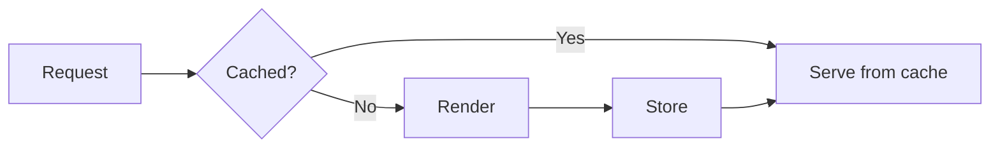

<!--
COPY THIS FILE to start a new chapter. Then:
  1. Fill the front matter. `slug` must be globally unique and match the {#ch-...} anchor below.
  2. Leave `part`/`chapter` as 0 if you do not know them — improvement #70 assigns the real numbers.
  3. Delete every HTML comment, including this one, before committing.
  4. Target ~220 lines. Hard limits: 150 min, 400 max.
  5. Check against the Quality Checklist in SKILL.md before you finish.
-->

# Chapter Title {#ch-chapter-title}

<!-- BLOCK 2 — OPENING.
     The promise: ONE sentence, what the reader can DO after this chapter. Not what it "covers".
     ✅ "Pick a rendering strategy per route and defend the choice."
     ❌ "This chapter covers rendering strategies." -->

> One sentence saying what the reader can do after this chapter.

**In this chapter:** first thing · second thing · third thing · fourth thing

<!-- 3–5 items, joined by " · ", no full stop. No Table of Contents — the build generates it.
     No back-link to the README — the build handles navigation. -->

## 💡 The Core Idea

<!-- BLOCK 3 — BODY. One paragraph. The mental model in plain words, BEFORE any API name.
     If a reader stopped here, this paragraph alone should leave them better off. -->

The mental model, in everyday words. An analogy is welcome. No library names yet.

> The one line worth remembering, if the reader remembers nothing else.

## How It Works

<!-- The mechanism. Prefer a table or a diagram over three paragraphs of prose. -->

**Something worth showing in code:**

```typescript
// Comments explain WHY, not what
interface Example {
  id: string;
  value: number;
}

function transform(input: Example[]): number[] {
  return input.map((item: Example) => item.value);
}
```

<!-- Diagrams: Mermaid for >3 nodes or any branch/cycle; ASCII only for a linear ≤3-step flow.
     Every diagram gets a bold caption line underneath. -->



**How a request resolves against the cache.**

## When to Use It

| Scenario                | Choose        | Why                          |
| ----------------------- | ------------- | ---------------------------- |
| Describe the situation  | The option    | The one-line reason           |
| A different situation   | Other option  | The tradeoff that decides it  |

> ⚠️ **Moving target:** _Required only if this topic ships breaking changes yearly._ Name what will change,
> then name the durable principle underneath it. That second sentence is what keeps this chapter useful in 2028.

## Common Mistakes

**❌ Wrong — what people write:**

```typescript
// The mistake, with the consequence in a comment
```

**✅ Right — what to write instead:**

```typescript
// The fix
```

Why it matters, in one or two sentences.

## 🔑 Key Takeaways

<!-- BLOCK 4. 3–5 bullets. Each a COMPLETE sentence that stands alone out of context. No sub-bullets. -->

- First takeaway, as a full sentence.
- Second takeaway, as a full sentence.
- Third takeaway, as a full sentence.

## Interview Questions

<!-- BLOCK 5. 3–6 questions. The answer is the SHAPE of a good answer in 2–4 sentences — not a script.
     At least one must be a judgement call: "when would you NOT use this?" -->

**Q: A question an interviewer actually asks?**

Two to four sentences giving the shape of a strong answer. Name the tradeoff. Say what you would measure.

**Q: When would you not reach for this?**

The judgement question. A senior answer names the cost, not just the benefit.

## What to Read Next

<!-- BLOCK 6. 2–3 links, each with a short reason. Cross-references use #ch-<slug> anchors — NEVER
     relative file paths, which break in PDF and EPUB. Unknown chapter number? Write "Chapter ??". -->

- [Chapter ?? — Related Chapter](#ch-related-chapter) — why it follows from this one
- [Chapter ?? — Another Chapter](#ch-another-chapter) — the adjacent idea
