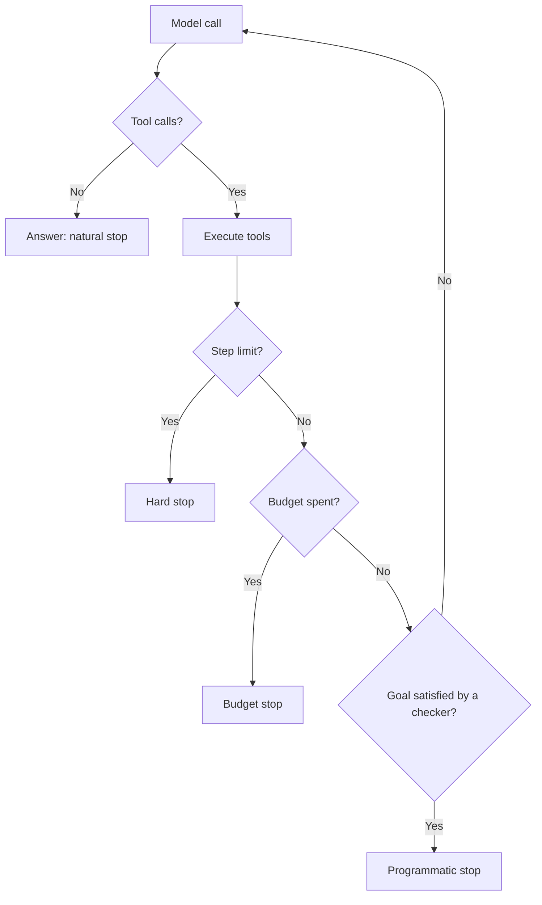

# What an Agent Actually Is {#ch-what-an-agent-actually-is}

> Read the loop, understand where it stops, and know the three questions that decide whether you needed one.

**In this chapter:** the loop in fifteen lines · what makes it an agent · the four stop conditions · the cost curve · workflow or agent · why they loop

## 💡 The Core Idea

An agent is a **`while` loop where the branch condition is a language model.** The model looks at the
conversation, picks a tool, your code runs it, the result goes back into the conversation, and the model
looks again. It ends when the model produces an answer instead of a tool call, or when you stop it.

That is the entire mechanism. Nothing in it is new to anyone who has written a state machine — the only
unusual property is that the transition function is probabilistic and reads English.

What distinguishes an agent from a script is not intelligence. It is that **the sequence of steps is not
written down anywhere.** You supply the tools and the goal; the path is chosen at runtime. That is the
capability and it is also the entire risk.

> If you can draw the flowchart in advance, write the flowchart. An agent is what you reach for when you
> cannot.

## How It Works

### The loop

```typescript
async function run(goal: string, tools: ToolSet, maxSteps = 10): Promise<string> {
  const messages: Message[] = [{ role: 'user', content: goal }];

  for (let step = 0; step < maxSteps; step++) {
    const res = await model.generate({ messages, tools });
    messages.push(res.message);

    if (res.toolCalls.length === 0) return res.text;      // the model chose to answer: done

    for (const call of res.toolCalls) {
      const output = await dispatch(call);                 // validate, authorise, execute
      messages.push({ role: 'tool', toolCallId: call.id, content: output });
    }
  }
  throw new StepLimitReached(messages);                    // stop, and say so honestly
}
```

Everything else in this section — memory, durability, multi-agent orchestration — is a modification to
those fifteen lines. Frameworks provide them; understanding them is what lets you debug one.

### The four stop conditions



**Only the first is the model's decision. The other three are yours, and a production agent needs all of them.**

| Stop | Bounds | Set from |
| --- | --- | --- |
| **Natural** | Nothing | The model decides it is done |
| **Step limit** | Runaway loops | Twice the steps a good run takes |
| **Budget** | Cost | Tokens or currency per task |
| **Programmatic** | Correctness | A checker that verifies the goal — tests pass, the file exists |

The programmatic stop is the one that separates a reliable agent from a demo. "The model said it was
finished" and "the work is actually done" are different claims, and only one of them can be verified.

### The cost curve is not linear

Every step resends the entire conversation, including every tool result so far. A ten-step run does not
cost ten times a one-step run — it costs roughly the sum of a growing context, which is quadratic in the
number of steps.

| Steps | Rough input tokens billed | Feel |
| --- | --- | --- |
| 1 | 2k | A model call |
| 5 | 30k | Noticeable |
| 10 | 110k | Expensive |
| 20 | 420k | A budget incident |

This is why step limits are a cost control and not just a safety net, and why
[Chapter ?? — Memory and State](#ch-memory-and-state) is about arithmetic more than about architecture.

### Workflow or agent

| | Workflow | Agent |
| --- | --- | --- |
| Path | Fixed, written by you | Chosen at runtime |
| Predictability | Deterministic | Varies run to run |
| Debugging | A stack trace | A trace of decisions |
| Cost | Known | Bounded at best |
| Fits | Known sequences | Unknown paths, variable inputs |

Most shipped "agents" should be workflows with one model call inside them. A pipeline that classifies a
ticket, retrieves the policy and drafts a reply has a known sequence — writing it as code makes it
faster, cheaper, testable and incapable of choosing the wrong branch.

> ⚠️ Autonomy is a cost, not a feature. Every decision handed to the model is a decision that can be made
> differently on the next run, and each one has to be verified rather than assumed.

### Why agents loop

Three causes account for nearly all of it, and none of them is fixed by a better model.

| Symptom | Cause | Fix |
| --- | --- | --- |
| Same tool, same arguments, repeatedly | An empty or ambiguous result reads as a transient failure | Return an explicit "no match" and a hint |
| Alternating between two tools | Overlapping descriptions; neither clearly applies | Merge them, or sharpen the boundary |
| Runs to the step limit every time | No satisfiable stop condition | State the completion criterion in the goal |
| Re-reads what it already read | The result was dropped from the window by compaction | Keep a structured working state outside the window |

The first row is the most common bug in the whole section. An empty array is indistinguishable from a
broken tool, so a reasonable model tries again — [Chapter ?? — Designing the Tool Surface](#ch-designing-the-tool-surface)
is largely about preventing this class.

## When to Use It

| Situation | Reach for |
| --- | --- |
| The steps are known in advance | A workflow with model calls inside it |
| The number of steps depends on what is found | An agent |
| One model call plus retrieval answers it | Neither — just call the model |
| Exploration or triage across many sources | An agent, with a step limit and read-only tools |
| Anything irreversible | An agent with an approval gate, or a workflow |

## Common Mistakes

**❌ Building an agent for a fixed pipeline**

> It costs more, runs slower, and can pick a branch you did not intend. Write the pipeline.

**❌ Only a step limit, no budget and no verification**

> A step limit stops the loop. It does not tell you whether the work was done or what it cost.

**❌ Trusting the model's claim that it finished**

> "I have updated the file" is generated text. Check the file.

**✅ Log every step — the messages, the tool calls, the results**

> An agent failure is a decision failure, and it is unreadable without the trace. This is the single most
> valuable thing to build before the second feature.

## 🔑 Key Takeaways

- An agent is a loop whose branch condition is a model; the tools and the goal are yours, the path is not.
- Cost grows faster than step count, because every step resends the whole conversation.
- Production agents need four stop conditions, and the programmatic one is what makes them reliable.
- If you can draw the flowchart in advance, write the flowchart — most "agents" should be workflows.
- Loops are almost always caused by tools whose results the model cannot distinguish from failure.

## Interview Questions

**Q: Explain what an agent is to a backend engineer.**

It is a loop with a language model as the branch condition. You give it a goal and a set of tools; it
picks a tool, your code executes it and appends the result to the conversation, and the model picks
again until it produces an answer or you stop it. The model never runs anything itself — it emits a
structured request and your dispatcher decides. What makes it an agent rather than a script is that the
sequence of steps is not written down anywhere in advance.

**Q: When would you build a workflow instead?**

Whenever I can draw the sequence. If the steps are classify, retrieve, draft, then that is code —
deterministic, testable, cheaper, faster, and incapable of choosing a branch I did not intend. An agent
earns its cost when the path genuinely depends on what it finds, such as triage across sources where the
number of steps is not knowable in advance. Most shipped agents I have seen would be better as workflows
with one model call inside.

**Q: How do you stop an agent running away?**

Four bounds, not one. A step limit for runaway loops, a token or currency budget for cost, a programmatic
check for whether the goal is actually satisfied, and the model's own natural stop. The programmatic one
is the one people skip and the one that matters — "the model said it was done" and "the work is done" are
different claims, and only the second can be verified.

**Q: Your agent runs to the step limit on every task. What is happening?**

Usually there is no stop condition it can satisfy, or a tool is giving it an answer it cannot interpret.
I would read the trace first. If it repeats one call with the same arguments, the tool is returning an
empty result that is indistinguishable from a failure, so it retries. If it alternates between two tools,
their descriptions overlap. If it just keeps going, the goal never stated what finished looks like. None
of those is fixed by changing the model.

**Q: Why does a ten-step agent cost so much more than ten single calls?**

Because each step resends the entire conversation, including every previous tool result. The input grows
at every step, so total billed input is the sum of a growing context rather than ten times a fixed one —
roughly quadratic. That is why bulky tool output is the first thing to clear from an agent's history, and
why step limits are a cost control rather than only a safety measure.

## What to Read Next

- [Chapter ?? — Designing the Tool Surface](#ch-designing-the-tool-surface) — where most agent quality actually lives
- [Chapter ?? — Tool Calling](#ch-tool-calling) — the single step this loop repeats
- [Chapter ?? — Memory and State](#ch-memory-and-state) — what survives as the conversation grows
