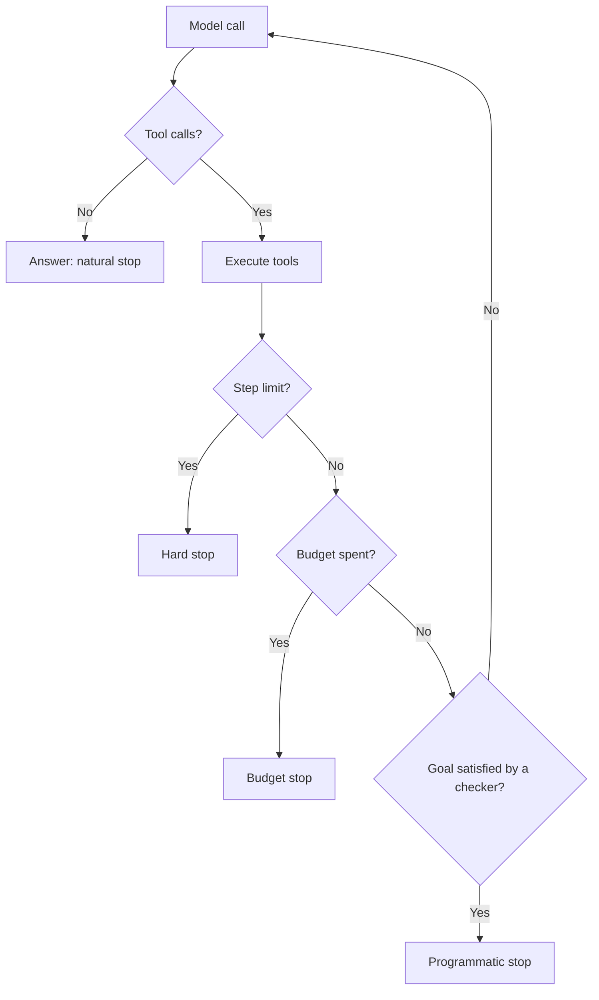

# What an Agent Is, and When to Use More Than One {#ch-what-an-agent-actually-is}

> Read the agent loop, bound it with four stop conditions, and split it into several agents only when you can name what the split buys.

**In this chapter:** the loop and its four stop conditions · why cost grows faster than steps · workflow or agent · orchestrator and workers · what gets lost in a handoff

## 💡 The Core Idea

An agent is a **`while` loop where the branch condition is a language model.** The model reads the
conversation and picks a tool. Your code runs the tool and adds the result to the conversation. Then the
model looks again. The loop ends when the model answers instead of calling a tool, or when you stop it.

A script and an agent differ in one way: **in an agent, the sequence of steps is not written down.** You
supply the tools and the goal, and the model chooses the path at runtime. That is the capability, and it
is also the whole risk.

> If you can draw the flowchart in advance, write the flowchart. An agent is what you reach for when you
> cannot.

Several agents are often drawn as an org chart: a planner, a researcher, a writer, a reviewer. A team of
people shares an office and a memory, and can ask each other questions. **Agents share a string.** A split
buys exactly two things: **context isolation** (each worker gets a clean window) and **parallelism**
(independent subtasks run at once). Start with one agent, and split only for one of those two reasons.

## How It Works

### The loop

**The whole mechanism, before any framework**

```typescript
async function run(goal: string, tools: ToolSet, maxSteps = 10): Promise<string> {
  const messages: Message[] = [{ role: 'user', content: goal }];

  for (let step = 0; step < maxSteps; step++) {
    const res = await model.generate({ messages, tools });
    messages.push(res.message);

    if (res.toolCalls.length === 0) return res.text;      // the model chose to answer: done

    for (const call of res.toolCalls) {
      const output = await dispatch(call);                 // validate, authorise, execute
      messages.push({ role: 'tool', toolCallId: call.id, content: output });
    }
  }
  throw new StepLimitReached(messages);                    // stop, and say so honestly
}
```

Memory, durability and multi-agent orchestration are all changes to these fifteen lines. Frameworks
provide them. Knowing the loop is what lets you debug one.

### The four stop conditions



**Only the first stop is the model's decision. The other three are yours, and production needs all of them.**

| Stop | Bounds | Set from |
| --- | --- | --- |
| **Natural** | Nothing | The model decides it is done |
| **Step limit** | Runaway loops | Twice the steps a good run takes |
| **Budget** | Cost | Tokens or currency per task |
| **Programmatic** | Correctness | A checker that verifies the goal — tests pass, the file exists |

The programmatic stop separates a reliable agent from a demo. "The model said it was finished" and "the
work is done" are different claims, and only the second can be checked.

### Cost grows faster than steps

Every step resends the whole conversation, including every tool result so far. So a ten-step run costs
the sum of a growing context, not ten times one call. That is roughly quadratic in the number of steps:
about 2k input tokens for one step, 110k for ten, and 420k for twenty.

A step limit is therefore a cost control, not only a safety net. It is also why bulky tool output is the
first thing to clear from the history — see [Chapter ?? — Memory, State and Long-Running Work](#ch-durability-and-long-running-work).

### Workflow or agent

A workflow has a fixed path, a stack trace and a known cost. An agent has a path chosen at runtime, a
trace of decisions and a cost that is bounded at best. Most shipped "agents" should be workflows. The
documentation assistant's normal path is retrieve, then answer — a known sequence, so write it as code.
An agent earns its cost on "why do the docs and the code disagree here?", where the steps depend on what
it finds.

> ⚠️ Autonomy is a cost, not a feature. Every decision you hand to the model can go differently on the
> next run, and each one has to be verified rather than assumed.

### Why agents loop

A better model fixes none of these.

| Symptom | Cause | Fix |
| --- | --- | --- |
| Same tool, same arguments, again and again | An empty result reads as a transient failure | Return an explicit "no match" and a hint |
| Alternating between two tools | Overlapping descriptions | Merge them, or sharpen the boundary |
| Runs to the step limit every time | No stop condition it can satisfy | State what "finished" looks like in the goal |

The first row is the most common agent bug. An empty array looks exactly like a broken tool, so a
sensible model tries again. [Chapter ?? — Tool Calling and the Tool Surface](#ch-tool-calling) is largely
about preventing it.

### Orchestrator and workers

When a split is justified, this is the pattern that works in practice. One orchestrator breaks the goal
into subtasks. Workers run them in parallel, each with a clean window. The orchestrator then combines the
results.

**The documentation assistant checking docs, code and tickets at once**

```typescript
async function orchestrate(goal: string): Promise<string> {
  const plan = await planner.decompose(goal);          // structured output: a list of subtasks
  const findings = await Promise.all(
    plan.subtasks.map((t) => runWorker(t, { tools: toolsFor(t.kind), maxSteps: 6 })),
  );
  return synthesiser.answer(goal, findings);            // orchestrator sees summaries, not raw output
}
```

Two properties make it work. Workers are **independent**, so there is no coordination protocol to
design. And the orchestrator holds the only full picture, so there is one place to look when the answer
is wrong. Workers return **summaries**, not transcripts. Passing raw output back rebuilds the one huge
window the split was meant to avoid.

### What a split costs

Everything a worker knows must fit into the string its parent reads. Uncertainty, empty searches and the
reason a route was dropped rarely survive. So the orchestrator treats a hedged finding as fact, or sends
another worker over the same ground. Three hops of summary over an ambiguous requirement give three
plausible readings. Three workers and an orchestrator also use **three to five times the tokens** of one
agent, the trace becomes a tree, and each hop needs its own eval. The parallel win must pay for all of it.

> ⚠️ A "reviewer agent" with the same model and context shares the author's blind spots, agrees, and
> doubles the cost. A real check runs something the model cannot fake: a test, a schema, a source of truth.

## When to Use It

| Situation | Reach for |
| --- | --- |
| The steps are known in advance | A workflow with model calls inside it |
| One model call plus retrieval answers it | Neither — just call the model |
| The number of steps depends on what is found | One agent, with all four stops |
| Anything irreversible | An approval gate, or a workflow |
| Independent subtasks over separate sources | Orchestrator and workers |
| Output needs checking | A verification step, not a critic agent |
| Routing between behaviours | One small-model call returning an enum |
| Workers need each other's output | Do not split — that is a distributed system |

## Common Mistakes

**❌ Building an agent for a fixed pipeline**

> It costs more, runs slower, and can pick a branch you did not intend. Write the pipeline.

**❌ Trusting the model's claim that it finished**

> "I have updated the file" is generated text. Check the file.

**❌ Per-agent step limits with no global bound**

> Three workers at ten steps each is thirty model calls before synthesis. Carry one budget through the
> whole run and stop the tree when it runs out.

**✅ Log every step, with one trace id across every worker**

> An agent failure is a decision failure, and it is unreadable without the trace. Log the handoff
> summaries too — a subtly wrong answer is usually a subtly wrong summary two hops up.

## 🔑 Key Takeaways

- An agent is a loop whose branch condition is a model; the tools and the goal are yours, the path is not.
- Cost grows faster than step count, because every step resends the whole conversation.
- Production agents need four stop conditions, and the programmatic one is what makes them reliable.
- If you can draw the flowchart in advance, write the flowchart — most "agents" should be workflows.
- Split into several agents only for context isolation or parallelism, and expect three to five times the tokens.

## Interview Questions

**Q: When would you build a workflow instead?**

Whenever I can draw the sequence. Classify, retrieve, draft is code: deterministic, testable, cheaper and
unable to choose a branch I did not intend. An agent earns its cost when the path depends on what it
finds, such as triage across several sources.

**Q: Your agent runs to the step limit on every task. What is happening?**

I would read the trace first. If it repeats one call with the same arguments, a tool is returning an
empty result that looks like a failure. If it alternates between two tools, their descriptions overlap.
If it just keeps going, the goal never said what finished looks like — and a new model fixes none of these.

**Q: When is one agent better than three?**

Almost always at first, and I want a measured reason before splitting. A split buys context isolation
and parallelism. It costs three to five times the tokens, a tree-shaped trace, per-hop evals, and a new
failure where a worker returns a confident empty summary. If the subtasks are sequential and share
context, it buys neither benefit.

**Q: Is a reviewer agent a good idea?**

Usually not as described. With the same model and context, it inherits the generator's blind spots and
tends to agree, so it doubles the cost and measures nothing. I want a check that can fail independently:
the tests, a schema, or a lookup against a source of truth.

**Q: How would you bound cost across several agents?**

At the run level, because per-agent limits multiply — three workers at ten steps is thirty calls before
synthesis. I would carry one shared budget through the run, charge it as steps complete, and stop the
whole tree when it runs out. I would also cap the plan itself, since twelve subtasks instead of three
multiplies everything downstream.

## What to Read Next

- [Chapter ?? — Tool Calling and the Tool Surface](#ch-tool-calling) — the single step this loop repeats, and where most agent quality lives
- [Chapter ?? — Memory, State and Long-Running Work](#ch-durability-and-long-running-work) — what survives as the conversation grows, and across restarts
- [Chapter ?? — Observability and Cost Engineering](#ch-observability) — reading a tree-shaped trace and pricing a run
