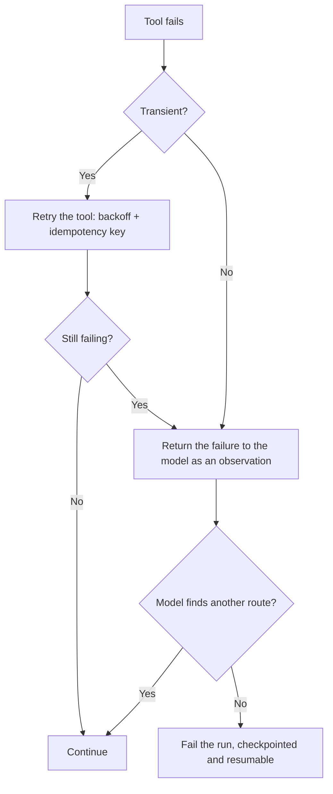

# Durability and Long-Running Work {#ch-durability-and-long-running-work}

> Make an agent that runs for an hour survive a deploy, a crash and a rate limit — without repeating the work it already paid for.

**In this chapter:** why a request handler is the wrong home · checkpointing every step · idempotency and the duplicate-effect problem · retries at three levels · human approval as a pause · what to show while it runs

## 💡 The Core Idea

An agent loop that takes forty minutes cannot live in an HTTP request. Request timeouts, deploys,
autoscaling and ordinary crashes all end it, and each restart throws away real money: every completed
step was a paid model call, and every tool call may have changed something in the world.

So a long-running agent is a **durable workflow that happens to call a model.** The state machine, the
checkpoint after every step, the idempotency key, the retry policy and the resume path are the same
patterns a payment pipeline uses. Nothing here is AI-specific except one thing: **the step you are
resuming may not be deterministic**, so replaying it is not the same as resuming it.

> The unit of durability is the step. If a step completed, its result must survive; if it did not, it
> must be safe to run again.

## How It Works

### Persist after every step

```typescript
interface Checkpoint {
  readonly runId: string;
  readonly step: number;
  readonly messages: Message[];      // the conversation so far
  readonly state: AgentState;        // goal, constraints, findings
  readonly status: 'running' | 'awaiting-approval' | 'done' | 'failed';
  readonly spentTokens: number;
}

async function step(run: Checkpoint): Promise<Checkpoint> {
  const res = await model.generate({ messages: run.messages, tools });
  const results = await Promise.all(res.toolCalls.map((c) => dispatch(c, run.runId)));
  const next = advance(run, res, results);
  await checkpoints.put(next);        // durable before anything else observes it
  return next;
}
```

The write happens **after** the model call and the tool calls, before the next iteration. A crash between
two steps then costs at most one step, and a resume reads the last checkpoint and continues — it does not
replay the conversation from the beginning.

Storing the full message list is the pragmatic choice. It is a few hundred kilobytes, and reconstructing
a conversation from an event log is work with no benefit here.

### Duplicate effects are the hard part

Retrying a read is free. Retrying `sendEmail` sends a second email, and a crash between "tool executed"
and "checkpoint written" is exactly where that happens.

| Approach | How | Fits |
| --- | --- | --- |
| **Idempotency key** | `${runId}:${step}:${toolName}` passed to the downstream system | Anything with an API that supports it |
| **Write-ahead intent** | Record "about to call X" before calling; on resume, check whether it happened | Systems with no idempotency support |
| **Read-back** | After a crash, query whether the effect exists before retrying | Effects that are observable |
| **Design it out** | `setStatus('sent')` rather than `incrementCounter()` | Always preferable where possible |

Deriving the key from `runId` and step number, rather than generating a fresh one, is what makes it work
across a restart — a regenerated key defeats the mechanism entirely.

### Retries at three levels



**Three levels, and the middle one is the one people leave out.**

The middle level is what makes an agent robust rather than merely retried: a tool that is genuinely down
should become an **observation the model can act on** — "the deploy API is unavailable" — so it can take
another route or stop honestly. Retrying at the tool level for ever is how a run burns its budget on one
broken dependency.

The outer level matters for cost. Re-running the whole agent is expensive, so a run that fails should
fail *checkpointed*, and the retry should resume rather than restart.

### Human approval is a pause, not a prompt

An approval gate on a destructive action turns a synchronous loop into a suspended one, sometimes for
days. That is a state, not a blocking call.

```typescript
if (tool.destructive) {
  await checkpoints.put({ ...run, status: 'awaiting-approval', pending: call });
  await notify(run.owner, call);
  return;                                   // the process exits; nothing is held open
}
// resumed later by an approval webhook, which loads the checkpoint and continues
```

Two properties follow. The process holds nothing open, so a deploy during the wait is harmless. And the
approval carries the `runId` and step, so an approval that arrives twice — a double-clicked button, a
retried webhook — resolves to the same step and cannot execute the action twice.

Approvals also need a timeout. A run awaiting approval for a week should expire rather than resume into a
world that has moved on.

### Budgets are durable too

A per-run token or currency budget must be persisted with the checkpoint. Otherwise every restart resets
it, and a crash-loop turns a bounded run into an unbounded bill. Charge the budget as steps complete and
refuse to resume a run that has exhausted it.

> ⚠️ **Moving target:** durable execution frameworks — hosted workflow runtimes, queue-backed schedulers,
> agent platforms — change quickly, and each names these concepts differently. The durable principle is
> checkpoint after every step, key effects idempotently, and model approval as a suspended state. Whatever
> the framework, verify it does those three things.

### What the user sees

A forty-minute run needs progress, not a spinner. Stream the step boundaries — "searching", "found 12
files", "awaiting your approval" — because a visible plan is also the mechanism by which a user notices
the agent is doing the wrong thing and stops it early. That is a cost control as much as a courtesy.

## When to Use It

| Run length | Design |
| --- | --- |
| Under 30 seconds | An ordinary request; no durability needed |
| 30 s – 5 min | Background job, one retry, progress streamed |
| 5 min – hours | Checkpointed workflow, idempotent tools, resumable |
| Any run with destructive tools | Approval gates, whatever the duration |
| Scheduled or triggered runs | Durable by default — nobody is watching to restart it |

## Common Mistakes

**❌ Running a long agent inside an HTTP request**

> The first deploy kills it and every completed step is paid for twice.

**❌ Generating a fresh idempotency key on retry**

> The key exists to be the same across attempts. A new one makes the whole mechanism decorative.

**❌ Holding a process open while awaiting human approval**

> Approval takes hours. Persist the state and exit; resume from a webhook.

**✅ Charge the budget as steps complete, and persist it**

> A crash-loop with a per-process budget is unbounded spend. A persisted budget stops at the number you
> chose.

## 🔑 Key Takeaways

- A long-running agent is a durable workflow that calls a model; checkpoint after every step.
- Idempotency keys must be derived from run and step so they survive a restart, never regenerated.
- Retry at three levels — the tool, the model as an observation, and the run — and do not skip the middle one.
- Human approval is a suspended state with a resume path and a timeout, not a blocking call.
- Persist the budget with the checkpoint, or a crash-loop turns a bounded run into an unbounded bill.

## Interview Questions

**Q: An agent takes forty minutes. Where does it run?**

Not in a request handler. It runs as a durable workflow — a queue-backed or workflow-runtime job that
checkpoints after every step, so a deploy, a crash or a scale-down costs at most one step rather than the
whole run. That matters more than usual here because every completed step was a paid model call and may
have already changed something in the world, so restarting from the beginning is expensive twice over.

**Q: How do you stop a retry from sending two emails?**

An idempotency key derived from the run id, the step number and the tool name, passed to the downstream
system so a duplicate call is recognised and ignored. The detail that gets missed is that the key must be
derived, not generated — a fresh key on retry defeats the mechanism. Where the downstream system has no
idempotency support, I record the intent before calling and check on resume whether the effect actually
happened.

**Q: A tool the agent needs is down. What should happen?**

Retry a few times with backoff at the tool level, and if it is genuinely unavailable, hand that back to
the model as an observation rather than continuing to retry. The model can then take a different route or
stop and say what it could not do. Retrying for ever at the tool level is how a run spends its whole
budget on one broken dependency and still fails, and it removes the model's chance to route around the
problem.

**Q: How do you implement human approval for a destructive step?**

As a state transition, not a blocking wait. The run checkpoints with status "awaiting approval" and the
pending call, notifies whoever owns it, and the process exits. An approval webhook loads the checkpoint
and resumes. That way a deploy during the wait is harmless, a duplicate approval resolves to the same
step and cannot execute twice, and I can expire the approval so a run does not resume a week later into a
world that has changed.

**Q: What is different about durability here compared with any other background job?**

Mostly nothing, which is the useful answer — checkpointing, idempotency and retry policy are the same
patterns. The differences are that each step is expensive, so the cost of losing progress is unusually
high; the step is not deterministic, so replaying it is not equivalent to resuming it; and the budget has
to be durable, because a crash-loop that resets its own spending limit is an unbounded bill rather than a
failed job.

## What to Read Next

- [Chapter ?? — Memory and State](#ch-memory-and-state) — the state a checkpoint persists
- [Chapter ?? — Multi-Agent Patterns](#ch-multi-agent-patterns) — durability when several loops are in flight
- [Chapter ?? — Observability](#ch-observability) — reading what a forty-minute run actually did
