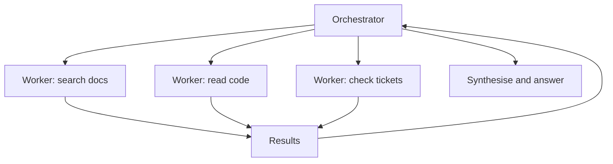

# Multi-Agent Patterns {#ch-multi-agent-patterns}

> Know the two problems that genuinely need more than one agent, and why every other reason costs more than it returns.

**In this chapter:** the two real motivations · orchestrator and worker · the handoff problem · what splitting costs · patterns that are not multi-agent · debugging several loops at once

## 💡 The Core Idea

Multi-agent architectures are drawn as org charts — a planner, a researcher, a writer, a reviewer — and
the diagram is persuasive because it looks like how a team works. **A team of people shares an office, a
memory and the ability to ask a question. Agents share a string.**

There are exactly two things splitting genuinely buys, and both are concrete:

- **Context isolation.** Each sub-agent gets a clean window for its own subtask, so one agent's noisy
  tool output does not crowd out another's.
- **Parallelism.** Independent subtasks run at once, and a task that takes ten sequential steps takes
  three.

Everything else attributed to multi-agent systems — better reasoning, specialisation, quality from
review — is usually achievable with one agent, a better tool surface, and a verification step.

> Start with one agent. Split when you can name which of those two problems you are solving, and measure
> that you solved it.

## How It Works

### Orchestrator and worker

The pattern that works in practice, and nearly the only one.



**One coordinator decomposes, workers run in parallel with clean windows, the coordinator synthesises.**

Two properties make it work. Workers are **independent** — no worker needs another's output, so there is
no coordination protocol to design. And the orchestrator holds the only complete picture, so there is one
place to look when the result is wrong.

```typescript
async function orchestrate(goal: string): Promise<string> {
  const plan = await planner.decompose(goal);          // structured output: a list of subtasks
  const findings = await Promise.all(
    plan.subtasks.map((t) => runWorker(t, { tools: toolsFor(t.kind), maxSteps: 6 })),
  );
  return synthesiser.answer(goal, findings);            // orchestrator sees summaries, not raw output
}
```

Workers return **summaries**, not their transcripts. Passing raw worker output back defeats the context
isolation the split was for — you have paid for three agents and reassembled one enormous window.

### The handoff problem

Everything a worker knows must be serialised into the string its parent reads. That is the constraint the
org-chart diagram hides.

| Lost in the handoff | Consequence |
| --- | --- |
| Nuance and uncertainty | The orchestrator treats a hedged finding as fact |
| What was searched and not found | Another worker searches the same ground |
| Why a route was abandoned | The orchestrator retries it |
| The original phrasing | Meaning drifts across each hop |

Drift compounds. Three hops of summarisation applied to an ambiguous requirement produce three plausible
and mutually inconsistent interpretations, and no one of them is obviously wrong.

### What splitting costs

| Cost | Detail |
| --- | --- |
| **Tokens** | Each agent re-reads its own instructions and tools; the orchestrator pays for every summary |
| **Latency** | Parallel workers help; the plan and synthesis steps are pure additions |
| **Debugging** | The trace is now a tree. "Which agent decided this?" is a real question |
| **Failure modes** | A worker that fails silently returns a confident empty summary |
| **Evaluation** | Each hop needs its own measurement, or you cannot locate a regression |

The token cost is routinely underestimated. Three workers plus an orchestrator is typically three to five
times the tokens of a single agent doing the same task, and the parallel wall-clock win is what has to
justify it.

### Patterns that are not multi-agent

Three things frequently described as multi-agent are better without the second loop.

| Called | Actually | Do instead |
| --- | --- | --- |
| "A reviewer agent" | A verification step | One model call with a rubric, or a test |
| "A router agent" | Classification | One small-model call returning an enum |
| "A specialist per domain" | Tool selection | One agent, domain-specific tools |

The reviewer case is worth spelling out. A second agent reviewing the first's work is a model call with
extra steps — and if the reviewer uses the same model and the same context, it shares the first one's
blind spots. A real verification step runs something the model cannot fake: a test, a schema check, a
lookup against a source of truth.

> ⚠️ Adding a critic agent that agrees with its author is a common way to double the cost of a system and
> measure nothing. If the check cannot fail for a reason the generator could not anticipate, it is not a
> check.

### Debugging several loops

A single agent produces a linear trace. A multi-agent system produces a tree, and it is unreadable
without deliberate instrumentation.

- **One trace id per run, propagated to every worker**, or you cannot reconstruct what happened.
- **Log the handoff payloads** — the summaries are where meaning is lost, and they are the first place to
  look when the answer is subtly wrong.
- **Evaluate each hop.** Decomposition quality, worker quality and synthesis quality fail differently and
  a single end-to-end number cannot tell you which regressed.
- **Bound the whole tree**, not each agent. Per-agent step limits multiply — three workers at ten steps
  each is thirty model calls before the orchestrator has done anything.

## When to Use It

| Situation | Design |
| --- | --- |
| One task, one context, sequential steps | One agent |
| Independent subtasks over separate sources | Orchestrator and workers |
| One agent's window fills with irrelevant tool output | Split for context isolation |
| Latency matters and subtasks are independent | Split for parallelism |
| Output needs checking | A verification step, not a critic agent |
| Routing between behaviours | A classifier call, not an agent |
| Workers need each other's output | Do not split; you are designing a distributed system |

That last row is the strongest signal. The moment workers depend on each other, you have taken on
coordination, ordering and partial failure — a distributed systems problem with a non-deterministic
scheduler.

## Common Mistakes

**❌ Modelling the system as a team of job titles**

> The diagram is intuitive and the mechanism is a string passed between processes. Split by context and
> parallelism, not by role.

**❌ Passing full worker transcripts back to the orchestrator**

> The split was for context isolation. Returning raw output rebuilds the window you were avoiding, at
> three times the price.

**❌ Per-agent step limits with no global bound**

> Three workers at ten steps each is thirty model calls before synthesis. Bound the run.

**✅ Measure the single-agent version first**

> It is the baseline that tells you whether the split helped, and often it tells you the split was not
> needed.

## 🔑 Key Takeaways

- Multi-agent buys exactly two things: context isolation and parallelism. Name which one before splitting.
- Orchestrator and independent workers is the pattern that works; workers needing each other is a distributed system.
- Everything a worker knows must survive as a string, and nuance, dead ends and uncertainty do not.
- A critic agent sharing the generator's model and context shares its blind spots — verify with something that can fail independently.
- The token cost of a split is typically three to five times a single agent; parallel wall-clock time is what must justify it.

## Interview Questions

**Q: When is one agent genuinely better than three?**

Almost always at first, and I would want a measured reason before splitting. Multi-agent buys context
isolation and parallelism, and costs three to five times the tokens, a tree-shaped trace, an extra
failure mode where a worker returns a confident empty summary, and per-hop evaluation. If the subtasks
are sequential and share context, splitting adds all of that cost and buys neither of the two benefits.

**Q: What actually gets lost when one agent hands off to another?**

Everything that was not written into the summary — uncertainty, what was searched and found empty, why a
route was abandoned, and the original phrasing of the requirement. The orchestrator then reads a hedged
finding as a fact, or sends another worker over ground already covered. And it compounds: three hops of
summarisation on an ambiguous requirement produce three plausible readings, none of them obviously wrong.

**Q: Is a reviewer agent a good idea?**

Usually not as described. If the reviewer uses the same model with the same context, it inherits the
generator's blind spots and tends to agree, so it doubles the cost and measures nothing. A verification
step that can fail independently is what I want — running the tests, validating against a schema,
checking a claim against a source of truth. If the check cannot fail for a reason the generator could not
anticipate, it is not a check.

**Q: How do you debug a multi-agent system?**

With a trace id propagated through every worker, and by logging the handoff payloads specifically. The
trace is a tree rather than a line, so "which agent decided this" is a real question and it is
unanswerable after the fact without that instrumentation. The handoffs matter most because that is where
meaning is lost — a subtly wrong final answer is usually a subtly wrong summary two hops up.

**Q: How would you bound cost across several agents?**

At the run level, not per agent, because per-agent limits multiply — three workers at ten steps each is
thirty model calls before the orchestrator synthesises anything. I would carry a shared budget through
the run, charge it as steps complete, and stop the whole tree when it is exhausted. I would also cap the
decomposition itself, since a planner that produces twelve subtasks instead of three multiplies
everything downstream.

## What to Read Next

- [Chapter ?? — What an Agent Actually Is](#ch-what-an-agent-actually-is) — the single loop this multiplies
- [Chapter ?? — Observability](#ch-observability) — reading a tree-shaped trace
- [Chapter ?? — Evals](#ch-evals) — measuring each hop so a regression can be located
