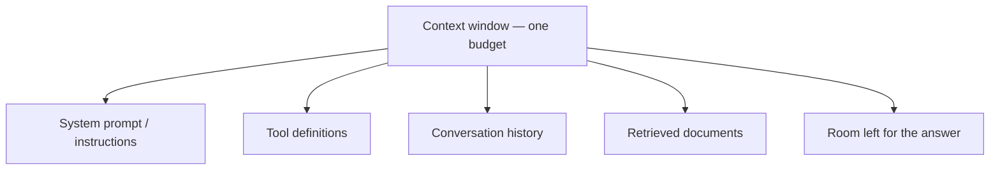

# How LLMs Behave {#ch-how-llms-behave}

> Predict the four behaviours that surprise every team shipping their first AI feature, before they surprise yours.

**In this chapter:** tokens and why characters lie · the context window as a budget · sampling and non-determinism · what statelessness costs · the four consequences

## 💡 The Core Idea

A language model is a **stateless function**. It takes a sequence of tokens, returns a probability
distribution over the next token, and something picks one. Then it runs again with that token appended.
That is the whole mechanism, and you do not need any more of it to reason about production behaviour.

Everything that surprises teams follows from those two words. *Stateless* means the model remembers
nothing — your application resends the entire conversation on every turn, which is why the tenth message
costs more than the first. *Probability distribution* means there is no single correct output — which is
why you cannot write an equality assertion against it.

> Treat the model as a slow, expensive, non-deterministic pure function. Every good decision in this part
> follows from taking that description literally.

## How It Works

### Tokens, not characters

A token is a chunk of text — often a word, often part of one. English averages roughly four characters
per token, but the average is a trap: code, JSON, UUIDs and non-Latin scripts tokenise far worse, and a
document that looks small can be three times the tokens you estimated.

| Text | Rough tokens | Why |
| --- | --- | --- |
| `The cat sat on the mat` | ~6 | Common words are single tokens |
| `f47ac10b-58cc-4372-a567-0e02b2c3d479` | ~25 | Random hex has no common chunks |
| A 500-line TypeScript file | ~5,000 | Punctuation and identifiers fragment |
| The same prose in Japanese | ~2× English | Fewer characters per token |

Tokens are the unit of **cost**, of the **context limit**, and of **truncation**. So never estimate them
from `str.length`, and never guess with a tokenizer library that was trained on a different model — ask
the provider's own counting endpoint, which is exact and costs nothing.

### The context window is one shared budget

The context window is the maximum number of tokens a single request may involve. It is not "how much you
can send" — input and output come out of the same allowance, and so does everything you forgot you were
sending.



**Five claimants on one number. The answer is the one that gets squeezed, because it is allocated last.**

The failure this causes is specific and common: a long conversation with several tools declared and a
retrieval step attached leaves almost no room for output, so answers get shorter and then get cut off
mid-sentence. The model does not warn you. It stops, and the response carries a finish reason saying it
hit the length limit — which is why that field is the first thing to log.

### Statelessness, and what it costs

The API holds no session. Turn ten sends turns one through nine again, so the cost of a conversation
grows with the **square** of its length: each turn is longer than the last, and you pay for all of it
again.

| Turn | History sent | Cumulative input tokens |
| --- | --- | --- |
| 1 | 0 | 500 |
| 5 | 4 turns | ~7,500 |
| 20 | 19 turns | ~105,000 |

Two consequences follow, and both are chapter-length topics later in this part. Prompt caching exists
because the stable prefix of that resend is identical every time. Summarising or clearing old turns
exists because eventually the resend does not fit — see
[Chapter ?? — Context Engineering](#ch-context-engineering).

### Sampling: why the same input gives different answers

The model returns a distribution; a sampler chooses from it. Choosing the highest-probability token every
time is *greedy* decoding and produces flat, repetitive text, so providers sample instead — historically
tuned with `temperature` (how much to flatten the distribution) and `top_p` (how much of the tail to
consider).

```typescript
// Lower temperature narrows the distribution; it does not make the call deterministic.
const result = await generateText({
  model: MODEL,
  temperature: 0.2, // check result.warnings — not every model still accepts this
  maxOutputTokens: 512,
  prompt: userQuestion,
});
```

> ⚠️ **Moving target:** several 2026 frontier models have **removed** the sampling parameters outright and
> reject requests that send them, exposing a *reasoning effort* control instead. The durable principle is
> that output is sampled and you get one knob for how adventurous it is; the knob's name and range move
> every release. Check the warnings your SDK returns rather than assuming a setting applied.

**Temperature 0 is not a determinism switch.** Even with sampling turned as low as it goes, repeated
identical requests can differ: floating-point addition is not associative, so results depend on how
requests were batched on the server, and mixture-of-experts routing can vary between runs. Providers also
update models behind a stable name.

## When to Use It

The practical question is what to do about variance, and the answer depends on what the output feeds.

| The output goes to… | Do this | Why |
| --- | --- | --- |
| A human reading prose | Nothing — let it vary | Variation is invisible and often better |
| Your own code, as JSON | Constrain the schema at the API level | Validation beats hoping |
| A test assertion | Assert properties, never equality | `expect(text).toBe(...)` will flake |
| A cache key | Hash the **input**, never the output | Outputs are not stable identifiers |
| A billing or audit record | Store the output as data, with the model id | The same prompt is not reproducible later |

## Common Mistakes

**❌ Estimating tokens from string length**

> `const tokens = text.length / 4;`

Fine for a log line, wrong for a limit. A JSON payload or a UUID column blows the estimate by three or
four times, and the request fails at the provider rather than in your code.

**❌ Treating a cut-off answer as a model quality problem**

The response stopped because it ran out of room, not because the model ran out of ideas. Log the finish
reason on every call; "length" and "stop" are entirely different bugs.

**✅ Log tokens and finish reason on every request from day one**

> `usage.inputTokens`, `usage.outputTokens`, and the finish reason cost nothing to record and answer most
> "why is this slow / expensive / truncated" questions before you have to reproduce anything.

## 🔑 Key Takeaways

- A model is a stateless function from tokens to a sampled next token; every production surprise follows from that.
- Tokens are the unit of cost, limits and truncation, and character counts are not a safe proxy for them.
- Input, tools, history, retrieval and the answer all draw on one context budget, and the answer is squeezed last.
- Conversation cost grows with the square of its length, because the whole history is resent every turn.
- Setting temperature to zero narrows the distribution; it does not make the call reproducible.

## Interview Questions

**Q: Why does the same prompt give a different answer each time, and how do you test something like that?**

Output is sampled from a probability distribution rather than looked up, so variation is the designed
behaviour, and even at the lowest sampling setting batching and floating-point effects mean runs are not
bit-identical. You test it by asserting properties instead of strings — the JSON parses, the schema
validates, the answer cites a source, the classification is one of five labels — and for anything
qualitative you score a fixed set of inputs and watch the pass rate over time rather than any single run.

**Q: A conversation gets slower and more expensive the longer it runs. Why?**

The API is stateless, so every turn resends the entire history. Input grows linearly with turn count and
cumulative cost grows quadratically, and latency follows input size. The two standard mitigations are
caching the stable prefix so the resend is cheap, and compacting old turns once the history stops earning
its space.

**Q: Your summariser returns half a sentence. Where do you look?**

At the finish reason and the token accounting, before the prompt. Almost always the output cap was too
low, or input grew until little of the window was left for the answer. Rewriting the prompt is the common
first move and it fixes nothing, because the model did not choose to stop.

**Q: When does non-determinism actually matter, and when is it fine?**

It is fine wherever a human reads the output and two good answers are equally good — chat, drafting,
summarising. It matters the moment output feeds code: a parsed field, a routing decision, a cache key, an
audit record. The line is not "important versus unimportant", it is whether anything downstream expects
the same input to produce the same bytes.

## What to Read Next

- [Chapter ?? — Context Engineering](#ch-context-engineering) — how to spend the budget this chapter describes
- [Chapter ?? — Choosing a Model](#ch-choosing-a-model) — what the cost and latency figures here are traded against
- [Chapter ?? — Evals](#ch-evals) — how to test a system that has no single correct output
