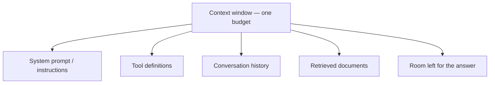

# How LLMs Behave and How to Choose One {#ch-how-llms-behave}

> Predict the behaviours that surprise every team shipping its first AI feature, then pick a model per route on evidence.

**In this chapter:** tokens and the context budget · statelessness and what it costs · sampling and non-determinism · the three axes of model choice · deciding with a number

## 💡 The Core Idea

A language model is a **stateless function**. It takes a sequence of tokens and returns a probability
distribution over the next token. A sampler picks one, and the model runs again with it appended. You
need no more of the mechanism than that to reason about production behaviour.

*Stateless* means the model remembers nothing. Your application resends the whole conversation every
turn, so the tenth message costs more than the first. *Probability distribution* means there is no single
correct output, so you cannot write an equality assertion against it.

Choosing a model follows from the same view. Treat it as a slow, costly, non-deterministic function, and
pick one **per route**, not per application. In the documentation assistant this part builds, the query
classifier and the answer writer have different right answers.

## How It Works

### Tokens, not characters

A token is a chunk of text — often a word, often part of one. English averages about four characters per
token. Code, JSON, UUIDs and non-Latin scripts do far worse, so a small-looking document can be three
times your estimate.

| Text | Rough tokens | Why |
| --- | --- | --- |
| `The cat sat on the mat` | ~6 | Common words are single tokens |
| `f47ac10b-58cc-4372-a567-0e02b2c3d479` | ~25 | Random hex has no common chunks |
| A 500-line TypeScript file | ~5,000 | Punctuation and identifiers fragment |

Tokens are the unit of **cost**, of the **context limit** and of **truncation**. Never estimate them from
`str.length`. Ask the provider's own counting endpoint, which is exact and free.

### The context window is one shared budget

The context window is the most tokens one request may involve. Input and output share that allowance,
and so does everything you forgot you were sending.



**Five claimants on one number. The answer is squeezed, because it is allocated last.**

A long conversation with several tools and a retrieval step leaves little room for output. Answers get
shorter, then stop mid-sentence. The model gives no warning. The response carries a finish reason saying
it hit the length limit, which is why that field is the first thing to log.

### Statelessness, and what it costs

The API holds no session. Turn ten sends turns one to nine again. Each turn is longer than the last, and
you pay for all of it again, so cumulative cost grows with the **square** of the conversation's length.

| Turn | History sent | Cumulative input tokens |
| --- | --- | --- |
| 1 | 0 | 500 |
| 5 | 4 turns | ~7,500 |
| 20 | 19 turns | ~105,000 |

Prompt caching exists because the stable prefix of that resend is the same every time. Summarising or
clearing old turns exists because the resend eventually stops fitting — see
[Chapter ?? — Context Engineering](#ch-context-engineering).

### Sampling: why the same input gives different answers

The model returns a distribution and a sampler chooses from it. Always taking the most likely token is
*greedy* decoding, and it gives flat, repetitive text. So providers sample, tuned with `temperature` (how
much to flatten the distribution) and `top_p` (how much of the tail to consider).

**A low-temperature call:**

```typescript
// Lower temperature narrows the distribution; it does not make the call deterministic.
const result = await generateText({
  model: MODEL,
  temperature: 0.2, // check result.warnings — not every model still accepts this
  maxOutputTokens: 512,
  prompt: userQuestion,
});
```

> ⚠️ **Moving target:** several 2026 frontier models have **removed** the sampling parameters and reject
> requests that send them, exposing a *reasoning effort* control instead. The durable principle: output is
> sampled, and you get one knob for how adventurous it is. Check your SDK's warnings, not your assumptions.

**Temperature 0 is not a determinism switch.** Floating-point addition is not associative, so results
depend on how the server batched requests, and providers update models behind a stable name.

### The three axes of model choice

| Axis | What it means | The signal to watch |
| --- | --- | --- |
| **Capability** | Multi-step reasoning, long tool use, following instructions | Your eval pass rate, not a leaderboard |
| **Latency** | Time to first token when streamed; total time otherwise | p95, on real prompt sizes |
| **Cost** | Price per input and output token, which differ by about 5× | Cost per *completed task*, not per request |

You get to optimise two. Time to **first** token is what a user feels when output streams, so a slower
model that starts sooner can feel faster. A cheaper model that needs two retries is not cheaper.

### Frontier versus small

A small model is strong when the task is **closed**: the answer space is bounded and the input holds
everything needed. It is weak when the task is **open**.

| Task shape | Small model | Frontier model |
| --- | --- | --- |
| Classification into known labels | ✅ Usually indistinguishable | Wasteful |
| Extraction against a schema | ✅ Usually fine | Wasteful |
| Open-ended reasoning over ambiguity | ❌ Visibly worse | ✅ Worth the price |
| Long-horizon tool use, many steps | ❌ Drifts and loops | ✅ Worth the price |

Most AI features chain several closed steps and one open one, so choose the model by step. Model names
and prices change within months; the closed-versus-open rule does not.

### Deciding with a number

Model choice without an eval is preference dressed as engineering. The method takes an afternoon:

1. Take **fifty real inputs** from the route, including the awkward ones.
2. Write the grading rule first: exact match, schema validity, a rubric, or a checked judge model.
3. Run every candidate over all fifty. Record pass rate, p95 latency and tokens.
4. Take the **cheapest model that clears the bar** — not the best one.

Step 4 is the discipline. Without a bar, the strongest model wins by default everywhere.

**One model id per route, kept in one place:**

```typescript
// Swapping a candidate is a one-line change; shipping it is a deploy.
export const MODELS = {
  classifyIntent: "small-fast",       // closed task, hot path
  draftReply: "frontier",             // open task, human reviews it
  migrateCode: "frontier-high-effort" // open task, long horizon
} as const;
```

**Routing** sends each request to the cheapest model that can handle it. It has three hidden costs. The
router is an extra request with its own error rate. Caches are model-scoped, so a cascade loses cache
reuse. And two models mean two eval suites to re-run on every provider release. Measure the strongest
model at **lower reasoning effort** first — one model, one cache, one suite, often the same saving.

## When to Use It

What to do about variance depends on what the output feeds. Which model to use depends on the route.

| Situation | Do this | Why |
| --- | --- | --- |
| Output goes to a human reading prose | Let it vary | Variation is invisible and often better |
| Output goes to your code as JSON | Constrain the schema at the API | Validation beats hoping |
| Output feeds a test | Assert properties, never equality | `toBe(...)` will flake |
| You need a cache key | Hash the **input**, never the output | Outputs are not stable identifiers |
| Route classifies or extracts | The smallest model that passes | Capability is not the constraint |
| Route reasons over ambiguity | Frontier, higher effort | This gap has not closed |
| Route handles regulated work | Pin an exact version | "Latest" is an uncontrolled dependency |

## Common Mistakes

**❌ Estimating tokens from string length**

`text.length / 4` is fine for a log line and wrong for a limit. A JSON payload or a UUID column blows it
by three or four times, and the request fails at the provider.

**❌ Treating a cut-off answer as a quality problem**

The response stopped because it ran out of room. "length" and "stop" are different bugs.

**✅ Log tokens and finish reason on every request from day one**

`usage.inputTokens`, `usage.outputTokens` and the finish reason cost nothing to record. They answer most
"why is this slow, expensive or truncated" questions before you reproduce anything.

**✅ Pin the version and re-run the suite on every change**

An id that resolves to "whatever is newest" is an unpinned dependency in your critical path. Ship the
switch behind a flag, so a bad upgrade is a toggle — [Chapter ?? — Feature Flags](#ch-feature-flags).

## 🔑 Key Takeaways

- A model is a stateless function from tokens to a sampled next token, and most production surprises follow from that.
- Tokens are the unit of cost, limits and truncation, and the answer is the last claimant on a shared context budget.
- Conversation cost grows with the square of its length, because the whole history is resent every turn.
- Temperature zero narrows the distribution; it does not make a call reproducible.
- Choose per route: the cheapest model that clears a measured bar on fifty of your own inputs.

## Interview Questions

**Q: Why does the same prompt give a different answer each time, and how do you test it?**

Output is sampled from a distribution, and even at the lowest setting batching and floating-point effects
change results. Test properties, not strings: the JSON parses, the answer cites a source, the label is one
of five. For qualitative output, score a fixed input set and watch the pass rate over time.

**Q: A conversation gets slower and more expensive the longer it runs. Why?**

The API is stateless, so every turn resends the whole history. Cumulative cost grows quadratically and
latency follows input size. The fixes are caching the stable prefix and compacting old turns.

**Q: Your summariser returns half a sentence. Where do you look?**

At the finish reason and the token counts, before the prompt. Usually the output cap was too low, or the
input grew until little room was left. Rewriting the prompt fixes nothing: the model did not choose to stop.

**Q: How would you decide between a frontier model and a cheaper one for a feature?**

Run both over the same fifty real inputs, with the grading rule written before seeing results. Compare
pass rate, p95 latency and cost per completed task, then take the cheapest that clears the bar. Without a
bar, teams pay frontier prices for classification.

**Q: Where would you not use a small model?**

Anywhere the task is open: ambiguous requirements, long tool chains, changes across an unfamiliar
codebase. Small models fail there in the costly way — fluent and plausible rather than obviously broken —
so the error shows up in review or production, not in a try-catch.

## What to Read Next

- [Chapter ?? — Context Engineering](#ch-context-engineering) — how to spend the budget this chapter describes
- [Chapter ?? — Evals, Retrieval Metrics and Error Analysis](#ch-evals) — how to build the bar that makes model choice evidence
- [Chapter ?? — Observability and Cost Engineering](#ch-observability) — the levers to pull before changing model
