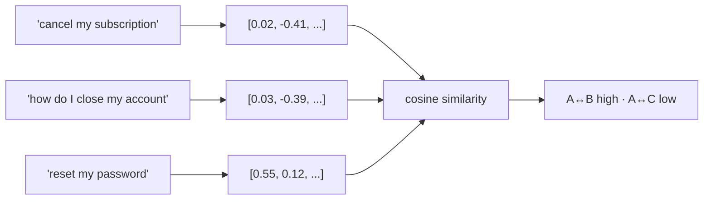

# Embeddings and Similarity {#ch-embeddings-and-similarity}

> Search by meaning instead of by word, and know the four cases where that is the wrong trade.

**In this chapter:** what a vector is · cosine similarity · why scores are ranks, not probabilities · when embeddings beat keywords · the rules that keep a store correct

## 💡 The Core Idea

An embedding turns a piece of text into a fixed-length list of numbers — a **point in space**, where
distance means difference in meaning. "Cancel my subscription" and "how do I close my account" land near
each other despite sharing no significant word. That is the whole value proposition: keyword search
matches strings, embedding search matches meaning.

The mechanics are simple enough to hold in your head. Every document becomes a point once, at ingestion
time. A query becomes a point at request time. Finding relevant documents is finding nearby points. No
maths beyond that is required to use this well.

> An embedding model has one job: put things that mean the same thing close together. Everything else in
> retrieval is bookkeeping around that.

## How It Works

### A vector is a point, and direction is what matters

An embedding model maps text to a vector of a few hundred to a few thousand numbers. The individual
numbers are not interpretable — there is no "formality" dimension you can read — but the **geometry** is.

Similarity is measured by the angle between two vectors, not the distance between their tips. Two
documents saying the same thing at different lengths point the same way; a plain distance would call them
different because one is longer.



**Cosine similarity compares direction, so length of text does not distort the comparison.**

That measure runs from −1 to 1, and in practice most real text sits in a narrow band well above zero:

```typescript
import { cosineSimilarity, embedMany } from "ai";

const { embeddings } = await embedMany({
  model: EMBEDDING_MODEL,
  values: ["cancel my subscription", "how do I close my account", "reset my password"],
});

cosineSimilarity(embeddings[0], embeddings[1]); // ~0.85 — same intent
cosineSimilarity(embeddings[0], embeddings[2]); // ~0.55 — both account admin, different jobs
```

### The scores are ranks, not probabilities

This is the misunderstanding that causes most bad thresholds. A cosine score of 0.82 does not mean 82%
relevant, and it is not comparable across models — one model's "unrelated" baseline is 0.1 and another's
is 0.7, because the value depends on how the model distributes text in its space.

Only the **ordering** is meaningful. So never hard-code a cut-off you reasoned your way to; take the top
*k*, or set a threshold by measuring where relevance actually falls off on a labelled set of your own
queries.

### Same model, both sides — and the asymmetry

Two rules keep a vector store honest, and breaking either produces retrieval that is quietly bad rather
than obviously broken.

1. **Query and documents must be embedded by the same model.** Different models produce incomparable
   spaces. Changing embedding model means re-embedding every document — plan for it as a migration, not
   a config change.
2. **Many models distinguish queries from documents.** A short question and a long passage are different
   shapes of text, and models that expose an input type expect you to say which is which. Getting it
   backwards costs recall silently.

Store the model name and version alongside the vectors. Without it, nobody can tell six months later
whether a store was built with one model or two.

### Where embeddings win, and where they lose

| Query | Keyword search | Embedding search |
| --- | --- | --- |
| "how do I close my account" | ❌ Misses "cancel subscription" | ✅ Finds it |
| "error ORA-01555" | ✅ Exact match | ❌ Fuzzy neighbours, wrong one first |
| "invoice from March 2026" | ✅ Filters cleanly | ❌ Numbers embed poorly |
| "the parts that are *not* deprecated" | ❌ Matches "deprecated" | ❌ Also matches "deprecated" |
| "policy on remote working" | ⚠️ Depends on wording | ✅ Robust to wording |

Three weaknesses are worth memorising because they come up in interviews. Embeddings are bad at **exact
identifiers** — error codes, SKUs, function names — where a single character changes everything and the
geometry does not care. They are bad at **numbers and dates**, which belong in metadata filters. And they
handle **negation** poorly: "not deprecated" and "deprecated" are close together, because they are about
the same subject.

The answer is not to choose. **Hybrid search** — run both, combine the rankings — beats either alone on
almost every real corpus, and metadata filters handle the structured part. That is
[Chapter ?? — Retrieval](#ch-retrieval).

### The operational shape

Embedding is cheap and one-directional: far cheaper per token than generation, batched easily, and done
once per document rather than per request. That asymmetry is why the ingestion side of a retrieval system
can afford to be thorough while the query side has to be fast.

## When to Use It

| If you need… | Use | Why |
| --- | --- | --- |
| Meaning-based search over prose | Embeddings | The wording of the query will not match the document |
| Exact codes, identifiers, names | Keyword or exact index | One character must change the result |
| Filtering by date, owner, status | Metadata filters in the store | Structured fields are not a similarity problem |
| Deduplicating near-identical text | Embeddings with a measured threshold | Ranking is exactly what this needs |
| Grouping feedback into themes | Embeddings plus clustering | No labels needed up front |
| A yes/no decision about one document | A model call, not a score | Similarity is not a classifier |

## Common Mistakes

**❌ Hard-coding a similarity threshold**

> `if (score > 0.75) { /* relevant */ }`

The number is not portable across models, corpora or query types. Take the top *k*, or measure where
relevance falls off on your own labelled queries.

**❌ Changing the embedding model without re-embedding**

The store now holds two incompatible geometries and retrieval degrades without any error. It is a
migration: re-embed everything, then switch reads over.

**✅ Embed queries and documents with the same model, and record which one**

> Persist the model name and version with each vector. It is the difference between a five-minute answer
> and an archaeology session when quality drops.

## 🔑 Key Takeaways

- An embedding is a point in space where nearness means similar meaning, and cosine similarity compares direction rather than length.
- Similarity scores are ranks, not probabilities — they are not comparable across models, so thresholds must be measured.
- Query and documents must share one embedding model; changing it is a re-indexing migration.
- Embeddings lose to keyword search on exact identifiers, numbers and negation, which is why hybrid retrieval wins.
- Embedding is cheap and done once per document; generation is expensive and done per request.

## Interview Questions

**Q: What does a cosine similarity of 0.82 tell you?**

That this pair is more similar than a pair scoring 0.6 in the same model and corpus, and nothing more.
It is not a probability and not comparable across models — unrelated text can sit at 0.7 in one model's
space and 0.1 in another's. Anything that depends on an absolute cut-off has to be calibrated against
labelled examples from the actual corpus.

**Q: When would keyword search beat embeddings?**

Whenever exactness is the point: error codes, SKUs, function names, quoted phrases, anything where one
changed character means a different thing. Embeddings put `ORA-01555` next to every other Oracle error
because they are all about the same subject. Numbers, dates and negation are the other three weak spots,
and the practical answer is hybrid retrieval plus metadata filters rather than picking a side.

**Q: You swapped the embedding model and recall dropped. Why?**

Almost certainly because the stored vectors are still from the old model, so queries are being compared
against a space they do not belong to. There is no error for this — the store returns nearest neighbours
in the wrong geometry, which look like plausible but poor results. Changing embedding model is a
re-indexing migration.

**Q: Where do embeddings fit outside search?**

Deduplication, clustering feedback or support tickets into themes without predefined labels,
recommendation by similarity to what someone already read, and routing a request to the most similar
known intent. They are cheap and fast enough to sit on paths where a model call would be too slow — which
is often the real reason to reach for them.

## What to Read Next

- [Chapter ?? — Retrieval](#ch-retrieval) — hybrid search, reranking and filters built on top of this
- [Chapter ?? — Ingestion and Chunking](#ch-ingestion-and-chunking) — what you embed decides what you can find
- [Chapter ?? — Vector Stores](#ch-vector-stores) — where the vectors live and what that costs
