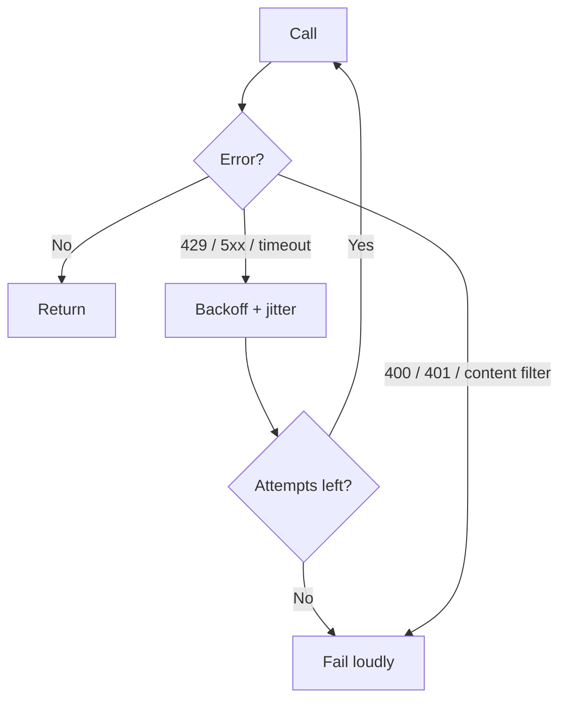

# Calling an LLM from TypeScript {#ch-calling-an-llm-from-typescript}

> Make a model call that behaves like every other call to a slow, expensive, occasionally wrong third-party service.

**In this chapter:** the call as an HTTP dependency · provider SDK vs unified SDK · timeouts and retries · the errors that matter · where the key lives

## 💡 The Core Idea

A model call is an HTTP request to a service that is **ten to a hundred times slower than your database,
priced per byte in both directions, and able to fail while returning HTTP 200.** Nothing else about it is
exotic. Every discipline you already apply to a payment gateway or a search API applies here, and the
teams that get burned are the ones who treat the call as a library function rather than as a network
dependency.

The one unfamiliar failure mode is worth stating on its own: the request can succeed, the status can be
`200`, the body can be well-formed, and the content can still be wrong. HTTP tells you the transport
worked. It tells you nothing about the answer.

> Treat the response as untrusted input from a slow remote service. That single framing gets most of the
> engineering right.

## How It Works

### The shape of a call

Three things go up — instructions, messages, and settings — and three come back: content, a stop reason,
and usage.

```typescript
import { generateText } from 'ai';

const result = await generateText({
  model: 'anthropic/claude-sonnet-4.6',
  instructions: 'Answer only from the provided documentation. Say when you cannot.',
  messages: [{ role: 'user', content: question }],
  maxOutputTokens: 800,           // a cost ceiling, not a style hint
  abortSignal: AbortSignal.timeout(20_000),
});

result.text;         // the content
result.finishReason; // 'stop' | 'length' | 'tool-calls' | 'content-filter' | 'error'
result.usage;        // inputTokens, outputTokens — the bill
```

**`finishReason` is the field most codebases never read**, and it is the one that tells you the answer was
cut off. A `length` finish means the model ran out of output allowance mid-sentence. Rendering that as a
complete answer is a bug that never throws.

> ⚠️ **Moving target:** this book is stamped against **AI SDK 7**, where the system prompt is the
> `instructions` property and a `system` message inside `messages` is rejected by default. The durable
> principle is that instructions and conversation are two different inputs with different caching
> behaviour. Check the current shape before writing the call.

### Provider SDK or unified SDK

| Approach | You get | You pay |
| --- | --- | --- |
| **Provider SDK** (`@anthropic-ai/sdk`, `openai`) | Every feature the day it ships, exact provider semantics | A rewrite to add a second provider |
| **Unified SDK** (the AI SDK, LangChain) | One call shape across providers, one streaming format | A lag on new features; leaks where providers genuinely differ |
| **Your own wrapper** | Exactly your needs | You now maintain a unified SDK |

Start with a unified SDK unless you are using one provider's frontier capability on day one. The
migration cost runs the other way — swapping a unified call for a provider call later is an afternoon;
retrofitting an abstraction across forty call sites is not.
[Chapter ?? — Multi-Provider Architecture](#ch-multi-provider-architecture) covers what the abstraction
cannot hide.

### Timeouts, because the default is not one

Most HTTP clients default to no timeout or to two minutes. Both are wrong for a user-facing model call: a
reasoning model can legitimately think for ninety seconds, and a user will not wait ten.

```typescript
async function ask(question: string, budgetMs: number): Promise<string> {
  const result = await generateText({
    model: 'anthropic/claude-sonnet-4.6',
    messages: [{ role: 'user', content: question }],
    abortSignal: AbortSignal.timeout(budgetMs),
  });
  if (result.finishReason === 'length') throw new TruncatedAnswer(result.text);
  return result.text;
}
```

Set the budget from the surface, not from the model. A chat box streaming to a user gets a generous
budget because the first token arrives early. A synchronous API endpoint that blocks a page render gets a
strict one.

### Retries, and the two failures that must not be retried



**Which model errors are worth a second attempt, and which are a waste of money.**

A `429` and a `503` are transient and belong in a retry with exponential backoff and jitter. A `400`
(malformed request, context too long) and a `401` are deterministic — retrying them burns latency to
reach the same failure. A content filter is a decision, not an outage; retrying it verbatim usually
returns the same refusal.

Retry counts as a request. Three retries on a large prompt is four times the input cost, and the input is
usually the expensive half.

### Errors worth naming separately

| Class | Typical cause | Right response |
| --- | --- | --- |
| **Rate limit** (429) | Burst, or a shared org quota | Backoff, queue, or shed load |
| **Context too long** (400) | The assembler over-packed | Trim before sending — never retry as-is |
| **Overloaded** (529 / 503) | Provider capacity | Backoff, then fail over |
| **Content filter** | Input or output tripped a policy | Surface it honestly; do not loop |
| **Truncated** (`finishReason: 'length'`) | Output allowance too small | Raise the ceiling or ask for less |

### Where the key lives

The API key is a server-side secret with a per-token cost attached. It never reaches the browser, and a
public endpoint that forwards user text straight to a provider is an open tab on your billing account.
The route needs the same controls as any expensive endpoint: authentication, a per-user rate limit, and a
cap on input size.

## When to Use It

| Situation | Call shape | Why |
| --- | --- | --- |
| Answer shown to a person | Streaming, generous timeout | Perceived latency collapses |
| Classify or extract in a pipeline | `generateText`, strict timeout, small model | Nobody is watching a spinner |
| Answer feeds other code | Structured output with validation | A string needs parsing you cannot trust |
| Batch of thousands | Queue with concurrency limits | Rate limits are per-minute, not per-request |

## Common Mistakes

**❌ Calling the provider from the browser**

> The key is exposed and the cost is uncapped. Route through your own server, always.

**❌ Ignoring `finishReason`**

> A truncated answer looks exactly like a complete one in the response body. Check the field, or ship
> half-sentences to users.

**❌ Retrying every error the same way**

> Retrying a context-length error three times costs four full input charges to reach the same failure.
> Split retryable from deterministic before writing the loop.

**✅ Give every call an explicit token ceiling and an explicit deadline**

> `maxOutputTokens` bounds the bill, `abortSignal` bounds the wait. Neither has a safe default, and a
> missing one shows up as a cost spike or a hung request.

## 🔑 Key Takeaways

- A model call is a slow, expensive network dependency that can fail while returning HTTP 200.
- Always set an output token ceiling and an explicit deadline; neither has a usable default.
- Read `finishReason` — a truncated answer is indistinguishable from a complete one without it.
- Retry rate limits and overload errors with backoff; never retry malformed requests or content filters.
- Start on a unified SDK, because retrofitting an abstraction across many call sites costs far more than replacing one.

## Interview Questions

**Q: What is the first thing you add to a naive `await callModel(prompt)` before shipping it?**

A deadline and an output ceiling. The default timeout in most HTTP clients is longer than any user will
wait, and without `maxOutputTokens` a single request can generate until the model decides to stop, which
is unbounded cost on a per-request basis. After those two, the error taxonomy: which failures retry and
which do not.

**Q: The provider returns 200 and the user sees a half-finished sentence. What happened?**

The output allowance ran out and `finishReason` came back as `length`. The transport succeeded, so
nothing threw. The fix is to read the finish reason and treat truncation as a real error state — either
raise the ceiling, ask the model for a shorter answer, or tell the user the response was cut short.
Silently rendering it is the failure.

**Q: Would you use a provider SDK or a unified one?**

A unified SDK by default, because the cost of adding a second provider later is otherwise a rewrite of
every call site, and multi-provider is a question of when rather than if once cost or an outage forces
it. I would use the provider SDK directly if the feature depends on something that provider shipped this
quarter, since unified layers lag on new capabilities by design.

**Q: How do you rate-limit an AI endpoint differently from a normal one?**

By cost rather than by request count. One request with a 100k-token context and a long answer can cost
more than a thousand ordinary requests, so a per-minute request cap does not bound spend. Cap input size,
cap output tokens, and track a per-user token budget alongside the request limit — that is the control
that actually protects the bill.

**Q: Where do you put the API key, and what else does that endpoint need?**

Server-side only, never in the browser or a client bundle. The endpoint that holds it needs
authentication, a per-user token budget, an input size cap, and a timeout — otherwise it is an
unauthenticated way for anyone to spend your money, which is a different and worse problem than a normal
open endpoint.

## What to Read Next

- [Chapter ?? — Streaming Responses](#ch-streaming-responses) — the same call, delivered token by token
- [Chapter ?? — Structured Output](#ch-structured-output) — when the answer has to be JSON your code can trust
- [Chapter ?? — Cost Engineering](#ch-cost-engineering) — what those usage numbers add up to
