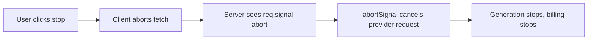

# Streaming Responses {#ch-streaming-responses}

> Get the first token to the browser in 400 ms instead of the whole answer in eight seconds — and cancel it cleanly when the user leaves.

**In this chapter:** why streaming is not an optimisation · SSE and the transport choice · the server route · cancellation all the way down · partial results are still results

## 💡 The Core Idea

A model generates one token at a time. Waiting for the last one before showing the first is a choice, and
it is almost always the wrong one. **Streaming does not make the answer faster; it moves the wait from
one eight-second block to a 400 ms block followed by text arriving faster than a person reads.**

That reframes the metric. The number that matters for a user-facing feature is **time to first token**,
not total duration. A model that finishes in six seconds with a 300 ms first token feels better than one
that finishes in four seconds with a four-second wait, and no amount of model tuning closes that gap.

> Streaming is a user-experience decision implemented in the transport layer. Treat it as a product
> requirement, not a performance micro-optimisation.

## How It Works

### The transport

Three options, and one of them wins for almost every case.

| Transport | Fits | Against it |
| --- | --- | --- |
| **Server-Sent Events** | One-way server → client text | Text only, one direction |
| **WebSocket** | Two-way, voice, live collaboration | Connection state, scaling, reconnection logic |
| **Chunked HTTP / `ReadableStream`** | Simple token pipes, framework built-ins | You reinvent event framing |

**Server-Sent Events is the default.** A model response is one-directional text over HTTP, which is
exactly what SSE was designed for. It reconnects on its own, works through ordinary HTTP infrastructure,
and needs no protocol upgrade. Reach for a WebSocket when the client also streams — audio in, or a
shared editing session. The server-side mechanics of holding that response open — proxy buffering, the
keep-alive ping, the six-connection limit on HTTP/1.1 — are
[Chapter ?? — Real-Time and Streaming APIs](#ch-realtime-streaming).

### The server route

```typescript
import { streamText, convertToModelMessages, type UIMessage } from 'ai';

export async function POST(req: Request): Promise<Response> {
  const { messages }: { messages: UIMessage[] } = await req.json();

  const result = streamText({
    model: 'anthropic/claude-sonnet-4.6',
    instructions: DOCS_ASSISTANT_INSTRUCTIONS,
    messages: convertToModelMessages(messages),
    abortSignal: req.signal,        // the whole point — see cancellation below
    onAbort: ({ steps }) => persistPartial(steps),
    onFinish: ({ usage, text }) => recordUsage(usage, text),
  });

  return result.toUIMessageStreamResponse();
}
```

Note what is **not** here: no `await` on the model call. `streamText` returns immediately with a stream
handle, and the response goes back to the client while tokens are still arriving. Awaiting the full
result and then streaming it is a common and self-defeating mistake — it reintroduces the entire wait.

### Cancellation has to reach the provider

A user who closes the tab or clicks stop has stopped caring. The tokens keep costing money until the
request to the provider is actually aborted, and that only happens if the signal propagates through every
hop.



**Where the abort has to travel for cancellation to save any money.**

Break the chain anywhere and the model finishes generating into a socket nobody is reading. Forwarding
`req.signal` into the call is one line and it is the line that makes cancellation real rather than
cosmetic.

> ⚠️ Buffering proxies swallow streams. A CDN, an API gateway, or a compression middleware that waits for
> a complete body turns a streaming route back into a blocking one, and it looks like a slow model rather
> than a misconfigured proxy. Test the deployed URL, never only `localhost`.

### Backpressure, and why it is usually not your problem

`ReadableStream` applies backpressure automatically: if the client reads slowly, the queue fills and the
producer pauses. For text at a few hundred tokens per second, no browser is the bottleneck.

Where it does matter is fan-out. One model response streamed to many subscribers — a shared session, a
live demo — needs the slow consumer isolated, or it stalls everyone. Buffer per subscriber and drop the
subscriber that falls behind, rather than letting it apply backpressure to the source.

### A partial answer is still worth something

When a stream dies at 60%, you are holding 60% of an answer. Throwing it away and showing an error
discards the only thing the user has.

| Event | ❌ Common | ✅ Better |
| --- | --- | --- |
| Network drops mid-stream | Clear the pane, show an error | Keep the text, mark it incomplete, offer retry |
| User clicks stop | Discard | Keep it; it is often what they wanted |
| Rate limit at token 400 | Full failure | Keep 400 tokens, explain, retry the remainder |

Persist partial output on abort. In an agent loop the partial state is expensive to recompute, and
`onAbort` is where that save belongs.

## When to Use It

| Scenario | Stream? | Why |
| --- | --- | --- |
| Chat or assistant UI | Yes | Time to first token is the whole experience |
| Long generated document | Yes | Progress is visible; the user can stop early |
| Classification returning one label | No | Output is 5 tokens; streaming adds complexity for nothing |
| JSON another service consumes | Usually no | The consumer needs a complete, valid object |
| Background batch job | No | Nobody is watching |

## Common Mistakes

**❌ Awaiting the full response and then writing it to a stream**

```typescript
const { text } = await generateText({ /* ... */ }); // the eight-second wait, restored
return new Response(toStream(text));
```

> The route now streams a result the user already waited for. Use the streaming call.

**❌ Not forwarding the abort signal**

> The client disconnects, the provider keeps generating, and you keep paying. The tokens are billed
> whether or not anyone reads them.

**❌ Testing streaming only on localhost**

> No proxy, no CDN, no gateway. Buffering appears in staging and reads as a slow model.

**✅ Render partial text as it arrives, and keep it on failure**

> The user gets an answer forming at reading speed, and a broken stream leaves them with most of an
> answer instead of an empty box.

## 🔑 Key Takeaways

- Streaming trades one long wait for a short one; time to first token is the metric that matters.
- Server-Sent Events is the right default — a model response is one-way text over ordinary HTTP.
- Cancellation only saves money if the abort signal reaches the provider request itself.
- Buffering proxies silently turn a streaming route back into a blocking one; test the deployed URL.
- Keep partial output when a stream fails — it is most of an answer, and discarding it helps nobody.

## Interview Questions

**Q: Why stream when the total time is the same?**

Because perceived latency is not total time. A user seeing text at 400 ms judges the system as
responsive even if it finishes at eight seconds, and a user staring at a spinner for four seconds judges
it as broken. The gap between those two experiences is larger than any model upgrade would buy, and it
costs one change to the transport rather than a change to the model.

**Q: SSE or WebSocket for a chat feature?**

SSE, unless the client also needs to stream. The data flow is one-directional text over HTTP, SSE
reconnects on its own, and it passes through normal HTTP infrastructure without a protocol upgrade. A
WebSocket adds connection state, reconnection handling and scaling questions to buy bidirectionality the
feature does not use. Voice input or live collaboration changes the answer.

**Q: A user closes the tab mid-answer. What happens, and what should happen?**

By default the server keeps reading from the provider and you are billed for every token nobody sees.
What should happen is that the client's disconnect aborts the server request, and the server's abort
signal is forwarded into the model call so generation actually stops. That is one parameter, and without
it cancellation is a UI illusion.

**Q: Streaming works locally and hangs in production. Where do you look?**

At everything between the route and the browser. A CDN, gateway or compression middleware that buffers
the response until the body is complete converts the stream into a single blocking write. It presents as
a slow model, which sends people to look at the wrong layer entirely. Check the response headers and the
proxy's buffering configuration first.

**Q: When would you not stream?**

When nothing is watching or when the consumer needs the whole thing anyway. A classifier returning one
label, a background job, or a call whose JSON output feeds another service — streaming there adds
partial-parse complexity and buys nothing. Streaming pays for itself only when a human is waiting.

## What to Read Next

- [Chapter ?? — Designing for Latency](#ch-designing-for-latency) — what the interface does with those tokens
- [Chapter ?? — Failure States](#ch-failure-states) — designing the broken stream properly
- [Chapter ?? — Structured Output](#ch-structured-output) — streaming an object rather than prose
