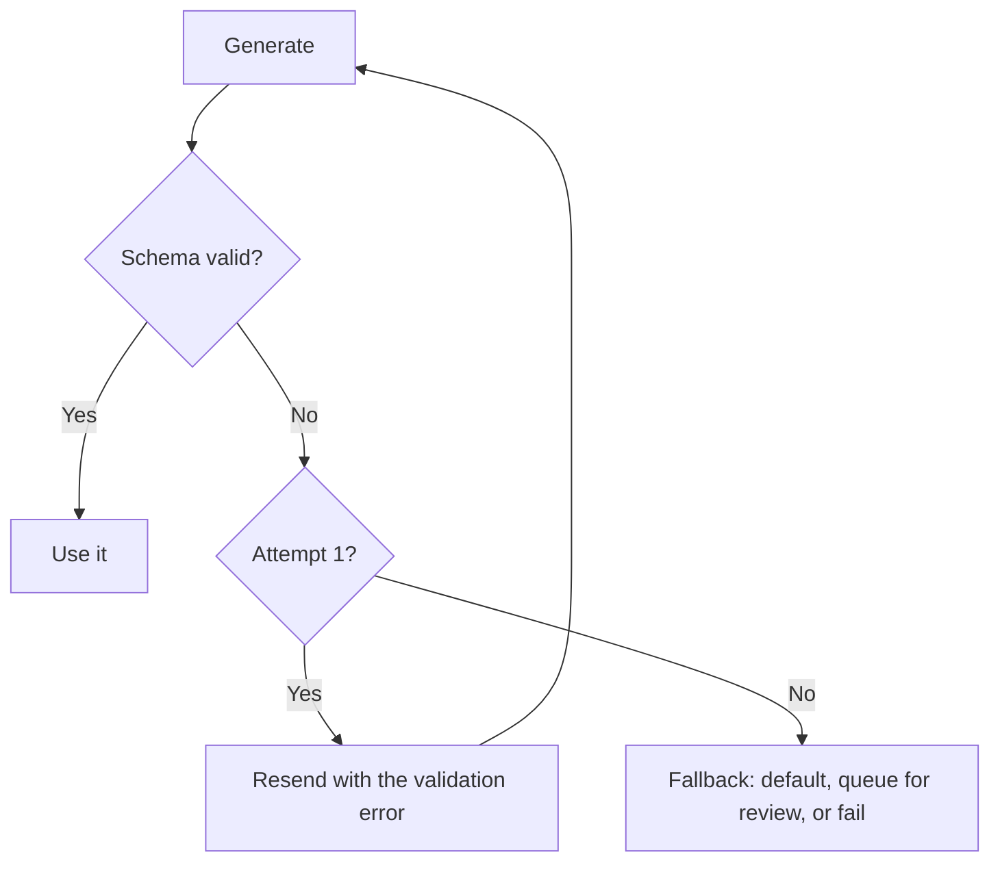

# Structured Output {#ch-structured-output}

> Get JSON your code can rely on, and decide in advance what happens on the day it is wrong anyway.

**In this chapter:** three ways to get JSON · schema-constrained generation · validating at the boundary · repair loops and their cost · schema design that changes the answer

## 💡 The Core Idea

The moment model output feeds code rather than a person, prose is the wrong medium. You need a shape:
named fields, known types, a contract. **Schema-constrained generation gets you that shape reliably — but
it constrains syntax, not truth.** A perfectly valid object can hold a hallucinated invoice number.

So the discipline splits in two, and mixing them up is the most common mistake in this chapter's
territory. Constrained decoding guarantees the JSON parses and matches the schema. Validation at your
boundary guarantees the values are ones your system can act on. You need both, and they catch different
things.

> The schema is a type system, not a fact checker. It tells you the field exists. It does not tell you the
> value is real.

## How It Works

### Three ways to ask, in order of reliability

| Approach | Mechanism | Failure rate | Use when |
| --- | --- | --- | --- |
| **Prompt and parse** | "Reply with JSON", then `JSON.parse` | High — prose preamble, trailing commas, code fences | Never, in production |
| **JSON mode** | Provider guarantees valid JSON | Low for syntax, no schema guarantee | The shape is trivial |
| **Schema-constrained** | Provider constrains decoding to your schema | Lowest | Default for anything typed |

Schema-constrained generation works at the decoding step: the provider restricts which tokens are legal
at each position so the output cannot leave the grammar. This is why it beats prompting — the model is
not being asked nicely, it is being made unable to produce a malformed object.

### The call

```typescript
import { generateText, Output } from 'ai';
import { z } from 'zod';

const Extraction = z.object({
  summary: z.string().max(300),
  severity: z.enum(['low', 'medium', 'high']),
  affectedVersions: z.array(z.string()),
  confident: z.boolean().describe('false if the document did not clearly state this'),
});

const { output } = await generateText({
  model: 'anthropic/claude-sonnet-4.6',
  output: Output.object({ schema: Extraction }),
  prompt: `Extract the fields from this changelog entry:\n\n${entry}`,
});

output.severity; // typed as 'low' | 'medium' | 'high'
```

Two details in that schema do real work. `.describe()` is sent to the model as part of the schema — it is
prompt text with a field attached, and it is the cheapest way to steer a value. The `confident` boolean
gives the model a legal way to signal uncertainty; without one, an uncertain model has no option but to
invent a plausible value, because the schema demands something in the slot.

> ⚠️ **Moving target:** the AI SDK 7 surface here is `Output.object({ schema })` on `generateText` and
> `streamText`, and provider support for strict schema adherence varies by model. The durable principle
> is that the schema goes to the provider and the result still gets validated on your side. API names
> move; that division does not.

### Validate anyway

Constrained decoding is a provider feature with provider-specific coverage. Some models support a subset
of JSON Schema; some silently drop constraints they cannot enforce, such as string length or regular
expressions. Parse at your boundary regardless.

```typescript
const parsed = Extraction.safeParse(output);
if (!parsed.success) {
  metrics.increment('llm.schema_violation', { field: parsed.error.issues[0]?.path.join('.') });
  return fallback(entry);
}
```

Counting violations by field is what turns this from a `try`/`catch` into a signal. A field that fails 5%
of the time is telling you its description is ambiguous, and that is a prompt fix, not a retry fix.

### Repair loops, and what they cost

When validation fails, sending the error back for a second attempt often works. It also doubles the cost
and the latency of that request.



**One repair attempt, then a decision — not a loop that runs until it works.**

Bound it at one retry. A second failure on the same input is almost never a sampling accident; it means
the schema and the input disagree, and a third call is money spent to reach the same wall. What follows
the bound is a product decision: a safe default, a human review queue, or an honest failure.

### Schema design changes the answer

The schema is part of the prompt. Field names, order and shape all move the output.

| ❌ Weaker | ✅ Stronger | Why |
| --- | --- | --- |
| `status: z.string()` | `status: z.enum([...])` | An open string invites invention |
| `data: z.record(z.unknown())` | Explicit named fields | An unconstrained bag constrains nothing |
| Answer field first | Reasoning field first | Tokens generated earlier condition what follows |
| No uncertainty field | `confident: z.boolean()` | Gives "I do not know" somewhere to go |
| Deeply nested, 40 fields | Flat, 8 fields | Adherence drops with schema complexity |

Field order is the subtle one. Generation is left to right, so a `reasoning` field placed **before** the
verdict measurably improves the verdict; placed after, it is a justification written to fit a decision
already made.

### Streaming an object

Partial objects can be streamed for progressive rendering, but a partial object is by definition not yet
valid. Render partial fields optimistically and validate only on completion — never act on a half-built
object.

## When to Use It

| Need | Approach |
| --- | --- |
| Output drives code, a database write, or a UI component | Schema-constrained plus validation |
| Output is read by a person | Plain text — a schema adds cost and rigidity for nothing |
| Classification into fixed categories | A one-field enum schema, smallest model that passes evals |
| Extraction from documents | Schema with an explicit uncertainty field |
| Values must be real, not merely well-typed | Schema plus a lookup against your own data |

## Common Mistakes

**❌ Trusting the schema as a correctness guarantee**

> `invoiceId: z.string()` is satisfied by any string. If the id must exist, look it up.

**❌ Unbounded repair loops**

> Three retries on a failing schema is four charges to reach the same failure. Bound at one, then decide.

**❌ A schema with no way to say "I do not know"**

> Every required field must be filled. Without an uncertainty flag or a nullable field, the model's only
> legal move is to invent a value.

**✅ Put reasoning before the verdict in the schema**

> The model generates in order, so the reasoning genuinely conditions the answer instead of decorating it.

## 🔑 Key Takeaways

- Schema-constrained generation makes malformed JSON nearly impossible; it makes wrong values no less likely.
- Validate on your side regardless — provider schema support is partial and varies by model.
- Bound repair loops at one retry, then fall back deliberately; a second failure is a schema problem.
- Schema design is prompt design: enums beat open strings, and reasoning fields belong before verdicts.
- Give the model a legal way to express uncertainty, or a required field forces it to invent one.

## Interview Questions

**Q: How do you get reliable JSON out of a model?**

Schema-constrained generation, where the schema is sent to the provider and decoding is restricted to
tokens that keep the output inside the grammar. That removes the syntax problem almost entirely, which
prompt-and-parse never does. Then validate the parsed object at my own boundary, because provider support
for the full schema surface is uneven and the guarantee I actually depend on should be enforced by my
code.

**Q: The schema validates but the data is wrong. What does that tell you?**

That the schema was doing the job it can do and not the one I needed. Structure and truth are separate
concerns: constrained decoding guarantees the shape, and nothing about the call verifies that an
identifier exists or a number was read from the right column. If values have to be real, they get checked
against a source of truth — a lookup, a range check, a cross-reference to the retrieved passage.

**Q: When validation fails, do you retry?**

Once, with the validation error included so the model can see what broke. Not more. A second failure on
the same input almost always means the schema and the input genuinely disagree, so further attempts cost
money to reach the same place. After that it is a product decision — a safe default, a review queue, or
an honest failure — and which one depends on whether a wrong answer is worse than no answer.

**Q: Does the shape of the schema change the quality of the output?**

Yes, considerably. Enums outperform open strings because they remove the option to invent. Flat schemas
outperform deep ones because adherence degrades with complexity. And field order matters, since
generation is sequential — a reasoning field before the verdict conditions the verdict, while the same
field after it only produces a justification for a decision already made.

**Q: How would you extract fields from a document where some are genuinely absent?**

Make those fields nullable or add an explicit confidence flag, and say in the field description what
absence looks like. A required field with no escape hatch forces the model to fill it, and a fabricated
value that validates is worse than a null — it passes every check I have and fails silently downstream.

## What to Read Next

- [Chapter ?? — Tool Calling](#ch-tool-calling) — structured output with a loop and side effects around it
- [Chapter ?? — Evals](#ch-evals) — measuring how often the values, not the shapes, are right
- [Chapter ?? — Prompting as Engineering](#ch-prompting-as-engineering) — field descriptions are prompt text
