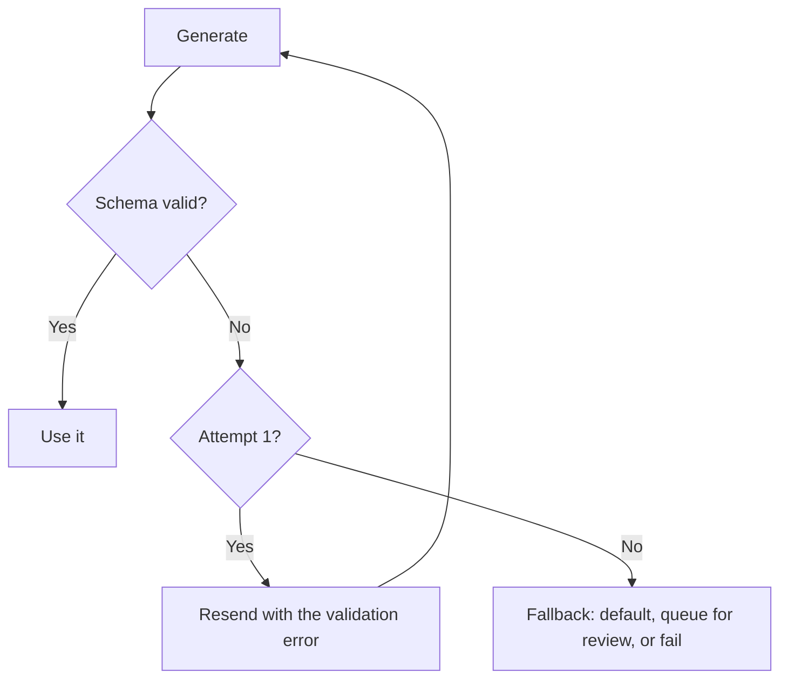

# Structured Output {#ch-structured-output}

> Get JSON your code can rely on, and decide in advance what happens on the day it is wrong anyway.

**In this chapter:** three ways to get JSON · schema-constrained generation · validating at the boundary · repair loops and their cost · schema design that changes the answer

## 💡 The Core Idea

Once model output feeds code instead of a person, prose is the wrong medium. You need a shape: named
fields, known types, a contract. **Schema-constrained generation gets you that shape reliably. But it
constrains syntax, not truth.** A perfectly valid object can hold a hallucinated (invented) invoice number.

So the work splits in two, and mixing them up is the most common mistake in this area. Constrained
decoding guarantees the JSON parses and matches the schema. Validation at your boundary guarantees the
values are ones your system can act on. You need both, and they catch different things.

> The schema is a type system, not a fact checker. It tells you the field exists. It does not tell you the
> value is real.

## How It Works

### Three ways to ask, in order of reliability

| Approach | Mechanism | Failure rate | Use when |
| --- | --- | --- | --- |
| **Prompt and parse** | "Reply with JSON", then `JSON.parse` | High — prose preamble, trailing commas, code fences | Never, in production |
| **JSON mode** | Provider guarantees valid JSON | Low for syntax, no schema guarantee | The shape is trivial |
| **Schema-constrained** | Provider constrains decoding to your schema | Lowest | Default for anything typed |

Schema-constrained generation works at the decoding step. The provider restricts which tokens are legal
at each position, so the output cannot leave the grammar. This is why it beats prompting. Nobody asks
the model nicely. The provider makes it unable to produce a malformed object.

### The call

```typescript
import { generateText, Output } from 'ai';
import { z } from 'zod';

const Extraction = z.object({
  summary: z.string().max(300),
  severity: z.enum(['low', 'medium', 'high']),
  affectedVersions: z.array(z.string()),
  confident: z.boolean().describe('false if the document did not clearly state this'),
});

const { output } = await generateText({
  model: 'anthropic/claude-sonnet-4.6',
  output: Output.object({ schema: Extraction }),
  prompt: `Extract the fields from this changelog entry:\n\n${entry}`,
});

output.severity; // typed as 'low' | 'medium' | 'high'
```

Two details in that schema do real work. The SDK sends `.describe()` to the model as part of the schema.
It is prompt text with a field attached, and the cheapest way to steer a value. The `confident` boolean
gives the model a legal way to signal doubt. Without one, an unsure model must invent a plausible value,
because the schema demands something in the slot.

> ⚠️ **Moving target:** the AI SDK 7 surface here is `Output.object({ schema })` on `generateText` and
> `streamText`. Provider support for strict schema adherence varies by model. The lasting principle is
> that the schema goes to the provider and your side still validates the result. API names move. That
> division does not.

### Validate anyway

Constrained decoding is a provider feature, and each provider covers a different part of it. Some models
support only a subset of JSON Schema. Some silently drop constraints they cannot enforce, such as string
length or regular expressions. Parse at your boundary regardless.

```typescript
const parsed = Extraction.safeParse(output);
if (!parsed.success) {
  metrics.increment('llm.schema_violation', { field: parsed.error.issues[0]?.path.join('.') });
  return fallback(entry);
}
```

Counting violations by field turns this from a `try`/`catch` into a signal. A field that fails 5% of
the time is telling you its description is unclear. That is a prompt fix, not a retry fix.

### Repair loops, and what they cost

When validation fails, sending the error back for a second attempt often works. It also doubles the cost
and the latency of that request.


```mermaid
flowchart TD
  A[Generate] --> B{Schema valid?}
  B -- Yes --> Z[Use it]
  B -- No --> C{Attempt 1?}
  C -- Yes --> D[Resend with the validation error] --> A
  C -- No --> E[Fallback: default, queue for review, or fail]
```

**One repair attempt, then a decision — not a loop that runs until it works.**

Limit it to one retry. A second failure on the same input is almost never a sampling accident. It means
the schema and the input disagree, and a third call is money spent to reach the same wall. After the
limit comes a product decision: a safe default, a human review queue, or an honest failure.

### Schema design changes the answer

The schema is part of the prompt. Field names, order and shape all move the output.

| ❌ Weaker | ✅ Stronger | Why |
| --- | --- | --- |
| `status: z.string()` | `status: z.enum([...])` | An open string invites invention |
| `data: z.record(z.unknown())` | Explicit named fields | An unconstrained bag constrains nothing |
| Answer field first | Reasoning field first | Tokens generated earlier condition what follows |
| No uncertainty field | `confident: z.boolean()` | Gives "I do not know" somewhere to go |
| Deeply nested, 40 fields | Flat, 8 fields | Adherence drops with schema complexity |

Field order is the subtle one. Generation runs left to right. So a `reasoning` field placed **before**
the verdict measurably improves the verdict. Placed after, it is a justification written to fit a
decision already made.

### Streaming an object

You can stream partial objects for progressive rendering. But a partial object is, by definition, not
yet valid. Render partial fields optimistically and validate only on completion. Never act on a
half-built object.

## When to Use It

| Need | Approach |
| --- | --- |
| Output drives code, a database write, or a UI component | Schema-constrained plus validation |
| Output is read by a person | Plain text — a schema adds cost and rigidity for nothing |
| Classification into fixed categories | A one-field enum schema, smallest model that passes evals |
| Extraction from documents | Schema with an explicit uncertainty field |
| Values must be real, not merely well-typed | Schema plus a lookup against your own data |

## Common Mistakes

**❌ Trusting the schema as a correctness guarantee**

> `invoiceId: z.string()` is satisfied by any string. If the id must exist, look it up.

**❌ Unbounded repair loops**

> Three retries on a failing schema is four charges to reach the same failure. Stop at one, then decide.

**❌ A schema with no way to say "I do not know"**

> Every required field must be filled. Without an uncertainty flag or a nullable field, the model's only
> legal move is to invent a value.

**✅ Put reasoning before the verdict in the schema**

> The model generates in order, so the reasoning genuinely conditions the answer instead of decorating it.

## 🔑 Key Takeaways

- Schema-constrained generation makes malformed JSON nearly impossible. It makes wrong values no less likely.
- Validate on your side regardless, because provider schema support is partial and varies by model.
- Limit repair loops to one retry, then fall back on purpose. A second failure is a schema problem.
- Schema design is prompt design: enums beat open strings, and reasoning fields belong before verdicts.
- Give the model a legal way to express uncertainty, or a required field forces it to invent one.

## Interview Questions

**Q: How do you get reliable JSON out of a model?**

Schema-constrained generation. The schema goes to the provider, which restricts decoding to tokens that
keep the output inside the grammar. That removes the syntax problem almost entirely, which
prompt-and-parse never does. Then I validate the parsed object at my own boundary. Provider support for
the full schema surface is uneven, and my own code should enforce the guarantee I actually depend on.

**Q: The schema validates but the data is wrong. What does that tell you?**

That the schema did the job it can do, not the one I needed. Structure and truth are separate concerns.
Constrained decoding guarantees the shape. Nothing in the call checks that an identifier exists or that
a number came from the right column. If values have to be real, check them against a source of truth: a
lookup, a range check, or a cross-reference to the retrieved passage.

**Q: When validation fails, do you retry?**

Once, with the validation error included so the model can see what broke. Not more. A second failure on
the same input almost always means the schema and the input really disagree. More attempts cost money to
reach the same place. After that it is a product decision: a safe default, a review queue, or an honest
failure. Which one depends on whether a wrong answer is worse than no answer.

**Q: Does the shape of the schema change the quality of the output?**

Yes, a lot. Enums beat open strings because they remove the option to invent. Flat schemas beat deep
ones because adherence drops with complexity. And field order matters, since generation is sequential. A
reasoning field before the verdict shapes the verdict. The same field after it only justifies a decision
already made.

**Q: How would you extract fields from a document where some are genuinely absent?**

Make those fields nullable or add an explicit confidence flag. Say in the field description what absence
looks like. A required field with no escape hatch forces the model to fill it. A made-up value that
validates is worse than a null, because it passes every check I have and fails silently downstream.

## What to Read Next

- [Chapter ?? — Tool Calling and the Tool Surface](#ch-tool-calling) — structured output with a loop and side effects around it
- [Chapter ?? — Evals, Retrieval Metrics and Error Analysis](#ch-evals) — measuring how often the values, not the shapes, are right
- [Chapter ?? — Prompting as Engineering](#ch-prompting-as-engineering) — field descriptions are prompt text
