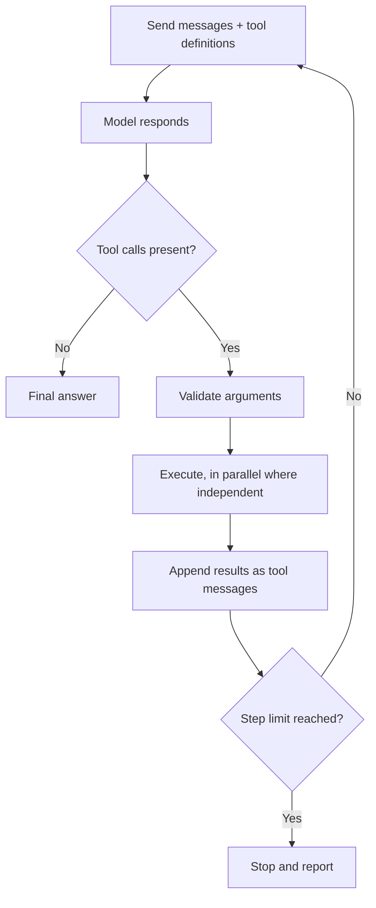

# Tool Calling {#ch-tool-calling}

> Let the model choose which of your functions to run, then own the loop that runs them and decides when to stop.

**In this chapter:** what the model actually returns · the loop and its stop condition · defining a tool · parallel calls · failures the model can act on · the permission boundary

## 💡 The Core Idea

A tool call is not the model running your code. **The model returns a structured request — a tool name
and arguments — and your code decides whether to run it.** The result goes back into the conversation and
the model continues. That is the whole mechanism, and the fact that your code sits in the middle is the
security property everything else rests on.

Seen that way, tool calling is [structured output](#ch-structured-output) with a loop and side effects
around it. The model is choosing a branch and filling in parameters; you are the runtime.

> The model never executes anything. It asks. Every guarantee about what an AI feature can do lives in
> your dispatcher, not in the prompt.

> ⚠️ **Moving target:** tool definitions are the fastest-renamed surface in any AI SDK. Version 5
> replaced `parameters` with `inputSchema` and `maxSteps` with `stopWhen`; version 7 renamed the stop
> helper again, from `stepCountIs` to `isStepCount`. The durable principle is the protocol underneath:
> the model returns a name and a JSON object, your code decides whether to run it, and the result goes
> back as another message. Every SDK is sugar over those three steps.

## How It Works

### The loop



**The tool-calling loop. Every step is a full model call, billed with the whole conversation attached.**

Two consequences follow from that last sentence. Cost grows quadratically with steps, because each step
resends everything before it — five steps is not five times one step. And the loop needs a hard step
limit, because a model with no satisfiable stop condition will keep calling tools until something else
stops it.

### Defining a tool

```typescript
import { generateText, tool, isStepCount } from 'ai';
import { z } from 'zod';

const searchDocs = tool({
  description:
    'Search the product documentation by keyword. Returns up to 5 passages with their source paths. ' +
    'Use this before answering any question about how the product behaves.',
  inputSchema: z.object({
    query: z.string().describe('Keywords, not a full sentence'),
    section: z.enum(['api', 'guides', 'changelog']).optional(),
  }),
  execute: async ({ query, section }) => {
    const hits = await docsIndex.search(query, { section, limit: 5 });
    if (hits.length === 0) return { found: false, hint: 'No match. Try broader keywords.' };
    return { found: true, passages: hits.map((h) => ({ path: h.path, text: h.text })) };
  },
});

const { text, steps } = await generateText({
  model: 'anthropic/claude-sonnet-4.6',
  tools: { searchDocs },
  stopWhen: isStepCount(6),
  messages,
});
```

**The description is the prompt.** It is the only thing the model reads when deciding whether this tool
applies, and it is where most tool-calling bugs are actually fixed. Say what the tool does, what it
returns, and when to use it — [Chapter ?? — Designing the Tool Surface](#ch-designing-the-tool-surface)
takes this much further.

### Parallel calls

A model can request several tools in one step, and independent ones should run concurrently. The subtlety
is that "independent" is your judgement, not the model's.

```typescript
const results = await Promise.all(
  calls.map((call) => (isReadOnly(call.toolName) ? run(call) : null)),
);
```

Read-only lookups parallelise safely. Two writes that touch the same record do not, and a model that
requests both has no idea they conflict. Serialise anything with side effects, or make the tools
idempotent so a duplicate is harmless.

### Failures the model can act on

An error message is prompt text. The model reads it and decides what to do next, so an unhelpful message
produces an unhelpful next step — usually the same call again.

| ❌ Returned error | ✅ Better | What the model does with it |
| --- | --- | --- |
| `Error: 500` | `Search is unavailable. Answer from the conversation or say you cannot check.` | Stops retrying, degrades honestly |
| `[]` | `{ found: false, hint: 'No match for "foo". Try broader keywords.' }` | Reformulates instead of looping |
| `Invalid input` | `section must be one of: api, guides, changelog` | Fixes the argument |
| Raw stack trace | A sentence, plus whether retrying could help | Avoids leaking internals into the window |

The empty-array row is the single most common cause of a looping agent. An empty result is
indistinguishable from a broken tool, so the model tries again, gets the same silence, and keeps going.

> ⚠️ Never put a raw exception into the conversation. Stack traces leak file paths and internals into a
> window that may be logged, shown to a user, or read by an attacker who planted the input.

### The permission boundary

The dispatcher is where authority is decided, and it must not trust arguments.

```typescript
async function dispatch(call: ToolCall, user: User): Promise<unknown> {
  const def = registry[call.toolName];
  if (!def) return { error: `Unknown tool: ${call.toolName}` };
  if (!can(user, def.permission)) return { error: 'Not permitted for this user.' };

  const args = def.inputSchema.safeParse(call.input);      // arguments are model output
  if (!args.success) return { error: describe(args.error) };

  return def.destructive ? requestApproval(call, user) : def.execute(args.data, { user });
}
```

Tool arguments are untrusted input in the strict sense: a document the model read can influence them.
`deleteFile({ path })` with a model-supplied path is a path traversal waiting to happen. Authorise
against the **user's** permissions, never the model's request, and gate destructive tools behind
approval — [Chapter ?? — Prompt Injection](#ch-prompt-injection) explains why this is the load-bearing
control.

## When to Use It

| Need | Tools? | Instead |
| --- | --- | --- |
| Current or private data the model cannot know | Yes | — |
| Actions with real effects — send, create, refund | Yes, gated | — |
| Always fetch the same context every request | No | Retrieve it before the call |
| A fixed, known sequence of steps | No | Write the code; a loop is slower and less reliable |
| Output shape only | No | [Structured output](#ch-structured-output) |

The third and fourth rows are where teams over-reach. If the workflow is deterministic, a `for` loop
costs nothing per step and never picks the wrong branch.

## Common Mistakes

**❌ No step limit**

> A model that cannot satisfy its stop condition keeps calling tools. Without `stopWhen`, that is an
> unbounded bill discovered the next morning.

**❌ Returning an empty result with no explanation**

> Silence looks like a broken tool, so the model retries. Say "no match" and say what to try instead.

**❌ Trusting tool arguments**

> They come from a model that read documents you do not control. Validate and authorise every one.

**✅ Write the description for the model, not for your team**

> It is the only signal the model has about when this tool applies. Vague descriptions produce the wrong
> tool at the wrong time, and no amount of system-prompt text repairs that.

## 🔑 Key Takeaways

- The model requests a tool call; your dispatcher decides whether to run it, which is where all authority lives.
- Every loop step resends the whole conversation, so cost grows faster than the step count.
- A hard step limit is not optional — it is the only bound on a loop the model controls.
- Error and empty results are prompt text: say what happened and what to try, or the model loops.
- Validate arguments and authorise against the user, never against what the model asked for.

## Interview Questions

**Q: Walk through what happens when a model calls a tool.**

The model returns a structured request — a tool name and JSON arguments matching the schema I sent — and
generation stops. My code validates the arguments, checks permissions, runs the function, and appends the
result to the conversation as a tool message. Then I call the model again with the extended history. It
either answers or requests another tool, and that repeats until it answers or hits my step limit. The
model never executes anything itself.

**Q: Your agent is looping on the same tool. What do you check first?**

The tool's return value on the failure path. The usual cause is a tool that returns an empty array or a
bare error when it finds nothing, which is indistinguishable from a transient failure, so the model
reasonably tries again. Making the tool return an explicit "no match" plus a hint about what to try
differently fixes more loops than any prompt change. After that I check for two tools with overlapping
descriptions and for a stop condition the model has no way to satisfy.

**Q: How do you stop a tool-calling feature from deleting production data?**

By making the dangerous operation unavailable rather than discouraged. The tool surface only exposes what
the feature needs, credentials are scoped to that, destructive tools sit behind a human approval gate,
and authorisation is checked against the signed-in user in my dispatcher. Instructions in a system prompt
are not a control — the model reads untrusted content, so anything enforced only in the prompt can be
argued away.

**Q: When would you not use tool calling?**

When the sequence is known. If the feature always retrieves context and then answers, retrieve first and
pass it in — a tool call there adds a full extra model round trip and a chance of the model skipping it.
Tool calling earns its cost when the branch genuinely depends on the input, not when it is dressing up a
fixed pipeline.

**Q: Can tool calls run in parallel?**

Read-only ones, yes, and it is a large latency win when a model requests three lookups in one step. Calls
with side effects should not, because the model has no model of your data consistency — it can request
two writes that conflict without any way to know. I run reads concurrently, serialise writes, and prefer
idempotent tools so a duplicate call is harmless rather than a second charge.

## What to Read Next

- [Chapter ?? — What an Agent Actually Is](#ch-what-an-agent-actually-is) — this loop, run to completion
- [Chapter ?? — MCP (Model Context Protocol)](#ch-model-context-protocol) — tool definitions as a shared protocol
- [Chapter ?? — Prompt Injection](#ch-prompt-injection) — why the dispatcher is a security boundary
