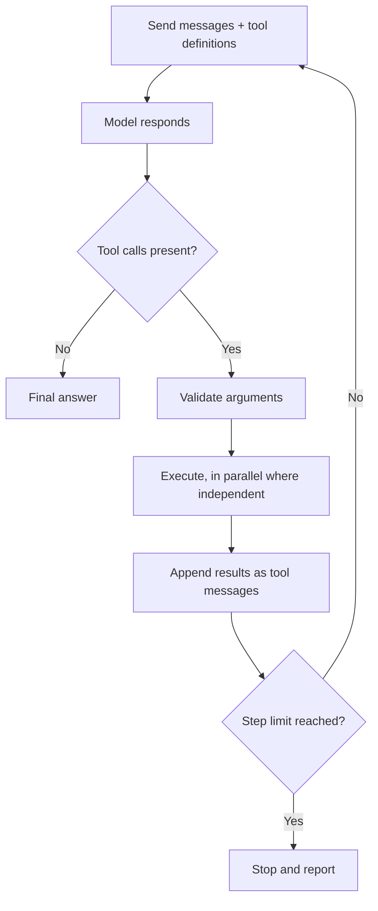

# Tool Calling and the Tool Surface {#ch-tool-calling}

> Let the model choose which of your functions to run, own the loop that runs them, and design the tools so it chooses well.

**In this chapter:** the loop and its stop condition · defining a tool · the permission boundary · designing the tool surface · errors the model can act on

## 💡 The Core Idea

A tool call is not the model running your code. **The model returns a structured request — a tool name
and arguments — and your code decides whether to run it.** The result goes back into the conversation, and
the model carries on. Your code sits in the middle, and that is the security property everything else
rests on.

The tool set is also an API. Its only consumer reads English, reads your descriptions once, cannot ask a
question and will fill every parameter with something. Design for that consumer, and most agent problems
go away. Paste in an API built for humans, and the model calls the wrong tool with plausible arguments.

> ⚠️ **Moving target:** tool definitions are the most often renamed surface in any AI SDK. Version 5
> replaced `parameters` with `inputSchema` and `maxSteps` with `stopWhen`. Version 7 renamed the stop
> helper again, from `stepCountIs` to `isStepCount`. The protocol underneath does not change: the model
> returns a name and a JSON object, your code decides whether to run it, and the result goes back as
> another message.

## How It Works

### The loop



**The tool-calling loop. Every step is a full model call, billed with the whole conversation attached.**

Two things follow. Cost grows faster than the step count, because each step resends everything before
it. And the loop needs a hard step limit, or a model with no stop condition it can meet keeps going.

### Defining a tool

The documentation assistant has one core tool: search the docs.

**A tool for the documentation assistant, and the loop that runs it**

```typescript
import { generateText, tool, isStepCount } from 'ai';
import { z } from 'zod';

const searchDocs = tool({
  description:
    'Search the product documentation and return up to 5 passages with their source paths. ' +
    'Use for questions about how the product behaves, its API, or its configuration. ' +
    'Do not use for customer account data — use lookupAccount for that. ' +
    'Returns { found: false } with a hint when nothing matches.',
  inputSchema: z.object({
    query: z.string().describe('Keywords, not a full sentence. Example: "rotate signing key"'),
    section: z.enum(['api', 'guides', 'changelog']).optional()
      .describe('Omit unless the user named a section.'),
  }),
  execute: async ({ query, section }) => {
    const hits = await docsIndex.search(query, { section, limit: 5 });
    if (hits.length === 0) return { found: false, hint: 'No match. Try broader keywords.' };
    return { found: true, passages: hits.map((h) => ({ path: h.path, text: h.text })) };
  },
});

const { text, steps } = await generateText({
  model: 'anthropic/claude-sonnet-4.6',
  tools: { searchDocs },
  stopWhen: isStepCount(6),            // the only bound on a loop the model controls
  messages,
});
```

### Parallel calls

A model can ask for several tools in one step. Independent ones should run at once — and "independent"
is your judgement, not the model's.

**Run read-only calls concurrently**

```typescript
const results = await Promise.all(
  calls.map((call) => (isReadOnly(call.toolName) ? run(call) : null)),
);
```

Two writes to the same record are not independent, and the model has no idea they conflict. Run side
effects one at a time, or make the tools idempotent so a duplicate call does no harm.

### The permission boundary

**The dispatcher: look up, authorise, validate, then run or ask**

```typescript
async function dispatch(call: ToolCall, user: User): Promise<unknown> {
  const def = registry[call.toolName];
  if (!def) return { error: `Unknown tool: ${call.toolName}` };
  if (!can(user, def.permission)) return { error: 'Not permitted for this user.' };

  const args = def.inputSchema.safeParse(call.input);      // arguments are model output
  if (!args.success) return { error: describe(args.error) };

  return def.destructive ? requestApproval(call, user) : def.execute(args.data, { user });
}
```

Tool arguments are untrusted input. A document the model read can shape them, so `deleteFile({ path })`
with a model-supplied path is a path traversal waiting to happen. Authorise against the **user's**
permissions, never the model's request. Gate destructive tools behind human approval —
[Chapter ?? — Prompt Injection](#ch-prompt-injection) explains why this is the control that matters.

## When to Use It

| Need | Choice | Why |
| --- | --- | --- |
| Current or private data the model cannot know | A read-only tool | Freely available, safe in parallel |
| Actions with real effects — send, create, refund | Its own tool, its own permission, an approval gate | Can be authorised and audited |
| A frequent multi-step sequence | One composite tool | Saves round trips and chances to go wrong |
| The same context on every request | No tool — retrieve it before the call | A tool adds a round trip and may be skipped |
| A fixed, known sequence of steps | No tool — write the code | A `for` loop costs nothing and never picks the wrong branch |
| Output shape only | No tool — [structured output](#ch-structured-output) | Nothing to execute |

## Designing the Tool Surface

The tool set, more than the prompt, usually decides whether the assistant works.

### Granularity

The rule: **one tool per user-visible intent.** If a person would call it one action — "search the docs",
"create a ticket", "check the build" — it is one tool. Too-fine tools are the more common and more costly
mistake — `openFile`, `seek`, `readBytes`, `close` is four full round trips where `readFile(path)` is
one. At the coarse end, a single `execute(command)` tool is flexible, but you can no longer say what the
agent is able to do.

### Descriptions are prompt text

The description is the model's only signal for *when* a tool applies, so most wrong-tool bugs are
description bugs. `'Searches the index.'` is written for a colleague who can read the source. The
`searchDocs` description above does four things instead: it says **what it returns**, **when to use it**,
**when not to** and what to use instead, and **what failure looks like**. Each one removes a class of
wrong call. Parameter descriptions are prompt text too.

Names matter too: `searchDocs` and `lookupAccount` cannot be confused; `search` and `query` can, and the
model alternates between overlapping tools because neither is clearly right.

### Parameters the model can fill

| ❌ Hard to fill | ✅ Easy to fill | Why |
| --- | --- | --- |
| `userId: string` | `email: string` | The model has the email, not your internal id |
| `filters: Record<string, unknown>` | Named optional fields | An open bag invites invention |
| `mode: string` | `mode: z.enum([...])` | Enums cannot be invented |

The first row generalises: **never require an identifier the model has no way to know.** Accept the
natural key and resolve it inside the tool, or add a lookup tool that returns the id first.

### Errors that teach the next step

Whatever a tool returns becomes prompt text. An unhelpful result produces an unhelpful next step —
usually the same call again.

| ❌ Returned | ✅ Better | What the model does |
| --- | --- | --- |
| `[]` | `{ found: false, hint: 'No match for "foo". Try broader keywords.' }` | Rephrases once, then says so |
| `Error: 500` | `Search is unavailable. Answer from the conversation or say you cannot check.` | Stops retrying, degrades honestly |
| `Invalid input` | `section must be one of: api, guides, changelog` | Fixes the argument |

The empty array is the most common cause of a looping agent: it looks like a broken tool, so the model
tries again. Say what happened, whether a retry helps, and what to do instead.

> ⚠️ Never put a raw exception into the conversation. Stack traces leak file paths and internals into a
> window that may be logged, shown to a user, or read by an attacker who planted the input.

### What to leave out

The strongest control is a tool that does not exist. Every tool is a permission handed to a system that
reads untrusted documents. Start read-only and add writes as separate, gated tools.
`cancelSubscription(accountId)` can be authorised and audited; `runSql(query)` cannot. Leave out what the
model rarely needs — a smaller surface also improves selection.

## Common Mistakes

**❌ No step limit**

> A model that cannot meet its stop condition keeps calling tools. Without `stopWhen`, that is an
> unbounded bill discovered the next morning.

**✅ Say when *not* to use the tool**

> Negative guidance separates overlapping tools faster than more positive description. It stops the model
> reaching for the nearest-looking tool.

## 🔑 Key Takeaways

- The model requests a tool call; your dispatcher decides whether to run it, and all authority lives there.
- Every loop step resends the whole conversation, so a hard step limit is the only bound on cost.
- Design one tool per user-visible intent, with descriptions that say what it returns and when not to use it.
- Error and empty results are prompt text: say what happened, whether to retry, and what to do instead.
- The strongest control is a tool that does not exist, so authorise against the user and gate anything destructive.

## Interview Questions

**Q: Walk through what happens when a model calls a tool.**

The model returns a tool name and JSON arguments matching the schema I sent, and generation stops. My
code validates the arguments, checks permissions, runs the function and appends the result as a tool
message. Then I call the model again with the longer history. That repeats until it answers or hits my
step limit — the model never executes anything itself.

**Q: Your agent keeps calling the same tool with the same arguments. What do you check first?**

The tool's return value when nothing is found. An empty array or a bare error looks the same as a
transient failure, so retrying is a reasonable guess. Returning an explicit "no match" plus a hint fixes
more loops than any prompt change. After that I look for two tools with overlapping descriptions, and for
a stop condition the model cannot meet.

**Q: How do you stop a tool-calling feature from deleting production data?**

By making the dangerous operation unavailable rather than discouraged. The surface exposes only what the
feature needs, credentials are scoped to that, destructive tools sit behind human approval, and the
dispatcher authorises against the signed-in user. A rule in the system prompt is not a control — the
model reads untrusted content, so it can be argued away.

**Q: Can you just expose your existing REST API as tools?**

You can, and it usually works badly. That API assumes a caller with documentation and internal ids, and
its errors are written for developers. The model fabricates ids, misreads codes and picks between
endpoints whose names distinguish nothing. I would redesign it for its real consumer: natural keys, enums,
prose descriptions and errors written as instructions.

## What to Read Next

- [Chapter ?? — What an Agent Is, and When to Use More Than One](#ch-what-an-agent-actually-is) — this loop, run to completion
- [Chapter ?? — MCP (Model Context Protocol)](#ch-model-context-protocol) — tool definitions as a shared protocol
- [Chapter ?? — Prompt Injection](#ch-prompt-injection) — why the dispatcher is a security boundary
