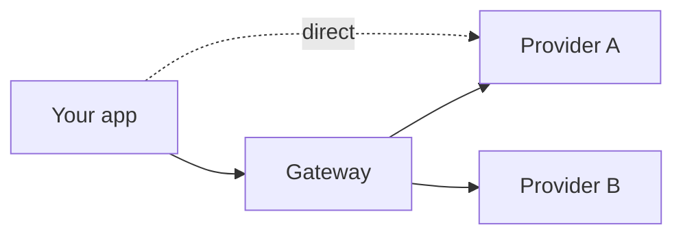

# Multi-Provider Architecture {#ch-multi-provider-architecture}

> Survive a provider outage, route cheap work to cheap models, and keep the switching cost low without pretending providers are identical.

**In this chapter:** the three reasons to want this · gateway or in-process · what failover cannot fix · routing by task · the differences that leak · the eval gate

## 💡 The Core Idea

Wanting more than one provider is not usually about vendor politics. It is about three concrete things:
**an outage you cannot fix, a bill you cannot justify, and a capability that shipped somewhere else.**

The trap is treating providers as interchangeable because the call signature matches. The signature is
the easy part. Prompts that were tuned against one model behave differently on another, tool-calling
reliability differs, caching semantics differ, and refusal boundaries differ. A provider swap is a
behaviour change, and **the only thing that makes it safe is an eval suite.**

> Portability is not an abstraction you write. It is a test suite you run.

## How It Works

### Three motivations, three different designs

| Motivation | What you need | What you do not need |
| --- | --- | --- |
| **Outage survival** | Automatic failover on 5xx and 529 | Cost routing |
| **Cost control** | Deliberate routing by task | Failover |
| **Capability access** | A per-feature model choice | Either of the above |

Building all three at once is how a two-day change becomes a quarter. Name the motivation first; the
design follows from it and is much smaller than the general case.

### Gateway or in-process



**A gateway centralises keys, routing and usage; a direct call keeps one hop out of the path.**

| Approach | Gets you | Costs you |
| --- | --- | --- |
| **Gateway** (hosted or self-run) | One key, central routing, usage and spend in one place, failover without a deploy | A dependency in the hot path, a small latency add, a new outage domain |
| **In-process routing** | No extra hop, full control | Keys and quota per provider, routing logic in every service |

A gateway is usually right once more than one service calls models, because the alternative is the same
routing logic and the same key rotation in five codebases. It is worth stating plainly that the gateway
itself becomes a dependency — a failover mechanism with a single point of failure in front of it is a
design to think about, not to assume.

```typescript
const { text } = await generateText({
  model: 'anthropic/claude-sonnet-4.6',
  providerOptions: {
    gateway: {
      order: ['vertex', 'anthropic'],           // try in this order
      models: ['openai/gpt-5.1'],               // fall back to a different model if all fail
    },
  },
  messages,
});
```

> ⚠️ **Moving target:** gateway options and model identifiers change frequently, and this example is
> stamped against **AI SDK 7**. The durable idea is the separation between *which model* and *which route
> to it* — keep that decision in configuration, not scattered through call sites.

### What failover cannot fix

Failover routes around **availability**. It does nothing about correctness, and switching models
mid-incident changes the behaviour of every prompt at the worst possible time.

- A fallback model must be **evaluated in advance** on the same golden set, or the incident becomes a
  quality incident with no measurement.
- Prompt caching does **not** carry across providers. Failing over drops the hit rate to zero and the
  bill spikes exactly when traffic is already unusual.
- Structured output and tool-calling adherence vary. A fallback that produces schema violations under
  load has traded an outage for a subtler outage.
- Failing over a **conversation** mid-stream is a research project, not a config change. Fail over new
  requests; let in-flight ones fail honestly.

### Routing by task

The largest cost win is not the cheapest provider. It is not sending trivial work to a frontier model.

| Task | Model class | Why |
| --- | --- | --- |
| Intent classification, routing | Small, fast | Fixed output space, latency on the hot path |
| Extraction against a schema | Small to mid | Constrained decoding does the heavy lifting |
| Answering from retrieved context | Mid | The context carries the facts |
| Open-ended reasoning, long tool chains | Frontier | Where capability actually differs |

Cascade patterns extend this: try the cheap model, check confidence or validate the output, escalate only
on failure. That pays when the cheap model succeeds most of the time and the check is reliable — measure
both before assuming, because a cascade that escalates half the time costs more than going straight to
the frontier model.

### The differences that leak through any abstraction

| Surface | How it differs | Consequence |
| --- | --- | --- |
| **Prompt caching** | Different breakpoints, TTLs, minimums | Cost model changes per provider |
| **Tool calling** | Parallel-call support and reliability vary | Loop behaviour changes |
| **Structured output** | Schema subset support differs | Validation failure rate changes |
| **Reasoning controls** | Effort levels, hidden reasoning tokens | Latency and cost change |
| **Refusals** | Different boundaries | Same input, different outcome |

Normalise the call shape. **Do not normalise these** — hide them and you get silent behaviour changes.
Expose them as explicit per-provider configuration so a difference shows up in code review.

## When to Use It

| Situation | Do |
| --- | --- |
| One provider, one feature, early | Stay single. Keep call sites thin |
| A user-facing feature that cannot be down | Failover, with the fallback already evaluated |
| Cost dominated by high-volume simple tasks | Route by task before changing provider |
| A regulated deployment | Pick the provider whose data boundary satisfies the requirement |
| "We might want to switch one day" | Build the eval suite, not the abstraction |

## Common Mistakes

**❌ Building a provider abstraction before a second provider exists**

> You are guessing at the seams. The abstraction that survives is the one written when a real second
> provider forces the shape.

**❌ Failing over to a model nobody evaluated**

> The outage ends and a quality incident starts, with no baseline to detect it.

**❌ Assuming cost parity from the headline price**

> Tokenisers differ, so the same text is a different token count. Reasoning tokens are billed and often
> invisible. Cache pricing differs. Compare on your own traffic, not on a price page.

**✅ Make the model a configuration value with a default per task**

> Changing a model becomes a config change with an eval run behind it, rather than a deploy touching
> forty call sites.

## 🔑 Key Takeaways

- Name the motivation — outage, cost, or capability — because each needs a different and smaller design.
- Failover handles availability only; a fallback model that has not been evaluated turns an outage into a quality incident.
- Prompt caching does not survive a provider switch, so cost spikes exactly when traffic is abnormal.
- Route by task before switching provider — sending trivial work to a frontier model is the usual overspend.
- Normalise the call shape, expose the real differences; hiding caching and tool semantics causes silent behaviour changes.

## Interview Questions

**Q: How would you make an AI feature survive a provider outage?**

Failover at the routing layer, with the fallback model evaluated on the same golden set beforehand so I
know what quality I am switching to. New requests route to the fallback on 5xx and overload errors;
in-flight streams fail honestly rather than being migrated mid-conversation. And I would expect the bill
to jump during failover, because prompt caching does not carry across providers — worth knowing before
the finance question arrives rather than after.

**Q: Is a unified SDK enough to make you portable?**

It makes the call site portable, which is the smallest part of the problem. What does not port is
behaviour: prompts tuned on one model, tool-calling reliability, schema adherence, refusal boundaries and
caching semantics all differ. The thing that actually delivers portability is an eval suite that can tell
me within an hour whether the new provider is worse, and on which cases.

**Q: Where does multi-provider cost optimisation actually come from?**

Mostly from not sending simple work to expensive models. Classification, routing and schema-constrained
extraction run well on small models and often dominate request volume, so moving them is a larger win
than any provider price difference. Comparing providers on headline price is misleading anyway, because
tokenisers differ, reasoning tokens are billed and frequently hidden, and cache pricing is not
comparable.

**Q: What would you deliberately not abstract away?**

Prompt caching semantics, tool-calling behaviour, structured-output support and reasoning controls. Those
are exactly the surfaces where providers genuinely differ, and an abstraction that hides them converts a
visible incompatibility into a silent behaviour change. I would normalise the shape of the call and keep
those as explicit configuration, so a difference appears in a diff rather than in production.

**Q: When is staying on one provider the right answer?**

Early, and for longer than most teams expect. A single feature with a handful of call sites gets nothing
from a routing layer except complexity and a second thing to operate. The investment that pays before
multi-provider does is the eval suite — it is what makes the eventual switch a measured decision instead
of a leap, and it is useful for every other change in the meantime.

## What to Read Next

- [Chapter ?? — Choosing a Model](#ch-choosing-a-model) — the per-task decision this routes on
- [Chapter ?? — Evals](#ch-evals) — the suite that makes a provider switch safe
- [Chapter ?? — Cost Engineering](#ch-cost-engineering) — caching, batching and where the money actually goes
