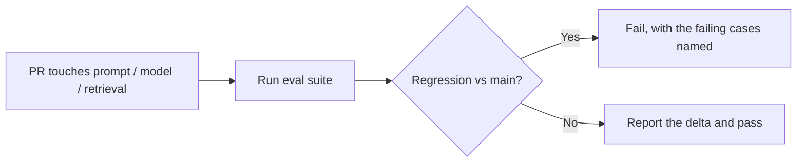

# Evals {#ch-evals}

> Replace "it feels better" with a pass rate on a golden set, and make a prompt change fail a build the way a code change does.

**In this chapter:** why unit tests do not apply · the golden set · three grader types · LLM-as-judge and its conditions · running in CI · the numbers that lie

## 💡 The Core Idea

Every other part of this book can be improved by reasoning about the code. An AI feature cannot. The
system is non-deterministic, the failure modes are not visible in the diff, and **a prompt change that
fixes one case routinely breaks four you were not looking at.**

An eval is the missing feedback loop: a fixed set of inputs, a definition of a good output, and a score.
It is the same idea as a test suite, with one structural difference — the assertion cannot be equality,
because the correct output is a range of acceptable answers rather than a string.

This is the single most-requested and least-taught skill in senior AI hiring, and the reason is
unglamorous. Building an eval suite is labelling work, and labelling work is boring.

> Without a suite and a number, work on an AI feature is a random walk that feels like progress.

## How It Works

### The golden set

| Property | Target | Why |
| --- | --- | --- |
| Size | 30 for a first signal, 100–200 mature | Below 30 a single case moves the number too much |
| Source | Real user inputs from logs | Synthetic cases inherit your assumptions |
| Failures | Every bug ever reported, added as a case | The suite grows from incidents |
| Edge cases | 10–20% adversarial, ambiguous or unanswerable | Otherwise the system learns to always answer |
| Versioning | In the repository, with the code | A set that drifts makes history meaningless |

Start with **twenty cases you wrote by hand this afternoon.** A small suite that runs is worth more than
a large one that is still being planned, and the first run usually finds a failure nobody knew about.

### Three graders

| Grader | Checks | Cost | Use for |
| --- | --- | --- | --- |
| **Deterministic** | Schema valid, contains a required id, latency under budget, refused when it should | Free | Everything it can cover |
| **Model-graded** | Faithfulness, tone, completeness against a rubric | A model call per case | Qualities with no programmatic form |
| **Human** | Genuine judgement; calibrating the other two | Expensive | A sample, periodically |

**Push everything you can into the first row.** A surprising share of quality is deterministically
checkable: did the answer cite a retrieved source, is the JSON valid, did it refuse the injection
attempt, is it under the length limit. Those run in milliseconds and never disagree with themselves.

```typescript
interface EvalCase {
  readonly id: string;
  readonly input: string;
  readonly context?: string[];
  readonly expect: {
    readonly mustContain?: string[];
    readonly mustNotContain?: string[];
    readonly mustCiteFrom?: string[];   // deterministic groundedness check
    readonly shouldRefuse?: boolean;
    readonly rubric?: string;           // only when nothing above will do
  };
}
```

### LLM-as-judge, and when it is valid

A model grading another model's output is genuinely useful and genuinely easy to misuse. Four conditions
make it defensible.

1. **The rubric is specific.** "Is this good?" produces noise. "Does every factual claim appear in the
   provided context? Answer yes or no and quote the unsupported claim." produces a signal.
2. **The judge has been checked against humans.** Label 50 cases by hand, run the judge, measure
   agreement. Below roughly 80% the judge is measuring something else.
3. **The judge sees the ground truth** where one exists. Asking a model to verify a fact it cannot look
   up is asking it to guess confidently.
4. **It is not the only signal.** Judges have known biases — they prefer longer answers, and they favour
   text a similar model produced.

> ⚠️ Never let a judge grade its own generation with the same context and the same model. It shares the
> generator's blind spots and tends to agree, which reads as a high score and measures nothing.

### Running it in CI



**The gate is a regression against the previous run, not an absolute threshold.**

Thresholds get lowered until they stop complaining. A regression gate does not, and it answers the
question people actually have: did this change make things worse.

- **Trigger on the files that matter** — prompts, model configuration, retrieval parameters, tool
  definitions. All of them change behaviour and none looks risky in a diff.
- **Run deterministic graders on every commit; model-graded on the pull request.** Cost and time.
- **Report per category.** A 3% average drop that is entirely one question type is a finding; averaged
  away it is noise.
- **Pin the model version.** A suite that silently compares against a different model version measures
  the provider, not your change.

### Numbers that lie

- **A single average.** It hides which category collapsed, which is the only actionable part.
- **Pass rates on a set the prompt was tuned against.** That is training on the test set. Keep a holdout.
- **Judge scores with no human calibration.** A confident number from an unchecked instrument.
- **100%.** It means the set is too easy, not that the system is finished. Add the cases that fail.

## When to Use It

| Situation | Do |
| --- | --- |
| Before the first prompt change anyone argues about | Build twenty cases; the argument becomes a measurement |
| Changing model or provider | Run both on the same set — the only safe way to switch |
| A user reports a bad answer | Add it as a case before fixing it |
| Deciding whether a smaller model is enough | Compare on the suite, not on a demo |
| A quality claim in a review | Ask for the number, not the anecdote |

## Common Mistakes

**❌ Waiting for a proper eval framework**

> Twenty cases in a JSON file and a script beats a framework that ships next quarter.

**❌ An absolute pass threshold in CI**

> It gets lowered. Gate on the delta against the previous run instead.

**❌ Grading with the model that produced the output, on the same context**

> It agrees with itself. The score goes up and nothing was measured.

**✅ Add every reported failure to the suite before fixing it**

> The suite grows from real incidents, and the fix is verified rather than assumed.

## 🔑 Key Takeaways

- A non-deterministic system cannot be tested with equality assertions; it needs a set, a rubric and a score.
- Twenty hand-written cases that run today beat a large suite that is still being designed.
- Push every check you can into deterministic graders — they are free, fast and never disagree with themselves.
- LLM-as-judge is valid with a specific rubric, human calibration, and something else to corroborate it.
- Gate CI on regression against the previous run; absolute thresholds get quietly lowered.

## Interview Questions

**Q: How do you know a prompt change made things better?**

By running it against a golden set and comparing the pass rate to the previous run. Without that, the
only evidence is a handful of examples I happened to try, and prompt changes are notorious for fixing the
case in front of you while breaking others you are not looking at. The suite also tells me *which*
category regressed, which is what makes the result actionable rather than just discouraging.

**Q: When is LLM-as-judge acceptable?**

When the rubric is specific enough that two people would grade the same way, when the judge has been
checked against human labels on a sample and agrees often enough to trust, when it can see the ground
truth for anything factual, and when it is not the only signal. What I would not do is let a judge grade
output from the same model with the same context — it inherits the blind spots and tends to agree, so the
score looks good and means nothing.

**Q: What goes into your golden set?**

Real inputs from logs first, because synthetic cases inherit whatever assumptions I already had. Then
every failure anyone has reported, added as a case before it is fixed, so the suite grows out of real
incidents. And ten to twenty per cent adversarial or unanswerable cases — if everything in the set has an
answer, the system learns to always produce one, and "I do not know" stops being a behaviour I can
measure.

**Q: How would you run this in CI without it being slow and expensive?**

Two tiers. Deterministic graders — schema validity, citation presence, refusal behaviour, latency —
run on every commit and cost nothing. Model-graded cases run on the pull request, on the subset where no
programmatic check exists. I would gate on a regression against main rather than an absolute number,
because absolute thresholds get lowered until they stop being inconvenient, and I would pin the model
version so the suite measures my change and not the provider's.

**Q: Your eval suite passes 100%. What does that tell you?**

That the suite is too easy. It is a signal to add cases, not to stop. The useful state for a suite is a
handful of persistent failures that represent genuinely hard inputs, because that is where the next
improvement is visible. A suite at 100% has stopped being an instrument and become a formality, and it
will not catch the regression that matters.

## What to Read Next

- [Chapter ?? — Error Analysis Loops](#ch-error-analysis-loops) — what to do with the cases that fail
- [Chapter ?? — Evaluating Retrieval](#ch-evaluating-retrieval) — the same discipline on the retrieval half
- [Chapter ?? — Observability](#ch-observability) — where the real inputs for the set come from
