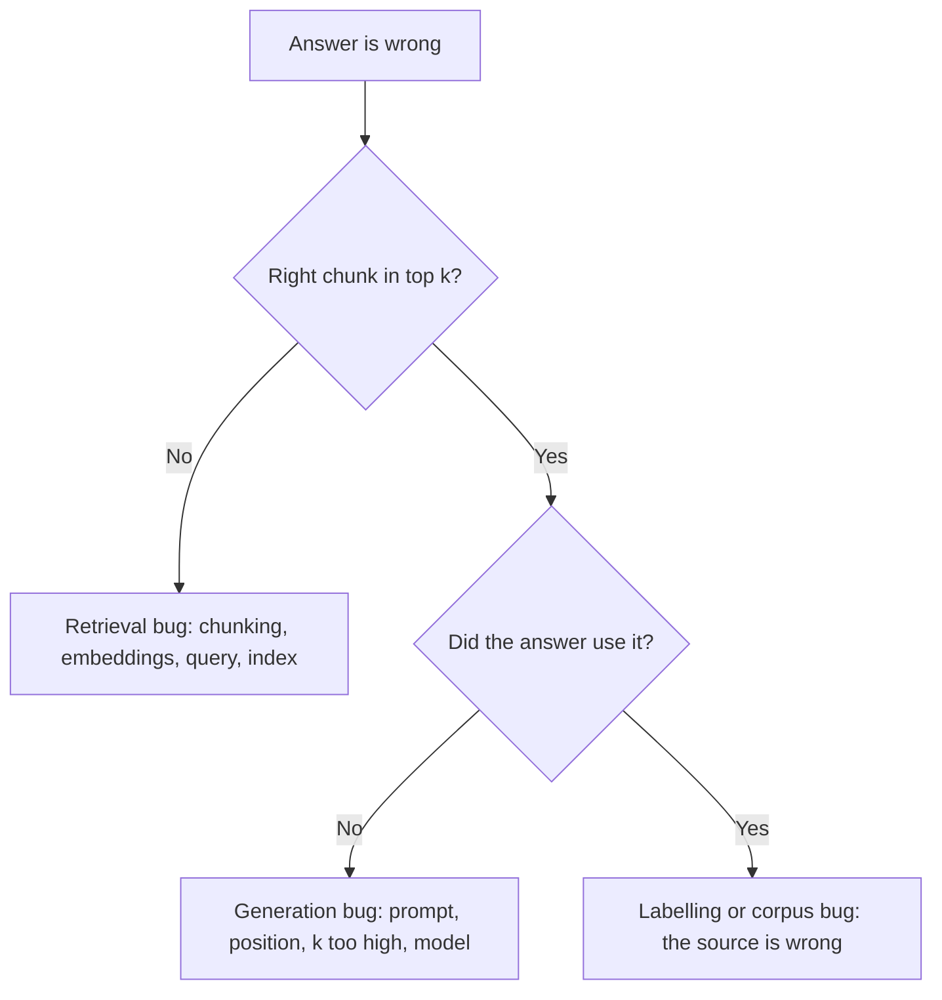

# Evals, Retrieval Metrics and Error Analysis {#ch-evals}

> Replace "it feels better" with a pass rate on a golden set, find which half of the system failed, and make a prompt change fail a build the way a code change does.

**In this chapter:** the golden set · recall@k and the retrieval-or-generation split · graders and LLM-as-judge · the error-analysis loop · evals in CI

## 💡 The Core Idea

Most code in this book can be improved by reasoning about it. An AI feature cannot. The output is
non-deterministic, the failure does not show in the diff, and **a prompt change that fixes one case
often breaks four you were not looking at.**

An eval is the missing feedback loop: a fixed set of inputs, a definition of a good output, and a score.
It is a test suite with one difference. The assertion cannot be equality, because the correct output is
a range of acceptable answers, not one string.

The documentation assistant has two halves. Retrieval puts passages in the window; generation writes
the answer from them. Both fail with the same user complaint — "the answer was wrong" — and they need
different fixes. So an eval suite measures each half on its own. Then error analysis turns the failures
into a ranked list of work.

This is the most-asked and least-taught skill in senior AI hiring. The reason is plain: building an eval
suite is labelling work, and labelling work is boring.

> Without a suite and a number, work on an AI feature is a random walk that feels like progress.

## How It Works

### The golden set

| Property | Target | Why |
| --- | --- | --- |
| Size | 30 for a first signal, 100–200 mature | Below 30, one case moves the number too much |
| Source | Real user queries from logs and tickets | Synthetic cases inherit your assumptions |
| Failures | Every reported bug, added as a case | The suite grows from incidents |
| Edge cases | 10–20% adversarial, ambiguous or unanswerable | Otherwise the system learns to always answer |
| Versioning | In the repository, with the code | A set that drifts makes history meaningless |

Start with **twenty cases you write by hand this afternoon.** A small suite that runs beats a large one
still being planned. The first run usually finds a failure nobody knew about.

Be careful with questions a model generates from your documents. They reuse the document's wording, so
retrieval finds them easily and the score flatters the system. Real users ask in their own words, and
that mismatch is exactly what retrieval must bridge. Use generated questions to fill coverage gaps, never
as the core of the set.

Each case carries the ids of the passages that should be retrieved. A person who has read the corpus
labels them. That one field lets the same set measure both halves.

**One golden case, covering retrieval and the answer**

```typescript
interface EvalCase {
  readonly id: string;
  readonly input: string;
  readonly category: 'factual' | 'procedural' | 'comparison' | 'unanswerable';
  readonly relevantChunkIds: string[];  // labelled by a human who read the corpus
  readonly expect: {
    readonly mustContain?: string[];
    readonly mustNotContain?: string[];
    readonly mustCiteFrom?: string[];   // deterministic groundedness check
    readonly shouldRefuse?: boolean;    // true for the unanswerable cases
    readonly rubric?: string;           // only when nothing above will do
  };
}
```

### Measure retrieval first

If the right passage is not in the window, nothing downstream can recover. The generator cannot cite
what it never saw. So retrieval is measured first, and it is cheap: no model call, only set membership
against labelled ids.

| Metric | Answers | Use when |
| --- | --- | --- |
| **recall@k** | Was a right passage in the top *k* at all? | The primary metric — it is the ceiling on quality |
| **precision@k** | How much of the top *k* was relevant? | Cost and noise matter |
| **MRR** | How high was the first correct result? | One right answer exists |
| **nDCG@k** | Graded relevance, weighted by position | Several passages are partly relevant |

**Start with recall@k and mostly stay there.** Ranking metrics matter only once recall is healthy.
Reordering results that do not contain the answer changes nothing.

**recall@k over the golden set**

```typescript
function recallAtK(cases: EvalCase[], retrieve: (q: string, k: number) => Promise<string[]>, k: number) {
  return Promise.all(cases.map(async (c) => {
    const ids = await retrieve(c.input, k);
    return c.relevantChunkIds.some((id) => ids.includes(id)) ? 1 : 0;
  })).then((hits) => hits.reduce<number>((a, b) => a + b, 0) / cases.length);
}
```

Report it at two values of *k*. `recall@20` measures the retriever. `recall@5` measures the retriever plus
the reranker. Two numbers narrow a vague complaint to one of three workstreams.

| recall@20 | recall@5 | Diagnosis | Fix |
| --- | --- | --- | --- |
| Low | Low | The passage is not findable | Chunking, then embeddings, then query rewriting |
| High | Low | Found but ranked poorly | Add or tune reranking |
| High | High, answers still wrong | Generation, not retrieval | Prompt, position, fewer chunks, model |

For a single bad answer, ask one question before any fix.



**One question routes the work to the right half. C and E have no fixes in common.**

### Measure the answer

| Grader | Checks | Cost | Use for |
| --- | --- | --- | --- |
| **Deterministic** | Schema valid, cites a required id, under the latency budget, refused when it should | Free | Everything it can cover |
| **Model-graded** | Faithfulness, tone, completeness against a rubric | A model call per case | Qualities with no programmatic form |
| **Human** | Real judgement; calibrating the other two | Expensive | A sample, now and then |

**Push everything you can into the first row.** A large share of quality is checkable by code. Did the
answer cite a retrieved source? Is the JSON valid? Did it refuse the injection attempt? Those checks run
in milliseconds and never disagree with themselves.

A model grading another model's output is useful and easy to misuse. Four conditions make it defensible.

1. **The rubric is specific.** "Is this good?" produces noise. "Does every factual claim appear in the
   provided context? Answer yes or no and quote the unsupported claim." produces a signal.
2. **The judge is checked against humans.** Label 50 cases by hand, run the judge, and measure agreement.
   Below about 80%, the judge is measuring something else.
3. **The judge sees the ground truth** where one exists. A model asked to verify a fact it cannot look up
   will guess, confidently.
4. **It is not the only signal.** Judges prefer longer answers, and they favour text a similar model wrote.

> ⚠️ Never let a judge grade its own generation with the same model and the same context. It shares the
> generator's blind spots and tends to agree. That reads as a high score and measures nothing.

### The error-analysis loop

The suite says the pass rate is 71%. It does not say what to do on Monday. **Error analysis is the step
between a number and a change**, and it is mostly clerical work: collect the failures, read their traces,
name what went wrong, count the names, fix the largest pile, and re-run. Run it weekly. The step teams
skip is the count.

Read the trace, not only the output. The wrong answer is usually several steps after the real mistake.

| Layer | What to look at | Failure it reveals |
| --- | --- | --- |
| Input | The user's actual words | Ambiguity, an unsupported language, a question out of scope |
| Retrieval | Chunk ids returned, with scores | The passage was missing, or ranked below the cutoff |
| Assembled request | What actually reached the window | Truncation, a lost system prompt, stale history |
| Tool calls | Which, with what arguments and results | Wrong tool, wrong arguments, an empty result |
| Output | The text, plus `finishReason` and usage | Truncation, refusal, format violation |

The third row cannot be checked without planning for it. Many "the model ignored the context" reports
turn out to be context that never arrived. Log the assembled request, or this layer stays invisible.

Build the categories from fifty of **your** failures, not from a blog post. Write a short phrase for each
failure, then group the phrases. Five to eight categories usually emerge. Then count them before fixing
anything.

| Category | Count | Share | ✅ Fix | ❌ Not the fix |
| --- | --- | --- | --- | --- |
| Retrieval miss | 34 | 45% | Chunking, hybrid search, reranking | A better model |
| Grounding failure | 18 | 24% | Fewer, better chunks; instruct to cite | More chunks |
| Ambiguity | 12 | 16% | Ask the user a clarifying question | Guessing better |
| Format violation | 7 | 9% | Schema-constrained output | A firmer instruction |
| Over-refusal | 5 | 7% | Loosen the guardrail, add allowed examples | A different model |

This table takes an afternoon, and it is the whole deliverable. It turns "the assistant is unreliable"
into a ranked plan. It also answers "should we switch models?" A model change addresses grounding and
format — about a third of these failures — at real cost. **A retrieval miss can never be fixed by the
generator.**

Ambiguity is often misfiled as a model failure. Some questions have two readings, and the fix belongs in
the interface, not the pipeline.

Stop when the largest remaining category is smaller than the suite's noise, or when fixing it costs more
than the failure does. Some failure rate is correct. A system tuned until it never declines has been tuned
into confident wrongness.

### Evals in CI

**The gate is a regression against the previous run, not an absolute threshold.** Thresholds get lowered
until they stop complaining. A regression gate answers the real question: did this change make things
worse?

- **Trigger on the files that change behaviour** — prompts, model configuration, tool definitions,
  chunking, embedding config, retrieval parameters and the corpus. None of them looks risky in a diff.
- **Run deterministic graders and recall@k on every commit; model-graded cases on the pull request.** The
  first tier costs nothing. The second costs a model call per case.
- **Report per category.** A 3% average drop that is all procedural questions is a finding. Averaged
  away, it is noise.
- **Pin the model version.** Otherwise the suite measures the provider's change, not yours.
- **Name the failing cases** in the build output, so the error-analysis loop starts from them.

> ⚠️ **Moving target:** eval tooling and hosted evaluation products change constantly. The durable part
> is a versioned golden set, a metric the team agrees on, and a run that gates a merge. That outlives
> every tool that runs it.

### Numbers that lie

- **A single average.** It hides which category collapsed, which is the only part you can act on.
- **Pass rates on a set the prompt was tuned against.** That is training on the test set. Keep a holdout.
- **Judge scores with no human calibration.** A confident number from an unchecked instrument.
- **Average similarity score.** It measures the retriever's confidence, not its correctness.
- **Recall at a large *k*.** `recall@50` is easy to make excellent and irrelevant if only 5 chunks reach
  the window.
- **100%.** The set is too easy, not the system finished. The useful state is a few persistent failures
  on hard inputs, because that is where the next improvement shows.

## When to Use It

| Situation | Do |
| --- | --- |
| Before the first prompt change anyone argues about | Build twenty cases; the argument becomes a measurement |
| Before tuning chunk size or *k* | Label the relevant chunk ids first, or you cannot tell if you helped |
| A user reports a wrong answer | Check the logged chunk ids, then add it as a case before fixing it |
| Changing model, provider or embedding model | Run both on the same set — the only safe way to switch |
| Pass rate dropped and nobody knows why | Read the newly failing traces; the category names itself |
| Users complain but the metrics look fine | Sample real traffic — the suite is missing a category |

## Common Mistakes

**❌ Waiting for a proper eval framework**

> Twenty cases in a JSON file and a script beat a framework that ships next quarter.

**❌ Measuring only end-to-end answer quality**

> It says something is wrong and nothing about which half. Two weeks in the wrong half is the usual
> outcome.

**❌ Fixing the failure someone just reported**

> It is a sample of one, and usually not the largest category. Count first.

**❌ Changing several things in one run**

> Two prompt edits and a retrieval change together give the net effect and nothing about which helped.

**✅ Log the retrieved chunk ids and the assembled request on every production request**

> A complaint becomes a diagnosis in one query, and next quarter's golden set comes from those logs.

**✅ Add every reported failure to the suite before fixing it**

> The suite grows from real incidents, and the fix is verified rather than assumed.

## 🔑 Key Takeaways

- A non-deterministic system cannot be tested with equality; it needs a golden set, a grader and a score.
- Measure retrieval first with recall@k, because a passage that never reached the window cannot be recovered.
- Push every check you can into deterministic graders, and trust LLM-as-judge only after checking it against humans.
- Error analysis is counting: read fifty traces, name the categories, and fix the largest one first.
- Gate CI on a regression against the previous run, reported per category, with the model version pinned.

## Interview Questions

**Q: How do you know a prompt change made things better?**

I run it against a golden set and compare the pass rate with the previous run. Without that, the only
evidence is a few examples I happened to try, and prompt changes often fix the case in front of you while
breaking others. The suite also shows *which* category regressed, which makes the result actionable.

**Q: What is recall@k, and why do you start with it?**

It is the fraction of questions where at least one relevant passage appears in the top *k* results. It
comes first because it is a ceiling. If the right passage is not in the window, no prompt, model or
reranker can produce a correct grounded answer. Ranking metrics only matter once recall is healthy.

**Q: A user says the assistant gave a wrong answer. Walk me through the diagnosis.**

I pull the retrieved chunk ids for that request from the logs. If the right passage is missing, it is a
retrieval bug: chunking, the query, or a document that was never indexed. If it is there, generation
ignored it, which points at the prompt, the chunk's position, or too many chunks. Then I add the case to
the suite before fixing it.

**Q: When is LLM-as-judge acceptable?**

When the rubric is specific enough that two people would grade the same way, and the judge agrees with
human labels on a sample. It must see the ground truth for anything factual, and it must not be the only
signal. I would never let a judge grade output from the same model with the same context — it inherits
the blind spots, so the score looks good and means nothing.

**Q: Your assistant is "unreliable". How do you turn that into work?**

I collect fifty failures, read their traces, write what went wrong in each, and count the categories.
That gives a ranked table with shares and rough effort, which is a plan. Fixing whichever failure was
reported last optimises a sample of one, and teams lose weeks to a category that was four per cent of the
problem.

**Q: How do you decide between fixing the pipeline and upgrading the model?**

By the category counts. If most failures are retrieval misses, a better model changes nothing, because
the passage was never in the window. If most are grounding or format failures, an upgrade may help — but
so do cheaper fixes like fewer, better chunks or a constrained output schema. The table turns a
preference into arithmetic.

## What to Read Next

- [Chapter ?? — Embeddings, Vector Stores and Retrieval](#ch-retrieval) — the parameters recall@k lets you tune with confidence
- [Chapter ?? — Observability and Cost Engineering](#ch-observability) — the traces and logs this chapter depends on
