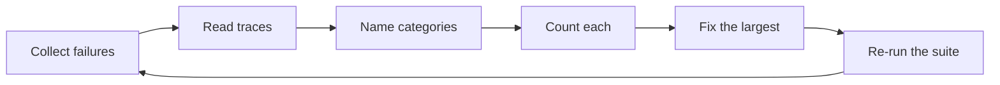

# Error Analysis Loops {#ch-error-analysis-loops}

> Turn a hundred bad answers into three named categories, fix the largest one, and measure that it moved.

**In this chapter:** the loop · reading traces · building a taxonomy from real failures · counting before fixing · the fix table by category · when to stop

## 💡 The Core Idea

An eval suite tells you the pass rate is 71%. It does not tell you what to do on Monday. **Error analysis
is the step between a number and a change**, and it is mostly a clerical activity: read the failures,
name what went wrong, count the names, fix the biggest pile.

Teams skip it because reading a hundred outputs is dull and rewriting the prompt feels productive. The
result is predictable — weeks spent improving a category that accounted for four per cent of failures,
while the thirty-per-cent category was never named.

> The instinct to fix the failure in front of you is the instinct to fix a sample of one. Count first.

## How It Works

### The loop

**Five steps, run weekly. The one that is always skipped is Count.**

### Reading a trace

A failure is not an output. It is a sequence of decisions, and the wrong answer is usually several steps
downstream of the actual mistake.

| Layer | What to look at | Failure it reveals |
| --- | --- | --- |
| Input | The user's actual words | Ambiguity, an unsupported language, a question outside scope |
| Retrieval | Chunks returned, with scores | The passage was missing, or ranked below the cutoff |
| Assembled request | What genuinely reached the window | Truncation, a lost system prompt, stale history |
| Tool calls | Which, with what arguments and results | Wrong tool, wrong arguments, an empty result |
| Output | The text, plus `finishReason` and usage | Truncation, refusal, format violation |

The third row is the one people cannot check without preparation, and it is where a surprising number of
"the model is bad" reports resolve. Log the assembled request — see
[Chapter ?? — Observability](#ch-observability) — or this layer stays invisible.

### A taxonomy that comes from your failures

Do not adopt a taxonomy from a blog post. Read fifty of **your** failures and let the names emerge; a
useful one is usually five to eight categories, and it will be specific to your product.

| Category | Symptom | Where it actually lives |
| --- | --- | --- |
| **Retrieval miss** | Answer omits a fact that is in the corpus | Chunking, embeddings, query |
| **Grounding failure** | Fact was retrieved, answer contradicts it | Prompt, chunk position, too many chunks |
| **Format violation** | Right content, unusable shape | Schema, examples |
| **Scope creep** | Answers a question it should have declined | Instructions, refusal examples |
| **Over-refusal** | Declines something legitimate | Instructions too strict, a guardrail misfiring |
| **Ambiguity** | Answered one reading of a two-reading question | Product decision: ask a clarifying question |

The last row is worth naming explicitly, because it is the category most often misfiled as a model
failure. Some questions have no single right answer, and the fix is a clarifying question in the
interface rather than anything in the pipeline.

### Count before you fix

| Category | Count | Share | Effort | Do it? |
| --- | --- | --- | --- | --- |
| Retrieval miss | 34 | 45% | Medium — chunking change | ✅ First |
| Grounding failure | 18 | 24% | Low — prompt and fewer chunks | ✅ Second |
| Ambiguity | 12 | 16% | Medium — a UI change | Later |
| Format violation | 7 | 9% | Low | ✅ Cheap, do it |
| Over-refusal | 5 | 7% | High — guardrail tuning | ❌ Not yet |

This table takes an afternoon and it is the entire deliverable. It converts an anxious "the assistant is
unreliable" into a ranked plan, and it makes the "we should switch models" suggestion answerable — a
model change addresses grounding and format, roughly a third of these failures, at considerable cost.

### The fix depends on the category

| Category | ✅ Fix | ❌ Not the fix |
| --- | --- | --- |
| Retrieval miss | Chunking, hybrid search, reranking | A better model |
| Grounding failure | Fewer, better chunks; instruct to cite | More chunks |
| Format violation | Schema-constrained output | A firmer instruction |
| Scope creep | Explicit refusal examples | A longer system prompt |
| Over-refusal | Loosen the guardrail, add allowed examples | A different model |
| Ambiguity | Ask the user | Guessing better |

The first row is the one worth memorising. **A retrieval miss cannot be fixed by the generator** — the
passage was never in the window, and no model recovers a fact it was not given.

### When to stop

Error analysis has diminishing returns and a clear stopping point: when the largest remaining category is
smaller than the noise in your eval suite, or when fixing it costs more than the failure does.

Some failure rate is correct. A system tuned until it never declines and never errs on ambiguity has been
tuned into confident wrongness, which is worse than the honest version.

## When to Use It

| Situation | Do |
| --- | --- |
| Eval pass rate dropped and nobody knows why | Read the newly failing cases; the category names itself |
| Users complain but the metrics look fine | Sample real traffic — the suite is missing a category |
| Deciding between a model upgrade and pipeline work | Count categories; it tells you which one is addressed |
| Weekly, as routine | Twenty traces, thirty minutes, one pattern found |
| The same fix keeps not working | The category is wrong — re-read the traces |

## Common Mistakes

**❌ Fixing the failure someone just reported**

> It is a sample of one, and it is usually not the largest category. Count first.

**❌ Adopting someone else's taxonomy**

> Your categories are specific to your corpus, your users and your prompt. Read fifty of your own
> failures and let them emerge.

**❌ Changing several things at once**

> Two prompt edits and a retrieval change in one run means the suite tells you the net effect and nothing
> about which helped.

**✅ Look at the assembled request, not only the output**

> Most "the model ignored the context" findings turn out to be context that never arrived.

## 🔑 Key Takeaways

- Error analysis is the step between an eval number and a change, and it is mostly counting.
- Read the trace, not the output — the wrong answer is usually several steps downstream of the mistake.
- Build the taxonomy from fifty of your own failures; five to eight categories is the usual shape.
- The fix depends entirely on the category, and a retrieval miss can never be fixed by the generator.
- Stop when the largest remaining category is smaller than the suite's noise; some failure rate is correct.

## Interview Questions

**Q: Your assistant is "unreliable". How do you turn that into work?**

By collecting fifty failures, reading their traces, naming what went wrong in each, and counting the
names. That produces a ranked table of categories with shares and rough effort, which is a plan. The
alternative — fixing whichever failure was reported most recently — optimises a sample of one, and I have
seen teams spend weeks on a category that was four per cent of the problem.

**Q: What do you look at in a trace?**

Five layers. The user's actual input, the retrieved chunks with their scores, the assembled request that
genuinely reached the model, the tool calls with arguments and results, and the output with its finish
reason. The assembled request is the layer people cannot inspect unless they planned for it, and it is
where a lot of "the model ignored the context" reports resolve into context that was truncated or never
added.

**Q: How do you decide between fixing the prompt and upgrading the model?**

By category counts. If most failures are retrieval misses, a better model changes nothing — the passage
was never in the window. If most are grounding failures or format violations, a model upgrade plausibly
helps, and so do cheaper fixes like passing fewer, better chunks or constraining the output schema. The
table makes that an arithmetic question instead of a preference.

**Q: How do you build the taxonomy?**

From my own failures rather than from a list I read somewhere. I read fifty traces, write a short phrase
for what went wrong in each, then cluster the phrases. Five to eight categories usually emerge, and they
are specific to the corpus and the users. A borrowed taxonomy tends to have categories that never occur
here and miss the two that dominate.

**Q: When do you stop?**

When the largest remaining category is within the noise of the eval suite, or when fixing it costs more
than the failures cost. There is also a category I would deliberately not drive to zero — over-refusal
and ambiguity. A system tuned until it never declines and never hesitates on a genuinely ambiguous
question has been tuned into confident wrongness, which is a worse product than the honest version.

## What to Read Next

- [Chapter ?? — Evals](#ch-evals) — the suite that produces the failures this reads
- [Chapter ?? — Observability](#ch-observability) — the traces this depends on existing
- [Chapter ?? — Evaluating Retrieval](#ch-evaluating-retrieval) — splitting retrieval misses from grounding failures
