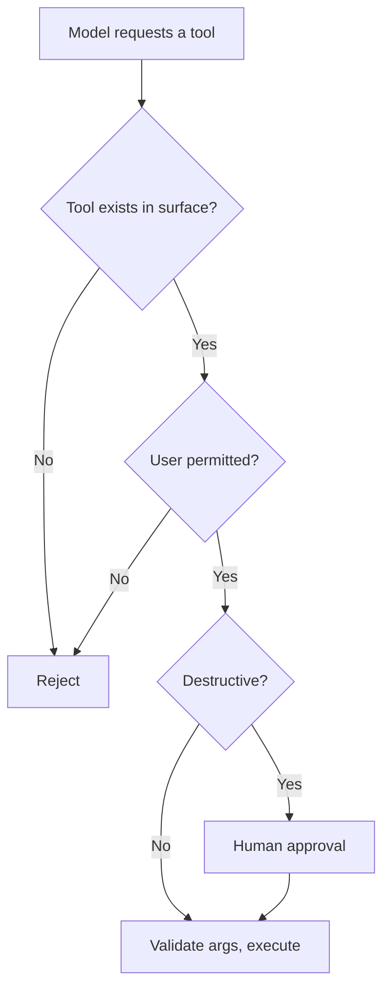

# Guardrails and Safety {#ch-guardrails-and-safety}

> Put controls where they can actually hold — on the input, on the output, and on what the model is permitted to do — and stop expecting the prompt to enforce anything.

**In this chapter:** the three boundaries · what leaves your control · input filtering and its limits · output filtering and PII · tool permissioning · handling refusals · over-refusal as a real failure

## 💡 The Core Idea

A guardrail written in the system prompt is a request, not a control. The model is a probabilistic system
reading text it does not fully trust, and **any rule enforced only by instruction can be argued away by
other instructions** — including instructions that arrive inside a document the model was asked to read.

Real controls sit outside the model, at three boundaries.

| Boundary | Question | Enforced by |
| --- | --- | --- |
| **Input** | What are we sending to a third party? | Redaction, size limits, classification |
| **Output** | What are we showing or storing? | Validation, filtering, escaping |
| **Capability** | What can this system do? | Tool surface, credentials, approval gates |

The third is the strongest, and it is the one that survives every other control failing. If the model
cannot delete data, no prompt makes it delete data.

> Defence in depth, with the tool surface as the layer that holds. Everything upstream of it reduces
> probability; only capability reduces impact.

## How It Works

### What leaves your control

Every model call sends content to a third party. That is a data-protection decision, and it is made once
per architecture rather than once per request.

| ❌ Do not send | Why |
| --- | --- |
| Credentials, tokens, connection strings | Treat as leaked the moment they are sent |
| Personal data with no lawful basis | A processing decision someone has to be able to defend |
| Customer records, in bulk | Contractual and regulatory exposure |
| Unremediated security findings | Discloses an exploitable weakness |

Two structural mitigations matter more than any filter. **Check the tier you are actually on** —
consumer and business tiers of the same product often carry different training and retention commitments.
And for regulated work, deployments that keep inference inside your own cloud account and audit trail
change the boundary rather than merely promising about it.

Redact before sending, at the boundary:

```typescript
const SENSITIVE = [
  { name: 'email', re: /[\w.+-]+@[\w-]+\.[\w.]+/g },
  { name: 'card',  re: /\b(?:\d[ -]*?){13,16}\b/g },
  { name: 'token', re: /\b(sk|pk|ghp|xox[baprs])[-_][A-Za-z0-9]{16,}\b/g },
];

function redact(text: string): { text: string; found: string[] } {
  const found: string[] = [];
  const out = SENSITIVE.reduce((acc, p) => {
    if (p.re.test(acc)) found.push(p.name);
    return acc.replace(p.re, `[${p.name.toUpperCase()}]`);
  }, text);
  return { text: out, found };   // `found` is a metric, not just a side effect
}
```

Counting what the redactor catches is the point. A rising email-redaction rate tells you a workflow
changed and users started pasting records in.

> ⚠️ Pattern redaction catches formats, not meaning. A free-text description of a named patient contains
> no pattern to match. Filters reduce accidental leakage; they do not make an unsuitable data flow
> suitable.

### Input filtering, and its ceiling

| Check | Catches | Misses |
| --- | --- | --- |
| Size and rate limits | Cost attacks, runaway loops | Everything else — but always worth having |
| Pattern redaction | Formatted secrets and identifiers | Free-text personal data |
| A classifier on the input | Obvious abuse and off-topic use | Anything phrased differently |
| Blocklists of phrases | Yesterday's attack | Today's rephrasing |

The last row is worth internalising. **Input filtering is a probability reduction, never a boundary.**
Treat it as one layer, budget for it failing, and put the load on capability limits.

### Output filtering, and where it belongs

Model output is untrusted input to whatever consumes it, and the consumer decides which check applies.

| Consumer | Check |
| --- | --- |
| Rendered as HTML | Escape, or render Markdown through a strict allow-list. Model output can contain script |
| Executed as SQL, shell or code | Do not. Use parameterised tools with fixed operations |
| Written to a database | Validate against the schema first |
| Shown to a user | Scan for leaked context — system prompt text, other users' data |
| Cited as fact | Verify the citation resolves to a retrieved chunk |

That last row is the cheapest quality guardrail in the whole part. If the answer cites a source, check
programmatically that the source was actually retrieved — a fabricated citation is caught with no model
call, and it is one of the most damaging failures a grounded assistant has.

### Tool permissioning



**The control path every tool call passes through. None of it lives in the prompt.**

The principles are the ones you already apply to any privileged process: least privilege on credentials,
read-only by default with writes as separate gated tools, approval for anything irreversible, and an
audit log of every invocation. An agent with real permissions is an operator, and it should be reviewed
like one — [Chapter ?? — Designing the Tool Surface](#ch-designing-the-tool-surface) is the design side
of this.

### Refusals, in both directions

A refusal is a normal response and needs a designed path — not a thrown error and not a retry loop.

| Refusal type | Response |
| --- | --- |
| Genuinely out of scope | Say so plainly, offer what the system can do |
| Provider policy | Do not retry verbatim; surface it honestly |
| Your own guardrail fired | Say which boundary, and how to proceed legitimately |
| **Over-refusal** | A bug. Log it, count it, fix the instruction |

Over-refusal is the failure teams do not measure because it looks like caution. A support assistant that
declines legitimate account questions is broken in a way that generates no error and no alert. **Track
refusal rate as a quality metric**, and put allowed-but-sensitive cases in the eval suite so tightening a
guardrail cannot silently break them.

## When to Use It

| Situation | Control |
| --- | --- |
| Any user-facing model call | Size limits, rate limits, output escaping |
| Handling personal data | Redaction at the boundary, plus a data-flow decision |
| The model can act | Least privilege, approval gates, audit log |
| Grounded answers with citations | Programmatic citation verification |
| A regulated deployment | A deployment whose data boundary you can evidence |
| Every deployment | Refusal rate tracked in both directions |

## Common Mistakes

**❌ Putting the rule only in the system prompt**

> It is an instruction competing with other instructions, some of which arrived in a document the model
> read.

**❌ Rendering model output as HTML unescaped**

> Model output is untrusted input. This is cross-site scripting with an unusual source.

**❌ Tuning guardrails without measuring over-refusal**

> Each tightening is invisible in the metrics and visible to users. Keep allowed cases in the eval suite.

**✅ Verify citations programmatically**

> If the answer cites a chunk, check the chunk was retrieved. No model call, and it catches the most
> damaging failure a grounded system has.

## 🔑 Key Takeaways

- A guardrail in the prompt is a request; real controls sit on input, output and capability.
- Capability is the layer that holds — if the tool does not exist, no instruction can invoke it.
- Pattern redaction catches formats, not meaning, and does not make an unsuitable data flow suitable.
- Model output is untrusted input: escape it, validate it, and verify its citations resolve.
- Over-refusal is a real failure that produces no error — measure refusal rate in both directions.

## Interview Questions

**Q: Where do you put guardrails, and why not in the prompt?**

At three boundaries outside the model: what goes in, what comes out, and what the system is permitted to
do. The prompt is not one of them, because an instruction in a system prompt competes with every other
instruction in the window — including text that arrived inside a document the model was asked to read. A
prompt rule lowers probability. A tool that does not exist lowers impact to zero.

**Q: How do you stop personal data reaching the provider?**

Redact at the boundary with patterns for the formatted cases — emails, card numbers, token shapes — and
count what the redactor catches, because a rising rate tells me a workflow changed. But I would be honest
that this catches formats and not meaning: free-text about a named person has no pattern to match. The
real decision is architectural — which deployment and which contractual tier the data flows through, and
whether that is defensible for this class of data.

**Q: What is the risk in rendering model output in a web page?**

It is untrusted input. The model may emit script or markup, and it produces that output partly from
documents an attacker may control, so this is cross-site scripting arriving through an unusual channel.
The fix is the ordinary one — escape it, or render Markdown through a strict allow-list of tags and
attributes — plus never treating output as a command to execute, whether that is SQL, shell, or code.

**Q: How do you keep an agent from doing damage?**

By limiting capability rather than instruction. The tool surface only exposes what the feature needs,
credentials are scoped to that, writes are separate gated tools rather than parameters on a read tool,
anything irreversible requires human approval, and every invocation is logged. That way a successful
manipulation of the model cannot exceed permissions I already decided to accept, which is the same
argument as least privilege for any other privileged process.

**Q: What is over-refusal, and why does it matter?**

It is the model declining something legitimate, and it matters because it generates no error, no alert
and no exception — it just quietly makes the product worse. Every guardrail tightening risks it, and
nobody notices until users stop trusting the feature. So I track refusal rate as a quality metric and
keep allowed-but-sensitive cases in the eval suite, so that tightening a filter fails a test rather than
failing a user.

## What to Read Next

- [Chapter ?? — Prompt Injection](#ch-prompt-injection) — the attack these boundaries are defending against
- [Chapter ?? — Designing the Tool Surface](#ch-designing-the-tool-surface) — capability limits as design
- [Chapter ?? — Failure States](#ch-failure-states) — what a refusal looks like on screen
