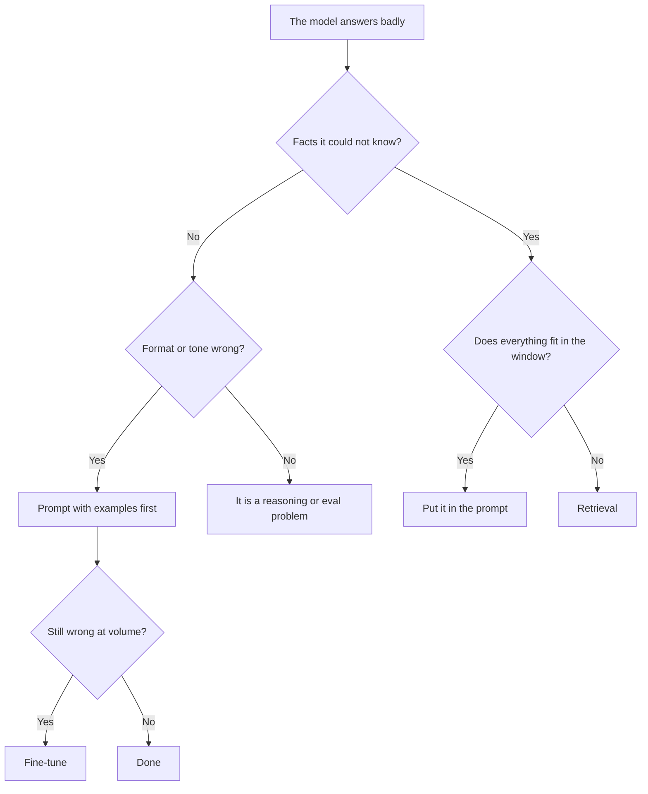

# When RAG, When Fine-Tune, When Neither {#ch-when-rag-when-fine-tune-when-neither}

> Separate the two problems people confuse — the model does not know your facts, and the model does not answer in your style — and pick the cheapest thing that solves the one you have.

**In this chapter:** facts versus form · the four options ranked by cost · what fine-tuning actually buys · why "neither" wins more often than expected · the hybrid case

## 💡 The Core Idea

Almost every "should we fine-tune?" conversation is really two questions wearing one coat.

**Retrieval supplies facts. Fine-tuning shapes behaviour.** A model that does not know your refund policy
has a knowledge problem, and no amount of training on your tone fixes it. A model that answers correctly
but in six rambling paragraphs has a form problem, and stuffing more documents into the window does not
fix that either.

Get that split right and the decision usually makes itself. Get it wrong and you spend a month
fine-tuning a model that will still not know what changed in the policy last Tuesday.

> If the answer changes when the data changes, retrieve it. If the answer changes when your taste
> changes, train it — or, far more often, just prompt it.

## How It Works

### Four options, cheapest first

| Option | Solves | Cost to build | Cost to change |
| --- | --- | --- | --- |
| **Prompt only** | Form, simple behaviour, small fixed knowledge | Hours | Edit a string |
| **Prompt + context in the window** | Facts, when the corpus is small | Hours | Change the file |
| **Retrieval (RAG)** | Facts, when the corpus is large or changes | Weeks | Re-index |
| **Fine-tuning** | Form, format, domain register, latency and cost at scale | Weeks, plus data | Retrain |

Work down that list and stop at the first row that solves the problem. Most teams start three rows too
low, because retrieval is more interesting to build than a prompt is to write.

### The decision

**Two questions decide almost every case. The branch most teams skip is the one on the right.**

### The window that ate the small corpus

A corpus of a few hundred pages fits in a large context window. If your entire knowledge base is a
handbook, a set of API docs and a changelog, **there may be no retrieval system to build** — assemble the
documents, cache the prefix, and answer.

That is a real architecture, not a shortcut, and it has properties retrieval does not: nothing can be
missed by a retriever, there is no index to keep fresh, and prompt caching makes the repeated cost small.
It stops working when the corpus outgrows the window, when per-request cost matters more than build cost,
or when accuracy degrades from irrelevant material — see
[Chapter ?? — Context Engineering](#ch-context-engineering) for why more context is not better.

### What fine-tuning actually buys

It is worth being precise, because the popular expectation is wrong.

| ✅ Fine-tuning is good at | ❌ Fine-tuning is bad at |
| --- | --- |
| A consistent output format | Teaching new facts reliably |
| A domain register or house style | Facts that change |
| Following a complex instruction set without a long prompt | Being auditable — you cannot cite a weight |
| Making a small model behave like a larger one on one narrow task | Anything you need to update this week |

That last row is the underrated one. Fine-tuning a small model on outputs from a frontier model, for a
narrow task, can hold quality while cutting cost and latency several-fold. That is a cost-engineering
move with a real payback, and it is a much better reason to fine-tune than "teaching it our domain".

> ⚠️ Fine-tuning on facts produces confident, unattributable, stale answers. The model cannot tell you
> where it learned something and cannot be corrected without another training run.

### The costs nobody budgets for

Retrieval is not cheap either — the honest comparison includes the parts that are not the model.

| Retrieval brings | Fine-tuning brings |
| --- | --- |
| An ingestion pipeline to keep running | A labelled dataset, curated |
| An index to keep fresh, and re-index on schema change | A training and evaluation run per iteration |
| A retrieval eval suite, or you are guessing | An eval suite anyway |
| Higher per-request tokens, forever | A model version to host and track |
| Permission filtering, if documents are not public | Nothing about permissions — it is baked in, which is worse |

That last line is a real constraint. If different users may see different documents, retrieval can filter
per user and a fine-tuned model cannot unlearn what it was trained on.

## When to Use It

| Situation | Choose | Because |
| --- | --- | --- |
| Answers must cite a source | Retrieval | Weights have no citations |
| Facts change weekly | Retrieval | Re-index, do not retrain |
| Corpus is a few hundred pages, static | Whole corpus in the window | No pipeline to run |
| Output format is inconsistent at volume | Prompt examples, then fine-tune | Cheapest first |
| Per-request cost dominates on one narrow task | Fine-tune a small model | Real payback, measurable |
| Different users see different documents | Retrieval, filtered | Training cannot enforce permissions |
| Answers are wrong but the facts were present | Neither | It is a prompt or eval problem |

## Common Mistakes

**❌ Fine-tuning to teach the model your product**

> It produces an unauditable, un-updatable, confidently wrong system. Facts belong in a store.

**❌ Building retrieval when the whole corpus fits in the window**

> An ingestion pipeline, an index and a retriever, all to solve a problem a cached prompt already solved.

**❌ Choosing before diagnosing**

> "The answer was wrong" has at least four causes: the fact was missing, the fact was retrieved and
> ignored, the format was wrong, or the question was ambiguous. They have four different fixes.

**✅ Write ten failing examples before choosing an architecture**

> They tell you which of the four causes you actually have, and they become the first rows of the golden
> set you will need regardless.

## 🔑 Key Takeaways

- Retrieval supplies facts; fine-tuning shapes form. Most architecture arguments are this distinction, unspoken.
- Work up from prompting — many "RAG projects" are a small corpus that fits in a cached window.
- Fine-tuning on facts produces confident, stale, unattributable answers that cannot be corrected quickly.
- The strongest case for fine-tuning is cost: a small model matching a large one on one narrow task.
- Retrieval can filter documents per user; a fine-tuned model cannot unlearn what it was trained on.

## Interview Questions

**Q: When would you fine-tune instead of using retrieval?**

When the problem is behaviour rather than knowledge — a rigid output format, a domain register, or a long
instruction set I would rather not pay for on every request. And most convincingly, when cost is the
driver: fine-tuning a small model on a narrow task to match a frontier model's quality is a measurable
saving. I would not fine-tune to teach facts, because the result cannot cite a source, cannot be updated
without retraining, and gets stale on its own.

**Q: Your company has 400 pages of internal documentation. Design the assistant.**

I would check whether it fits in the window before designing anything, because 400 pages plausibly does.
If it fits, the design is: assemble the corpus, put it in the stable part of the prompt so it caches, and
answer. No ingestion pipeline, no index, nothing to keep fresh, and no retriever that can miss the right
passage. I would move to retrieval when the corpus grows past the window, when per-request cost starts
mattering more than build cost, or when the extra material starts hurting accuracy.

**Q: What does "neither" look like as an answer?**

More often than people expect. If the right facts were already in the window and the answer was still
wrong, retrieval will not help — the problem is prompt structure, an ambiguous question, or a model
choice. The diagnostic is to print what actually went into the request. If the passage was there, no
amount of retrieval work fixes it, and building a pipeline is expensive displacement activity.

**Q: How do permissions affect this decision?**

They can decide it outright. If different users are entitled to see different documents, retrieval can
filter at query time by applying the user's access rules to the index. A fine-tuned model has absorbed
everything in its training data with no way to scope it per user, so any document that went into training
is reachable by everyone. In a regulated or multi-tenant setting that rules fine-tuning out for knowledge
entirely.

**Q: Can you use both?**

Yes, and the split is clean: retrieval for facts, fine-tuning for form. A support assistant might
retrieve the current policy while using a fine-tuned small model to keep answers in a strict house
format at low cost. What I would avoid is reaching for both at the start — each carries its own pipeline
and eval burden, and doing them together means neither can be measured on its own.

## What to Read Next

- [Chapter ?? — Ingestion and Chunking](#ch-ingestion-and-chunking) — where a retrieval pipeline begins
- [Chapter ?? — Context Engineering](#ch-context-engineering) — why filling the window is not free
- [Chapter ?? — Evaluating Retrieval](#ch-evaluating-retrieval) — the measurement that settles this argument
