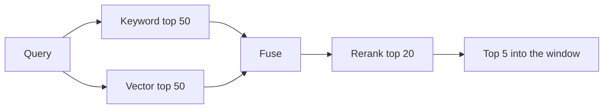

# Retrieval {#ch-retrieval}

> Find the passages that answer the question — using keywords where they win, vectors where they win, and a reranker where the ordering still matters.

**In this chapter:** what each search mode is blind to · hybrid search and fusion · reranking and its latency · choosing *k* · filters and permissions · query rewriting

## 💡 The Core Idea

Vector search finds text that **means** something similar. Keyword search finds text that **says** the
same words. Those are different failures, and the queries that break one are exactly the queries the
other handles.

Vector search misses exact identifiers — a part number, an error code, a function name — because
embeddings blur precise tokens into a neighbourhood. Keyword search misses paraphrase: a user asking
"why is my build slow" will not match a document titled "reducing compilation time". **Production
retrieval runs both,** and the argument about which is better is usually an argument between two people
who have tested different query sets.

> The retriever's job is not to answer. It is to make sure the answer is in the window, ranked high
> enough to be used.

## How It Works

### Three modes, three blind spots

| Mode | Finds | Misses | Cost |
| --- | --- | --- | --- |
| **Keyword (BM25)** | Exact terms, codes, names, rare words | Paraphrase, synonyms | Cheap, no embedding call |
| **Vector** | Meaning, paraphrase, cross-lingual | Exact identifiers, negation, rare tokens | An embedding call per query |
| **Hybrid** | Both | Little; it inherits both recalls | Two searches plus fusion |

Negation is the underrated vector blind spot. "Deployments that do **not** use the cache" embeds close to
"deployments that use the cache" — the vectors barely move. If your domain has meaningful negations,
keyword or metadata filtering has to carry them.

### Hybrid, and how the two lists get merged

Two searches return two ranked lists with incomparable scores — BM25 scores are unbounded, cosine
similarity sits in a fixed range. Normalising them is fiddly and brittle. **Reciprocal rank fusion** side-
steps the problem by using ranks instead of scores:

```typescript
function fuse(lists: string[][], k = 60): string[] {
  const score = new Map<string, number>();
  for (const list of lists) {
    list.forEach((id, i) => score.set(id, (score.get(id) ?? 0) + 1 / (k + i + 1)));
  }
  return [...score].sort((a, b) => b[1] - a[1]).map(([id]) => id);
}

const merged = fuse([await keywordSearch(q, 50), await vectorSearch(q, 50)]).slice(0, 20);
```

A document that both retrievers rank highly rises above one that only a single retriever loved. There is
no score calibration to maintain, which is why this is the default fusion in most production systems.

### Reranking

The retriever optimises for **recall** — get the right passage into the candidate set. The reranker
optimises for **precision** — put it first.



**Retrieve wide and cheap, rerank narrow and expensive, send few into the window.**

The difference is architectural. A vector search compares two embeddings computed independently, so the
document never "sees" the query. A cross-encoder reranker reads query and passage **together** and scores
the pair, which is far more accurate and far more expensive — it cannot be precomputed.

| | Adds | Costs |
| --- | --- | --- |
| **Reranking on** | Large precision gain, especially at small *k* | 100–400 ms and a per-document charge |
| **Reranking off** | Lower latency, simpler | Right answer ranked eighth, and truncated away |

Rerank when the corpus is large or the queries are ambiguous. Skip it when the corpus is small enough
that *k*=5 already contains the answer — measure before adding a network hop to every query.

### Choosing *k*

*k* is a budget decision as much as a search one. Each retrieved chunk occupies window space, costs input
tokens on every request, and adds noise that measurably lowers answer quality.

| *k* | Behaviour |
| --- | --- |
| 1–3 | Cheap and sharp; unforgiving if ranking is imperfect |
| 5–10 | The usual sweet spot with reranking |
| 20+ | Recall insurance without a reranker; expensive and noisy |

Retrieve wide (50), rerank, then pass few (5). Passing 20 unranked chunks costs more and answers worse
than passing 5 reranked ones.

### Filters and permissions

A filter is not an optimisation. If users may see different documents, the filter **is** the access
control, and it has to run inside the search rather than after it.

```typescript
const hits = await index.query({
  vector: await embed(userQuery),
  topK: 50,
  filter: { tenantId: user.tenantId, visibility: { $in: user.roles } }, // pre-filter, in the engine
});
```

Fetching the top 50 and filtering in application code is a correctness bug waiting to be a security
incident: if the top 50 are all documents the user cannot see, they get nothing, and the first time
someone "fixes" it by raising the limit, the leak becomes possible.

### Query rewriting

The user's words are often not the corpus's words. Two cheap techniques help, and both cost a model call.

- **Rewriting** turns "and what about the other one?" into a standalone question using the conversation
  history. Without it, follow-up questions retrieve nothing useful — this is the single most common bug
  in multi-turn RAG.
- **Multi-query expansion** generates two or three phrasings, searches each, and fuses the results. It
  buys recall on vocabulary mismatch at the price of extra searches.

> ⚠️ Both add a full model round trip before retrieval even starts. Use a small, fast model, and measure
> whether the recall gain justifies the added latency on your traffic.

## When to Use It

| Situation | Retrieval design |
| --- | --- |
| Technical docs with codes and names | Hybrid, weighted toward keyword |
| Natural-language FAQ | Vector first, keyword as a floor |
| Large corpus, ambiguous questions | Hybrid + reranking |
| Small corpus, under 1,000 chunks | Vector alone; measure before adding parts |
| Multi-tenant or role-scoped documents | Pre-filter in the engine, always |
| Conversational assistant | Query rewriting, or follow-ups fail |

## Common Mistakes

**❌ Vector-only search on a corpus full of identifiers**

> Error codes and function names are exactly what embeddings blur. Users notice immediately.

**❌ Filtering after retrieval**

> Wrong results, empty result sets, and a permission model enforced in the wrong layer.

**❌ Raising *k* to fix a ranking problem**

> More chunks means more cost, more noise and a measurably worse answer. Rerank instead.

**✅ Log the retrieved chunks for every request**

> When an answer is wrong, the first question is whether the right passage was retrieved at all. Without
> that log the answer is guesswork, and it is the highest-value log line in the whole system.

## 🔑 Key Takeaways

- Keyword and vector search fail on opposite queries; hybrid retrieval is the production default.
- Fuse the two lists by rank, not by score — reciprocal rank fusion needs no calibration.
- Retrieve wide, rerank, pass few: a cross-encoder reads query and passage together and is worth its latency at scale.
- Permission filters must run inside the search engine, never on the results afterwards.
- Rewrite conversational queries into standalone ones, or every follow-up question retrieves the wrong thing.

## Interview Questions

**Q: Vector, keyword, or both?**

Both, in almost every production system, because they fail on different queries. Vector search handles
paraphrase and misses exact identifiers like error codes and function names; keyword search does the
reverse. I would run both and fuse by rank rather than trying to normalise incomparable scores. On a very
small corpus I would start with one and add the second when the eval shows which queries are failing.

**Q: What does a reranker do that the retriever cannot?**

It reads the query and the passage together. A vector search compares two embeddings that were computed
independently, so the document was never aware of the question — that is what makes it fast and
precomputable, and also what limits its precision. A cross-encoder scores the pair directly, which is
much more accurate and cannot be precomputed. So the pattern is retrieve fifty cheaply, rerank twenty
expensively, send five.

**Q: The assistant gives a wrong answer. What do you check first?**

What was retrieved. I would print the chunks that went into the window before touching the prompt,
because the most common cause is that the right passage was never there — or was there and ranked below
the cutoff. If the passage was present and the answer was still wrong, that is a different bug entirely,
and it lives in the prompt or the model rather than in retrieval.

**Q: How do you handle a follow-up question like "what about the other one?"**

Rewrite it into a standalone query using the conversation history before retrieving. Embedded on its own
that question carries almost no signal, so retrieval returns noise and the answer looks like a model
failure. The rewrite costs a small fast model call before the search, and it is the fix for the most
common multi-turn RAG bug there is.

**Q: How do you scope retrieval to what a user is allowed to see?**

By filtering inside the search engine as part of the query, using tenant and role fields stored on each
chunk at ingestion. Filtering the results afterwards is wrong twice: it silently returns fewer results
than requested, and it puts an access-control decision in application code where someone will eventually
widen the limit to compensate. Pre-filtering keeps the security boundary and the search in the same place.

## What to Read Next

- [Chapter ?? — Vector Stores](#ch-vector-stores) — the engine that runs these queries
- [Chapter ?? — Evaluating Retrieval](#ch-evaluating-retrieval) — recall@k, and how to know any of this helped
- [Chapter ?? — Embeddings and Similarity](#ch-embeddings-and-similarity) — what a vector search is comparing
