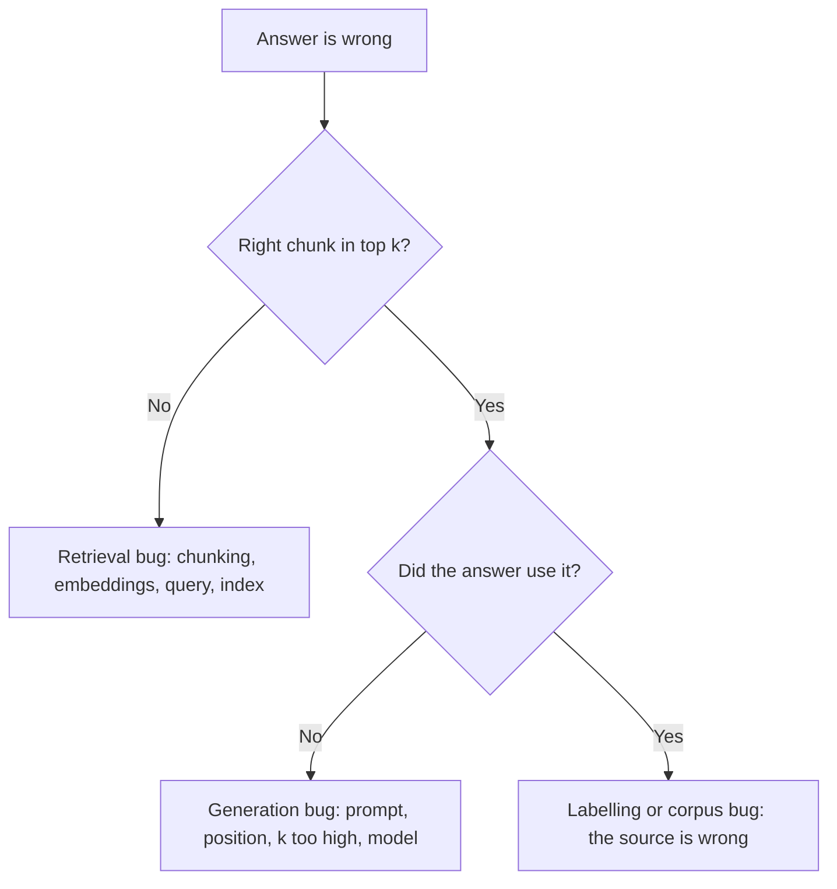

# Evaluating Retrieval {#ch-evaluating-retrieval}

> Build a golden set, measure recall@k, and separate a retrieval bug from a generation bug before spending a week on the wrong one.

**In this chapter:** why a wrong answer is usually a retrieval bug · the golden set · recall@k, MRR and nDCG · splitting the two failure modes · running it in CI · the metrics that mislead

## 💡 The Core Idea

A RAG system has two independent halves and one shared symptom. Retrieval either put the right passage in
the window or it did not. Generation either used what was there or it did not. **Both produce a user
complaint that reads "the answer was wrong", and they need entirely different fixes.**

Without a retrieval measurement you cannot tell which half failed, so every change is a guess. Teams in
that position tune the prompt — it is the fastest thing to change — and the prompt was rarely the problem.

The measurement is not exotic. It is a list of questions with the passages that should have been
retrieved for each, and a number that says how often they were.

> `recall@k` is the number that turns "the assistant feels worse this week" into a fact with a cause.

## How It Works

### The golden set

Fifty questions with known correct sources beats five hundred generated ones. The labour is in the
labelling, and the labelling is what makes it trustworthy.

| Source of questions | Value |
| --- | --- |
| Real user queries from logs | Highest — the actual distribution |
| Support tickets and internal questions | High — real vocabulary |
| Questions written by subject experts | Good for coverage of what nobody asks yet |
| Model-generated from documents | Weakest — tends to reuse the document's wording |

That last row is the trap. Questions generated from a chunk contain that chunk's phrasing, so retrieval
finds them easily and the score flatters the system. Use generated questions to reach coverage, never as
the only set.

```typescript
interface GoldenCase {
  readonly question: string;
  readonly relevantChunkIds: string[];  // labelled by a human who read the corpus
  readonly category: 'factual' | 'procedural' | 'comparison' | 'unanswerable';
}
```

**Include unanswerable questions.** Ten to fifteen per cent of the set should be things the corpus does
not cover, because "retrieves nothing and says so" is a behaviour that must be measured too. A system
tuned only on answerable questions learns to always produce something.

### The metrics

| Metric | Answers | Use when |
| --- | --- | --- |
| **recall@k** | Was the right passage in the top *k* at all? | The primary metric — it is the ceiling on quality |
| **precision@k** | How much of the top *k* was relevant? | Cost and noise matter |
| **MRR** | How high was the first correct result? | One right answer exists |
| **nDCG@k** | Graded relevance, position-weighted | Several passages are partly relevant |

**Start with recall@k and mostly stay there.** If the passage is not in the top *k*, nothing downstream
can recover — the generator cannot cite what it never saw. Precision and ranking metrics matter after
recall is healthy.

```typescript
function recallAtK(cases: GoldenCase[], retrieve: (q: string, k: number) => Promise<string[]>, k: number) {
  return Promise.all(cases.map(async (c) => {
    const ids = await retrieve(c.question, k);
    return c.relevantChunkIds.some((id) => ids.includes(id)) ? 1 : 0;
  })).then((hits) => hits.reduce<number>((a, b) => a + b, 0) / cases.length);
}
```

Report it at two values of *k*. `recall@20` measures the retriever; `recall@5` measures the retriever plus
the reranker. A large gap between them is a ranking problem and points straight at reranking.

### Splitting the two failure modes



**One question, asked before any fix, that routes the work to the right half of the system.**

Row C and row E have no fixes in common. Chunking changes will not help a model that ignored a passage it
was given, and prompt changes will not help a passage that was never retrieved.

### What each retrieval failure means

| recall@20 | recall@5 | Diagnosis | Fix |
| --- | --- | --- | --- |
| Low | Low | The passage is not findable | Chunking, then embeddings, then query rewriting |
| High | Low | Found but ranked poorly | Add or tune reranking |
| High | High, answers still wrong | Generation, not retrieval | Prompt, position, fewer chunks, model |

That table is most of the debugging value of this chapter. Two numbers narrow a vague complaint to one of
three workstreams.

### Running it in CI

Retrieval evaluation is cheap because most of it needs no model call — recall@k is set membership against
labelled ids. That makes it viable as a gate.

- **Run on every change to chunking, embedding config, retrieval parameters or the corpus.** All four
  change recall and none of them look risky in a diff.
- **Fail on a drop, not on an absolute number.** A threshold gets raised until it stops complaining; a
  regression against the last run does not.
- **Report per category.** A 4% average drop that is entirely procedural questions is a specific,
  fixable finding rather than noise.
- **Version the golden set with the code.** A set that changes silently makes every historical number
  meaningless.

> ⚠️ **Moving target:** eval tooling and hosted evaluation products change constantly. The durable part
> is a versioned golden set, a metric your team agrees on, and a run that gates a merge. That outlives
> every tool that runs it.

### Metrics that mislead

- **Average similarity score.** It measures the retriever's confidence, not its correctness, and it goes
  up when the corpus gets more homogeneous.
- **Answer quality alone.** It hides which half failed, which is the entire question this chapter exists
  to answer.
- **Recall at a large *k*.** `recall@50` is easy to make excellent and irrelevant if only 5 chunks reach
  the window.
- **A single average across a mixed set.** Report per category, or a collapse in one question type
  disappears into an average that barely moves.

## When to Use It

| Situation | Do |
| --- | --- |
| Before tuning chunk size or *k* | Build the golden set first — otherwise you cannot tell if you helped |
| A user reports a wrong answer | Check whether the passage was retrieved before anything else |
| Changing the embedding model | Run both indexes on the same set and compare |
| Adding a reranker | Compare recall@5 before and after; recall@20 should barely move |
| Weekly, in CI | Gate on regression against the previous run |

## Common Mistakes

**❌ Tuning chunk size without measuring**

> Every change feels like an improvement on the three examples you happen to test.

**❌ A golden set generated entirely from the documents**

> The questions inherit the documents' wording, retrieval finds them easily, and the score is flattering
> and useless.

**❌ Measuring only end-to-end answer quality**

> It tells you something is wrong and nothing about which half. Two weeks in the wrong half is the
> standard outcome.

**✅ Log the retrieved chunk ids on every production request**

> It turns a user complaint into a diagnosis in one query, and it is where next quarter's golden set
> comes from.

## 🔑 Key Takeaways

- A wrong answer is a retrieval failure or a generation failure, and only a retrieval metric tells you which.
- recall@k is the primary metric: if the passage is not in the top *k*, nothing downstream can recover.
- Fifty human-labelled questions beat five hundred generated ones, and 10–15% should be unanswerable.
- recall@20 measures the retriever and recall@5 measures the ranking; the gap between them diagnoses reranking.
- Gate CI on a regression against the last run rather than on an absolute threshold nobody will defend.

## Interview Questions

**Q: How do you know your RAG system is working?**

With a golden set — real questions, each labelled with the passages that should be retrieved — and
recall@k measured against it. That gives me a number I can move, and it separates the retrieval half from
the generation half. Without it, every change to chunking or *k* is judged by trying three examples I
happen to remember, which is how teams spend weeks improving something that was never the problem.

**Q: What is recall@k, and why is it the metric you start with?**

The fraction of questions where at least one genuinely relevant passage appears in the top *k* results.
It comes first because it is a ceiling: if the right passage is not in the window, no prompt, model or
reranker can produce a correct grounded answer. Precision and ranking metrics matter, but only once
recall is healthy — improving ordering among results that do not contain the answer changes nothing.

**Q: A user says the assistant gave a wrong answer. Walk me through the diagnosis.**

I pull the retrieved chunk ids for that request from the logs. If the right passage is not among them, it
is a retrieval bug and I look at chunking, the query, and whether the document is even indexed. If it is
among them, the retrieval worked and the generation ignored it — that points at the prompt, the position
of the chunk in the window, or too many chunks diluting it. Two very different workstreams, and one log
line decides between them.

**Q: What is wrong with generating your golden set from the documents?**

The questions come out phrased like the source, so retrieval matches them easily and the score is
inflated. Real users ask in their own vocabulary, which is precisely the mismatch retrieval has to
bridge. I would use generated questions to fill coverage gaps for material nobody has asked about yet,
but the core of the set has to be real queries from logs or tickets, labelled by a person.

**Q: How would you run this in CI without it becoming a nuisance?**

Recall@k needs no model call — it is set membership against labelled ids — so it is fast and cheap enough
to run on every pull request that touches chunking, embeddings, retrieval parameters or the corpus. I
would fail on a regression against the previous run rather than an absolute threshold, because thresholds
get quietly lowered, and report the result per question category so a collapse in one type of question
does not hide inside an average.

## What to Read Next

- [Chapter ?? — Evals](#ch-evals) — the same discipline applied to the generation half
- [Chapter ?? — Retrieval](#ch-retrieval) — the parameters this measurement lets you tune with confidence
- [Chapter ?? — Error Analysis Loops](#ch-error-analysis-loops) — turning failures into categories worth fixing
