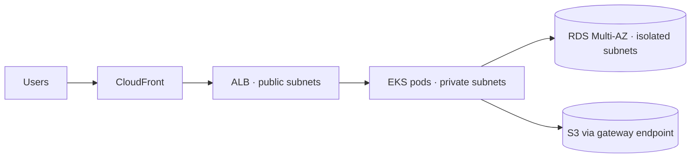

# AI for Documentation

Documentation is the classic "important but never urgent" task. AI shifts the cost from *writing* to *reviewing*, which is what makes it finally sustainable.

## Where AI Helps and Where It Harms

| Document | AI Value | Risk |
|----------|----------|------|
| **README / module docs** | ✅ High — structure is formulaic | Low |
| **Terraform variable docs** | ✅ High — mechanical extraction | Low |
| **Architecture description from IaC** | ✅ Good — reads the actual code | Medium |
| **Runbooks** | ⚠️ Draft only | 🔴 **High — untested commands** |
| **Postmortems** | ✅ Good for structure and timeline | Medium — analysis must be human |
| **ADRs (decision records)** | ⚠️ Structure only | 🔴 High — the *reasoning* is the content |
| **Onboarding guides** | ✅ Good first draft | Medium — misses tribal knowledge |

> The rule: AI is good at documents whose **structure** carries the value, and dangerous for documents whose **judgement** carries the value.

🔴 **Runbooks are the dangerous case.** A generated runbook reads convincingly but contains commands nobody has run. Someone follows it at 3am during an outage and makes things worse.

## The Core Problem: Documentation Drift

```
Day 1:   docs written, accurate
Day 30:  infrastructure changed, docs not
Day 90:  docs actively misleading
Day 180: nobody trusts them, so nobody updates them
```

⚠️ AI makes writing cheap, which makes drift **worse** if you generate prose and leave it. A confidently wrong document is more harmful than a missing one.

✅ **The fix: generate from source, in CI.** Documentation that is regenerated on every change cannot drift.

| Approach | Drifts? |
|----------|---------|
| Prose written once by a human | ✅ Yes |
| Prose written once by AI | ✅ Yes — faster, so more of it |
| **Generated from code in CI** | ❌ No |

## Deterministic Generation First

Before reaching for AI, use the tool that cannot hallucinate.

| Content | Tool | Hallucinates? |
|---------|------|--------------|
| Terraform inputs/outputs tables | **terraform-docs** | ❌ No |
| Helm chart values reference | **helm-docs** | ❌ No |
| API reference | **OpenAPI / TypeDoc** | ❌ No |
| Kubernetes resource inventory | `kubectl` + templates | ❌ No |
| Dependency inventory | **SBOM** | ❌ No |
| Architecture diagram from IaC | **terraform graph**, cdk-dia | ❌ No |

```yaml
# Deterministic docs, enforced in CI — the README cannot go stale
- name: Terraform docs
  uses: terraform-docs/gh-actions@v1
  with:
    working-dir: modules/
    output-file: README.md
    output-method: inject
    fail-on-diff: true      # ✅ PR fails if docs are out of date
```

✅ Use AI for the parts a generator cannot produce: **why** the module exists, when to use it, and the trade-offs. Use generators for the parts it should never invent: argument names, defaults, and types.

## Generating Architecture Docs from IaC

This works well because the source of truth is real code, not memory.

```
Prompt:

Read the attached Terraform (main.tf, vpc.tf, eks.tf) and write an
architecture overview containing:

1. A component list — one line each, purpose only
2. Network topology: VPC CIDR, subnet layout, ingress/egress paths
3. Data flow from internet request to database
4. A Mermaid diagram of the components
5. Trust boundaries and where authentication happens
6. Single points of failure

Rules:
- Only describe what is in the files. Do not infer components that are absent.
- If something is unclear, list it under "Needs clarification".
- Do not include recommendations.
```

**The two instructions that matter:**

| Instruction | Prevents |
|------------|---------|
| *"Only describe what is in the files"* | 🔴 Inventing components that sound like they should exist |
| *"List anything unclear"* | Silent guessing presented as fact |

✨ Mermaid diagrams are ideal output: text-based, version-controlled, reviewable in a diff, and rendered by GitHub.



⚠️ AI reliably invents a WAF, a bastion host, or a Redis cache that does not exist, because those appear in most reference architectures. Diff every component against the code.

## Runbooks — Draft, Then Test

```
❌ Generated runbook, shipped as-is:
   "Scale the deployment: kubectl scale deploy/api --replicas=10"
   → wrong namespace, wrong deployment name, no verification step,
     no rollback, no note that the HPA will immediately override it
```

**Turn the draft into something usable:**

| Step | Action |
|------|--------|
| 1 | Generate the structure and candidate steps |
| 2 | 🔴 **Run every command** in a non-production environment |
| 3 | Replace placeholders with real names, namespaces, and ARNs |
| 4 | Add a verification step after each action — "how do I know it worked?" |
| 5 | Add the rollback for each step |
| 6 | Add what it does **not** cover |
| 7 | Date it and name an owner |

```markdown
## Runbook: API latency above SLO

**Owner:** platform-team · **Last tested:** 2026-07-22 (staging)

### 1. Confirm the symptom
    aws cloudwatch get-metric-statistics --namespace AWS/ApplicationELB \
      --metric-name TargetResponseTime --extended-statistic p99 ...
  ✅ Verify: p99 above 800ms for more than 5 minutes.
  ❌ If p99 is normal, this is not the right runbook → see network-latency.md

### 2. Check for a recent deploy
    kubectl -n production rollout history deploy/checkout-api
  ✅ If a deploy landed within 30 minutes → go to step 3 (roll back first)

### 3. Roll back
    kubectl -n production rollout undo deploy/checkout-api
  ✅ Verify: `rollout status` completes; p99 recovers within 5 minutes
  ↩️ Rollback of this action: `rollout undo` again to return to the new version

### Not covered by this runbook
- Database-side latency → see rds-performance.md
- Regional AWS degradation → see the AWS Health Dashboard
```

> The value of a runbook is entirely in whether the commands work when you are tired and under pressure. Untested steps make it a liability.

## Postmortems

AI is good at the mechanical half and must not do the analytical half.

| ✅ Let AI Do | 🔴 Keep Human |
|-------------|--------------|
| Build the timeline from logs, alerts, and deploy records | Root cause analysis |
| Draft the impact summary | Contributing factors |
| Summarize a long incident channel | Action items and owners |
| Format to the template | The "what we got lucky on" section |
| Find related past incidents | Judgement about systemic issues |

⚠️ Feeding an incident channel into a model to produce "root cause" yields the **most-discussed** theory, not the true one. Those are often different, and the difference is the whole point of a postmortem.

✅ Also watch for blame. Raw incident chat contains frustration; a summary can carry it into the permanent record. Explicitly instruct: *"Describe actions in terms of systems and processes, never individuals."*

## Keeping Documentation Honest

| Practice | Effect |
|----------|--------|
| **Regenerate in CI, fail on diff** | Reference docs cannot drift |
| **Date and owner on every document** | Readers can judge staleness |
| **"Last tested" on runbooks** | Distinguishes tested from theoretical |
| **Link to code, do not restate it** | One source of truth |
| **Delete stale docs** | ✅ A missing doc is safer than a wrong one |
| **Docs in the same PR as the change** | The only reliable update trigger |

> The best documentation strategy is to need less of it: clear naming, small modules, and self-describing IaC beat any volume of generated prose.

## Interview Q&A

**Q: How would you use AI to improve documentation without making things worse?**

The failure mode to avoid is generating a large volume of plausible prose that then drifts and becomes actively misleading, which is worse than having no documentation. So I would split it. Reference material — Terraform inputs and outputs, Helm values, API schemas, dependency inventories — should come from deterministic generators like terraform-docs and OpenAPI tooling, enforced in CI with a fail-on-diff check so it cannot go stale and cannot be hallucinated. Then I would use AI for the parts a generator genuinely cannot produce: why a module exists, when to use it, the trade-offs, and the architecture narrative read from the actual code. Every document gets a date and an owner so readers can judge staleness, and I would rather delete a stale document than leave it, because a confidently wrong runbook causes incidents.

**Q: What is the risk of AI-generated runbooks?**

That they read convincingly while containing commands nobody has ever run. Generated runbooks typically have the right shape and the wrong specifics — a plausible but incorrect namespace, a deployment name that does not exist, no verification step after each action, no rollback, and no acknowledgement of interactions such as a horizontal pod autoscaler immediately overriding a manual scale. The person following it is by definition under pressure at an awkward hour and is trusting the document, so a wrong step actively makes the incident worse. The way to use AI here is as a structural draft: it proposes the steps, then a human runs every command in a non-production environment, replaces placeholders with real values, adds a verification and a rollback for each step, states what the runbook does not cover, and records a "last tested" date.

**Q: Should AI write postmortems?**

It should write the mechanical half, not the analytical half. Building a timeline from logs, alerts, deploy records, and a long incident channel is tedious, error-prone, and exactly what these tools are good at, and drafting the impact summary and formatting to the template saves real effort at a point when everyone is tired. What it must not produce is the root cause, the contributing factors, or the action items, because a model summarizing an incident channel surfaces the most-discussed theory rather than the true one — and the gap between those two is precisely what a postmortem exists to close. I would also explicitly instruct it to describe actions in terms of systems and processes rather than individuals, because raw incident chat contains frustration and a summary can carry blame into the permanent record, which destroys the blameless culture that makes people report problems.

**Q: Why do you prefer generated documentation over written documentation?**

Because drift is the dominant failure mode. Documentation is accurate on the day it is written and degrades from then on, and once readers have been misled a couple of times they stop trusting it — at which point nobody updates it either and the decline accelerates. Documentation generated from the source of truth cannot drift, because regenerating is part of the build and a stale version fails the pull request. It also cannot hallucinate: terraform-docs reads the actual variable definitions, so the argument names and defaults are correct by construction, whereas a model writing the same table from memory will occasionally invent a plausible parameter. AI still has a real role, but for the judgement layer — the why and the when — which no generator can produce and which changes far more slowly than the reference detail.

**Q: What is the biggest mistake when generating architecture documentation from infrastructure code?**

Letting it infer components that are not there. Reference architectures nearly always include a WAF, a bastion host, a caching layer, and multi-region failover, so a model asked to describe your architecture will often add them because they belong in the pattern it learned — and the result reads as a competent description of a system you do not have. That is dangerous during an incident or a security review, when someone relies on the document. The mitigation is explicit prompt constraints: describe only what appears in the supplied files, do not infer absent components, and list anything ambiguous under a "needs clarification" heading rather than guessing. Then diff every named component against the code before merging. Asking for Mermaid output helps too, because a text diagram is reviewable in a pull request diff rather than being an opaque image.

---

[← AI-Assisted Development](./02-code-development.md) | [Index](./README.md) | [AI-Powered Troubleshooting →](./04-troubleshooting.md)
