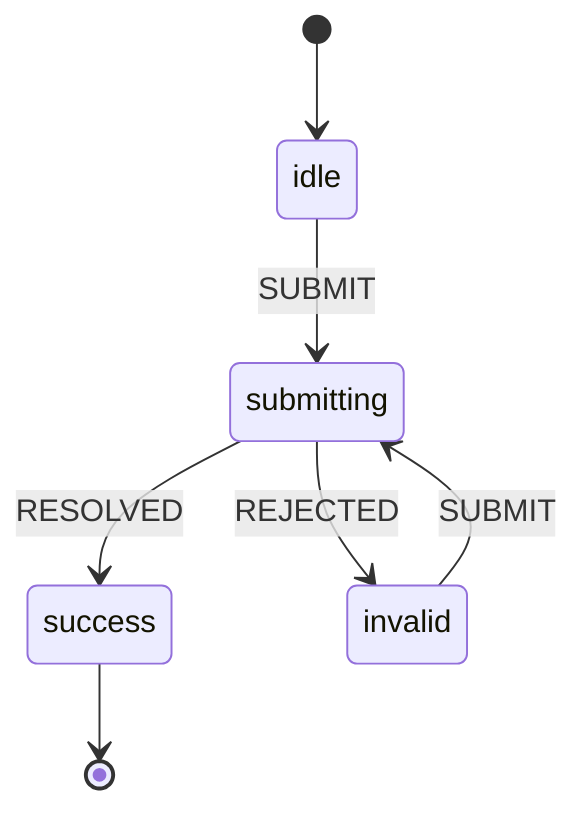

# Modelling Flows as State Machines {#ch-modelling-flows-as-machines}

> Replace six booleans that can contradict each other with one value that cannot, and make the impossible states impossible to represent.

**In this chapter:** the boolean explosion · states, events, transitions · `useReducer` as the small version · when a library earns its place · statecharts · testing a machine

## 💡 The Core Idea

Most interface bugs that survive code review are **states nobody designed**. A component with
`isLoading`, `isError`, `isSubmitting`, `isDirty` and `isSuccess` has thirty-two combinations. Perhaps
five of them are real, and the other twenty-seven are reachable — `isLoading && isError` is one keystroke
away, and the design says nothing about what it should look like.

A state machine inverts the model. Instead of independent flags that code has to keep consistent, there
is **one state at a time** and a fixed set of events that move between them. A transition the machine
does not define simply cannot happen.

> The flags describe what is true. The machine describes what is allowed. The bugs live in the gap
> between them.

## How It Works

Four pieces: a finite set of **states**, the **events** that arrive, the **transitions** that map a state
and an event to the next state, and **context** for the data that is not finite.



**A checkout flow as a machine: `submitting` cannot also be `invalid`, because there is one state.**

The important line in that diagram is the one that is missing. There is no arrow from `success` back to
`submitting`, so a double-click on a confirmed order cannot resubmit it — not because a guard clause
catches it, but because no transition exists.

### The small version is in React already

`useReducer` is a state machine with the vocabulary filed off. For a single component, it is usually
enough:

```typescript
type State = { status: "idle" } | { status: "submitting" } | { status: "invalid"; message: string } | { status: "success"; id: string };

type Event = { type: "SUBMIT" } | { type: "RESOLVED"; id: string } | { type: "REJECTED"; message: string };

function reducer(state: State, event: Event): State {
  switch (state.status) {
    case "idle":
    case "invalid":
      return event.type === "SUBMIT" ? { status: "submitting" } : state;
    case "submitting":
      if (event.type === "RESOLVED") return { status: "success", id: event.id };
      if (event.type === "REJECTED") return { status: "invalid", message: event.message };
      return state;
    case "success":
      return state; // Terminal. A stray SUBMIT does nothing.
  }
}
```

Two things are doing the work, and neither is a library. Switching on the **current state** before the
event is what makes an unexpected event a no-op rather than a bug. And typing `State` as a **discriminated
union** rather than as a bag of optional fields means `message` only exists when the status is `invalid`
— the compiler refuses to read it anywhere else.

### What a library adds

XState and its peers add the things a reducer cannot express without growing into one:

| Feature | Why a plain reducer struggles |
| ------- | ----------------------------- |
| **Hierarchical states** | "Editing" with sub-states — pristine, validating, invalid — nests, and a nested reducer is hand-rolled |
| **Parallel regions** | A media player is playing *and* muted *and* fullscreen; three machines, one component |
| **Side effects as data** | Entry and exit actions, and invoked promises the machine owns rather than a `useEffect` observing state |
| **Guards and delays** | "Only if the cart is non-empty", "after 30 seconds", declared with the transition |
| **A diagram that is the code** | The visualiser reads the machine, so the picture cannot drift from the implementation |

That last one is the real organisational payoff. A statechart is legible to a designer and a product manager. That turns "what happens if they close
the tab mid-payment" into a question with an answer on a diagram, rather than an archaeology
exercise in a component.

> ⚠️ **Moving target:** XState's API has changed shape across major versions, and the ecosystem around
> statecharts moves with it. The durable principle is the modelling, not the library — enumerate the
> states, name the events, and let the transitions be the only way between them. That survives whatever
> the current API looks like, and it is what an interviewer is actually asking about.

## When to Use It

| Situation | Reach for | Why |
| --------- | --------- | --- |
| A boolean pair that cannot both be true | A discriminated union in `useState` | The type does the work; no machinery needed |
| One component, a handful of states, linear flow | `useReducer` | Already in React, and the switch is readable |
| Multi-step checkout, onboarding, upload with retry | A machine library | Guards, delays and nesting are the requirement |
| A flow the whole team argues about | A machine library | The diagram is the shared language |
| Server data caching and refetching | A query library, not a machine | That is server state — see the earlier chapters in this section |

The honest boundary: **most components do not need this.** Reach for it when the flow has a shape people
draw on a whiteboard, or when a bug report says "it got stuck".

## Common Mistakes

**❌ Modelling server state as a machine.** Loading, success and error look like states, but caching,
deduplication, revalidation and garbage collection are what actually make server data hard, and a query
library already implements them. A machine on top of it duplicates the state and then disagrees with it.

**❌ Putting everything in context.** Context is the data that is not finite — an id, a draft, a retry
count. If a value in context is being compared against a string to decide what to render, it wanted to
be a state.

**❌ Building the machine from the UI.** States are what the system is doing, not what the screen looks
like. A machine with `showingSpinner` and `showingErrorBanner` has encoded one design and will be
rewritten with it; one with `submitting` and `invalid` survives the redesign.

**❌ Keeping the flags alongside the machine.** Migrating halfway — a machine for the flow and an
`isLoading` boolean that some component still sets — gives you both models and the contradictions the
machine was meant to remove.

## 🔑 Key Takeaways

- Independent booleans multiply: five flags are thirty-two combinations, and the ones nobody designed
  are where the bugs are.
- A machine allows one state at a time, so an undesigned combination cannot be represented rather than
  being caught by a guard clause.
- `useReducer` with a discriminated-union state is a state machine, and it is enough for most single
  components.
- A library earns its place at nesting, parallel regions, guards, delays and owned side effects — and at
  the diagram, which is the shared language with non-engineers.
- Server data is not a machine problem; cache invalidation is, and a query library already solves it.

## Interview Questions

**Q: Why prefer a state machine to a few booleans?**

Because booleans are independent and states are not. Five booleans describe thirty-two combinations,
most of which the design never considered, and every one is reachable through some ordering of events —
a double-click, a slow network, a back button. A machine has one state at a time and only the transitions you wrote. So `submitting` and `invalid`
cannot both be true, and a second submit on a confirmed order is a no-op by construction rather than
by a guard someone remembered to add.

**Q: When is `useReducer` enough, and when do you reach for XState?**

`useReducer` is enough while the states are flat, the flow is linear and side effects live outside the
reducer — which covers most components. A library earns its place when states nest, when regions run in parallel, or when transitions need
guards and delays. The other trigger is the machine owning the async work, rather than a `useEffect`
watching state and firing requests. The other trigger is organisational: when
the flow is complicated enough that the team needs a diagram to agree on it.

**Q: Would you model data fetching as a state machine?**

Not the caching part. Idle, loading, success and error are easy to model, and they are the least interesting part of
server data. The hard parts are deduplicating concurrent requests, revalidating stale entries,
collecting unused ones and reconciling optimistic updates. A query library implements all of that. Where a machine still helps is the flow *around* the request: a three-step wizard whose second
step submits, where the retry and cancel behaviour is the complicated part.

**Q: How do you test a machine?**

Test the transitions, not the rendering. The reducer or machine is a pure function from state and event to state. So the valuable tests
assert which events are *ignored*: that `SUBMIT` in `success` changes nothing, and that `RESOLVED`
arriving while `idle` does not fabricate a result. Those are
exactly the cases that are awkward to reach through the DOM and are where the real bugs are, and they
run in microseconds.

## What to Read Next

- [Chapter ?? — The Four Kinds of State](#ch-four-kinds-of-state) — the classification this chapter assumes
- [Chapter ?? — Form State](#ch-form-state) — the flow most likely to want a machine first
- [Chapter ?? — React TypeScript at Scale](#ch-react-typescript-at-scale) — discriminated unions, which are what make the states unrepresentable
