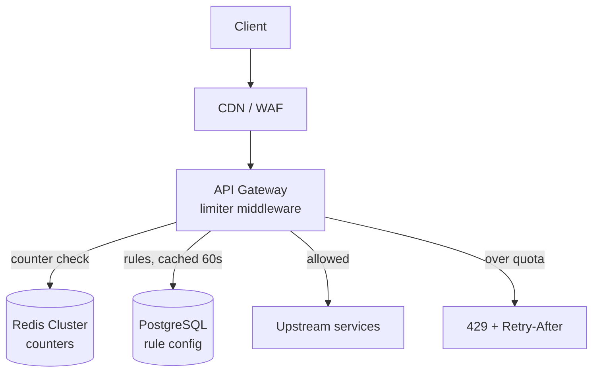

# Design a Rate Limiter {#ch-design-rate-limiter}

> Place the limiter where it is cheapest to enforce, then make it hold at a million requests a second.

**In this chapter:** requirements · where enforcement belongs · rules and tiers · management API · capacity and failure modes

## How to Open This Answer

"I'll design a distributed rate limiter for a multi-tenant API. The interesting decisions are where enforcement sits, how per-tier rules reach every node without a database call on the hot path, and how the counter stays correct across dozens of servers without becoming the bottleneck."

> The algorithms themselves — fixed window, sliding window counter, token bucket, and the Redis Lua script that makes the decision atomic — are implemented in [Chapter ?? — Rate Limiting](#ch-rate-limiting). This chapter assumes them and designs the system around them.

## Problem Statement

A rate limiter sits in front of your API and blocks requests that exceed a configured quota. It must add under 5 ms of overhead, work correctly across dozens of load-balanced servers, and fail safely when its state store is unavailable. Different users, tiers and endpoints need different limits, and those limits change without a deploy.

## R — Requirements

### Functional (pick 4-5 that matter most)

- Block requests over quota; return HTTP 429 with `Retry-After`
- Support limits keyed by user id, IP address and API key
- Configurable rules per endpoint and per user tier (free / paid / enterprise)
- Multiple time windows enforced at once — per minute and per day
- Operators can inspect and change limits live, without a deploy

### Non-Functional (pick 3-4)

- Overhead under 5 ms per request at the median
- Limits enforced globally, not per server
- Fail open — a limiter outage must not become an API outage
- 1M requests per second at peak

## A — Architecture

### Where Enforcement Belongs

This is the first decision, and the one candidates skip.

```text
CDN / WAF        ← volumetric floods; blocks traffic before it costs you anything
   ↓
API gateway      ← per-key quotas, global ceilings, one place to configure
   ↓
Application      ← business rules: per-tier, per-endpoint cost, per-account quotas
```

**Push crude limits as far out as you can** — a request rejected at the edge costs nothing. Keep rules that need business context (which plan, which account, how expensive this query is) in the application, where that context exists. The gateway is the primary enforcement point because it cannot be bypassed by internal service-to-service calls and avoids duplicating Redis logic across twenty services.

> Rate limiting is not DDoS protection. A volumetric attack saturates bandwidth before your middleware runs, which is why the CDN and WAF row exists above the gateway rather than being folded into it.

### High-Level Diagram



**The rule store is off the hot path; only the counter is on it.** Each node caches the rule table in memory with a 60-second TTL, so a limit check is one Redis round trip and no database call.

### The Hot Path, Step by Step

```text
1. Resolve identity   → API key, else user id, else IP (/56 subnet for IPv6)
2. Resolve rule       → in-memory rule cache, keyed by (endpoint, tier)
3. Check counters     → one Lua call per window, pipelined
4. Decide             → deny if any window is exhausted
5. Annotate           → RateLimit headers on the response, allowed or not
```

Steps 1 and 2 are local. Step 3 is the only network hop, and it is what the 5 ms budget is spent on.

## D — Data Model

```typescript
interface RateLimitRule {
  ruleId: string;
  endpoint: string;          // '/api/search' or '*' for a global default
  tier: 'free' | 'paid' | 'enterprise' | 'anonymous';
  limitPerMinute: number;
  limitPerHour: number;
  limitPerDay: number;
  costPerRequest: number;    // expensive endpoints spend more of the budget
}

interface RateLimitDecision {
  allowed: boolean;
  limit: number;
  remaining: number;
  resetAt: number;            // Unix seconds when the window resets
  retryAfterSeconds?: number; // present only when allowed = false
  hitDimension?: 'user' | 'ip' | 'endpoint' | 'global'; // which limit denied it
}
```

Storage notes:

- `rate_limit_rules` in PostgreSQL — read rarely, cached in memory on every node with a 60-second TTL
- Redis key for a window counter: `rl:{dimension}:{id}:{windowBucket}`, where `windowBucket = Math.floor(Date.now() / windowMs)`
- Redis key for a token bucket: `rl:tb:{id}` — a Hash with fields `tokens` and `last_refill`
- Every key carries a TTL of 2× its window, so expired windows clean themselves up

**Tiering needs no extra keys.** The tier is read from the JWT (or cached from a user service for five minutes), used to select a rule, and the same counter key is compared against a different limit value.

## I — Interface (APIs)

The limiter is middleware, not a public API. What *is* an API is its control plane:

```typescript
interface RateLimiter {
  check(request: IncomingRequest): Promise<RateLimitDecision>;
}

interface IncomingRequest {
  userId?: string;
  apiKey?: string;
  ipAddress: string;
  endpoint: string;
  userTier: RateLimitRule['tier'];
}

// GET /admin/rate-limit/rules — list active rules and the config version
interface ListRulesResponse {
  rules: RateLimitRule[];
  version: string;
}

// POST /admin/rate-limit/rules — create or update a rule; live, no deploy
interface UpsertRuleRequest {
  endpoint: string;
  tier: RateLimitRule['tier'];
  limitPerMinute: number;
  limitPerHour: number;
  enforce: boolean;           // false = monitor mode, log what would have been blocked
}

// GET /admin/rate-limit/status/:userId — support answering "why was I throttled?"
interface UserRateLimitStatus {
  userId: string;
  tier: string;
  windows: Array<{
    window: 'minute' | 'hour' | 'day';
    used: number;
    limit: number;
    resetsAt: string;
  }>;
}
```

The `enforce: false` flag matters more than it looks. **Roll every new limit out in monitor mode first** and log what would have been blocked for a week — real traffic is burstier than anyone predicts, and the first limit you pick is usually too tight for one legitimate integration.

## O — Optimizations & Trade-offs

### Keeping Redis Off the Critical Path

| Concern | Problem | Approach |
| ------- | ------- | -------- |
| Round-trip latency | 2–5 ms per check at p50, worse at p99 | Co-locate Redis in the same AZ; pipeline the per-window checks into one call |
| Throughput at 1M rps | A single node saturates | Redis Cluster sharded by key prefix — `rl:user:{id}` distributes uniformly |
| Redundant checks | Most requests are nowhere near their limit | Local L1 counter with a 100 ms TTL absorbs 80%+ of checks; Redis sees bursts and first-requests |
| Hot tenant | One enterprise key concentrates on one shard | Split that key's counter into N sub-keys and sum, or give it a dedicated shard |

The L1 cache is the significant trade: it admits a few percent over the limit in exchange for most of the latency. Say that out loud rather than presenting shared Redis as free.

### Enforcing Several Dimensions at Once

Check every applicable dimension concurrently and deny if any one fails:

```typescript
const [byUser, byIp, byEndpoint] = await Promise.all([
  check(`user:${userId}`, rule.limitPerMinute),
  check(`ip:${ipSubnet}`, ANONYMOUS_CEILING),
  check(`endpoint:${endpoint}`, rule.limitPerMinute * 10),
]);

const denied = [byUser, byIp, byEndpoint].find((d) => !d.allowed);
```

Report **which** dimension denied the request in the response body. A client throttled by a global ceiling and a client over its own quota need different remedies, and "429" alone tells them nothing.

### Failure Modes

| Failure | Fail open | Fail closed |
| ------- | --------- | ----------- |
| Behaviour when Redis is down | Allow all requests | Block all requests |
| Impact | Some abuse slips through | Every user is blocked |
| Preferred for | Public APIs, user-facing products | Payments, SMS sending, anything where abuse costs more than downtime |

✅ **Fail open, loudly** — alert on it, and keep an in-process limiter as a degraded fallback so you fall back to approximate limiting rather than none.

### Capacity Estimation

| Metric | Estimate |
| ------ | -------- |
| Peak request rate | 1M rps |
| Redis ops per request (3 dimensions, pipelined) | 1 round trip, 3 Lua calls |
| Effective Redis ops after the 100 ms L1 cache | ~200k rps |
| Redis Cluster shards needed (at ~100k ops/s each) | 3–4, plus replicas |
| Rule table size | ~200 rules, a few KB in memory per node |
| Rule cache refresh | Every 60 s per node |

State these to show the limiter is a thin, high-throughput layer. The bottleneck is Redis round trips or network, never CPU.

## Common Follow-up Questions

**Q: How do you enforce limits across several dimensions at once?**

Check them concurrently and deny if any fails — user quota, IP backstop, per-endpoint ceiling, global load-shedding limit. All four are independent keys, so they pipeline into one Redis round trip. The response says which dimension was hit, because that determines whether the caller should slow down or ask for a higher tier.

**Q: How would you implement tiered limits without extra state?**

The tier comes from the JWT, or from a user service cached for five minutes. It selects a `RateLimitRule` from the in-memory rule cache, and the same counter key is compared against that rule's limit. No extra Redis keys — a free and an enterprise user on the same endpoint share the key shape and differ only in the number they are measured against.

**Q: How do you prevent Redis from becoming the bottleneck at 1M rps?**

Redis Cluster sharded by key prefix, which distributes cleanly because rate-limit keys are high-cardinality by construction. Then a local in-process counter with a 100 ms TTL in front of it, which absorbs most checks under steady traffic so Redis only sees bursts and first-requests. That trades a few percent of over-admission for roughly an 80% cut in round trips.

**Q: Where would you not put the limiter?**

Inside each microservice as the only enforcement point. Limits then get bypassed by service-to-service calls, the Redis logic is duplicated twenty times, and every team tunes their own numbers. In-service limits are worth having as defence in depth, but the authoritative limit belongs at the gateway, where all external traffic is guaranteed to pass.

**Q: A large customer complains they are being throttled unfairly. How do you answer?**

With the status endpoint: their tier, their used-versus-limit for each window, and which dimension denied them. That usually shows one of three things — a retry storm in their client, a shared IP being counted as one caller, or an endpoint whose cost weighting is wrong. Without per-dimension reporting the conversation has no evidence in it, which is why the management API is part of the design rather than an afterthought.
