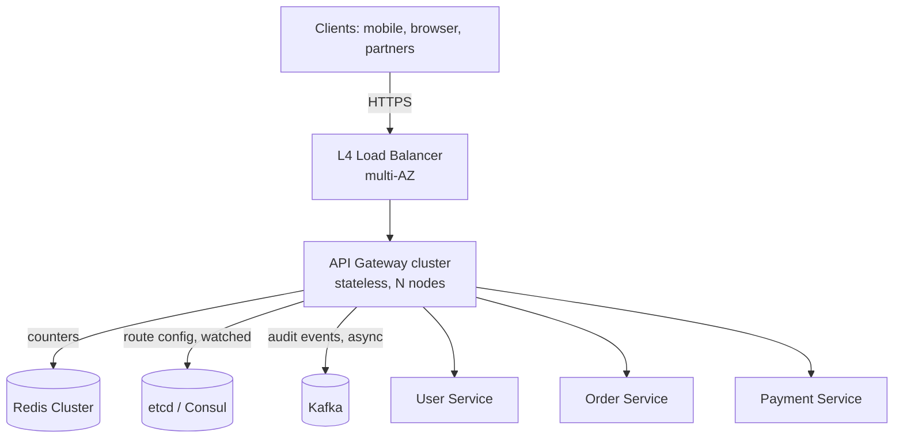

# Design an API Gateway {#ch-design-api-gateway}

> Build an edge that adds five milliseconds, scales to half a million requests a second, and never becomes the reason the platform is down.

**In this chapter:** requirements · the middleware pipeline · route config and hot reload · management API · scaling, failure and capacity

## How to Open This Answer

"I'll design a stateless API Gateway cluster that authenticates, rate-limits and routes every external request before it reaches a microservice. The hard parts are keeping per-request overhead under 5 ms, hot-reloading route config without dropping connections, and making sure a single slow upstream cannot take the whole edge down."

> Why a gateway at all, what belongs in it, gateway versus load balancer versus service mesh, and the BFF variant are the pattern, covered in [Chapter ?? — The API Gateway Pattern](#ch-api-gateway-pattern). The rate-limiting algorithms the pipeline calls into are in [Chapter ?? — Rate Limiting](#ch-rate-limiting). This chapter designs the system.

## Problem Statement

A microservice estate exposes dozens of internal services that clients must not call directly. The gateway centralises authentication, TLS termination, rate limiting and routing so each service stays focused on its domain. At scale the gateway itself must not become the bottleneck or the single point of failure — every external request passes through it, so its availability is the platform's availability.

## R — Requirements

### Functional (pick 4-5 that matter most)

- Route requests to the correct upstream by path and method
- Authenticate every request — JWT signature or API key
- Enforce per-client rate limits, per second and per day
- Terminate TLS; forward plain HTTP internally
- Transform requests and responses — add, strip and normalise headers

### Non-Functional (pick 3-4)

- Add ≤ 5 ms median latency per request
- 500k requests per second at peak
- 99.999% availability — the gateway failing means the platform is down
- Horizontally scalable with no shared state between instances

## A — Architecture

### High-Level Diagram



**Nothing on the request path requires coordination between gateway nodes.** JWT validation uses a cached public key, so there is no auth-service call. Route config is watched from etcd and held in memory. Only the rate-limit counter is genuinely shared, and that is one Redis round trip.

### The Middleware Pipeline

Every request passes through composable stages, in order. A failed stage short-circuits with a status code and the rest never run.

```text
1. TLS termination      → decrypt, forward plain HTTP internally
2. Auth                 → verify JWT signature with the cached public key      → 401
3. Rate limiter         → shared counter check                                  → 429
4. Request transformer  → strip client headers, inject verified identity
5. Router               → match path pattern → upstream URL
6. Circuit breaker      → per-upstream health state                             → 503
7. Proxy                → forward with an aggressive timeout                    → 504
8. Response transformer → add CORS, strip internal headers
9. Logger               → async audit event to Kafka
```

Two properties matter more than the list itself. **Order is a cost decision** — auth before rate limiting means an unauthenticated flood still costs a signature verification, so a cheap IP-keyed pre-check often sits ahead of stage 2. And **stage 9 is asynchronous**: an audit log write must never be on the latency path or in the failure path of a request.

### Route Config and Hot Reload

The route table is the gateway's only state, and it must change without a deploy.

```text
etcd watch fires
    ↓
Node validates the new config, then swaps the in-memory table atomically
    ↓
In-flight requests finish on the old table; new requests use the new one
```

**Validate before swapping, and never crash on a bad config.** A malformed route table pushed at 3 a.m. should be rejected with an alert, leaving the last-known-good table serving traffic.

## D — Data Model

```typescript
// Loaded from the config store, watched for changes
interface RouteConfig {
  id: string;
  pathPattern: string;          // "/orders/**"
  method: "GET" | "POST" | "PUT" | "DELETE" | "*";
  upstreamUrl: string;          // "http://order-svc:8080"
  stripPrefix?: string;         // remove "/orders" before forwarding
  requiredScope?: string;       // JWT scope needed for this route
  timeoutMs: number;            // per-route, not global
  canaryWeight?: number;        // 0–100, share sent to the canary upstream
  rateLimit?: RateLimitPolicy;
}

interface RateLimitPolicy {
  requestsPerSecond: number;
  requestsPerDay: number;
  keyStrategy: "ip" | "apiKey" | "userId";
}

// Written asynchronously to Kafka, one per request
interface GatewayRequestLog {
  requestId: string;            // generated here; every downstream log carries it
  clientId: string;
  path: string;
  method: string;
  upstreamService: string;
  statusCode: number;
  gatewayLatencyMs: number;
  upstreamLatencyMs: number;
  timestamp: string;
}
```

`timeoutMs` being per route rather than global is the detail worth stating. A report export legitimately takes eight seconds; a session lookup taking more than 200 ms is broken. One global timeout has to serve the slowest route and therefore protects nothing.

## I — Interface (APIs)

The gateway proxies everything; its own API is the control plane.

```typescript
// GET /gateway/routes — list active routes and the config version hash
interface ListRoutesResponse {
  routes: RouteConfig[];
  version: string;
}

// POST /gateway/routes — add or update a route (admin only)
interface UpsertRouteRequest {
  route: Omit<RouteConfig, "id">;
}
interface UpsertRouteResponse {
  id: string;
  appliedAt: string;
}

// GET /gateway/health — per-upstream, not a single boolean
interface GatewayHealthResponse {
  status: "ok" | "degraded";
  configVersion: string;
  upstreams: Array<{
    service: string;
    state: "open" | "half-open" | "closed";
    latencyP99Ms: number;
  }>;
}

// POST /gateway/circuit-breaker/reset — ops tool for a recovered upstream
interface CircuitBreakerResetRequest {
  upstreamService: string;
}
```

Exposing `configVersion` on the health endpoint is how you detect the worst kind of drift: nodes serving different route tables because one missed a watch event.

## O — Optimizations & Trade-offs

### Scaling Concerns

| Concern | Problem | Approach |
| ------- | ------- | -------- |
| Gateway as SPOF | All traffic flows through one cluster | Stateless nodes, active-active across 3 AZs, L4 load balancer in front |
| JWT validation cost | RSA signature verification on every request | Cache the public key; cache validated tokens by `jti` with TTL = token expiry. Never call an auth service per request |
| Rate-limit latency | Redis round trip adds 1–2 ms | Co-locate Redis in the same AZ; local L1 token bucket absorbs most checks |
| Slow upstream | Connections pile up and starve every other route | Per-route timeouts plus per-upstream circuit breakers at a 50% failure threshold |
| Config drift | A node misses a watch event and serves stale routes | Version hash on the health endpoint; alert when nodes disagree |
| Audit log volume | 500k events/s is a firehose | Async fire-and-forget to Kafka, sampled for successful 2xx, complete for errors |

**Per-upstream circuit breakers, never a global one.** A single global threshold means one failing service trips the breaker for all of them, which converts a partial outage into a total one.

### Capacity Estimation

| Metric | Estimate |
| ------ | -------- |
| Total request rate across all services | 500k rps |
| Gateway overhead per request | ~2 ms (Redis check plus routing) |
| Gateway nodes needed (at ~50k rps each) | 10, plus headroom for one AZ failing → 15 |
| Route table size | ~200 routes, a few KB per node |
| Config reload frequency | Event-driven, typically minutes apart |
| Audit throughput | ~500k events/s → Kafka, 6+ partitions |

State these to show the gateway is a thin, high-throughput layer. **The bottleneck is Redis or network, never CPU** — and the node count is set by the AZ-failure case, not the happy path.

## Common Follow-up Questions

**Q: How do you handle WebSocket or gRPC traffic?**

WebSockets need the connection to stay open, so those routes are L4 pass-through — the gateway cannot inspect frames after the upgrade, which means auth has to happen on the handshake and per-message limits move into the service. For gRPC, terminate TLS at the edge and proxy HTTP/2 to the upstream. Most managed gateways support both natively.

**Q: How do you do canary and blue/green deploys through the gateway?**

`canaryWeight` on the route: the router does weighted selection, so `canaryWeight: 5` sends 5% to the new upstream. Ramp while watching error rate and p99 for that route specifically, then flip to 100% and remove the old upstream. Because the weight lives in the config store, the whole rollout is a live change with no gateway deploy — which also means a rollback is one config write.

**Q: What if the config store goes down?**

Nodes keep serving from their in-memory copy of the last-known-good config. Alert, but do not crash and do not fail requests: availability over consistency for read traffic. The failure this protects against is worse than stale routes — a gateway fleet that restarts into an empty route table returns 404 for everything.

**Q: How do you prevent DDoS at this layer?**

Not here. A volumetric attack exhausts bandwidth before the pipeline runs, so that is a WAF and CDN job in front of the load balancer. What the gateway handles is application-layer abuse: IP-keyed limits for unauthenticated traffic, per-key quotas for authenticated traffic, and a global ceiling for load shedding.

**Q: How do you handle a request that needs data from three services?**

Not in the router. Either an aggregation service sitting behind the gateway that fans out and merges, or a GraphQL layer where the client specifies fields and resolvers fan out. Putting fan-out in the routing gateway means partial-failure handling and three upstream latencies land inside the component every request depends on.

**Q: A route's p99 has doubled. How do you tell whether it is the gateway or the upstream?**

The audit log carries `gatewayLatencyMs` and `upstreamLatencyMs` separately, and the request id it generates propagates to every downstream log. That split answers the question directly, which is the reason both fields exist rather than a single total — without it, every latency investigation starts with an argument about whose problem it is.
