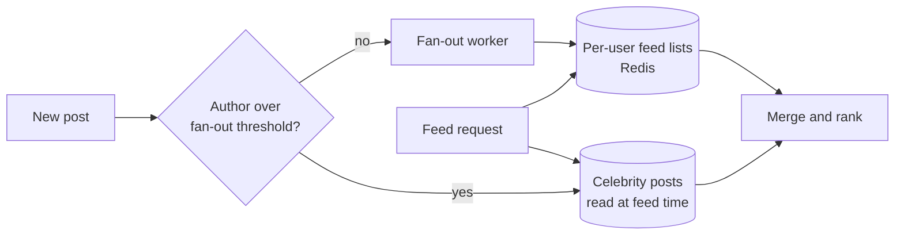

# Design a News Feed {#ch-design-news-feed}

> Choose where the feed is assembled — at write time or at read time — and handle the account with fifty million followers.

**In this chapter:** requirements and scale · fan-out on write versus on read · the hybrid · ranking · pagination that survives a moving list · the celebrity problem

## 💡 The Core Idea

A feed is a merge of many small write streams into one read stream, and the only real question is **when
the merge happens**. Do it when someone posts, and every reader's feed is pre-built and cheap to serve —
until one account has fifty million followers and a single post becomes fifty million writes. Do it when
someone opens the app, and posting is cheap — until every feed load has to merge and rank a thousand
timelines in under 200 ms.

Neither answer is right on its own. Recognising that, and proposing the hybrid, is the whole design.

> Fan-out is a choice about where to spend: writes are predictable and can be delayed, reads are
> user-facing and cannot.

## How It Works

### Requirements

**Functional:** post, follow, read a ranked feed of posts from people you follow, paginate backwards.

**Out of scope:** direct messages, stories, search, ads.

**Non-functional:** feed loads under 200 ms at p99, eventual consistency is fine — a post appearing a few
seconds late is invisible — and the read path must stay up even if the write path is degraded.

**Scale:** 100 million daily users, two posts each, so 200 million posts a day — about 2,000 writes a
second. Each user opens the feed 20 times a day, so 2 billion reads — about 20,000 a second average,
60,000 at peak. The average account has 200 followers; the largest has 50 million.

### The two strategies

| | Fan-out on write (push) | Fan-out on read (pull) |
| --- | ----------------------- | ---------------------- |
| On post | Append the post id to every follower's feed list | Store the post once |
| On read | Read one pre-built list | Fetch the timelines of everyone followed, merge, rank |
| Read latency | ~10 ms | 100–500 ms |
| Write cost | O(followers) | O(1) |
| Storage | A copy per follower | One copy |
| Breaks when | An account has millions of followers | A user follows thousands of accounts |

**Average account, 200 followers:** push writes 200 small entries and every one of its followers gets a
10 ms feed. That is clearly the right trade at 2,000 posts a second.

**Celebrity account, 50 million followers:** push writes 50 million entries for one post. At even a few
hundred such posts a day the fan-out queue never drains.

### The hybrid



**Push for ordinary accounts, pull for the few above the threshold, merged at read time.**

```typescript
const FANOUT_THRESHOLD = 100_000;

async function onPost(post: Post, followerCount: number, q: Queue): Promise<void> {
  if (followerCount < FANOUT_THRESHOLD) {
    await q.send({ type: "fanout", postId: post.id, authorId: post.authorId });
  }
  // Above the threshold: nothing to do. Readers will pull this post at feed time.
}

async function buildFeed(userId: string, feeds: FeedStore, celebs: CelebrityStore): Promise<Post[]> {
  const [pushed, pulled] = await Promise.all([
    feeds.range(userId, 0, 400),                 // pre-built, one read
    celebs.recentFrom(await followedCelebrities(userId)), // a handful of accounts
  ]);
  return rank([...pushed, ...pulled]).slice(0, 50);
}
```

The threshold is a tuning knob, not a constant: it moves with how much fan-out capacity you have.

### Storage

| Data                | Store                     | Why                                        |
| ------------------- | ------------------------- | ------------------------------------------ |
| Posts               | Wide-column, keyed by author with a time sort | Append-heavy, always read as a range |
| Feed lists          | Redis sorted set per user, capped at ~500 entries | Read on every app open |
| Follow graph        | Key-value, both directions | Fan-out needs followers, feed needs followees |
| Media               | Object storage plus a CDN | Never in the database                      |

Capping the feed list matters. Nobody scrolls past a few hundred items, and an uncapped list per user is
unbounded storage growth for data nobody reads.

### Ranking

Chronological is a defensible answer and a boring one. A simple ranked feed scores each candidate:

```typescript
interface Signals { affinity: number; type: number; ageHours: number }

// Recency decays; affinity and content type weight what survives the decay.
const score = (s: Signals): number => s.affinity * s.type * Math.pow(0.9, s.ageHours);
```

Ranking must happen on a **candidate set**, not the whole corpus: gather a few hundred recent posts,
score those, return the top fifty. Scoring everything is what makes naive ranked feeds slow.

### Pagination

Offset pagination breaks on a list that grows while the user reads it — new posts shift everything down
and page two repeats items from page one. Use a **cursor**: the id and score of the last item returned,
so the next page continues from a fixed point regardless of what arrived since.

### Failure and staleness

The read path must survive the write path. If the fan-out queue backs up, feeds go stale rather than
empty — which is why the pre-built list is a cache-like structure with a rebuild path, not the source of
truth. Posts themselves are stored once, authoritatively, and any user's feed can be recomputed from the
follow graph.

## When to Use It

The fan-out decision recurs anywhere one event has many interested readers: notifications, activity
streams, chat channel delivery, collaborative document presence.

| If the requirement adds…                | The design changes to…                                  |
| --------------------------------------- | -------------------------------------------------------- |
| Strictly chronological, no ranking       | Drop the scorer; the merge becomes a simple sorted merge |
| Feeds must be identical across devices   | Cursor state moves server-side                           |
| Follower counts are uniformly small      | Pure push; the hybrid is unnecessary complexity          |
| Every user follows thousands of accounts | Pull dominates, and the candidate set needs a cheaper source |

## Common Mistakes

**❌ Picking one fan-out strategy and defending it**

> "Fan-out on write, because reads are more frequent than writes."

True on average and wrong at the tail. Every real feed system is hybrid, and the interviewer is waiting
for the celebrity case.

**✅ Push with a threshold, pull above it**

> "Push under a hundred thousand followers, pull above, merged at read. The threshold is tuned to
> fan-out capacity."

**❌ Fan-out synchronously on the post request**

The user waits for 200 list writes before their post is accepted. Fan-out belongs on a queue; the post
itself is durable the moment it is written.

**❌ Offset pagination**

`LIMIT 50 OFFSET 100` on a list with new items arriving shows the user duplicates on every page.

## 🔑 Key Takeaways

- A feed design is a decision about when the merge happens: at write time, at read time, or both.
- Push suits ordinary accounts and pull suits the few with enormous followings; every real system is hybrid.
- Fan-out is asynchronous, and the pre-built feed list is a rebuildable projection rather than the source of truth.
- Rank a bounded candidate set, never the whole corpus.
- Cursor pagination is required on a list that grows while it is being read.

## Interview Questions

**Q: Push or pull?**

Both. Push for the vast majority of accounts, because reads outnumber writes a hundred to one and a
pre-built list makes the feed a single read. Pull for accounts above a follower threshold, because one
post from them would otherwise generate tens of millions of writes. The reader merges the two sources.

**Q: What happens when a user with 50 million followers posts?**

Nothing on the write path — the post is stored once and their followers pick it up at read time. Without
that exception, the fan-out queue receives 50 million jobs from a single request, and every other user's
feed update queues behind it.

**Q: How do you keep feed loads under 200 ms?**

The pre-built list is a single Redis read of a capped sorted set. The pull side touches only the handful
of large accounts a user follows. Ranking runs over a few hundred candidates, not the corpus. And the
media never travels through the API — the feed returns CDN URLs.

## What to Read Next

- [Chapter ?? — Queues and Asynchronous Work](#ch-message-queues) — the fan-out patterns generalised
- [Chapter ?? — Caching](#ch-caching) — what the pre-built feed list really is
- [Chapter ?? — Design a Chat System](#ch-design-chat-system) — the same delivery problem when latency is measured in milliseconds
