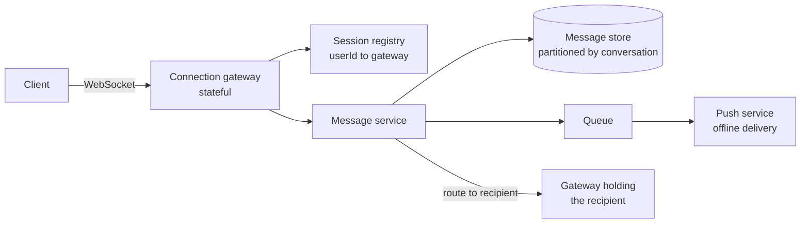

# Design a Chat System {#ch-design-chat-system}

> Hold millions of stateful connections, deliver a message once and in order, and make offline delivery a first-class path.

**In this chapter:** requirements and scale · the stateful-connection problem · message storage and ordering · delivery and read receipts · presence · group fan-out

## 💡 The Core Idea

Every other system in this part is stateless at the edge: a request arrives, any server answers it. Chat
is not. A user holds an open connection to **one specific server**, and a message for that user must
reach that server. Everything difficult about chat follows from that — routing between servers, what
happens when one dies, and how a message ordering that users trust survives a distributed system with no
global clock.

> The hard part is not sending a message. It is knowing which of ten thousand servers is holding the
> recipient's connection, and what to do when the answer is "none".

## How It Works

### Requirements

**Functional:** one-to-one and group messages, delivery and read receipts, online presence, message
history, offline delivery.

**Out of scope:** voice and video, end-to-end encryption key management, file transfer beyond an
attachment URL.

**Non-functional:** message delivery under 200 ms for online users, messages must never be lost or shown
out of order within a conversation, and history must survive indefinitely.

**Scale:** 50 million daily users, 40 messages each — 2 billion a day, roughly 25,000 messages a second
and 75,000 at peak. Ten million concurrent connections. At 200 bytes a message that is 400 GB a day.

### Architecture



**The session registry is what turns a user id into the one server that can reach them.**

Gateways are thin: they own connections, heartbeats and nothing else. Business logic lives behind them,
so a gateway can be restarted without losing anything but the connections, which clients re-establish.

### The stateful connection problem

Ten million concurrent connections at roughly 100,000 per server is about 100 gateway servers. Three
consequences to name:

| Problem                                    | Answer                                                    |
| ------------------------------------------ | --------------------------------------------------------- |
| Which gateway holds a user?                 | A session registry in Redis: `userId → gatewayId`, with a TTL refreshed by heartbeat |
| A gateway dies                              | Its registry entries expire; clients reconnect with backoff and jitter to another gateway |
| Load balancing across gateways              | Least-connections, not round-robin — connections are long-lived, so request counts mean nothing |

> ⚠️ A thundering-herd reconnect is the classic chat outage. When a gateway holding 100,000 connections
> dies, all of them reconnect at once. Backoff with jitter on the client, and connection rate limits on
> the gateway, are not optional.

### Message storage and ordering

```typescript
interface Message {
  conversationId: string; // partition key — a conversation lives on one shard
  messageId: string;      // Snowflake: time-ordered, generated without coordination
  senderId: string;
  body: string;
  sentAt: number;
  clientMessageId: string; // client-generated, for deduplicating retries
}
```

Partitioning by conversation is what makes ordering tractable: all writes for a conversation land on one
shard, so a time-sortable id gives a total order within it that everyone agrees on. There is no global
order across conversations, and none is needed — users only ever perceive order inside a thread.

The `clientMessageId` is what makes send idempotent. A client that retries after a timeout sends the same
id, and the server returns the original message rather than creating a duplicate.

### Delivery

| Recipient state       | Path                                                             |
| --------------------- | ---------------------------------------------------------------- |
| Online, same gateway  | Written to the store, pushed straight down the socket             |
| Online, other gateway | Routed via the session registry to that gateway, then pushed      |
| Offline               | Stored, and a push notification queued; delivered on reconnect    |

The client drives recovery on reconnect: it sends the last message id it holds per conversation and the
server returns everything after it. That single mechanism covers a dropped connection, a backgrounded
app and a two-week absence.

Receipts are three states — **sent** (the server has it), **delivered** (the recipient's device has it),
**read** (the recipient opened it) — and each is a small write. In a large group, per-user read receipts
are a write amplification problem, which is why group chats usually show a count rather than a list.

### Presence

Presence is the highest-volume, lowest-value data in the system, and treating it like messages is a
common design error.

| Decision                | Choice                                              |
| ----------------------- | --------------------------------------------------- |
| Storage                 | Redis with a TTL, refreshed by heartbeat — never the durable store |
| Update frequency        | Every 30 seconds, not on every event                |
| Who gets told           | Only users with the conversation open, not every contact |
| On failure              | Show stale or unknown; presence is never worth an outage |

Broadcasting every presence change to every contact of every user is an O(users × contacts) firehose that
will dwarf actual message traffic.

### Group messages

A group message is fan-out again. Under a few hundred members, push to each member's gateway directly.
Above that, the write amplification and the receipt traffic both grow linearly, so large groups become
channels: members pull recent history on open and subscribe to a topic rather than receiving individual
deliveries.

## When to Use It

This design — stateful edge, session registry, per-conversation ordering, offline queue — is the shape of
any low-latency bidirectional system: collaborative editing, multiplayer state sync, live support,
trading notifications.

| If the requirement adds…              | The design changes to…                                    |
| ------------------------------------- | ---------------------------------------------------------- |
| End-to-end encryption                  | The server stores ciphertext and cannot rank, search or preview |
| Global total ordering                  | A consensus-backed sequencer, and a large latency cost      |
| Mostly one-way updates                 | Server-sent events, which drop half the connection complexity |
| Users rarely online at once            | Push notifications become the primary path, sockets the exception |

## Common Mistakes

**❌ Treating the chat gateway as stateless**

> Putting gateways behind a round-robin load balancer with no session registry.

A message for a user then reaches a server with no connection to them, and delivery silently fails.

**✅ A session registry with heartbeat TTLs**

> `userId → gatewayId` in Redis, refreshed every 30 seconds and expiring when the gateway stops
> heartbeating.

**❌ Relying on client timestamps for ordering**

Device clocks are wrong by seconds or hours. Order by a server-assigned, time-sortable id within a
conversation.

**❌ No deduplication on send**

A retried send after a timeout posts the same message twice, and the user sees it. A client-generated
message id makes send idempotent.

## 🔑 Key Takeaways

- Chat is stateful at the edge, so a session registry mapping users to gateways is the core component.
- Partition messages by conversation, and order within a conversation with a time-sortable server-side id — no global order is needed.
- A client-generated message id makes sending idempotent, which is what makes retries safe.
- Offline delivery is a first-class path: reconnect with the last known message id and receive everything since.
- Presence is high-volume, low-value data that belongs in an expiring cache and should never cause an outage.

## Interview Questions

**Q: A user is connected to gateway 7 and their friend to gateway 42. How does the message get across?**

The message service looks the recipient up in the session registry, finds gateway 42, and routes the
message there — either directly or through a pub/sub topic per gateway. The registry entry has a TTL
refreshed by the gateway's heartbeat, so a dead gateway's entries expire rather than pointing at nothing.

**Q: A gateway holding 100,000 connections crashes. What happens?**

Its registry entries expire, so routing stops targeting it within the TTL. All 100,000 clients detect the
drop and reconnect — which is the real danger, because they will do it simultaneously. Exponential
backoff with jitter on the client and a connection rate limit on the gateways are what prevent the
recovery from taking down a second gateway.

**Q: When would you not use WebSockets here?**

When traffic is mostly server-to-client and the client rarely sends — server-sent events give the same
push with far less connection machinery and work through more proxies. And on mobile, where the OS
suspends background sockets anyway, push notifications are the actual delivery mechanism and the socket
only matters while the app is in the foreground.

## What to Read Next

- [Chapter ?? — Real-Time Communication](#ch-realtime-communication) — the transport choice and the topology cost
- [Chapter ?? — Sharding](#ch-sharding) — why conversation id is the shard key here
- [Chapter ?? — Design a News Feed](#ch-design-news-feed) — the same fan-out question with a hundred times more latency budget
