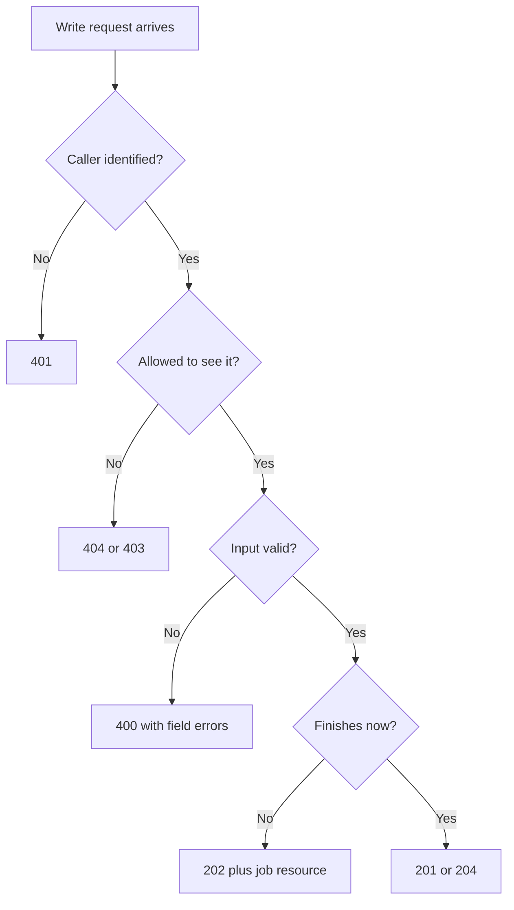

# REST API Best Practices {#ch-rest-best-practices}

> Design an HTTP API another engineer can guess correctly before reading the docs, and defend every choice in it.

**In this chapter:** resource URLs · methods and idempotency · status codes · one error shape · pagination that survives scale

## 💡 The Core Idea

REST is not a specification you can fail a compliance test against. It is a set of conventions built on
top of HTTP. The payoff is predictability: when the conventions hold, a client can guess how a route
behaves without opening the documentation. Interviewers use REST design as a proxy for something bigger —
can you model a domain, and do you understand HTTP well enough to stop reinventing it?

> The URL names a **thing**. The method says what you are **doing to it**. `POST /users/123/deactivate`
> is a red flag. `PATCH /users/123` with `{ "status": "inactive" }` is the same work, expressed in HTTP.

## How It Works

### Resource-oriented URLs

| Rule                        | ❌ Bad                           | ✅ Good                      |
| --------------------------- | -------------------------------- | ---------------------------- |
| Nouns, not verbs            | `/getUsers`, `/createUser`       | `GET /users`, `POST /users`  |
| Plural collections          | `/user/123`                      | `/users/123`                 |
| Lowercase with hyphens      | `/orderItems`, `/order_items`    | `/order-items`               |
| Nest only to show ownership | `/users/1/orders/9/items/4/tax`  | `/order-items/4`             |
| No file extensions          | `/users.json`                    | `/users` + `Accept` header   |

Stop nesting at two levels. `/users/123/orders` is useful — it means "orders belonging to this user".
Deeper than that, the child has its own identity, so give it a top-level route.

Actions that are not CRUD still model as resources most of the time. A password reset is a request
(`POST /users/123/password-resets`), a refund is a record (`POST /orders/9/refunds`), and a slow export is
a job (`POST /reports`, returning `202`).

> ⚠️ Do not twist a whole design to avoid one pragmatic RPC-style route. One `POST /cache:purge` beats a
> fake resource nobody understands. Just be ready to explain the choice.

### Methods and idempotency

| Method   | Purpose                        | Safe | Idempotent | Body |
| -------- | ------------------------------ | ---- | ---------- | ---- |
| `GET`    | Read                           | ✅   | ✅         | ❌   |
| `POST`   | Create / non-idempotent action | ❌   | ❌         | ✅   |
| `PUT`    | Replace whole resource         | ❌   | ✅         | ✅   |
| `PATCH`  | Partial update                 | ❌   | ❌ usually | ✅   |
| `DELETE` | Remove                         | ❌   | ✅         | ❌   |

**Safe** means no state change — a crawler can call it freely. **Idempotent** means calling it five times
leaves the same state as calling it once. That property is what makes a retry safe.

**`PUT` replaces, `PATCH` merges:**

```typescript
interface User { id: string; name: string; email: string; phone?: string }

// PUT /users/123  { "name": "Ada", "email": "ada@x.com" }  → phone is cleared
async function replaceUser(id: string, body: Omit<User, "id">): Promise<User> {
  return db.users.replaceOne({ id }, { id, ...body });
}

// PATCH /users/123  { "name": "Ada" }  → email and phone untouched
async function updateUser(id: string, patch: Partial<Omit<User, "id">>): Promise<User> {
  return db.users.updateOne({ id }, { $set: patch });
}
```

A patch of `{ "views": "+1" }` gives a different result on every call, which is why the specification
cannot promise `PATCH` is idempotent. A plain `$set` patch is idempotent in practice. Say both things.

### Status codes

You need about a dozen, not sixty.

| Code | Meaning               | Use it when                                              |
| ---- | --------------------- | -------------------------------------------------------- |
| 200  | OK                    | `GET`, `PUT`, `PATCH` succeeded with a body               |
| 201  | Created               | `POST` created something — add a `Location` header        |
| 202  | Accepted              | Queued for async work; nothing exists yet                 |
| 204  | No Content            | `DELETE` succeeded, or a write with nothing to return     |
| 400  | Bad Request           | Malformed request or failed validation                    |
| 401  | Unauthorized          | Missing or invalid credentials — really *unauthenticated* |
| 403  | Forbidden             | Authenticated, but not allowed                            |
| 404  | Not Found             | No such resource — also hides existence from a 403 case   |
| 409  | Conflict              | Duplicate email, version mismatch, illegal state change   |
| 429  | Too Many Requests     | Rate limited — add `Retry-After`                          |
| 500  | Internal Server Error | Your bug. Never leak the stack trace                      |
| 503  | Service Unavailable   | Dependency down, or shedding load                         |



**How a write request resolves to a status code.**

## When to Use It

| Scenario                                        | Choose            | Why                                                            |
| ----------------------------------------------- | ----------------- | -------------------------------------------------------------- |
| Public API, many unknown clients                | REST              | Cacheable by default, and every HTTP tool already understands it |
| One frontend that needs varied, nested data     | GraphQL           | The client picks the shape, so round trips collapse             |
| Internal service-to-service calls, typed both ends | gRPC or tRPC    | Contract generated from types; HTTP semantics add little        |
| Server pushes to the client                     | WebSocket or SSE  | REST has no way to send without being asked                     |

Most products end up with REST at the edge and something else behind it. Saying that beats defending
REST for everything.

## Error Responses

Use one shape everywhere and make it machine-readable.
[RFC 9457 Problem Details](https://www.rfc-editor.org/rfc/rfc9457.html) is the standard worth naming.

```typescript
interface FieldError {
  field: string;
  code: string;    // machine-readable: "too_short", not "must be longer"
  message: string;
}

interface ProblemDetails {
  type: string;      // stable URI identifying the error class
  title: string;     // short human summary
  status: number;    // matches the HTTP status
  detail?: string;   // about this one occurrence
  instance?: string; // the request path
  errors?: FieldError[];
  traceId?: string;  // ties the response to your logs
}
```

Build that shape in one place. `AppError` here is a small `Error` subclass carrying `status`, `type` and
optional `errors`; everything a route throws either is one or is a bug.

```typescript
import type { ErrorRequestHandler } from "express";

export const errorHandler: ErrorRequestHandler = (err, req, res, _next) => {
  const known = err instanceof AppError;
  const status = known ? err.status : 500;

  // Log the real error server-side; return a safe one to the client.
  if (!known || status >= 500) req.log.error({ err, traceId: req.id });

  const body: ProblemDetails = {
    type: known ? err.type : "about:blank",
    title: known ? err.message : "Internal Server Error",
    status,
    instance: req.originalUrl,
    errors: known ? err.errors : undefined,
    traceId: req.id, // ✅ the most useful field in any support ticket
  };

  res.status(status).json(body);
};
```

Return **all** validation errors at once. A form that surfaces one bad field per round trip is a bad API,
not a bad frontend.

## Pagination

| Strategy                               | How it works                   | Use when                                             |
| -------------------------------------- | ------------------------------ | ---------------------------------------------------- |
| **Offset** `?page=3&limit=20`          | `OFFSET 40 LIMIT 20`           | Small datasets, admin screens that need page numbers |
| **Cursor** `?cursor=<opaque>&limit=20` | `WHERE (createdAt, id) < (…)`  | Feeds, infinite scroll, large or fast-moving data    |

Offset is the common choice and the wrong one at scale. `OFFSET 1000000` still makes the database walk
and throw away a million rows. Worse, if a row is inserted while the user pages, everything shifts — they
see item 20 twice and never see item 21. Keyset pagination fixes both:

```typescript
interface Page<T> { data: T[]; nextCursor: string | null }

// Encode the full sort key, not just the id — ties must break deterministically.
const encode = (o: Order): string =>
  Buffer.from(`${o.createdAt.toISOString()}|${o.id}`).toString("base64url");

async function listOrders(cursor: string | undefined, limit = 20): Promise<Page<Order>> {
  const capped = Math.min(limit, 100); // ✅ always cap a client-supplied limit
  let where: object = {};

  if (cursor) {
    const [createdAt, id] = Buffer.from(cursor, "base64url").toString().split("|");
    // Keyset predicate: strictly "after" the last row of the previous page.
    where = { $or: [{ createdAt: { $lt: createdAt } }, { createdAt, id: { $lt: id } }] };
  }

  // Fetch one extra row to learn whether a next page exists — no COUNT(*) needed.
  const rows: Order[] = await db.orders.find(where)
    .sort({ createdAt: -1, id: -1 }).limit(capped + 1).toArray();

  const data = rows.slice(0, capped);
  return { data, nextCursor: rows.length > capped ? encode(data[data.length - 1]) : null };
}
```

> ⚠️ A cursor is opaque. Clients must not parse it. Base64 is encoding, not security — sign it if it
> exposes anything sensitive.

State the tradeoff out loud: cursors give up random access. You cannot jump to page 50, and a total count
needs a separate, often approximate, query. That is the right trade for a feed and the wrong one for a
paginated report.

## Idempotent Writes

`POST /payments` is not idempotent, but the network will still time out and the client will still retry.
Without protection the customer is charged twice.

```typescript
import type { RequestHandler } from "express";

export const idempotency: RequestHandler = async (req, res, next) => {
  const key = req.header("Idempotency-Key");
  if (!key) return next();

  // SET NX — only the first request for this key claims the slot.
  const claimed = await redis.set(`idem:${key}`, "in-flight", { NX: true, EX: 86_400 });

  if (!claimed) {
    const stored = await redis.get(`idem:${key}`);
    if (stored === "in-flight") {
      return res.status(409).json({ title: "Request already in progress" });
    }
    return res.status(200).json(JSON.parse(stored!)); // replay the first response
  }

  res.on("finish", async () => {
    if (res.statusCode < 400) {
      await redis.set(`idem:${key}`, JSON.stringify(res.locals.body), { EX: 86_400 });
    } else {
      await redis.del(`idem:${key}`); // a failure should be retryable
    }
  });

  next();
};
```

Stripe's API works this way. Naming the pattern is a strong senior signal.

## Common Mistakes

**❌ Wrong — an error dressed as a success:**

```typescript
// Every cache, proxy, HTTP client and error dashboard now believes this succeeded.
res.status(200).json({ success: false, error: "user not found" });
```

**✅ Right — let the status code carry the outcome:**

```typescript
res.status(404).json({ type: "https://errors.example.com/not-found", title: "User not found", status: 404 });
```

Retries and circuit breakers read the status line, not your body. A `200` on failure blinds all of them.

**❌ Wrong — user input straight into a sort clause:**

```typescript
const sort = { [req.query.sort as string]: -1 }; // injection, and a full table scan
```

**✅ Right — allowlist the sortable columns:**

```typescript
const SORTABLE = new Set(["createdAt", "total", "status"]);

function parseSort(raw = "-createdAt"): Record<string, 1 | -1> {
  const desc = raw.startsWith("-");
  const field = desc ? raw.slice(1) : raw;
  return SORTABLE.has(field) ? { [field]: desc ? -1 : 1 } : { createdAt: -1 };
}
```

The same rule covers filtering and sparse field selection: `?fields=id,total` and `?status=shipped` shape
a collection, they never identify one row, and every accepted key comes from a list you control.

> ⚠️ Authorisation must check the **object**, not just the route. `GET /orders/9` has to verify that
> order 9 belongs to the caller. A route guard alone lets any authenticated user read every order.

## 🔑 Key Takeaways

- The URL names a resource and the method names the action; a verb in the path means the design slipped.
- Idempotency decides whether a client, proxy or load balancer may safely retry after a timeout.
- One error shape everywhere, carrying a `traceId` and every failed field, costs nothing and saves hours.
- Cursor pagination is the only strategy that survives large tables and concurrent inserts.
- A `200` response with `success: false` breaks every cache, retry and dashboard that reads HTTP.

## Interview Questions

**Q: What makes an API RESTful?**

Resources identified by URLs, manipulated with standard HTTP methods, stateless requests, and responses
that are explicit about caching. In practice "RESTful" means using HTTP as designed instead of tunnelling
RPC through `POST`. Strict REST also requires HATEOAS — hypermedia links in responses — which almost
nobody implements, and it is worth saying so.

**Q: `PUT` or `PATCH`?**

`PUT` replaces the whole resource, so omitted fields get cleared. `PATCH` merges a partial change. A
settings form that submits every field can honestly use `PUT`. A "change email" action should use `PATCH`,
so it cannot clobber fields the client never loaded.

**Q: Which methods are idempotent, and why does it matter?**

`GET`, `PUT`, `DELETE`, `HEAD` and `OPTIONS`. It matters because it decides whether a retry after a
timeout is safe. `POST` is not idempotent, so for anything that moves money I accept an `Idempotency-Key`
header and deduplicate server-side.

**Q: How do you paginate ten million rows?**

Keyset pagination. `OFFSET` degrades linearly because the database still scans the skipped rows, and
concurrent inserts cause duplicates and gaps. I encode the last row's sort key plus its id into an opaque
cursor, filter with a `WHERE (sortKey, id) < (…)` predicate, and fetch `limit + 1` rows to detect the next
page without a `COUNT(*)`.

**Q: When would you not build a REST API?**

When the client needs deeply nested, highly variable data, REST forces either over-fetching or a waterfall
of round trips — GraphQL earns its complexity there. When both ends are internal and typed, a generated
contract beats hand-written routes. And when the server must push, REST has no answer at all. The cost of
leaving REST is losing HTTP caching and universal tooling, so I would name what replaces them.

## What to Read Next

- [Chapter ?? — GraphQL](#ch-graphql) — what you gain and lose when the client picks the response shape
- [Chapter ?? — API Versioning](#ch-versioning) — how to change a contract other people depend on
- [Chapter ?? — Rate Limiting](#ch-rate-limiting) — the `429` path, and how to make limits predictable
