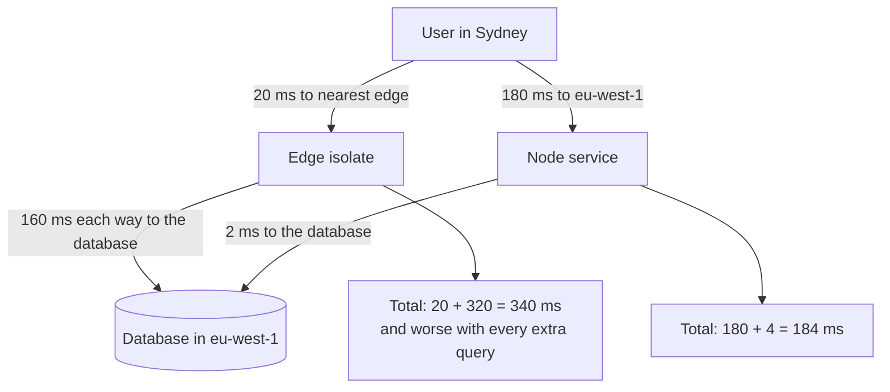

# Edge Runtimes and Hono {#ch-edge-runtimes}

> Say precisely which Node APIs an edge runtime removes, why that changes the code, and when moving a service there is actually a win.

**In this chapter:** what an edge runtime is and is not · the APIs you lose · a Hono service · where the latency actually goes · when to stay on Node

## 💡 The Core Idea

An edge runtime runs your code in **many locations, in a lightweight isolate, against Web-standard
APIs instead of Node's**. Three properties follow from that, and each one is a constraint before it is
a feature.

| Property | Consequence |
| -------- | ----------- |
| Isolates, not processes | Startup is around a millisecond, so there is no meaningful cold start |
| Web APIs only | No `fs`, no `net`, no raw TCP, so no traditional database driver |
| Deployed to many regions | Close to the user, and therefore **far from your database** |

The third is the one that decides most real cases. Moving a handler to the edge shortens the hop from
the user to your code and lengthens the hop from your code to your data. If the handler makes three
sequential database calls, you have made the request slower by moving it closer.

## How It Works

### The runtime is `fetch`, not `http`

A Node handler receives Node's `IncomingMessage`. An edge handler receives a Web `Request` and returns
a Web `Response` — the same objects the browser's `fetch` uses. That single change is why edge code
looks different.

| Node | Edge | Note |
| ---- | ---- | ---- |
| `require`/`fs`/`path` | Not available | Bundle assets; read nothing from disk |
| `Buffer` | `Uint8Array`, `TextEncoder` | `Buffer` is Node-only |
| `crypto` module | `crypto.subtle` | Async, and a smaller algorithm set |
| `pg`, `mysql2` — TCP drivers | HTTP-based database client | The single biggest porting blocker |
| `process.env` at runtime | Bindings passed into the handler | Environment is per-request, not global |

The last row catches people. On Node, `process.env.DATABASE_URL` is readable from any module at import
time. In a worker, configuration arrives as an argument, so a module that reads config at import time
has nothing to read.

### A Hono service

Hono is a router over those Web-standard objects. It is the framework of choice here because the same
source runs on Cloudflare Workers, Deno, Bun and Node — the adapter is the only thing that changes.

```typescript
import { Hono } from "hono";
import { cors } from "hono/cors";

// Bindings are typed, so the handler cannot reach for config that is not configured.
type Env = {
  Bindings: {
    DATABASE_URL: string;
    CACHE: KVNamespace;
  };
};

const app = new Hono<Env>();

app.use("/api/*", cors({ origin: "https://app.example.com", credentials: true }));

app.get("/api/orders/:id", async (c) => {
  const cached = await c.env.CACHE.get(`order:${c.req.param("id")}`);
  if (cached) return c.json(JSON.parse(cached) as Order);

  // c.env, not process.env — configuration is per-request in an isolate.
  const order = await fetchOrder(c.env.DATABASE_URL, c.req.param("id"));
  return c.json(order);
});

export default app;
```

`c` is the context: request, response helpers, bindings and per-request state in one object. There is
no mutable `req`/`res` pair, because a `Request` is immutable — which removes a whole category of
Express bug where two middlewares fight over the same field.

### The typed client is the reason to pick Hono over a bare router

Chaining the route definitions makes the app's type describe the whole API, and `hc` turns that type
into a client. No code generation, no schema file.

```typescript
// server.ts — the chain matters: each .get() returns a new type carrying the route
const routes = app
  .get("/orders/:id", (c) => c.json({ id: c.req.param("id"), total: 0 }))
  .post("/orders", (c) => c.json({ id: "new" }, 201));

export type AppType = typeof routes;
```

```typescript
// client.ts — in the frontend
import { hc } from "hono/client";
import type { AppType } from "./server";

const client = hc<AppType>("/api");
const res = await client.orders[":id"].$get({ param: { id: "42" } });
const order = await res.json(); // typed from the handler's return
```

That is the same end-to-end guarantee as [Chapter ?? — tRPC and Typed APIs](#ch-trpc), reached over
plain HTTP rather than over a procedure abstraction — so the endpoints stay callable by `curl` and by
clients that are not TypeScript.

> ⚠️ **Moving target:** edge runtimes are the least stable target in this part of the book. Cloudflare
> added a Node compatibility mode, Vercel's edge and Node functions have converged, and Deno and Bun
> both implement moving subsets of Node. The durable principle is the one in the table above: **Web
> `Request`/`Response` in, no filesystem, no raw TCP, config as an argument.** Verify the current
> compatibility list before planning a port.

### Where the latency actually goes

The honest version of the edge pitch, for one request that reads from a database:



**The same handler, two placements: proximity to the user against proximity to the data.**

So the edge wins when a request either needs no origin data at all, or needs exactly one round trip.
Auth checks on a token, redirects, personalisation from a cookie, geolocation, A/B assignment,
streaming a response from a model provider — all of these fit. A dashboard that runs six queries does
not, unless the data is replicated to the edge too.

## When to Use It

| Situation | Choose | Why |
| --------- | ------ | --- |
| Auth, redirects, header rewriting, A/B assignment | Edge | Zero or one data dependency, and the win is user latency |
| Streaming a model response to the browser | Edge | Time to first token dominates, and the isolate holds the stream open cheaply |
| Read-heavy API with data replicated globally | Edge | Both hops are short |
| Several sequential queries against one regional database | Node, in the database's region | Each hop is paid at edge-to-origin latency |
| Long CPU work, image processing, big in-memory caches | Node | Isolates cap CPU time and memory hard |
| Anything needing a TCP database driver | Node | Or an HTTP database proxy, which adds its own hop |

## Common Mistakes

❌ **Porting a Node service unchanged and expecting it to work.** `fs`, `Buffer` and the database
driver all fail, usually at deploy time rather than in development.
✅ Audit imports against the runtime's API list before committing to the port.

❌ **Reading configuration at module scope.** In an isolate, config arrives per request, so
`const url = process.env.DATABASE_URL` at the top of a file reads `undefined`.
✅ Pass bindings through the handler context and type them.

❌ **Assuming in-memory state persists.** An isolate can be recycled between any two requests, and
there are many of them, so a module-level `Map` is neither shared nor durable.
✅ Use the platform's key-value or durable store for anything that must outlive a request.

❌ **Moving a database-heavy endpoint to the edge for "speed".** Every query now pays the
edge-to-origin round trip.
✅ Measure the data hops first; move the endpoint only when there are zero or one.

❌ **Treating the edge as a different deployment of the same service.** Two runtimes means two sets of
compatibility constraints for one codebase.
✅ Split deliberately: edge for the request-shaping layer, Node for the data layer.

## 🔑 Key Takeaways

- An edge runtime is an isolate with Web-standard APIs — no filesystem, no raw TCP, and configuration passed in per request.
- Moving code to the edge shortens the user hop and lengthens the data hop; count the data hops before moving anything.
- Hono runs one source across Workers, Deno, Bun and Node because it targets `Request` and `Response` rather than Node's `http`.
- Chaining Hono routes lets `hc` derive a typed client from the server's own type, with no code generation.
- The strongest edge cases are auth, redirects, personalisation and streaming — work with zero or one origin round trip.

## Interview Questions

**Q: Why can't you use `pg` in a Cloudflare Worker?**

Because `pg` speaks the PostgreSQL wire protocol over a raw TCP socket, and an isolate has no TCP
socket API — it has `fetch`. The options are an HTTP-based driver that the provider proxies to the
database, a connection-pooling proxy that exposes HTTP, or keeping the data layer on Node. All three
add a hop, which is the cost worth naming in the answer.

**Q: You move an API route to the edge and it gets slower. Why?**

Almost always because the handler talks to a regional database. The user-to-code hop got shorter and
every code-to-data hop got much longer, so any endpoint with more than one query loses. The fix is to
split: keep request shaping at the edge and run the data-heavy handler in the database's region.

**Q: What actually makes an isolate's cold start so much cheaper than a container's?**

There is no per-request process or container to start. The runtime is already resident and the isolate
is a fresh JavaScript context inside it, so startup is roughly the cost of evaluating your bundle. The
trade is the sandbox that makes it safe to share a process: no filesystem, no native modules, and hard
caps on CPU and memory.

**Q: When would you keep a service on Node instead?**

When it needs a TCP database driver, does real CPU work, keeps a large in-memory cache, or runs long
enough to hit the isolate's CPU limit. Also when the team already operates Node well — an edge
deployment adds a second runtime's constraints to the same codebase, and that cost is easy to
understate.

## What to Read Next

- [Chapter ?? — tRPC and Typed APIs](#ch-trpc) — the other route to an end-to-end typed contract
- [Chapter ?? — Middleware and the Edge](#ch-nextjs-middleware-and-the-edge) — the same runtime inside a Next.js app
- [Chapter ?? — Serverless and Functions](#ch-serverless-functions) — how this compares with a regional function
