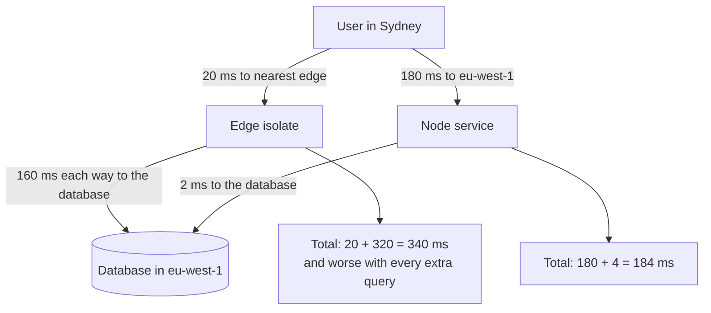

# Express, Hono and Edge Runtimes {#ch-express}

> Choose between a long-lived Node server and a Web-standard handler on the edge, and explain what each one costs you.

**In this chapter:** Express as an ordered pipeline · what Express 5 changed · Hono over `Request` and `Response` · what an edge runtime removes · where the latency actually goes

## 💡 The Core Idea

There are two ways to shape a JavaScript server today. **Express** is a long-lived Node process. It runs
a list of functions, in order, against one mutable `req` and `res`. **Hono** is a function from a Web
`Request` to a Web `Response`. Those are the same objects the browser's `fetch` uses, so Hono runs on
Node and also on edge runtimes such as Cloudflare Workers.

The framework is the small part of the decision. The large part is **where the code runs**. An edge
runtime puts your code close to the user, and therefore far from your database. A handler that makes
three database calls gets slower when you move it closer to the user. The number of data round trips
decides it, not the framework.

## How It Works

### Express is a list, and order is the configuration

`app.use` pushes a function onto a list. A request walks the list from the top until something responds
or the list runs out. There is no container and no lifecycle, so Express hides nothing.

**A pipeline in registration order:**

```typescript
import express, { type Request, type Response, type NextFunction } from "express";

const app = express();

app.use(express.json({ limit: "100kb" })); // 1. parse the body before any route needs it
app.use(requestId); // 2. attach an id used by every log line below
app.use("/api", authenticate); // 3. path-scoped: /api only
app.use("/api/orders", ordersRouter); // 4. a Router is a mountable pipeline
app.use(notFound); // 5. nothing matched
app.use(errorHandler); // 6. four arguments: the error pipeline
```

Most Express bugs are order bugs. Put the body parser after the routes and `req.body` is `undefined`.
Put auth after a route and the route has already run.

A `Router` is Express's only composition tool. Mount it with the prefix and keep the prefix out of it.

### Typing handlers and errors

`Request` is generic over params, response body, request body and query. Name them once.

**A typed handler that throws instead of formatting errors:**

```typescript
interface OrderParams {
  id: string;
}

async function getOrder(req: Request<OrderParams, Order>, res: Response<Order>): Promise<void> {
  const order = await orders.find(req.params.id); // string, not any
  if (!order) throw new NotFoundError("order", req.params.id);
  res.json(order);
}

// Exactly four parameters, or Express treats it as ordinary middleware.
function errorHandler(err: unknown, req: Request, res: Response, next: NextFunction): void {
  const status = err instanceof HttpError ? err.status : 500;
  req.log.error({ err, requestId: req.id }, "request failed");
  res.status(status).json({
    error: status === 500 ? "Internal Server Error" : (err as HttpError).message,
  });
}
```

Handlers decide *what* went wrong. The one error handler decides the status code and the body.

> ⚠️ **Moving target:** Express 5 shipped in 2024 after a decade of 4.x, and most tutorials are still
> 4.x. The durable principle is that Express is a middleware list. The two changes below are the ones
> that break real code on upgrade.

| Change in Express 5 | Consequence |
| ------------------- | ----------- |
| A rejected promise from a handler is forwarded to `next()` | `asyncHandler` wrappers and `.catch(next)` are no longer needed |
| Wildcards must be named: `'/*splat'` replaces `'*'` | `app.all('*')` throws on boot, so catch-all routes need rewriting |

The first matters most. In Express 4, an `async` handler that threw left the request hanging. Express
also gives you no validation and no observability, so every project adds its own.

### Hono: the same routes over `Request` and `Response`

Hono is a router over Web-standard objects. One source runs on Workers, Deno, Bun and Node.

**A Hono service with typed bindings:**

```typescript
import { Hono } from "hono";

// Bindings are typed, so a handler cannot reach for config that does not exist.
type Env = {
  Bindings: {
    DATABASE_URL: string;
  };
};

const app = new Hono<Env>();

app.get("/api/orders/:id", async (c) => {
  // c.env, not process.env: in an isolate, config arrives per request.
  const order = await fetchOrder(c.env.DATABASE_URL, c.req.param("id"));
  return c.json(order);
});

export default app;
```

`c` is the context: request, response helpers, bindings and per-request state. There is no mutable
`req` and `res` pair, and the handler *returns* its response, so two middlewares cannot fight over a field.

**Chain the routes, and `hc` derives a typed client from the server's type:**

```typescript
// server.ts: each .get() returns a new type that carries the route
const routes = app.get("/orders/:id", (c) => c.json({ id: c.req.param("id"), total: 0 }));
export type AppType = typeof routes;

// client.ts, in the frontend: full types and no code generation
import { hc } from "hono/client";
const client = hc<AppType>("/api");
const res = await client.orders[":id"].$get({ param: { id: "42" } });
const order = await res.json(); // typed from the handler's return
```

That is the same guarantee as [Chapter ?? — GraphQL, tRPC and Typed API Choices](#ch-graphql), but over plain HTTP. The
endpoints stay callable by `curl` and by clients that are not TypeScript.

### What an edge runtime takes away

An edge runtime runs code in an **isolate**: a fresh JavaScript context inside a runtime that is already
running. Startup costs about a millisecond. The price is the sandbox.

| On Node | On the edge | Why it matters |
| ------- | ----------- | -------------- |
| `fs`, `path`, `require` | Not available | Bundle assets; read nothing from disk |
| `pg`, `mysql2` over TCP | An HTTP-based database client | No raw sockets: the biggest porting blocker |
| `process.env` at import time | Bindings passed into the handler | Module-scope config reads `undefined` |
| Long CPU work, big caches | Hard caps on CPU time and memory | Isolates are recycled at any moment |

> ⚠️ **Moving target:** Cloudflare added a Node compatibility mode, Vercel's edge and Node functions
> have converged, and Deno and Bun implement moving subsets of Node. The durable principle is **Web
> `Request`/`Response` in, no filesystem, no raw TCP, config as an argument.** Check the current
> compatibility list before planning a port.

### Where the latency actually goes

**One request that reads from a database, in two placements:**



**The same handler, two placements: close to the user against close to the data.**

## When to Use It

| Situation | Choose | Why |
| --------- | ------ | --- |
| A backend-for-frontend beside a React app, with a regional database | Express on Node | Small surface, TCP drivers, and the whole team can read it |
| Auth, redirects, A/B assignment, streaming a model response | Hono on the edge | Zero or one data round trip, so the win is user latency |
| Several sequential queries against one regional database | Node in the database's region | At the edge, every hop pays edge-to-origin latency |
| One codebase that may move between Node and Workers | Hono on Node | Web-standard handlers keep the move cheap later |
| A Next.js app that needs a few endpoints | Neither | Route handlers already are the server — [Chapter ?? — Route Handlers and the BFF](#ch-route-handlers-and-the-bff) |

## Common Mistakes

❌ **Registering the body parser after the routes.** `req.body` is `undefined`, and nothing in the
handler shows why.
✅ Parsers first, routes next, 404 and error handlers last.

❌ **An error handler with three parameters.** Express treats it as normal middleware, and the client
gets Express's default HTML stack trace.
✅ Declare all four parameters, even when `next` is unused.

❌ **Reading configuration at module scope on the edge.** `const url = process.env.DATABASE_URL` at the
top of a file reads `undefined` in an isolate.
✅ Pass bindings through the handler context, and type them.

## 🔑 Key Takeaways

- Express is an ordered list of functions over one mutable request, so registration order is the configuration.
- Express 5 forwards rejected promises to `next()`, and error middleware is recognised by having exactly four parameters.
- Hono targets Web `Request` and `Response`, so one source runs on Node, Deno, Bun and Workers, and `hc` derives a typed client from it.
- An edge isolate has no filesystem, no raw TCP and no module-scope config, in exchange for near-zero startup.
- Moving code to the edge shortens the user hop and lengthens the data hop, so count the data round trips before you move anything.

## Interview Questions

**Q: An async Express handler throws and the client hangs. What happened?**

That is Express 4 behaviour. The router called the handler, got a promise back and ignored it, so the
rejection had nowhere to go. The fixes are `.catch(next)`, a wrapper that does it, or Express 5, which
forwards rejections itself. Naming the version shows you have hit it in production.

**Q: Why can't you use `pg` in a Cloudflare Worker?**

`pg` speaks the PostgreSQL protocol over a raw TCP socket, and an isolate has `fetch`, not sockets. The
options are an HTTP-based driver, a pooling proxy that speaks HTTP, or keeping the data layer on Node.
All three add a hop, and that cost is the point to name.

**Q: You move an API route to the edge and it gets slower. Why?**

Almost always because the handler talks to a regional database. The user hop got shorter and every
data hop got much longer, so any endpoint with more than one query loses. Split it: request shaping at
the edge, the data-heavy handler in the database's region.

**Q: A new backend-for-frontend: Express or Hono on the edge?**

A judgement call on the data, not the framework. If it runs several queries against one regional
database, a Node server in that region wins, and Express is the right size. If it mostly checks tokens,
redirects or streams, the edge wins. Hono on Node is a fair middle path, because its handlers can move
later without a rewrite.

## What to Read Next

- [Chapter ?? — The Node.js Event Loop, Async and Errors](#ch-event-loop-async) — what belongs in the error handler this chapter registers
- [Chapter ?? — Middleware, Runtimes and Deployment](#ch-nextjs-middleware-and-the-edge) — the same edge runtime inside a Next.js app
- [Chapter ?? — Serverless and Functions](#ch-serverless-functions) — how an isolate compares with a regional function
