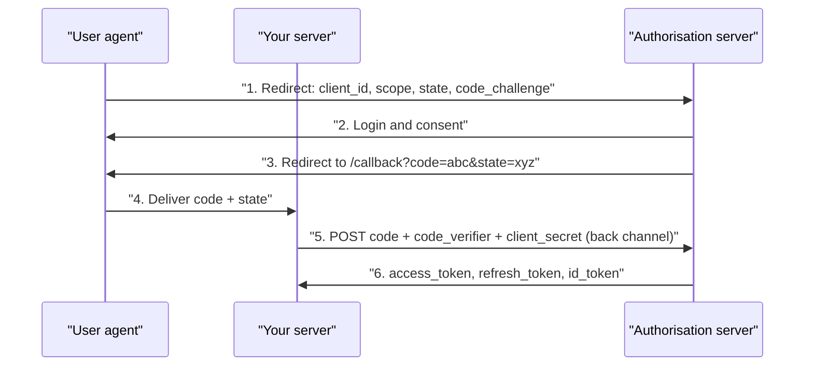

# OAuth, OIDC and Authorisation {#ch-oauth}

> Walk the authorisation code flow with PKCE, then decide what the signed-in user may do — on the server, against the object.

**In this chapter:** authorisation code with PKCE · OAuth against OIDC against JWT · RBAC, ABAC and ACLs · checking the object, not the route · why scopes are not permissions

## 💡 The Core Idea

Two questions protect every request. **Authentication** asks *who are you?* **Authorisation** asks
*may you do this, to this thing?* They fail in different ways and in different places.

**OAuth** lets a user give an application limited access to their data without sharing a password.
It answers "what may this application do?" **OpenID Connect (OIDC)** adds an `id_token` on top and
answers "who is this user?" Raw OAuth for login is a known mistake: an access token proves permission,
not who granted it.

Authentication belongs to the **request**, so one middleware can set it. Authorisation belongs to
the **request and the object together**, so a route guard alone cannot decide it. Every check lives
on the server. Hiding a button is user experience, not security.

> ⚠️ **Moving target:** OAuth 2.1 makes PKCE mandatory and removes the implicit and password grants.
> The durable principle is that the credential travels back-channel and the code is bound to the
> client that asked for it. Grant names and endpoints will keep moving.

## Authorisation Code with PKCE



**The authorisation code flow. Only the code crosses the browser; the tokens never do.**

The extra round trip is the point. The code in step 3 travels in a URL, so it lands in history and
logs. On its own it is useless: redeeming it needs the client secret or the PKCE verifier.

**PKCE** (Proof Key for Code Exchange) binds the code to whoever started the flow. The client sends
`SHA256(verifier)` first and the raw `verifier` later, so a thief holding only the code fails.

**Starting the flow and handling the callback:**

```typescript
export function startLogin(req: Request, res: Response): void {
  const verifier = crypto.randomBytes(32).toString('base64url');
  const challenge = crypto.createHash('sha256').update(verifier).digest('base64url');
  const state = crypto.randomBytes(16).toString('hex');
  req.session.pkceVerifier = verifier;
  req.session.oauthState = state;

  const params = new URLSearchParams({
    client_id: process.env.OAUTH_CLIENT_ID!,
    redirect_uri: 'https://app.example.com/auth/callback',
    response_type: 'code',
    scope: 'openid email profile', // Ask for the least you need.
    state,
    code_challenge: challenge,
    code_challenge_method: 'S256',
  });
  res.redirect(`https://accounts.google.com/o/oauth2/v2/auth?${params}`);
}

export async function handleCallback(req: Request, res: Response): Promise<void> {
  const { code, state } = req.query as { code?: string; state?: string };
  // 1. A mismatched state is login CSRF — reject it.
  if (!code || !state || state !== req.session.oauthState) {
    return void res.status(400).json({ error: 'Invalid OAuth state' });
  }
  // 2. Exchange the code back-channel, with the verifier and the client secret.
  const tokens = await exchangeCode(code, req.session.pkceVerifier!);
  // 3. Issue *your own* session. The browser never receives provider tokens.
  req.session.userId = await upsertUserFromIdToken(tokens.id_token!);
  res.redirect('/dashboard');
}
```

> ⚠️ Never send the provider's access or refresh token to the frontend. Keep them server-side,
> encrypted, keyed by your own session. A provider refresh token is as sensitive as a password.

## Grants, Tokens and the Checks That Matter

| Grant | For | Status |
| ----- | --- | ------ |
| **Authorisation code + PKCE** | Web apps, SPAs, mobile | ✅ The default for everything |
| **Client credentials** | Service to service, no user | ✅ Correct for machine auth |
| **Implicit** | An old SPA workaround | ❌ Removed in 2.1 — token in the URL fragment |
| **Resource owner password** | The app collects the password | ❌ Removed in 2.1 — no delegation, no provider MFA |

**OAuth** is an authorisation framework, **OIDC** an identity layer, and a **JWT** only a token
*format*. An opaque access token you look up is often better than a JWT, because you can revoke it.

- ✅ **Always validate `state`.** Without it, an attacker links their provider account to the victim's session.
- ✅ **Match redirect URIs against an exact allowlist.** A wildcard like `*.example.com` turns any subdomain takeover into stolen codes.
- ✅ **Verify the `id_token`.** Check the signature against the provider's JWKS, then `iss`, `aud`, `exp` and `nonce`.

## Authorisation: The Three Models

| Model | Decides from | Fits |
| ----- | ------------ | ---- |
| **RBAC** — role-based | The user's role | Most apps; small, stable permission sets |
| **ABAC** — attribute-based | Attributes of user, resource and context | "Own department", "only during business hours" |
| **ACL** — access control list | A per-object list of grants | User sharing: documents, folders, calendars |

**RBAC, done properly:** roles map to permissions, and code checks permissions — never roles.

```typescript
type Permission = 'order:read' | 'order:write' | 'order:refund';

const ROLE_PERMISSIONS: Record<Role, readonly Permission[]> = {
  viewer: ['order:read'],
  agent: ['order:read', 'order:write'],
  manager: ['order:read', 'order:write', 'order:refund'],
};

export function requirePermission(permission: Permission): RequestHandler {
  return (req, res, next) => {
    const granted = ROLE_PERMISSIONS[req.user.role] ?? [];
    if (!granted.includes(permission)) {
      return void res.status(403).json({ error: { code: 'forbidden' } });
    }
    next();
  };
}
```

`if (user.role === 'admin')` scattered through handlers is the anti-pattern: a new role means
auditing every conditional. Reach for ABAC when a requirement says "own" or "only when".

## Check the Object, Not the Route

`GET /orders/9` with a valid token must still check that order 9 is the caller's. Missing that is
**broken object-level authorisation** — OWASP's top API risk, and just a missing `WHERE` clause.

**Make the check part of the query:**

```typescript
// ❌ Route guard only. Any authenticated user reads any order.
app.get('/orders/:id', requireAuth, async (req, res) => {
  res.json(await db.orders.findUnique({ where: { id: req.params.id } }));
});

// ✅ The tenant is part of the query, so a forgotten check returns nothing.
app.get('/orders/:id', requireAuth, requirePermission('order:read'), async (req, res) => {
  const order = await db.orders.findFirst({
    where: { id: req.params.id, tenantId: req.user.tenantId },
  });
  // 404, not 403 — a 403 confirms the order exists, which is itself a leak.
  if (!order) return void res.status(404).json({ error: { code: 'not_found' } });
  res.json(order);
});
```

In a multi-tenant system, one missed `tenantId` leaks one customer's data to another. Defences, weakest first:

| Approach | Guarantee | Cost |
| -------- | --------- | ---- |
| `tenantId` in every query by convention | None — one omission is a breach | Free, and not enough |
| A repository layer that adds `tenantId` | No handler can build a query without it | A layer to maintain |
| Row-level security (RLS) in Postgres | The database refuses cross-tenant reads | A session variable per connection; awkward with transaction pooling |

## OAuth Scopes Are Not Permissions

A scope says what an **application** may ask for on the user's behalf. A permission says what the
**user** may do. A token with `orders:write` does not mean this user may write this order.

**Check both, in order:**

```typescript
if (!token.scope.includes('orders:write')) return res.status(403).json({ error: { code: 'insufficient_scope' } });
if (!(await canEdit(req.user, order))) return res.status(403).json({ error: { code: 'forbidden' } });
```

Treating a scope as a permission lets an integration granted one read write everywhere. Past a few
dozen rules, or when services must agree, move the rules into a policy engine such as OPA or Cedar.

## Common Mistakes

- ❌ **Trusting a client-supplied `tenantId` or `userId`.** ✅ Take both from the verified session or token.
- ❌ **Deciding on the client.** ✅ Hide the button for UX, then repeat every check on the server.
- ❌ **Failing open.** ✅ If the policy lookup errors, deny. A permissive default is a vulnerability.

## 🔑 Key Takeaways

- OAuth answers what an application may do, OIDC's `id_token` answers who the user is, and your own authorisation decides what that user may touch.
- Authorisation code with PKCE is the only flow to use, and `state` and PKCE do different jobs, so you need both.
- Provider tokens stay on the server; the browser only ever holds your own session.
- Put the tenant and owner in the query, so a forgotten check returns nothing rather than everything.
- An OAuth scope limits the application, not the user, so check the scope and then the user's permission on the object.

## Interview Questions

**Q: Walk me through the authorisation code flow with PKCE.**

The app redirects with its client id, scopes, a random `state` and a PKCE challenge. The user signs
in, and the server redirects back with a short-lived code. The backend exchanges the code, verifier
and client secret for tokens, server to server. The code crosses the browser; the tokens do not.

**Q: What is `state` for, and is it the same as PKCE?**

No. `state` is CSRF protection for the flow: a random value in the session that must match on
callback, so an attacker cannot make a victim finish a flow with the attacker's code. PKCE stops a
stolen code being redeemed by anyone else. OAuth 2.1 requires PKCE even for confidential clients.

**Q: What is broken object-level authorisation, and how do you prevent it structurally?**

The caller is authenticated and their role allows the action in general, but nobody checks that this
object is theirs. Changing an id in the URL then reads someone else's data. The fix is to make
ownership part of the query, through a repository layer or row-level security, so a missing check
returns no rows.

**Q: 403 or 404 for a resource the user may not see?**

404 when the caller should not learn it exists — a 403 on sequential ids lets an attacker count your
data. 403 when they already know it exists, such as a team document they may read but not edit.

**Q: When would you not reach for ABAC or a policy engine?**

When permissions are small and stable, RBAC is simpler to reason about and audit. A policy engine
earns its cost when rules change faster than code or several services must agree. For one team and a
dozen rules, it adds a network hop and a new language for little gain.

## What to Read Next

- [Chapter ?? — Credentials, Sessions, CORS and CSRF](#ch-credentials-and-sessions) — the session you issue after the callback, and protecting the cookie that holds it
- [Chapter ?? — REST Best Practices and Versioning](#ch-rest-best-practices) — where 403 and 404 sit in the status code map
