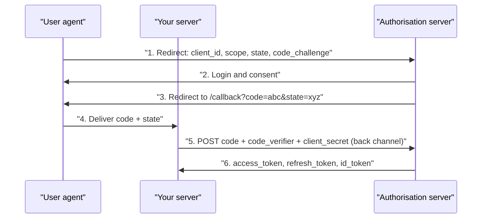

# OAuth 2.1 and OpenID Connect {#ch-oauth}

> Walk the authorisation code flow with PKCE and say what each redirect is protecting against.

**In this chapter:** the four roles · authorisation code with PKCE · the grants that survive · OAuth against OIDC against JWT · state, redirects and scopes · SSO and magic links

## 💡 The Core Idea

OAuth lets a user give one application limited access to their data on another service without
sharing a password. "Sign in with Google" is the everyday case: your application never sees the
Google password, only a token scoped to what the user approved.

The distinction that decides whether you understand it: **OAuth is authorisation, not
authentication.** It answers "what may this application do?" **OpenID Connect** is the thin layer on
top that answers "who is this user?" by adding an `id_token`. Using raw OAuth for login is a known
anti-pattern, because an access token proves an application has permission, not who granted it.

> ⚠️ **Moving target:** OAuth 2.1 consolidates a decade of best-practice documents — it makes PKCE
> mandatory and removes the implicit and password grants. The durable principle is that the
> credential travels back-channel and the code is bound to the client that requested it. Grant names
> and endpoints will keep moving.

## The Four Roles

| Role | Who | Example |
| ---- | --- | ------- |
| **Resource owner** | The user | You |
| **Client** | The application wanting access | A photo printing service |
| **Authorisation server** | Issues tokens | Google's OAuth endpoints |
| **Resource server** | Holds the data | The Google Photos API |

The last two often belong to the same company but are different jobs — and in an interview, keeping
them separate is what shows you have read the specification rather than a tutorial.

## Authorisation Code with PKCE



**The authorisation code flow. Only the code crosses the browser; the tokens never do.**

The extra round trip is the point. The code in step 3 travels through a URL, where it lands in
browser history, referrer headers and proxy logs. It is useless on its own: redeeming it needs the
client secret or the PKCE verifier, sent server to server.

**PKCE** (Proof Key for Code Exchange) binds the code to whoever started the flow. The client sends
`SHA256(verifier)` up front and the raw `verifier` at exchange time; an attacker who intercepts the
code never saw the verifier, so the exchange fails.

```typescript
export function createPkcePair(): { verifier: string; challenge: string } {
  const verifier = crypto.randomBytes(32).toString('base64url');
  const challenge = crypto.createHash('sha256').update(verifier).digest('base64url');
  return { verifier, challenge };
}

export function startLogin(req: Request, res: Response): void {
  const { verifier, challenge } = createPkcePair();
  const state = crypto.randomBytes(16).toString('hex');

  // Both must survive the round trip — session, or a signed cookie.
  req.session.pkceVerifier = verifier;
  req.session.oauthState = state;

  const params = new URLSearchParams({
    client_id: process.env.OAUTH_CLIENT_ID!,
    redirect_uri: 'https://app.example.com/auth/callback',
    response_type: 'code',
    scope: 'openid email profile', // Ask for the least you need.
    state,
    code_challenge: challenge,
    code_challenge_method: 'S256',
  });
  res.redirect(`https://accounts.google.com/o/oauth2/v2/auth?${params}`);
}
```

**The callback does three things, in order:**

```typescript
export async function handleCallback(req: Request, res: Response): Promise<void> {
  const { code, state } = req.query as { code?: string; state?: string };

  // 1. Reject a mismatched state — this is the CSRF check for the flow itself.
  if (!code || !state || state !== req.session.oauthState) {
    return void res.status(400).json({ error: 'Invalid OAuth state' });
  }

  // 2. Exchange the code back-channel, with the verifier and the client secret.
  const tokens = await exchangeCode(code, req.session.pkceVerifier!);

  // 3. Issue *your own* session. The browser never receives provider tokens.
  req.session.userId = await upsertUserFromIdToken(tokens.id_token!);
  res.redirect('/dashboard');
}
```

> ⚠️ Never send the provider's access or refresh token to the frontend. Keep them server-side,
> encrypted, keyed by your own session. A provider refresh token is as sensitive as a password.

## The Grants Worth Knowing

| Grant | For | Status |
| ----- | --- | ------ |
| **Authorisation code + PKCE** | Web apps, SPAs, mobile | ✅ The default for everything |
| **Client credentials** | Service to service, no user | ✅ Correct for machine auth |
| **Refresh token** | A new access token | ✅ With rotation |
| **Device code** | TVs, CLIs — typing is awkward | ✅ Niche but valid |
| **Implicit** | An old SPA workaround | ❌ Removed in 2.1 |
| **Resource owner password** | The app collects the password | ❌ Removed in 2.1 |

Implicit died because it returned the access token in a URL fragment — visible in history, referrers
and logs — with no way to authenticate the client. The password grant died because the application
sees the password, which removes both the delegation and the provider's MFA.

## OAuth, OIDC and JWT

| Thing | Is | Answers |
| ----- | -- | ------- |
| **OAuth 2.1** | An authorisation framework | "What may this application access?" |
| **OIDC** | An identity layer on top of OAuth | "Who is this user?" |
| **JWT** | A token *format* | Neither — it is a container |

OIDC adds the `id_token`, a JWT with verified claims about the user. OAuth access tokens may be JWTs
or opaque strings; both are valid, and an opaque token you introspect is often the better choice
because it is revocable.

## Security Essentials

**✅ Always validate `state`.** Without it, an attacker completes a flow in the victim's browser and
links their own provider account to the victim's session — login CSRF.

**✅ Match redirect URIs exactly.**

```typescript
// ❌ Any subdomain takeover now steals authorisation codes
const allowed = /^https:\/\/.*\.example\.com\//;

// ✅ Exact allowlist, no pattern matching
const ALLOWED_REDIRECTS = new Set(['https://app.example.com/auth/callback']);
```

**✅ Request the smallest scope.** `email profile`, not `drive.readonly`, unless you genuinely read
files. A leaked token then does less damage.

**✅ Validate the `id_token` properly.** Verify the signature against the provider's JWKS, then
`iss`, `aud`, `exp` and `nonce`. A decoded-but-unverified token is attacker-controlled JSON.

## SSO and Magic Links

**Single sign-on** is the same flow with the customer's identity provider — Okta, Entra ID, Auth0 —
instead of a consumer brand. The provider holds the user directory, authenticates once, and each
application trusts a signed assertion. SAML 2.0 is XML-based and still common in enterprise
procurement; OIDC is the same idea over the flow above and is what to choose for anything new.

**Magic links** remove the password rather than federating it: the user types an email address and
clicks a one-time signed URL.

Generate 32 random bytes, store only the hash with a 15-minute expiry, and mail the raw token in
the URL — the mailbox holds the only copy.

| Pattern | Reach for it when | Do not, when |
| ------- | ----------------- | ------------ |
| **SSO (OIDC)** | Enterprise buyers, internal tools, product suites | A consumer product with no directory behind it |
| **Magic links** | Low-friction sign-up, invite flows | High-value accounts — the mailbox becomes the credential |

A magic link is a bearer credential sitting in an inbox. Treat it like a password reset token:
single use, short expiry, hashed at rest, never a second factor on its own.

## 🔑 Key Takeaways

- OAuth answers what an application may do; OIDC's `id_token` answers who the user is.
- Authorisation code with PKCE is the only flow to use, including for confidential clients.
- `state` protects the callback against CSRF and PKCE protects the code against interception — different jobs.
- Match redirect URIs against an exact allowlist; prefix or wildcard matching is how accounts get taken over.
- Provider tokens stay server-side and encrypted; the browser only ever holds your own session.

## Interview Questions

**Q: Walk me through the authorisation code flow.**

The application redirects the user to the authorisation server with its client id, the requested
scopes, a random `state` and a PKCE challenge. The user authenticates and consents, and the server
redirects back with a short-lived code. The application's backend then exchanges that code, plus the
verifier and its client secret, for tokens over a direct server-to-server call. The code crosses the
browser; the tokens do not.

**Q: What does PKCE add, and why does a confidential client need it too?**

It binds the code to the client that started the flow, so a code stolen from a redirect cannot be
redeemed. It was designed for mobile apps that cannot keep a secret, and OAuth 2.1 requires it
everywhere — because a confidential client can still leak a code through an open redirect or a
referrer header, and PKCE makes that leak useless.

**Q: What is `state` for, and is it the same as PKCE?**

No. `state` is CSRF protection for the flow: a random value stored in the session and required to
match on callback, which stops an attacker forcing a victim's browser to complete a flow with the
attacker's code. PKCE protects the code itself from being redeemed by a third party. You need both.

## What to Read Next

- [Chapter ?? — Sessions and JWTs](#ch-jwt) — validating the `id_token` and issuing your own session
- [Chapter ?? — Authorisation](#ch-authorisation) — what scopes do and do not decide once the user is in
- [Chapter ?? — Password Security](#ch-password-security) — the flow you are delegating away
