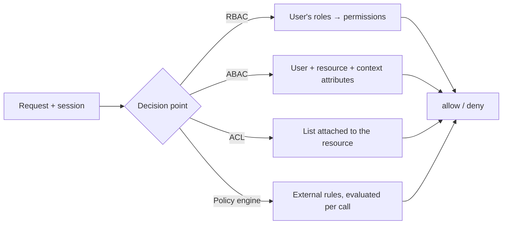

# Authorisation {#ch-authorisation}

> Decide who may do what, and enforce it somewhere the client cannot reach.

**In this chapter:** RBAC · ABAC and ownership rules · access control lists · policy engines · tenant isolation · OAuth scopes

## 💡 The Core Idea

Authentication answers _who is this?_ Authorisation answers _what may they do?_ They fail in different
ways. A broken login lets a stranger in. Broken authorisation lets a real, logged-in user read a record
that is not theirs — and that is the more common bug, because it hides behind a valid session.

Every model below is the same shape underneath: turn a request into a decision, and make that decision
on the server. The models differ only in what the decision is allowed to look at.

## How It Works



**Four ways to reach the same allow/deny, differing only in what the decision may read.**

## Role-Based Access Control

RBAC is the default in enterprise apps. Users hold roles such as `admin`, `editor` or `viewer`, and each
role carries a fixed set of permissions. A user's effective permissions are the union of their roles'.

**Check the permission, not the role name:**

```typescript
type Role = "admin" | "editor" | "viewer";
type Permission = "report:read" | "report:write" | "report:delete" | "user:manage";

const rolePermissions: Record<Role, readonly Permission[]> = {
  admin: ["report:read", "report:write", "report:delete", "user:manage"],
  editor: ["report:read", "report:write"],
  viewer: ["report:read"],
};

function can(roles: readonly Role[], permission: Permission): boolean {
  return roles.some((r: Role) => rolePermissions[r].includes(permission));
}

function requirePermission(perm: Permission) {
  return (req: Request, res: Response, next: NextFunction): void => {
    if (!can(req.user.roles, perm)) {
      res.status(403).json({ error: "Forbidden" });
      return;
    }
    next();
  };
}

app.delete("/reports/:id", requirePermission("report:delete"), deleteReport);
```

`if (user.role === "admin")` scattered across a codebase is the thing you cannot refactor later. Adding a
`superEditor` role then means finding every one of those checks. Adding a permission to a role's list does
not.

## Attribute-Based Access Control

RBAC breaks the moment access depends on the data rather than the user — _"a user may edit a report if
they own it, or if they manage the department it belongs to."_ No role expresses that. ABAC decides from
attributes of the user, the resource, and the context.

```typescript
interface User {
  id: string;
  department: string;
  roles: readonly string[];
}

interface Report {
  id: string;
  ownerId: string;
  department: string;
}

function canEditReport(user: User, report: Report): boolean {
  if (report.ownerId === user.id) return true;
  return user.roles.includes("manager") && user.department === report.department;
}
```

| Aspect          | RBAC                        | ABAC                                    |
| --------------- | --------------------------- | --------------------------------------- |
| **Decision on** | User → role → permission    | User + resource + context               |
| **Flexibility** | Low — roles are fixed       | High — any attribute                    |
| **Audit**       | Easy: "who has admin?"      | Harder: the answer depends on the data  |
| **Best for**    | Stable role sets            | Ownership rules, multi-tenant products  |

> Most real systems are RBAC at the edge and ABAC in the middle. Start with roles, add attributes when
> roles stop expressing the rule.

## Access Control Lists

An ACL inverts the question. Instead of _"what may this user do?"_ it asks _"who may touch this
resource?"_ — the model behind file systems, shared documents and repository permissions.

```typescript
interface AclEntry {
  principalId: string; // user or group id
  permissions: readonly ("read" | "write" | "share")[];
}

function canRead(entries: readonly AclEntry[], userId: string, groupIds: readonly string[]): boolean {
  return entries.some(
    (e: AclEntry) =>
      (e.principalId === userId || groupIds.includes(e.principalId)) &&
      e.permissions.includes("read"),
  );
}
```

Reach for ACLs when sharing is per-record and set by users — a document, a folder, a customer account.
Do not reach for them when every resource of a type has the same rules; that is RBAC with extra storage.

> ⚠️ **Do not store an ACL as a JSON blob on the row.** "List every document Alice can read" becomes a
> full table scan. Model entries as their own table with an index on the principal.

## Policy Engines

When rules change more often than the code, differ per tenant, or must be readable by people who are not
engineers, move them out of the application. **Open Policy Agent** is the common choice: the service asks
_"may user X do Y to Z?"_ and the engine evaluates a policy file and answers.

```typescript
interface AuthzInput {
  user: { id: string; roles: readonly string[]; department: string };
  action: string;
  resource: { type: string; ownerId: string; department: string };
}

async function isAllowed(input: AuthzInput): Promise<boolean> {
  const res = await fetch("http://opa:8181/v1/data/app/authz/allow", {
    method: "POST",
    headers: { "Content-Type": "application/json" },
    body: JSON.stringify({ input }),
  });
  const { result } = (await res.json()) as { result: boolean };
  return result;
}
```

The cost is a network call on the hot path and a second language to maintain. It pays for itself when
product, security and compliance all need to read the same rules — and not before.

## Tenant Isolation

In a multi-tenant product, the worst possible bug is one customer seeing another's data. Tenant isolation
is not a separate concern from authorisation; it is the authorisation rule that runs first on every query.

```typescript
// Always derive the tenant from the session, never from the request body.
async function getReports(user: User): Promise<Report[]> {
  return db.reports.find({ tenantId: user.tenantId });
}
```

Application-level filtering works until someone writes the one query that forgets it. Postgres row-level
security moves the rule into the database, where forgetting is not possible:

```sql
ALTER TABLE reports ENABLE ROW LEVEL SECURITY;

CREATE POLICY tenant_isolation ON reports
  USING (tenant_id = current_setting('app.tenant_id')::uuid);
```

```typescript
await db.query("SET app.tenant_id = $1", [user.tenantId]);
// Every query on this connection is now filtered.
```

> ⚠️ **Cache keys need the tenant too.** A cache keyed on `report:123` serves tenant A's row to tenant B
> the moment two tenants share an id space.

## OAuth Scopes Are Not Permissions

When a third-party application calls your API on a user's behalf, it should not inherit everything that
user can do. Scopes narrow the token; permissions narrow the user. You check both.

```typescript
function requireScope(scope: string) {
  return (req: Request, res: Response, next: NextFunction): void => {
    const granted: string[] = (req.token.scope as string).split(" ");
    if (!granted.includes(scope)) {
      res.status(403).json({ error: "insufficient_scope" });
      return;
    }
    next();
  };
}

// Scope check first, then the user's own permission.
app.post("/reports", requireScope("write:reports"), requirePermission("report:write"), createReport);
```

A token scoped `write:reports` held by a `viewer` still may not write. The scope caps the token; it does
not grant anything.

## When to Use It

| Scenario                                | Model                | Why                                        |
| --------------------------------------- | -------------------- | ------------------------------------------ |
| 3–10 roles, permissions rarely change   | RBAC                 | Simplest thing that audits well            |
| "Users edit their own records"          | ABAC                 | The rule depends on the row, not the user  |
| Per-document sharing set by users       | ACL                  | The list belongs to the resource           |
| Rules change without a deploy           | Policy engine        | Policy outlives the service that reads it  |
| Multi-tenant SaaS                       | RBAC + row-level security | Isolation must not depend on discipline |
| Third-party API access                  | Scopes **and** RBAC  | Two independent limits                     |

## Common Mistakes

❌ **Hiding the button and calling it done.** The frontend removing a delete button is user experience.
✅ The endpoint checks authorisation on every call, because `curl` never loaded your UI.

❌ **Trusting identifiers from the request.** A `tenantId` or `role` in the body is attacker-controlled.
✅ Derive both from the authenticated session.

❌ **Fetching by id and returning it.** This is the classic insecure direct object reference:

```typescript
// ❌ Any logged-in user reads any report.
app.get("/reports/:id", async (req, res) => {
  res.json(await db.reports.findById(req.params.id));
});

// ✅ Verify access, and do not confirm that the record exists.
app.get("/reports/:id", async (req, res) => {
  const report = await db.reports.findById(req.params.id);
  if (!report || !canRead(req.user, report)) {
    res.status(404).json({ error: "Not found" });
    return;
  }
  res.json(report);
});
```

Returning `404` rather than `403` matters: a `403` tells an attacker enumerating ids exactly which
records exist.

❌ **Checking the REST route but not the GraphQL resolver.** A single GraphQL endpoint hides dozens of
authorisation decisions.
✅ Enforce per field or per resolver, not per HTTP route.

## 🔑 Key Takeaways

- Roles grant access and permissions check it — write code against permissions, never against role names.
- Use RBAC until a rule depends on the data, then add attributes; reach for a policy engine only when the rules outlive the code.
- In a multi-tenant system, tenant isolation is the first authorisation rule, and row-level security enforces it better than discipline.
- A scope limits what a token may do; it never grants a user a permission they lack.
- Answer unauthorised resource access with `404`, so the response does not confirm what exists.

## Interview Questions

**Q: What is the difference between authentication and authorisation, and which fails more quietly?**

Authentication proves identity; authorisation decides what that identity may do. Authorisation failures
are quieter, because the request carries a valid session and looks legitimate in every log. Broken access
control has topped the OWASP Top 10 since 2021 for exactly that reason.

**Q: When would you choose ABAC over RBAC?**

When the decision depends on the resource rather than the user — ownership, department, region, time.
RBAC cannot express "may edit their own report" without inventing a role per user. The trade is
auditability: with roles you can answer "who can delete reports?" from a table; with attributes you have
to evaluate the rule against the data.

**Q: How do you stop one tenant reading another's data?**

Derive the tenant from the authenticated session, never the request, and enforce it below the application
where possible — Postgres row-level security applies the filter even to a query that forgot it. Then key
every cache entry by tenant, and treat isolation as a test suite, not a code review item.

**Q: Someone says they secured the admin page by hiding the menu item. What do you say?**

That it is a usability change, not a control. The endpoints behind that page are still reachable with
`curl`, and the client bundle usually names them. The check has to run on the server on every request;
the hidden menu is only there so users do not see options they cannot use.

**Q: When is a policy engine like OPA the wrong choice?**

When the application has a handful of stable roles. It adds a network call to the request path, a second
language, and a deployment to keep in sync — all to solve a problem that a permissions map in code solves
for free. It earns its place when many services share rules, or when non-engineers must read them.

## What to Read Next

- [Chapter ?? — JWT Authentication](#ch-jwt-authentication) — where the roles and scopes in this chapter arrive from
- [Chapter ?? — OAuth 2.0](#ch-oauth-2) — how a third-party token gets its scopes in the first place
- [Chapter ?? — Backend Input Validation](#ch-backend-input-validation) — the other half of "never trust the request"
