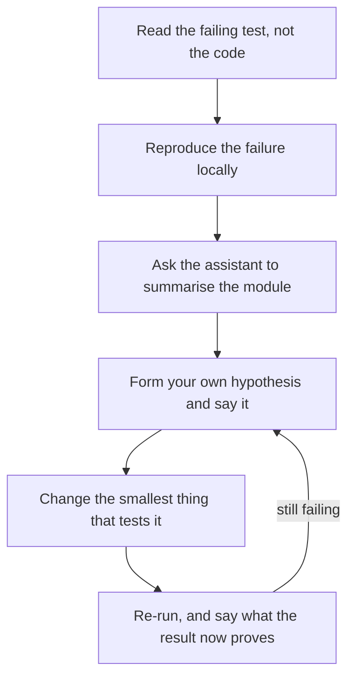

# The AI-Assisted Interview {#ch-ai-assisted-interview}

> Use an assistant in the room without handing it the thing you are actually being scored on.

**In this chapter:** the two rooms and how to find out which one you are in · the four axes an assisted round scores · verifying generated code out loud · prompt hygiene on the clock · the room where AI is banned

## 💡 The Core Idea

When the assistant is allowed, the code stops being evidence. Everyone in the room knows the model can
produce a working function, so producing one proves nothing. What is left to score is **your judgement
about the code** — what you asked for, what you rejected, and how you checked.

This inverts the habit most candidates bring. In an unassisted round the artefact is the answer, so you
go quiet and type. In an assisted round the artefact is the *cheap* part, and going quiet is the failure:
you have removed the only thing being measured. The documented rejection pattern is exactly this —
candidates who lean on the model without showing their own understanding are failed, while the ones who
pass use it for well-defined subtasks and keep the design in their own hands.

So the rule for the whole hour is one sentence. **You own the design, the assistant owns the typing, and
you say out loud which is which.**

## How It Works

### Two rooms, and you do not pick which one

Roughly 38% of US companies now permit AI in technical interviews and 62% still prohibit it, so you have
to arrive ready for both. You cannot infer which room you are in from the company's public engineering
brand — the policy is usually set per loop, sometimes per interviewer.

Ask in the first minute, and ask precisely, because "allowed" covers three very different rooms.

| What you ask | Why it changes your plan |
| ------------ | ------------------------ |
| "Is an assistant allowed, and may I share the screen while I use it?" | Silent use looks like hiding it, even when it is permitted |
| "Autocomplete, chat, or an agent that can edit files?" | Autocomplete needs no narration; an agent needs you to state intent before every run |
| "Should I say when a block is generated?" | Most interviewers want this; assume yes unless told otherwise |
| "Is the internet allowed for docs?" | Some loops ban the model but allow MDN, which changes how you handle an API you half-remember |

> ⚠️ If a shared editor arrives with an assistant switched on and the round is meant to be unassisted,
> say so and turn it off while they watch. Saying nothing and letting the suggestions appear is the one
> mistake in this chapter that ends a loop rather than costing points.

### The four axes an assisted round scores

At least one major employer now lets candidates switch between models mid-interview and scores the round
on four named axes. Treat the four as a checklist of what to make visible, because they are what the
rubric asks the interviewer to write down.

| Axis | What it looks like unassisted | What it looks like with an assistant |
| ---- | ----------------------------- | ------------------------------------ |
| **Problem solving** | You reach a working approach | You scope the subtask before you ask for it, and you can say why that is the right seam |
| **Code quality** | You write clean code | You reject a generated block for a stated reason — a bad boundary, a swallowed error, a wrong default |
| **Verification** | You test the happy path and an edge case | You assume the generated code is wrong until you have named the inputs that break it |
| **Communication** | You narrate your thinking | You narrate the prompt *before* you send it, so the interviewer hears the intent, not just the output |

The pattern across the right-hand column: **every axis moves one level up the stack.** You are no longer
scored on producing the thing; you are scored on specifying and checking it.

### The code-comprehension round

The newer round shape, added by at least one major employer for the 2026 cycle, is not "write a
function" at all. You are given an existing codebase and asked to read, debug and optimise it, with an
assistant available. It is closer to a first week on the job than to a puzzle, and it rewards a
completely different order of operations.



**The order to work a code-comprehension round in. The assistant is used at step three — after the
failure is reproduced, and before you have committed to a hypothesis.**

Two things about that order matter more than the fix itself. **Reproducing before reading** stops you
from being led by whichever file you happened to open first. And **asking for a summary rather than a
fix** uses the model for the job it is genuinely good at — telling you what 400 unfamiliar lines do —
while keeping the diagnosis, which is the scored part, yours.

### Verifying generated code out loud

This is the craft the round is really about. Here is a block an assistant will produce for "add retries
to this call", written the way it actually arrives.

**What the assistant produced, unedited:**

```typescript
async function retry<T>(fn: () => Promise<T>, attempts: number = 3): Promise<T> {
  for (let i = 0; i < attempts; i++) {
    try {
      return await fn();
    } catch (error) {
      await new Promise((resolve) => setTimeout(resolve, 2 ** i * 1000));
    }
  }
  throw new Error("Retry failed");
}
```

It compiles, it reads well, and it has four defects. Saying them in this order is the answer:

1. **It retries every error.** A 400 or a validation failure will never succeed, so this turns one fast
   failure into three slow ones. Retry is only correct for *transient* faults.
2. **It loses the cause.** The caller gets `Retry failed` and cannot tell a timeout from a bad payload,
   which is the log line you will want at 3am.
3. **It sleeps after the last attempt.** Four seconds of waiting, and then it throws anyway.
4. **There is no jitter.** Every client backs off on the same schedule, so an outage ends with a
   synchronised stampede — see [Chapter ?? — Rate Limiting](#ch-rate-limiting).

The fix follows from the list: take a predicate that says whether an error is transient, break out of
the loop when it is not, skip the sleep on the final attempt, add jitter to the delay, and pass the last
error through as `cause`. Five small edits, each traceable to one sentence you said out loud.

Note what the narration did. It never said "this is wrong" — it named **the input that breaks it** each
time. That is the sentence pattern to practise: *"this is fine unless the error is a 400, in which case
we wait four seconds to fail."* An interviewer can write that down as a verification signal. "Looks a
bit off" is not something anyone can score.

### Prompt hygiene on the clock

Under time pressure the temptation is to describe the whole problem and hope. That produces a large block
you then have to read, which costs more time than writing it yourself would have.

| ❌ Prompt that costs you time | ✅ Prompt that buys you time | Why |
| ---------------------------- | --------------------------- | --- |
| "Write a function to solve this problem" | "Write the type for a paginated response with a nullable cursor" | Small, checkable, and not the part being scored |
| "Is this correct?" | "What input makes this return the wrong answer?" | The first invites agreement; the second invites a counterexample |
| Pastes the problem description | Pastes the failing test and the error | The test is unambiguous; your prose is not |
| "Fix the bug" | "Summarise what this module does in five lines" | Keeps the diagnosis yours, which is the graded part |

Two limits worth holding to. **Ask for one function, not a file** — you have to read every line aloud,
so anything over about fifteen lines is a block you will not properly check. And **two attempts, then
write it yourself.** Arguing with a model in front of an interviewer burns clock and reads as an
inability to just do the thing.

> ⚠️ Never let a line into the editor you cannot explain. Interviewers probe exactly here: they pick a
> generated line and ask why it is there. "The assistant added that" is a rejection, and it is the most
> common one in this format.

### The room where AI is banned

Sixty-two per cent of the time this is still the round, and the risk is not knowledge — it is atrophy.
If every line you have written for a year arrived by pressing Tab, the unassisted hour will find that
out.

| What changes | What does not |
| ------------ | ------------- |
| You need the API surface in your head — array methods, `Map`, `Promise` combinators | Restating the problem before you start |
| Typos and syntax cost real seconds | Narrating the approach before typing |
| You choose the edge cases with no prompt to suggest them | Naming the input that would break your own code |

The preparation is unglamorous and it works: **practise one problem a week with autocomplete switched
off entirely.** Not a tutorial, not a new topic — a problem you have already solved, typed cold. The
muscle you are keeping is recall, and it is the only one an assistant can quietly take from you.

## When to Use It

Inside an assisted hour, the decision is which parts to delegate. This is the split that scores well.

| Task in the round | Do it | Why |
| ----------------- | ----- | --- |
| Types, interfaces, fixture data | Assistant | Cheap, verifiable at a glance, not the signal |
| Boilerplate you have written a hundred times | Assistant | Frees the clock for the part that is graded |
| The core algorithm or data structure | Yourself | This is the thing being measured; delegating it removes the evidence |
| Test cases | Assistant, then prune | It will suggest cases you would have missed, and two that are pointless |
| Any design or trade-off decision | Yourself, out loud | "The model suggested this architecture" is not an answer |
| Reading unfamiliar code | Assistant, for the summary only | Its diagnosis is a hypothesis, not a finding |

## Common Mistakes

❌ **Prompting silently, then reading the result.**
✅ Say what you are about to ask for and why, then send it. The interviewer needs to hear the intent, or
the round looks like the model solving the problem.

❌ **Accepting a fifteen-plus-line block because it looks plausible.**
✅ Delete it and ask for a smaller piece. A block you cannot walk line by line is a liability, not
progress.

❌ **Treating the assistant's explanation of a bug as the diagnosis.**
✅ Reproduce the failure first, and use the summary to locate it. The model is confident about code it
has not run.

❌ **Announcing that you do not use AI, as a signal of rigour.**
✅ Answer the question that was asked. In a 2026–27 loop this reads as being behind rather than
principled — the same way refusing to use a debugger would.

> ⚠️ **Moving target:** interview policy is changing faster than the tools. The 38/62 split, the four
> scored axes and the code-comprehension round are the 2026–27 picture and will look different by 2028.
> The durable principle is the one that has not moved: **the interviewer is scoring your judgement, and
> the assistant only changes which layer that judgement has to be visible at.**

## 🔑 Key Takeaways

- When the assistant is allowed, the code is no longer evidence — your reasoning about it is the only
  thing left to score.
- Ask in the first minute whether AI is permitted and what "permitted" covers, because the answer varies
  per loop rather than per company.
- Verify generated code by naming the input that breaks it, not by saying it looks wrong.
- Never let a line into the editor you cannot explain; being asked about one is the standard probe.
- The unassisted round is still the majority, so practise one problem a week with autocomplete off.

## Interview Questions

**Q: We allow an AI assistant in this round. How will you use it?**

Answer with the split, not with enthusiasm. Types, fixtures and boilerplate go to the assistant; the core
algorithm and every design decision stay with you. Add that you will say when a block is generated and
walk through it before it goes in. That one sentence covers three of the four scored axes before you have
written any code.

**Q: The assistant just gave you twenty lines. What do you do next?**

Read it out loud against inputs, not against style. Name the case that breaks it — an empty array, a
non-transient error, a duplicate key — and either fix that case or delete the block and ask for something
smaller. Saying "this is fine unless X" is what an interviewer can record as verification.

**Q: How is the code-comprehension round different from a normal coding round?**

The artefact already exists, so nothing is scored on producing code. It measures how you orient in
unfamiliar code: reproduce the failure before reading, use the assistant for a summary of the module
rather than for a fix, state a hypothesis, and change the smallest thing that tests it. The fix is often
one line, and the line is not the point.

**Q: When would you refuse to use the assistant even though it is allowed?**

When the subtask *is* the interview. If the round is "implement an LRU cache", generating it removes the
only signal in the hour, so you write it yourself and use the assistant for the test fixtures instead.
The same applies to any trade-off question — an architecture you cannot defend independently is worse
than a simpler one you can.

## What to Read Next

- [Chapter ?? — Listening and Thinking Aloud](#ch-thinking-aloud) — the narration technique this chapter
  raises the bar on, including what to say in the first five minutes
- [Chapter ?? — AI in Interviews](#ch-ai-in-interviews) — the other half of the AI-era loop: the four AI
  *questions* a senior round asks, and the number that ends each one
- [Chapter ?? — Written Communication](#ch-written-communication) — the same verification instinct applied
  to reviewing someone else's pull request
