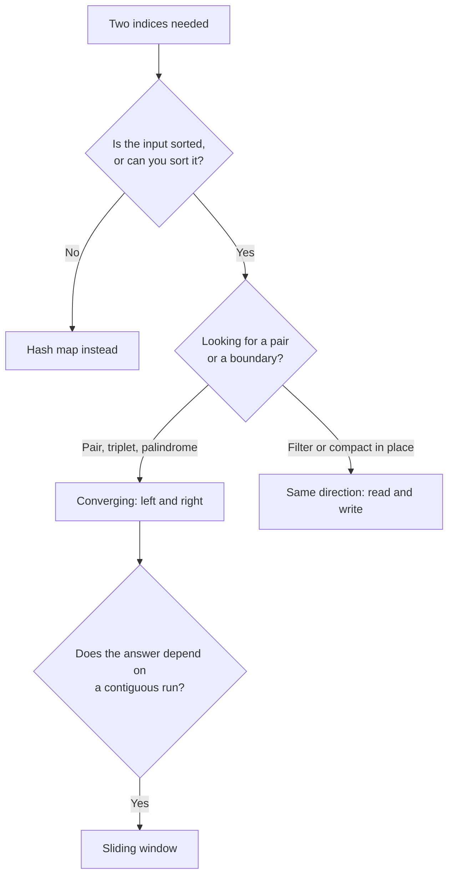

# Two Pointers {#ch-two-pointers}

> Replace a nested loop with two indices that only ever move forwards, and justify why nothing is skipped.

**In this chapter:** converging and same-direction pointers · the greedy argument that makes them correct · the read/write shape · duplicates · what separates this from a sliding window

## 💡 The Core Idea

A nested loop checks every pair. Two pointers check `n` of them and get the same answer, because at
each step the input tells you which pointer to move and moving the other one could not possibly help.

That last clause is the pattern. The code is four lines; the interview is about the argument. If you
cannot say why advancing `left` throws away only pairs you have already ruled out, you have written a
heuristic rather than an algorithm.

> Two pointers needs **order**. Sorted values, or a monotonic property like "width only shrinks". Take
> the order away and the argument collapses, which is why the first question to ask is whether the
> input is sorted and whether you are allowed to sort it.

## How It Works

### Shape one: converging

Both indices start at the ends and walk towards each other. Total moves: `n`.

```typescript
// Two Sum II — the array is sorted, find the pair adding to target
function twoSum(numbers: number[], target: number): [number, number] {
  let left = 0;
  let right = numbers.length - 1;

  while (left < right) {
    const sum = numbers[left] + numbers[right];
    if (sum === target) return [left + 1, right + 1];  // 1-indexed, per the problem
    sum < target ? left++ : right--;                    // too small → raise it; too big → lower it
  }
  return [-1, -1];
}
// Time: O(n), Space: O(1)
```

**Why nothing is missed.** When `sum < target`, `numbers[left]` is too small to pair with anything
still in range — every remaining partner is `numbers[right]` or smaller, so no pair involving `left`
can reach the target. Discarding `left` discards only pairs already proven impossible. The mirror
argument holds for `right`.

### Shape two: same direction

Both start at the front and move at different rates. One reads, one writes.

```typescript
// Remove duplicates from a sorted array, in place. Returns the new length.
function removeDuplicates(nums: number[]): number {
  if (nums.length === 0) return 0;
  let write = 1;                                  // next slot to fill

  for (let read = 1; read < nums.length; read++) { // scans every element once
    if (nums[read] !== nums[write - 1]) {
      nums[write] = nums[read];
      write++;
    }
  }
  return write;
}
// Time: O(n), Space: O(1)
```

`write` never overtakes `read`, so nothing unread is ever overwritten. That invariant is what makes
the in-place edit safe, and it is the sentence to say aloud.

### The greedy version

Container With Most Water is the question that separates people who memorised the template from
people who understand it.

```typescript
function maxArea(height: number[]): number {
  let left = 0;
  let right = height.length - 1;
  let best = 0;

  while (left < right) {
    // The shorter wall caps the water, whatever the taller one does.
    best = Math.max(best, (right - left) * Math.min(height[left], height[right]));
    height[left] < height[right] ? left++ : right--;   // always move the shorter wall
  }
  return best;
}
// Time: O(n), Space: O(1)
```

**Why moving the shorter wall is safe.** Width shrinks on every move, whichever pointer you advance.
If you move the **taller** wall, the height is still capped by the shorter one, so the area can only
get worse — every pair you skipped was already beaten by the pair you just measured. If you move the
**shorter** wall, the cap can rise, so improvement is at least possible. Discarding the short wall
discards only pairs that were guaranteed to be smaller.

### Picking the shape



**How the two-pointer shapes relate, and where a sliding window takes over.**

## When to Use It

| Signal in the question                          | Shape             | Complexity                 |
| ----------------------------------------------- | ----------------- | -------------------------- |
| Sorted array, find a pair summing to a target    | Converging        | `O(n)`                     |
| Palindrome check                                 | Converging        | `O(n)`                     |
| Triplet summing to a target (3Sum)               | Loop + converging | `O(n²)` after an `O(n log n)` sort |
| Remove, compact, or partition in place           | Read / write      | `O(n)`, `O(1)` space       |
| Merge two sorted arrays                          | One index each    | `O(n + m)`                 |
| Unsorted, and sorting would destroy the indices  | Hash map, not this | `O(n)` time, `O(n)` space  |

The last row is the honest alternative. Classic Two Sum returns original indices from an unsorted
array, so sorting loses the answer — that problem is a hash map wearing this pattern's clothes.

⚠️ Sorting to enable two pointers costs `O(n log n)`, which caps the whole solution. If the array is
already sorted, say so, because that is the difference between `O(n)` and `O(n log n)`.

## Common Mistakes

**Using the pattern on unsorted input:**

```typescript
// ❌ [3, 1, 4] with target 5 — sum is 7, so right--, and the pair (1, 4) is never seen
// ✅ Sort first, or use a hash map when the original indices are the answer
```

**Moving both pointers on a match:**

```typescript
// ❌ if (sum < target) { left++; right--; }   // skips left..right pairs that were still live
// ✅ if (sum < target) left++; else right--;  // one move per comparison
```

**Skipping duplicates in the wrong place:**

```typescript
// 3Sum: after recording a triplet, both pointers must clear their runs
function skipDuplicates(nums: number[], left: number, right: number): [number, number] {
  while (left < right && nums[left] === nums[left + 1]) left++;
  while (left < right && nums[right] === nums[right - 1]) right--;
  return [left + 1, right - 1];
}
// ❌ Advancing only one of them emits the same triplet again on the next pass.
```

The outer loop needs the same guard — `if (i > 0 && nums[i] === nums[i - 1]) continue;` — or the
duplicate appears one level higher instead.

**Getting the loop boundary wrong:**

```typescript
// ❌ while (left <= right)   → pairs an element with itself when the pointers meet
// ✅ while (left < right)    → for pair problems
// A palindrome check is the exception: left < right is still correct, the middle needs no partner.
```

## Problems to Practise

| #   | Problem                              | Difficulty | What it drills                       |
| --- | ------------------------------------ | ---------- | ------------------------------------ |
| 167 | Two Sum II — Input Array Is Sorted   | Easy       | The converging template              |
| 125 | Valid Palindrome                     | Easy       | Converging with a character filter   |
| 283 | Move Zeroes                          | Easy       | The read/write invariant             |
| 26  | Remove Duplicates from Sorted Array  | Easy       | In-place compaction                  |
| 11  | Container With Most Water            | Medium     | The greedy argument                  |
| 15  | 3Sum                                 | Medium     | Sort, fix one, converge — plus duplicates |
| 75  | Sort Colors                          | Medium     | Three-way partition (Dutch flag)     |
| 42  | Trapping Rain Water                  | Hard       | Converging while tracking two maxima |

Do 11 and 42 back to back. They use the same movement rule for the same reason, and seeing that
twice is what makes the argument stick.

## 🔑 Key Takeaways

- Two pointers replaces an `O(n²)` pair scan with an `O(n)` pass and `O(1)` extra space.
- It is only correct when the input has an order that proves the discarded pairs could not win.
- Converging pointers solve pair and palindrome questions; a read/write pair compacts in place.
- Always move exactly one pointer per comparison, and move the one whose value is limiting the result.
- On an unsorted array where the original indices are the answer, use a hash map instead.

## Interview Questions

**Q: Why is it safe to discard an element when the sum is too small?**

Because the array is sorted, `numbers[left]` is currently the smallest available value and
`numbers[right]` the largest. If their sum is below the target, no remaining partner for `left` is
bigger than `right`, so no pair containing `left` can reach it. Discarding it removes only pairs
already proven impossible.

**Q: In Container With Most Water, why move the shorter wall?**

The area is `width × min(left, right)`, and width falls on every move. Moving the taller wall leaves
the same cap with less width, so the result can only get worse. Moving the shorter wall is the only
move whose cap can rise, so it is the only one that can improve the answer.

**Q: What is the difference between two pointers and a sliding window?**

A sliding window is a two-pointer technique where the pointers move in the same direction and the
region between them is meaningful — it is a contiguous subarray you are maintaining. Generic two
pointers usually converge, and the space between them carries no state. Contiguity is the tell.

**Q: When would you not reach for two pointers on a sorted array?**

When the question asks for something the ordering does not help with, like counting subarrays with a
given sum where values may be negative — order gives no direction to move in. Also when sorting is
not allowed because the output must reference original positions.

**Q: How do you avoid duplicate triplets in 3Sum without a `Set`?**

Sort first, then skip repeated values at all three levels: `continue` past a repeated anchor in the
outer loop, and after recording a triplet advance `left` and retreat `right` past their runs. A `Set`
of stringified triplets works but costs `O(n)` extra space and signals that the invariant was not
thought through.

## What to Read Next

- [Chapter ?? — Sliding Window](#ch-sliding-window) — the same two indices, when the span between them is the answer
- [Chapter ?? — Fast and Slow Pointers](#ch-fast-and-slow-pointers) — two pointers at different speeds, for cycles and midpoints
- [Chapter ?? — Prefix Sum](#ch-prefix-sum) — what to use when the values can be negative
