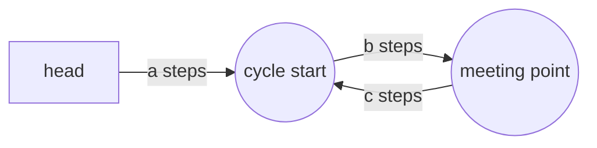

# Fast and Slow Pointers {#ch-fast-and-slow-pointers}

> Detect a cycle, or find a midpoint, in one pass and constant extra space.

**In this chapter:** why the fast pointer must catch the slow one · cycle detection · the midpoint · the equation that finds where a cycle starts · the questions that are cycles in disguise

## 💡 The Core Idea

Two pointers walk the same structure at different speeds — one node per step, two nodes per step. If
the structure ends, the fast one falls off the end first. If it loops, the fast one comes around from
behind and lands on the slow one.

That is the whole pattern. Its value is what it replaces: the obvious way to find a cycle is a `Set`
of every node already visited, which costs `O(n)` memory. Two pointers cost two variables.

> The gap between the pointers closes by exactly one node per step, because fast gains two and slow
> gains one. Inside a cycle of length `L` the gap is at most `L`, so they meet within `L` steps. There
> is no way to jump over the slow pointer — a gap of 1 becomes a gap of 0.

## How It Works

### Cycle detection

```typescript
interface ListNode {
  val: number;
  next: ListNode | null;
}

function hasCycle(head: ListNode | null): boolean {
  let slow: ListNode | null = head;
  let fast: ListNode | null = head;

  // Guard fast and fast.next — fast is the one that runs off the end
  while (fast !== null && fast.next !== null) {
    slow = slow!.next;        // 1 step
    fast = fast.next.next;    // 2 steps
    if (slow === fast) return true;   // reference equality, not value equality
  }
  return false;               // fast reached null, so the list terminates
}
// Time: O(n), Space: O(1)  — the Set version is O(n) space
```

The loop condition carries the whole correctness argument for the no-cycle case. `fast` moves two, so
both `fast` and `fast.next` must exist before the step. When either is `null` the list has an end, and
an ending list cannot loop.

### Finding the middle

Same two speeds, no cycle. When fast reaches the end, slow is halfway.

```typescript
function middleNode(head: ListNode | null): ListNode | null {
  let slow = head;
  let fast = head;

  while (fast !== null && fast.next !== null) {
    slow = slow!.next;
    fast = fast.next.next;
  }
  return slow;   // for even lengths this is the second of the two middles
}
// Time: O(n), Space: O(1)
```

Slow covers half the distance fast does, so when fast has travelled `n` nodes slow has travelled
`n / 2`. Starting both at `head` returns the **second** middle on an even-length list — `3` out of
`[1, 2, 3, 4]`. Start `fast` at `head.next` instead and you get the first. Read the problem statement:
Reorder List and Palindrome Linked List want different halves.

### Finding where the cycle starts

This is the part worth memorising, because the derivation is not something to invent under pressure.



**The tail is `a` nodes long; the meeting point sits `b` into the cycle, `c` short of returning to the start.**

When they meet, slow has walked `a + b` and fast has walked exactly twice that. Fast also went round
the cycle some whole number of times, so its distance is `a + b + k(b + c)` for some `k ≥ 1`. Setting
the two equal:

```text
2(a + b) = a + b + k(b + c)
     a + b = k(b + c)
         a = k(b + c) − b
         a = (k − 1)(b + c) + c
```

So `a` and `c` differ only by whole laps of the cycle. Walk one pointer from `head` and one from the
meeting point, both at one step, and they collide at the cycle start.

```typescript
function detectCycleStart(head: ListNode | null): ListNode | null {
  let slow = head;
  let fast = head;

  while (fast !== null && fast.next !== null) {
    slow = slow!.next;
    fast = fast.next.next;
    if (slow === fast) {
      // Phase 2: reset one pointer, then move both at the same speed
      let entry = head;
      while (entry !== slow) {
        entry = entry!.next;
        slow = slow!.next;
      }
      return entry;
    }
  }
  return null;
}
// Time: O(n), Space: O(1)
```

## When to Use It

| Signal in the question                                     | Reach for                | Why                                          |
| ---------------------------------------------------------- | ------------------------ | -------------------------------------------- |
| "Does this linked list have a cycle?"                      | Fast and slow            | The defining case                            |
| "Where does the cycle begin?"                              | Fast and slow, two phase | The `a = c` equation above                    |
| "Find the middle" or "the `n`th from the end"              | Fast and slow            | One pass, no length count                    |
| A sequence defined by `x = f(x)` — Happy Number            | Fast and slow            | Repeated function calls are a linked list     |
| An array where `nums[i]` is a valid index — LC 287         | Fast and slow            | The array *is* the `next` pointer             |
| Random access is available and memory is free              | Index arithmetic         | Cheaper to reason about                       |
| You need every node visited exactly once, in order         | A single pointer         | Two pointers add nothing                      |

The two rows in the middle are what separate a candidate who has memorised 141 from one who has
understood it. Any function that maps a value to exactly one next value builds an implicit linked
list, and Floyd's algorithm applies unchanged:

```typescript
// LC 202 — a number is "happy" if repeatedly summing the squares of its digits reaches 1
function isHappy(n: number): boolean {
  const next = (x: number): number =>
    String(x).split('').reduce((sum, d) => sum + Number(d) ** 2, 0);

  let slow = n;
  let fast = next(n);
  while (fast !== 1 && slow !== fast) {
    slow = next(slow);
    fast = next(next(fast));
  }
  return fast === 1;   // either it terminated at 1, or it cycled
}
// Time: O(log n) per step, Space: O(1)  — the Set version stores every value seen
```

## Common Mistakes

**Guarding only `fast`:**

```typescript
// ❌ while (fast !== null) { fast = fast.next.next; }   // throws on the last node
// ✅ while (fast !== null && fast.next !== null)
```

**Comparing values instead of references:**

```typescript
// ❌ if (slow.val === fast.val) return true;   // duplicate values are not a cycle
// ✅ if (slow === fast) return true;           // same node object
```

A list of `[1, 1, 1]` with no cycle returns `true` under the first version.

**Starting the pointers apart, then checking before moving:**

```typescript
// ❌ let slow = head, fast = head.next;
//    if (slow === fast) ...            // never true on the first check, and the phase-2 maths breaks
// ✅ start both at head, move first, compare second
```

The cycle-start derivation assumes both pointers left `head` together. Offsetting them still detects a
cycle but shifts the meeting point, so phase 2 returns the wrong node.

**Using a speed ratio other than 2:1 for phase 2:**

```typescript
// ❌ fast = fast.next.next.next;   // detection still works; a = c no longer holds
```

**Returning `slow` for the middle without reading which middle is wanted:**

```typescript
// ❌ assuming [1,2,3,4] gives 2
// ✅ both from head gives 3 (second middle); fast from head.next gives 2
```

## Problems to Practise

| #   | Problem                          | Difficulty | What it drills                              |
| --- | -------------------------------- | ---------- | ------------------------------------------- |
| 141 | Linked List Cycle                | Easy       | The null guards and reference equality      |
| 876 | Middle of the Linked List        | Easy       | Which middle the offset gives you           |
| 202 | Happy Number                     | Easy       | A cycle with no linked list in sight        |
| 142 | Linked List Cycle II             | Medium     | Phase 2, and the `a = c` equation           |
| 234 | Palindrome Linked List           | Medium     | Midpoint, then reverse the second half      |
| 143 | Reorder List                     | Medium     | Midpoint, reverse, then interleave          |
| 287 | Find the Duplicate Number        | Medium     | Treating `nums[i]` as a `next` pointer      |
| 457 | Circular Array Loop              | Hard       | Direction changes invalidate a found cycle  |

Do 141 and 142 back to back, then 287. The third one is the first two with the linked list removed,
and getting it without hints is the sign the pattern has landed.

## 🔑 Key Takeaways

- Two pointers at speeds 1 and 2 close their gap by one node per step, so in a cycle they must meet.
- The pattern replaces `O(n)` memory with `O(1)`, which is the only reason to prefer it over a `Set`.
- After a meeting, a pointer from `head` and a pointer from the meeting point converge on the cycle start.
- `while (fast && fast.next)` is the guard; the fast pointer is the only one that can dereference `null`.
- Any `x → f(x)` sequence is a linked list, so Happy Number and Find the Duplicate Number are the same problem.

## Interview Questions

**Q: Why does the fast pointer always catch the slow one inside a cycle? Could it jump over?**

Each step the gap between them shrinks by exactly one, because fast gains two positions and slow
gains one. A gap of one therefore becomes a gap of zero — there is no way to skip past. Since the gap
starts at most the cycle length `L`, they meet within `L` steps of both being inside the cycle.

**Q: Why 2:1 and not 3:1?**

Detection works for any ratio above 1:1, but 2:1 is the only one where the meeting-point distance
reduces to `a = c` cleanly, which is what makes finding the cycle start a two-line addition. Higher
ratios also risk stepping over the slow pointer for a gap that is not a multiple of the speed
difference, so you need extra care for no benefit.

**Q: When would you use a `Set` instead?**

When memory is not the constraint and you need more than a yes or no — the set of nodes in the cycle,
the order they were visited, or a count. The `Set` version is also easier to read and harder to get
wrong under time pressure, so it is a legitimate first answer as long as you name the `O(n)` space cost
and then offer Floyd's as the optimisation.

**Q: How does Find the Duplicate Number become a cycle problem?**

With `n + 1` values in the range `1…n`, treating `i → nums[i]` gives every index exactly one successor,
so it is a linked list where the duplicate value is a node two pointers arrive at from different
places. That makes it the cycle-entry node, and phase 2 finds it in `O(1)` space without modifying the
input — which is exactly what the problem forbids you to do.

**Q: What breaks if the input is a doubly linked list, or a tree?**

Nothing about the arithmetic, but the pattern loses its point. A doubly linked list can be walked
backwards, and a tree has no single `next`, so "two speeds along one path" no longer describes the
structure. The pattern needs a single deterministic successor per node.

## What to Read Next

- [Chapter ?? — In-Place Linked List Reversal](#ch-in-place-linked-list-reversal) — the other half of Palindrome Linked List and Reorder List
- [Chapter ?? — Two Pointers](#ch-two-pointers) — the same two-index idea when the array is sorted and indexable
- [Chapter ?? — Time and Space Complexity](#ch-time-and-space-complexity) — why an `O(1)` space answer is worth the extra thought
