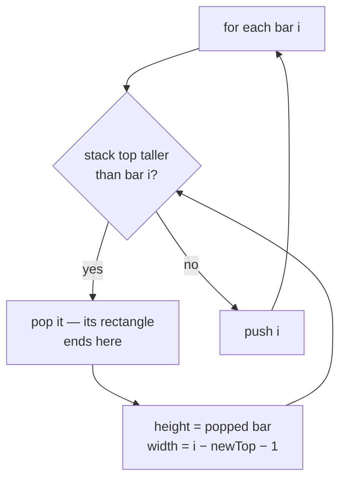

# Monotonic Stack {#ch-monotonic-stack}

> Answer "next greater" or "next smaller" for every element in one pass, by keeping only the elements that can still be an answer.

**In this chapter:** what the stack holds and why it is indices · the template · increasing versus decreasing · why popping in a loop is still `O(n)` · the histogram problems that are this pattern in disguise

## 💡 The Core Idea

A queue at a ticket counter: anyone shorter than the person who just arrived can no longer be the
tallest person ahead of you, so they are worthless as an answer and can be discarded. A monotonic stack
is that discard rule applied to an array.

Walk left to right. Before pushing the current element, pop everything on the stack that the current
element beats. Each popped element has just found its answer — the current element is its "next
greater". What remains on the stack is always sorted, which is where the name comes from.

The brute force is a nested loop: for each element, scan right until something bigger appears. That is
`O(n²)`. The stack version is `O(n)` because it never re-examines an element it has already discarded.

> **Store indices, not values.** Almost every question in this family asks for a distance — "how many
> days until a warmer day" — and an index lets you subtract. If you only need the value, read
> `nums[stack[stack.length - 1]]`.

## How It Works

### The template

```typescript
// LC 739 — for each day, how many days until a warmer temperature
function dailyTemperatures(temps: number[]): number[] {
  const answer: number[] = new Array(temps.length).fill(0);
  const stack: number[] = [];   // indices, temperatures strictly decreasing down the stack

  for (let i = 0; i < temps.length; i++) {
    // Everything cooler than today has found its warmer day: today
    while (stack.length > 0 && temps[stack[stack.length - 1]] < temps[i]) {
      const cooler = stack.pop()!;
      answer[cooler] = i - cooler;   // the distance is why we stored indices
    }
    stack.push(i);
  }
  // Anything still on the stack never found a warmer day, and keeps its 0
  return answer;
}
// Time: O(n), Space: O(n)  — the brute force is O(n²)
```

Three lines of structure, and every problem in the family is a variation on them: pop while the
monotonic condition is violated, resolve each popped element, then push.

### Why the inner `while` does not make it quadratic

Each index is pushed exactly once and popped at most once, so the total number of pops across the whole
run is at most `n`. One iteration can pop many elements, but that only happens because earlier
iterations pushed them, and they can never come back. The total work is `2n` pushes and pops, regardless
of how lumpy the distribution is.

This is amortised analysis, and it is the same argument as the sliding window's shrink loop — see
[Chapter ?? — Sliding Window](#ch-sliding-window).

### Increasing or decreasing

The direction of the comparison is the only thing that changes, and getting it backwards is the most
common failure in the pattern.

| You want                | Stack holds (top to bottom) | Pop while                    | Resolved element gets       |
| ----------------------- | --------------------------- | ---------------------------- | --------------------------- |
| Next **greater** to the right | Decreasing            | `nums[top] < nums[i]`        | `i` as its answer            |
| Next **smaller** to the right | Increasing            | `nums[top] > nums[i]`        | `i` as its answer            |
| Previous **greater** to the left | Decreasing         | `nums[top] <= nums[i]`       | the new `top` after popping  |
| Previous **smaller** to the left | Increasing         | `nums[top] >= nums[i]`       | the new `top` after popping  |

The two halves are worth reading together. "Next X to the right" is answered **when an element is
popped**. "Previous X to the left" is answered **when an element is pushed** — whatever is still under
it on the stack is the nearest qualifying element behind it. Same loop, different line does the work.

For duplicates, choose `<` or `<=` deliberately: strict comparison leaves equal values on the stack, so
"next strictly greater" needs `<` and "next greater or equal" needs `<=`.

### The circular variant

Next Greater Element II wraps around. Rather than a second stack pass, walk `2n` indices and take
`i % n`, pushing only during the first lap:

```typescript
function nextGreaterElements(nums: number[]): number[] {
  const n = nums.length;
  const answer: number[] = new Array(n).fill(-1);
  const stack: number[] = [];

  for (let i = 0; i < 2 * n; i++) {
    const value = nums[i % n];
    while (stack.length > 0 && nums[stack[stack.length - 1]] < value) {
      answer[stack.pop()!] = value;
    }
    if (i < n) stack.push(i);   // second lap only resolves; it must not add new work
  }
  return answer;
}
// Time: O(n), Space: O(n)
```

### The histogram shape

Largest Rectangle in Histogram is the same stack with a different resolution step. When a bar is
popped, the popped bar's height is the limiting height, and its width runs from the bar after the new
stack top to the bar before `i`.



**Popping is where the rectangle is measured: the bar cannot extend past `i`, and cannot extend left past whatever is still on the stack.**

Trapping Rain Water, Maximal Rectangle and Sum of Subarray Minimums are all this same
pop-and-measure step with a different formula inside it.

## When to Use It

| Signal in the question                                        | Reach for         | Why                                          |
| ------------------------------------------------------------- | ----------------- | -------------------------------------------- |
| "Next greater / smaller element" for **every** element        | Monotonic stack   | The defining case                             |
| "How many days / steps until…"                                | Monotonic stack   | Indices give the distance                     |
| Bars, buildings, skylines, histograms                         | Monotonic stack   | Each bar's span is bounded by shorter neighbours |
| "Remove `k` digits to make the smallest number"               | Monotonic stack   | Greedy popping builds the answer directly     |
| Maximum of every window of size `k`                           | Monotonic **deque** | You must also drop from the front as the window moves |
| You need the maximum of the whole array, once                 | A single scan     | A stack adds nothing                          |
| The array is sorted                                           | Two pointers or binary search | The answer is adjacent, so nothing needs discarding |

Sliding Window Maximum is the row that catches people. It looks like a window question and behaves like
this one — the structure is a monotonic **deque**, because elements also expire off the left when the
window slides past them.

## Common Mistakes

**Storing values when the answer is a distance:**

```typescript
// ❌ stack.push(temps[i]);        // no way to compute i - cooler
// ✅ stack.push(i);               // read the value with temps[stack[stack.length - 1]]
```

**Getting the comparison direction backwards:**

```typescript
// ❌ while (temps[stack.at(-1)!] > temps[i])   // this finds next *smaller*
// ✅ while (temps[stack.at(-1)!] < temps[i])   // next greater
```

Sanity check with two elements. `[1, 2]` must give index 0 an answer; if it does not, the sign is wrong.

**Checking the stack top before checking the stack is non-empty:**

```typescript
// ❌ while (temps[stack.at(-1)!] < temps[i] && stack.length > 0)   // reads undefined first
// ✅ while (stack.length > 0 && temps[stack.at(-1)!] < temps[i])
```

**Forgetting the leftovers:**

```typescript
// ❌ assuming every index gets resolved — indices still on the stack at the end never do
// ✅ pre-fill the answer array with the "no answer" sentinel (0 or -1) before the loop
```

**Pushing during the second lap of a circular pass:**

```typescript
// ❌ stack.push(i % n);            // the same index enters twice and the stack never drains
// ✅ if (i < n) stack.push(i);
```

**Using `<=` when the problem says strictly greater:**

```typescript
// ❌ on [2, 2, 3], `<=` pops the first 2 at the second 2 and reports a distance of 1
// ✅ use `<` for "strictly greater", and decide this before writing the loop
```

## Problems to Practise

| #    | Problem                            | Difficulty | What it drills                                   |
| ---- | ---------------------------------- | ---------- | ------------------------------------------------ |
| 496  | Next Greater Element I             | Easy       | The template, plus a value-to-answer map          |
| 739  | Daily Temperatures                 | Medium     | Indices, distances, and the leftover zeroes       |
| 503  | Next Greater Element II            | Medium     | The circular `2n` pass                            |
| 901  | Online Stock Span                  | Medium     | Previous-greater, resolved on push                |
| 402  | Remove K Digits                    | Medium     | The stack as the answer, not a scratchpad         |
| 907  | Sum of Subarray Minimums           | Medium     | Counting spans instead of measuring one           |
| 84   | Largest Rectangle in Histogram     | Hard       | The pop-and-measure width formula                 |
| 42   | Trapping Rain Water                | Hard       | Two-pointer and stack solutions both exist        |

Do 739 until the template is muscle memory, then 84. If 84 makes sense, 85 and 907 are bookkeeping on
top of it.

## 🔑 Key Takeaways

- A monotonic stack discards elements that can never be an answer again, turning an `O(n²)` scan into `O(n)`.
- Store indices; almost every question in the family wants a distance or a width.
- A **decreasing** stack finds next greater; an **increasing** stack finds next smaller.
- "Next to the right" is answered on pop, "previous to the left" on push — same loop, different line.
- Pre-fill the answer array with the sentinel, because elements left on the stack never get resolved.

## Interview Questions

**Q: There is a `while` loop inside the `for` loop. Why is this `O(n)`?**

Each index is pushed once and popped at most once, so the total pops over the entire run are bounded by
`n`. A single iteration may pop many elements, but only because earlier iterations pushed them and they
can never return. Total work is `2n` operations, which is `O(n)` amortised.

**Q: Why store indices rather than values?**

Because the answer is usually positional. Daily Temperatures wants `i - cooler`, and Largest Rectangle
wants a width measured between two stack entries. An index gives you the value for free via the array,
whereas a value gives you no way back to a position.

**Q: How do you decide between an increasing and a decreasing stack?**

Ask what an element is waiting for. If it is waiting for something bigger, then anything smaller
arriving cannot help it — so smaller elements must have already been popped, which means the stack is
decreasing. Reverse the sentence for next-smaller. Verifying on a two-element array takes five seconds
and catches the mistake before it costs anything.

**Q: When is a monotonic stack the wrong tool even though the question mentions "maximum"?**

When elements have to leave from both ends. Sliding Window Maximum needs the front dropped as the
window advances, so it needs a deque, not a stack. Equally, if the array is sorted, the next greater
element is simply the neighbour and no structure is needed at all.

**Q: How does Largest Rectangle in Histogram use this pattern?**

The stack holds indices of bars in increasing height. When a shorter bar arrives, every taller bar on
the stack can no longer extend right, so it is popped and its rectangle measured: the popped bar's
height, and a width running from just after the new stack top to just before the current index. A
sentinel bar of height 0 appended to the input drains the stack at the end without a second loop.

## What to Read Next

- [Chapter ?? — Sliding Window](#ch-sliding-window) — the same amortised argument, applied to a span rather than a stack
- [Chapter ?? — Top K Elements](#ch-top-k-elements) — when "largest" needs an ordering rather than a discard rule
- [Chapter ?? — Two Pointers](#ch-two-pointers) — the alternative solution to Trapping Rain Water, in `O(1)` space
