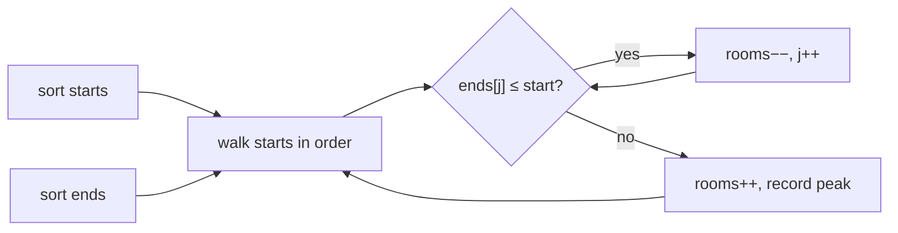

# Overlapping Intervals {#ch-overlapping-intervals}

> Sort the intervals first, and every question about overlap becomes a comparison between two numbers.

**In this chapter:** the four overlap shapes and the one test that covers them all · merging · the sweep line for "how many at once" · sorting by start versus by end · the inclusive/exclusive trap

## 💡 The Core Idea

An interval is a start and an end: a meeting, a booking, a version range, a maintenance window. Every
question in this family — merge them, count the concurrent ones, insert one, remove the fewest — is
answered by the same first move.

**Sort, then compare each interval only against its neighbour.** Unsorted, interval `i` can overlap
anything, so you check all pairs at `O(n²)`. Sorted by start, an interval can only overlap what came
just before it, so one pass is enough.

A calendar is the everyday version. You do not scan the whole week to see whether two meetings clash;
you read down the day in order and notice when one row starts before the row above it ends.

> Two intervals `[a, b]` and `[c, d]`, sorted so `a ≤ c`, overlap when `c ≤ b`. That single comparison
> covers containment, partial overlap and touching endpoints. You never need the four cases separately.

## How It Works

### Merging

```typescript
type Interval = [start: number, end: number];

function merge(intervals: Interval[]): Interval[] {
  if (intervals.length === 0) return [];

  // Sort by start. Everything below relies on it.
  const sorted = [...intervals].sort((a, b) => a[0] - b[0]);
  const merged: Interval[] = [sorted[0]];

  for (let i = 1; i < sorted.length; i++) {
    const last = merged[merged.length - 1];
    const [start, end] = sorted[i];

    if (start <= last[1]) {
      // Overlap — extend. Math.max matters: the current interval may sit entirely inside the last one
      last[1] = Math.max(last[1], end);
    } else {
      merged.push([start, end]);
    }
  }
  return merged;
}
// Time: O(n log n) for the sort, O(n) for the pass. Space: O(n) for the output
```

`Math.max(last[1], end)` is the line that handles containment. On `[[1, 10], [2, 3]]` a plain
`last[1] = end` shrinks the merged interval to `[1, 3]` and silently loses coverage.

The sort dominates the cost, so `O(n log n)` is the floor for this pattern unless the input arrives
sorted — which is worth asking about, because it drops the answer to `O(n)`.

### Counting concurrency — the sweep line

"How many meeting rooms are needed" is not a merge. Merging tells you *where* meetings happen; this asks
*how many at once*, which is a different question and needs a different decomposition.

Split each interval into two events and process them in time order. A start adds one, an end removes
one, and the answer is the highest the counter ever reaches.

```typescript
function minMeetingRooms(intervals: Interval[]): number {
  const starts = intervals.map(([s]) => s).sort((a, b) => a - b);
  const ends = intervals.map(([, e]) => e).sort((a, b) => a - b);

  let rooms = 0;
  let peak = 0;
  let endIndex = 0;

  for (const start of starts) {
    // Free every room whose meeting finished at or before this start
    while (endIndex < ends.length && ends[endIndex] <= start) {
      rooms--;
      endIndex++;
    }
    rooms++;
    peak = Math.max(peak, rooms);
  }
  return peak;
}
// Time: O(n log n), Space: O(n)
```

Decoupling the starts from the ends is the trick worth remembering: the two arrays are sorted
independently, because which meeting a freed room belonged to does not matter — only that one is free.



**Every start claims a room; every end that has already passed releases one. The peak is the answer.**

A min-heap of end times solves the same problem at the same complexity, and is the version to reach for
when you also need to know *which* room each meeting got — see
[Chapter ?? — Top K Elements](#ch-top-k-elements).

### Which key to sort by

The sort key is the actual decision in this pattern, and it is not always the start.

| Question                                        | Sort by | Then                                              |
| ----------------------------------------------- | ------- | ------------------------------------------------- |
| Merge overlapping intervals                     | Start   | Extend the last merged interval, or push a new one |
| Insert one interval into a sorted list          | Start   | Merge only the run that overlaps the new one       |
| Can one person attend all meetings?             | Start   | Any `start < previousEnd` is a clash               |
| Minimum rooms / maximum concurrency             | Both, separately | Sweep starts against ends            |
| **Maximum** non-overlapping intervals to keep   | **End** | Greedily keep each interval that starts after the last kept one ends |
| Fewest arrows to burst all balloons             | **End** | Same greedy — shoot at each kept interval's end     |

The last two rows are the ones that separate a memorised solution from an understood one. Sorting by
**end** works because finishing earliest leaves the most room for everything after it, which is the
standard exchange argument for interval scheduling. Sorting by start and greedily keeping the earliest
start is provably wrong: one very long interval starting at zero blocks everything.

## When to Use It

| Signal in the question                                       | Reach for              | Why                                    |
| ------------------------------------------------------------ | ---------------------- | -------------------------------------- |
| The input is a list of `[start, end]` pairs                  | Sort, then one pass    | The defining shape                      |
| "Merge", "overlap", "conflict", "clash"                      | Sort by start          | Neighbour comparison is enough          |
| "Minimum rooms", "maximum concurrent", "busiest moment"      | Sweep line or heap     | You need a count, not a span            |
| "Maximum number of non-overlapping…" or "fewest to remove"   | Sort by end, greedy    | The earliest finish leaves the most room |
| Intervals arrive one at a time and must be queried live      | An interval tree or an ordered map | Re-sorting per insert is `O(n log n)` each time |
| Many queries against a fixed set of intervals                | Prefix sums over a timeline | Sorting once per query wastes work |

⚠️ Check whether the endpoints are **inclusive**. If `[1, 2]` and `[2, 3]` count as overlapping the test
is `start <= last.end`; if touching is allowed it is `start < last.end`. Meeting Rooms treats touching
as fine — one meeting ending at 2 does not clash with one starting at 2 — while Merge Intervals treats
`[1, 4]` and `[4, 5]` as mergeable. Ask, or state your assumption out loud.

## Common Mistakes

**Not sorting:**

```typescript
// ❌ iterating the input as given — neighbour comparison is only valid on sorted input
// ✅ sort by start (or end) first, and say the O(n log n) cost out loud
```

**Overwriting the end instead of taking the maximum:**

```typescript
// ❌ last[1] = end;                        // [[1,10],[2,3]] merges to [1,3]
// ✅ last[1] = Math.max(last[1], end);
```

**Sorting the input array in place:**

```typescript
// ❌ intervals.sort(...)                   // mutates the caller's array
// ✅ [...intervals].sort(...)              // unless the problem says in-place is fine
```

**Using the default comparator on numbers:**

```typescript
// ❌ starts.sort();                        // lexicographic — [10, 9] stays [10, 9]
// ✅ starts.sort((a, b) => a - b);
```

**Solving Meeting Rooms II by merging:**

```typescript
// ❌ merge, then count the merged intervals — this counts busy blocks, not concurrency
// ✅ sweep starts against ends, or use a min-heap of end times
```

**Sorting by start for the "keep the most intervals" greedy:**

```typescript
// ❌ sort by start and keep greedily — one long interval starting at 0 blocks everything after it
// ✅ sort by end; earliest finish leaves the most room
```

## Problems to Practise

| #   | Problem                                       | Difficulty | What it drills                                    |
| --- | --------------------------------------------- | ---------- | ------------------------------------------------- |
| 252 | Meeting Rooms                                 | Easy       | The overlap test, and inclusive endpoints          |
| 56  | Merge Intervals                               | Medium     | The `Math.max` extension                           |
| 57  | Insert Interval                               | Medium     | Merging one run without re-sorting                 |
| 253 | Meeting Rooms II                              | Medium     | Sweep line, or a heap of end times                 |
| 435 | Non-overlapping Intervals                     | Medium     | The sort-by-end greedy, and why it is optimal       |
| 452 | Minimum Number of Arrows to Burst Balloons    | Medium     | The same greedy wearing a costume                  |
| 986 | Interval List Intersections                   | Medium     | Two sorted lists, and intersection instead of union |
| 759 | Employee Free Time                            | Hard       | Merge across `k` lists, then read the gaps          |

Do 56 and 253 back to back — same input shape, different decomposition — then 435 and 452, which are
the same problem with different wording.

## 🔑 Key Takeaways

- Sorting first is the pattern; it turns an all-pairs `O(n²)` check into a single `O(n)` neighbour pass.
- Sorted so `a ≤ c`, intervals `[a, b]` and `[c, d]` overlap when `c ≤ b` — one test, all four shapes.
- Extend a merged interval with `Math.max`, or a contained interval silently shrinks it.
- Merging answers "where", a sweep line answers "how many at once"; they are different questions.
- "Keep the most non-overlapping intervals" sorts by **end**, because finishing earliest leaves the most room.

## Interview Questions

**Q: Why is sorting the first move, and what does it cost you?**

Unsorted, any interval could overlap any other, so correctness needs all `n²` pairs checked. Sorted by
start, an interval can only overlap one that began earlier, so comparing against the previous merged
interval is sufficient. It costs `O(n log n)`, which then dominates the whole solution — so it is worth
asking whether the input is already sorted, because that drops it to `O(n)`.

**Q: Give the overlap condition, and say why the four diagram cases are unnecessary.**

With `a ≤ c` guaranteed by the sort, `[a, b]` and `[c, d]` overlap exactly when `c ≤ b`. Containment,
partial overlap and touching all satisfy it, and a gap is the only way to fail it. The four-case
enumeration is a teaching device, not something to write in code.

**Q: Why can't you solve Meeting Rooms II by merging the intervals?**

Merging collapses overlapping intervals into busy blocks, so it tells you when at least one meeting is
running. It throws away the information you need — the depth of overlap. Three meetings all from 9 to 10
merge into a single interval identical to one meeting from 9 to 10, but need three rooms rather than one.

**Q: Why does the "keep the maximum number of non-overlapping intervals" greedy sort by end time?**

Choosing the interval that finishes earliest leaves the largest possible remaining timeline for
everything after it, and an exchange argument shows any optimal solution can be rewritten to start with
that choice without getting worse. Sorting by start fails on a counterexample as small as
`[[0, 10], [1, 2], [3, 4]]` — the earliest start blocks two intervals that would both have fitted.

**Q: How would you handle intervals that arrive continuously and must be queried live?**

Re-sorting per insertion is `O(n log n)` each time, so the shape changes: keep the intervals in a
structure ordered by start — a balanced tree or an ordered map — and on insert look up the neighbour on
each side to decide whether to merge. That makes insertion `O(log n)`. An interval tree is the
specialised version when the queries are "everything overlapping this range".

## What to Read Next

- [Chapter ?? — Top K Elements](#ch-top-k-elements) — the min-heap alternative to the sweep line
- [Chapter ?? — Prefix Sum](#ch-prefix-sum) — the tool for many range queries over one fixed timeline
- [Chapter ?? — Modified Binary Search](#ch-modified-binary-search) — how Insert Interval finds its position in `O(log n)`
