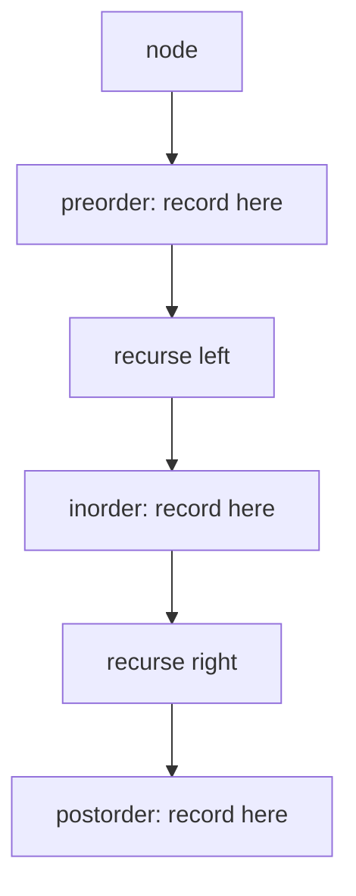

# Binary Tree Traversal {#ch-binary-tree-traversal}

> Pick the traversal order the problem needs, and most tree questions become four lines of recursion.

**In this chapter:** the four orders and what each one is for · why inorder on a BST is sorted · the iterative versions worth knowing · level order and the `levelSize` trick · the recursion depth that decides `O(h)` versus `O(n)`

## 💡 The Core Idea

A tree has no single "next" node, so visiting every node means choosing an order. There are only four
worth knowing, and three of them differ by **where the node itself is visited** relative to its children.

```typescript
interface TreeNode {
  val: number;
  left: TreeNode | null;
  right: TreeNode | null;
}
```

| Order          | Visit sequence         | Use it when                                                    |
| -------------- | ---------------------- | -------------------------------------------------------------- |
| **Preorder**   | node → left → right    | You need the node before its children: copy a tree, serialise it |
| **Inorder**    | left → node → right    | The tree is a BST and you want sorted order                     |
| **Postorder**  | left → right → node    | The node's answer depends on its children: heights, sums, deletion |
| **Level order**| row by row, left to right | The answer is about depth: right-side view, minimum depth   |

The three depth-first orders are the *same traversal* with the node's own work moved to a different
line. That is the whole insight — write the recursion once, then move one line.

> Choosing the order is the actual work in a tree question. "Maximum depth" is postorder because a
> node's depth needs its children's depths first; "validate BST" is preorder because the bounds flow
> downwards.

## How It Works

### The three depth-first orders

```typescript
function inorder(node: TreeNode | null, out: number[] = []): number[] {
  if (node === null) return out;   // the base case: a missing child is not an error
  inorder(node.left, out);
  out.push(node.val);              // move this line to change the order
  inorder(node.right, out);
  return out;
}
// Time: O(n) — every node visited once. Space: O(h) for the call stack
```

Preorder pushes before the two calls; postorder pushes after both. Nothing else changes.

The space is `O(h)`, not `O(n)` — `h` is the height. On a balanced tree that is `O(log n)`; on a
degenerate tree that is a linked list in disguise it is `O(n)`, and deep enough input overflows the
stack. That distinction is the one interviewers ask about.

### Why inorder on a BST is sorted

A BST's invariant is that everything in the left subtree is smaller than the node and everything in the
right is larger. Inorder visits exactly in that order — all the smaller values, then the node, then all
the larger ones — and the property holds recursively at every level. So the output is ascending by
construction.

The practical consequence: **"kth smallest in a BST" is an inorder traversal with a counter**, and it
can stop early rather than building the whole list.

```typescript
function kthSmallest(root: TreeNode | null, k: number): number {
  const stack: TreeNode[] = [];
  let node = root;
  let remaining = k;

  while (node !== null || stack.length > 0) {
    while (node !== null) {      // walk left as far as possible, remembering the way back
      stack.push(node);
      node = node.left;
    }
    node = stack.pop()!;         // the smallest unvisited node
    if (--remaining === 0) return node.val;
    node = node.right;
  }
  throw new Error('k is larger than the tree');
}
// Time: O(h + k), Space: O(h)
```

That is the **iterative inorder**, and it is the only iterative traversal worth memorising. The stack is
doing by hand exactly what recursion does for you, which is why it is the answer to "can you do this
without recursion?"

### Level order

Level order is breadth-first, so it needs a queue rather than a stack. The one non-obvious part is
capturing the row size **before** the loop, so each row is grouped correctly.

```typescript
function levelOrder(root: TreeNode | null): number[][] {
  if (root === null) return [];

  const rows: number[][] = [];
  let queue: TreeNode[] = [root];

  while (queue.length > 0) {
    const levelSize = queue.length;   // read it now — the loop below will grow the queue
    const row: number[] = [];
    const next: TreeNode[] = [];

    for (let i = 0; i < levelSize; i++) {
      const node = queue[i];
      row.push(node.val);
      if (node.left !== null) next.push(node.left);
      if (node.right !== null) next.push(node.right);
    }
    rows.push(row);
    queue = next;
  }
  return rows;
}
// Time: O(n), Space: O(w) where w is the widest level
```

Swapping in a fresh array per level avoids `Array.prototype.shift()`, which is `O(n)` in V8 and quietly
turns the traversal into `O(n²)` on a wide tree.

Space is `O(w)`, the maximum width — which on a balanced tree is roughly `n / 2`, so level order costs
`O(n)` space where depth-first costs `O(log n)`. The trade runs the other way on a degenerate tree.



**One traversal, three places to do the node's own work. The order is which line you pick.**

Once each level is a group, a family of questions falls out with no new machinery: right-side view is
the last element of each row, minimum depth is the first row containing a leaf, and zigzag is the same
loop reversing alternate rows.

## When to Use It

| The question asks for                                   | Traversal            | Why                                          |
| ------------------------------------------------------- | -------------------- | -------------------------------------------- |
| Sorted values from a BST, or the kth smallest           | Inorder              | The BST invariant makes it ascending          |
| A copy, or a serialisation you can rebuild from         | Preorder             | The root arrives before anything needs it     |
| Height, diameter, subtree sums, "is it balanced"        | Postorder            | The node's answer is a function of its children |
| Level averages, right-side view, minimum depth          | Level order          | Depth is the thing being measured              |
| Shortest path in an unweighted graph                    | BFS                  | Level order generalised — see the BFS chapter |
| All root-to-leaf paths, or all combinations             | Preorder with backtracking | The path is built on the way down       |
| A node's parent or ancestors                            | Postorder, returning up | The answer is discovered on the way back |

⚠️ Deleting or freeing a tree must be **postorder**. Preorder frees the node while its children are still
only reachable through it, which leaks the whole subtree. The same logic applies to any bottom-up
aggregate — folder sizes, dependency counts.

## Common Mistakes

**Recursing before checking for `null`:**

```typescript
// ❌ out.push(node.val); if (node === null) return;   // throws on a missing child
// ✅ if (node === null) return; — the base case comes first
```

**Getting the iterative preorder stack order backwards:**

```typescript
// ❌ stack.push(node.left); stack.push(node.right);   // pops right first
// ✅ stack.push(node.right); stack.push(node.left);   // a stack reverses what you give it
```

**Not capturing the level size:**

```typescript
// ❌ for (let i = 0; i < queue.length; i++)   // the queue grows inside the loop; rows merge
// ✅ const levelSize = queue.length;          // read once, before the loop
```

**Using `shift()` as a queue:**

```typescript
// ❌ const node = queue.shift()!;   // O(n) per call — O(n²) overall on a wide tree
// ✅ index into the array, or swap in a fresh array per level
```

**Assuming inorder is sorted for any binary tree:**

```typescript
// ❌ inorder(root) and checking it is ascending only works if it is a BST to begin with
// ✅ that check is exactly how you validate a BST — but state the assumption
```

**Claiming `O(log n)` space for recursion:**

```typescript
// ❌ "recursion is O(log n) space"
// ✅ it is O(h). Balanced means O(log n); a skewed tree means O(n) and can overflow the stack
```

## Problems to Practise

| #   | Problem                                        | Difficulty | What it drills                                |
| --- | ---------------------------------------------- | ---------- | --------------------------------------------- |
| 94  | Binary Tree Inorder Traversal                  | Easy       | The recursion, then the iterative stack        |
| 102 | Binary Tree Level Order Traversal              | Medium     | The `levelSize` grouping                       |
| 104 | Maximum Depth of Binary Tree                   | Easy       | Postorder in three lines                       |
| 199 | Binary Tree Right Side View                    | Medium     | The last element of each row                   |
| 103 | Binary Tree Zigzag Level Order Traversal       | Medium     | Level order with alternating direction         |
| 230 | Kth Smallest Element in a BST                  | Medium     | Early-stopping iterative inorder               |
| 98  | Validate Binary Search Tree                    | Medium     | Bounds flowing down, not a local comparison    |
| 297 | Serialize and Deserialize Binary Tree          | Hard       | Why preorder with null markers rebuilds a tree |

Do 94 recursively and iteratively, then 102. After that, 199, 103 and 637 are the same loop with the row
read differently.

## 🔑 Key Takeaways

- Preorder, inorder and postorder are one traversal with the node's own work on a different line.
- Inorder on a BST is sorted, which is why kth-smallest is an inorder walk with a counter.
- Postorder is for anything a node computes from its children — heights, sums, and deletion.
- Level order needs a queue and the row size read **before** the loop, or the rows merge.
- Recursive traversal costs `O(h)` stack space: `O(log n)` balanced, `O(n)` skewed and liable to overflow.

## Interview Questions

**Q: Why does inorder traversal of a BST produce sorted output?**

The BST invariant says every value in the left subtree is smaller than the node and every value in the
right is larger. Inorder visits the left subtree, then the node, then the right — so it emits all smaller
values, then the node, then all larger ones. Because the invariant holds at every node, the property
composes recursively and the whole output is ascending.

**Q: Which traversal for computing the height of a tree, and why?**

Postorder. A node's height is one more than the taller of its children's heights, so both children must
be resolved before the node can answer. Preorder would visit the node while its children are still
unknown, which is the wrong direction for any bottom-up aggregate.

**Q: How do you traverse without recursion, and when does it matter?**

Replace the call stack with an explicit stack: walk left pushing every node, pop to visit, then move to
the popped node's right child. It matters when the tree may be deep enough to overflow the call stack —
a degenerate tree of 10⁵ nodes will — and when an interviewer asks for it directly, which is usually a
test of whether you understand what recursion is doing.

**Q: What is the space complexity of level order versus depth-first, and which is cheaper?**

Level order holds one level at a time, so `O(w)` where `w` is the widest level — on a balanced tree that
is about `n / 2`. Depth-first holds one root-to-leaf path, so `O(h)` — on a balanced tree `O(log n)`.
So depth-first is much cheaper on balanced trees, and the comparison reverses on a skewed tree, where
the width is 1 and the height is `n`.

**Q: Why can't you validate a BST by comparing each node to its two children?**

Because the constraint is not local. A node in the left subtree must be smaller than *every* ancestor it
descends from on a right branch, not just its parent — a value of 6 as the right child of 3 under a root
of 5 passes every parent-child check and still breaks the BST. The correct approach passes a `(min, max)`
range down the recursion, or checks that an inorder traversal is strictly increasing.

**Q: How does preorder let you rebuild a tree, when inorder alone cannot?**

Preorder gives you the root first, so with null markers for missing children the structure is
unambiguous — read a value, recursively build its left subtree, then its right. Inorder alone does not
identify the root, so it needs a second traversal (preorder or postorder) to disambiguate, which is why
the "construct from two traversals" questions always pair inorder with one of the others.

## What to Read Next

- [Chapter ?? — Depth-First Search](#ch-depth-first-search) — the same recursion once the structure is a graph rather than a tree
- [Chapter ?? — Breadth-First Search](#ch-breadth-first-search) — level order generalised, and why it finds shortest paths
- [Chapter ?? — Top K Elements](#ch-top-k-elements) — the alternative to an inorder walk when the tree is not a BST
