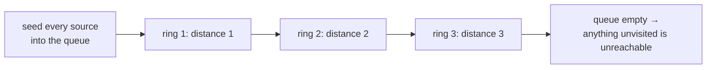

# Breadth-First Search {#ch-breadth-first-search}

> Explore in rings of increasing distance, so the first time you arrive somewhere is the shortest way there.

**In this chapter:** why BFS finds shortest paths and DFS does not · the queue template · counting levels · multi-source BFS · marking visited on enqueue · the memory cost that makes it the wrong default

## 💡 The Core Idea

BFS spreads. It visits everything one step away, then everything two steps away, and so on — like fire
across dry grass, or a ripple on water.

That ordering is the whole value. Because nodes are reached in order of distance, **the first time BFS
arrives at a node it has arrived by a shortest path**. No comparison, no revisiting, no bookkeeping: the
guarantee is structural. Depth-first search offers nothing equivalent, because it commits to one branch
and may reach a node the long way round first.

The mechanism is a queue — first in, first out. Swap the queue for a stack and you have DFS; that single
substitution is the difference between the two algorithms.

> The guarantee only holds when every edge costs the same. Give edges weights and BFS breaks, because
> three cheap steps can beat one expensive one. That is Dijkstra's job — see
> [Chapter ?? — Graph Algorithms](#ch-graph-algorithms).

## How It Works

### The template

```typescript
type Graph = Map<number, number[]>;

function shortestPath(graph: Graph, start: number, goal: number): number {
  if (start === goal) return 0;

  const visited = new Set<number>([start]);
  let frontier: number[] = [start];
  let distance = 0;

  while (frontier.length > 0) {
    distance++;
    const next: number[] = [];

    for (const node of frontier) {
      for (const neighbour of graph.get(node) ?? []) {
        if (visited.has(neighbour)) continue;
        if (neighbour === goal) return distance;
        visited.add(neighbour);   // mark on enqueue, not on dequeue
        next.push(neighbour);
      }
    }
    frontier = next;   // a fresh array per ring, so shift() is never needed
  }
  return -1;   // unreachable
}
// Time: O(V + E), Space: O(V)
```

Two decisions in that code are worth defending out loud.

**Mark visited on enqueue.** If you mark on dequeue instead, a node with three neighbours pointing at it
gets queued three times before it is ever processed. The answer stays correct; the queue can blow up
exponentially on a dense graph.

**Swap arrays instead of using `shift()`.** `Array.prototype.shift()` is `O(n)` in V8 because it
reindexes, so using it as a queue turns an `O(V + E)` traversal into `O(V²)`. Either hold a read index
into the array, or build one array per ring as above.

### Counting levels

When the question asks "how many steps", the ring boundary is what you count. Reading the frontier size
before the loop is the standard idiom:

```typescript
interface TreeNode {
  val: number;
  left: TreeNode | null;
  right: TreeNode | null;
}

// LC 111 — the depth of the shallowest leaf
function minDepth(root: TreeNode | null): number {
  if (root === null) return 0;

  let queue: TreeNode[] = [root];
  let depth = 1;

  while (queue.length > 0) {
    const next: TreeNode[] = [];
    for (const node of queue) {
      if (node.left === null && node.right === null) return depth;   // first leaf found wins
      if (node.left !== null) next.push(node.left);
      if (node.right !== null) next.push(node.right);
    }
    queue = next;
    depth++;
  }
  return depth;
}
// Time: O(n), Space: O(w) where w is the widest level
```

Minimum depth is the question that shows BFS earning its keep over DFS. A recursive solution has to
explore every branch to the bottom before it knows which is shallowest; BFS returns at the first leaf it
meets and never looks at the deep half of the tree.

### Multi-source BFS

If several starting points spread at once, seed the queue with **all of them** before the first step.
The rings then measure distance from the nearest source, not from any particular one.

```typescript
// LC 994 — minutes until every fresh orange rots, or -1
function orangesRotting(grid: number[][]): number {
  const rows = grid.length;
  const cols = grid[0].length;
  let frontier: [number, number][] = [];
  let fresh = 0;

  for (let r = 0; r < rows; r++) {
    for (let c = 0; c < cols; c++) {
      if (grid[r][c] === 2) frontier.push([r, c]);   // every rotten orange is a source
      else if (grid[r][c] === 1) fresh++;
    }
  }

  let minutes = 0;
  const directions: [number, number][] = [[1, 0], [-1, 0], [0, 1], [0, -1]];

  while (frontier.length > 0 && fresh > 0) {
    const next: [number, number][] = [];
    for (const [r, c] of frontier) {
      for (const [dr, dc] of directions) {
        const nr = r + dr;
        const nc = c + dc;
        if (nr < 0 || nr >= rows || nc < 0 || nc >= cols || grid[nr][nc] !== 1) continue;
        grid[nr][nc] = 2;   // the grid is the visited set
        fresh--;
        next.push([nr, nc]);
      }
    }
    frontier = next;
    minutes++;
  }
  return fresh === 0 ? minutes : -1;   // leftover fresh oranges are unreachable
}
// Time: O(rows × cols), Space: O(rows × cols)
```

Seeding all sources together is what keeps this `O(cells)`. Running a separate BFS from each rotten
orange and taking the minimum is `O(sources × cells)` for the same answer.



**One BFS, many sources. Each ring is one unit of distance from the nearest source, not from a chosen one.**

01 Matrix and As Far from Land as Possible are the same shape with the sources chosen differently.

## When to Use It

| Signal in the question                                    | Reach for            | Why                                        |
| --------------------------------------------------------- | -------------------- | ------------------------------------------ |
| "Shortest path", "fewest steps", "minimum moves"          | BFS                  | First arrival is the shortest arrival       |
| "How many levels", "minimum depth"                        | BFS with ring counting | The ring boundary *is* the level count   |
| Spread from many origins at once — rot, heat, flood       | Multi-source BFS     | Seed all sources before the first step      |
| Distance from every cell to the nearest X                 | Multi-source BFS from every X | One pass instead of one per cell   |
| The answer is likely close to the start                   | BFS                  | It never descends a long wrong branch       |
| Edges have **weights**                                    | Dijkstra             | Cheap-and-many can beat expensive-and-few   |
| "Does a path exist", or "all paths"                       | DFS                  | No distance ordering needed, and `O(h)` space |
| The graph is deep and narrow                              | DFS                  | BFS holds a whole ring; DFS holds one path  |

The last row is the honest cost. BFS space is `O(w)`, the widest ring — on a balanced binary tree that is
about `n / 2`, and on a wide grid it is the whole grid. DFS space is `O(h)`. So BFS is not a better
default; it is the right tool when distance ordering is the thing you need.

## Common Mistakes

**Marking visited on dequeue:**

```typescript
// ❌ pop, then check visited — the same node gets queued once per incoming edge
// ✅ mark it the moment it is pushed
```

**Using `shift()` as a queue:**

```typescript
// ❌ const node = queue.shift()!;   // O(n) per call in V8 — the traversal becomes O(V²)
// ✅ swap in a fresh array per ring, or hold a read index
```

**Not capturing the ring boundary:**

```typescript
// ❌ for (let i = 0; i < queue.length; i++)   // the queue grows inside the loop; levels merge
// ✅ read the size first, or build the next ring in a separate array
```

**Using a stack by accident:**

```typescript
// ❌ const node = stack.pop()!;   // this is DFS; the shortest-path guarantee is gone
// ✅ FIFO, always
```

**Adding multi-source starting points one at a time:**

```typescript
// ❌ for (const source of sources) bfs(source)   // O(sources × cells) for the same answer
// ✅ seed every source into the queue, then run one BFS
```

**Claiming BFS gives shortest paths on a weighted graph:**

```typescript
// ❌ BFS counts edges, not cost — 3 edges of weight 1 beat 1 edge of weight 10
// ✅ Dijkstra with a min-heap, or 0-1 BFS with a deque when weights are only 0 and 1
```

## Problems to Practise

| #    | Problem                             | Difficulty | What it drills                                     |
| ---- | ----------------------------------- | ---------- | -------------------------------------------------- |
| 111  | Minimum Depth of Binary Tree        | Easy       | Why BFS beats DFS when the answer is shallow        |
| 637  | Average of Levels in Binary Tree    | Easy       | The ring boundary as a grouping                     |
| 102  | Binary Tree Level Order Traversal   | Medium     | The template, on a tree                             |
| 994  | Rotting Oranges                     | Medium     | Multi-source seeding, and the unreachable check     |
| 542  | 01 Matrix                           | Medium     | Multi-source from every zero                        |
| 1091 | Shortest Path in Binary Matrix      | Medium     | Eight directions, and the early return              |
| 863  | All Nodes Distance K in Binary Tree | Medium     | Building parent links so a tree becomes a graph     |
| 127  | Word Ladder                         | Hard       | An implicit graph — neighbours are computed, not stored |

Do 994 then 542 — the second is the first with the sources chosen differently. Then 127, where realising
the graph does not exist until you generate it is the whole difficulty.

## 🔑 Key Takeaways

- BFS visits nodes in order of distance, so first arrival is shortest arrival — no comparisons needed.
- That guarantee needs uniform edge costs; weighted graphs need Dijkstra instead.
- Mark visited **on enqueue**, or one node enters the queue once per incoming edge.
- Never use `shift()` as a queue in JavaScript; it is `O(n)` and makes the traversal `O(V²)`.
- Multi-source BFS seeds every origin before the first step and still costs one pass.

## Interview Questions

**Q: Why does BFS guarantee the shortest path, and why doesn't DFS?**

BFS processes nodes in non-decreasing order of distance from the start: the whole ring at distance `d` is
finished before any node at `d + 1` is touched. So when a node is first reached, no shorter route to it
can exist — any such route would have been explored in an earlier ring. DFS follows one branch to its
end, so it can reach a node by a long detour before ever seeing the direct edge.

**Q: Where do you mark nodes visited, and what goes wrong otherwise?**

At the moment they are pushed onto the queue. If you mark on dequeue, then a node with `k` neighbours
already in the queue is enqueued `k` times before it is first processed. The result is still correct, but
the queue grows far beyond `O(V)` and on a dense graph that is the difference between passing and timing
out.

**Q: When is DFS the better choice?**

When there is no distance to measure — "does a path exist", "all root-to-leaf paths", counting connected
components — and when memory matters on a deep, narrow structure. BFS holds an entire ring, `O(w)`, while
DFS holds one path, `O(h)`. On a balanced tree that comparison strongly favours DFS; on a long chain it
reverses.

**Q: What is multi-source BFS and when does it apply?**

Seed the queue with every starting point before the first expansion, so the rings measure distance from
the *nearest* source. It applies whenever something spreads from several origins at once, or when you
need each cell's distance to the nearest X — rotting oranges, 01 Matrix, distance to the nearest gate.
It replaces one BFS per source with a single `O(V + E)` pass.

**Q: How do you recover the actual path, not just its length?**

Keep a `parent` map recording which node first enqueued each node, then walk it backwards from the goal
and reverse. That is `O(V)` extra space. Storing the whole path in each queue entry also works and is
easier to write, but it costs `O(V)` per entry, so it is only acceptable when the graph is small.

**Q: Can BFS be written recursively?**

Not naturally. Recursion gives you a stack, which is exactly the structure BFS is not using — the
ordering BFS depends on comes from FIFO behaviour. You can fake it by recursing once per level with the
frontier passed as an argument, but that is an explicit queue with extra steps, and it costs stack frames
for no benefit.

## What to Read Next

- [Chapter ?? — Depth-First Search](#ch-depth-first-search) — the same traversal with a stack, and when that is the better trade
- [Chapter ?? — Graph Algorithms](#ch-graph-algorithms) — Dijkstra, for when the edges have weights
- [Chapter ?? — Binary Tree Traversal](#ch-binary-tree-traversal) — level order, which is BFS on a structure with no cycles
