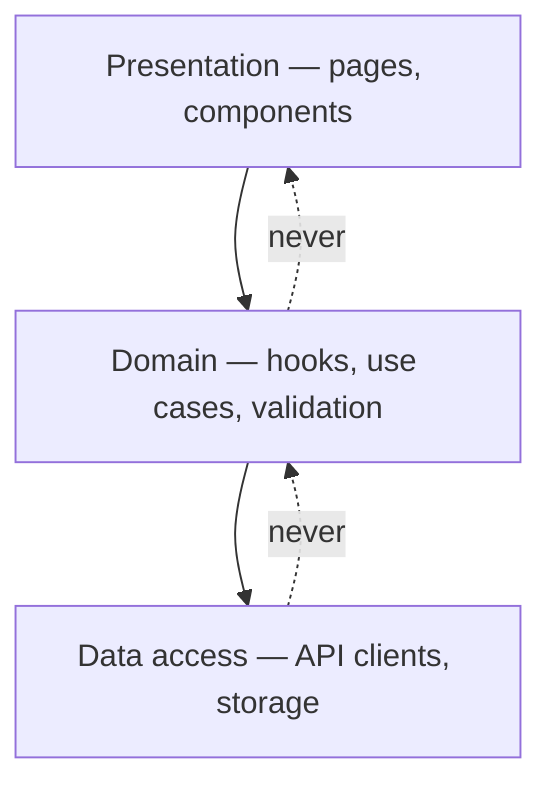

# Frontend Architecture Patterns {#ch-frontend-architecture-patterns}

> Put boundaries in a large client app so a change lands in one place instead of five.

**In this chapter:** what architecture buys you · component-based · layered · clean architecture · choosing between them · the mistakes that show up in review

## 💡 The Core Idea

Architecture is the set of rules about **which file is allowed to import which other file**. That is
all it is. Everything else — folder names, layer diagrams, dependency-injection containers — exists to
make those rules visible and hard to break by accident.

The reason it matters is not elegance. It is the cost of change. In a codebase with no boundaries, a
change to the shape of an API response touches components, tests, and three unrelated screens. In a
codebase with boundaries, it touches one file. Senior interviews probe this by asking where a change
lands, not by asking you to name a pattern.

## How It Works

Three patterns cover almost every real frontend. They are not alternatives — they stack.

| Pattern | The rule it adds | Cost |
| ------- | ---------------- | ---- |
| **Component-based** | UI is built from independent, typed pieces | Almost none — this is the default |
| **Layered** | Imports flow one way: UI → logic → data | A folder convention and a lint rule |
| **Clean architecture** | Domain code imports no framework at all | Interfaces and indirection everywhere |

### Component-based

The baseline for React, Svelte, Vue and Angular alike. The one decision worth making is where data
fetching lives, because that is what makes a component testable or not.

**Split the piece that fetches from the piece that renders:**

```typescript
interface User {
  id: string;
  name: string;
}

// Presentational — no data fetching, no router, no store. Trivial to test and to reuse.
interface UserCardProps {
  user: User;
  onEdit: () => void;
}

function UserCard({ user, onEdit }: UserCardProps) {
  return (
    <div className="card">
      <h3>{user.name}</h3>
      <button onClick={onEdit}>Edit</button>
    </div>
  );
}

// Container — owns the data and the side effects, renders no markup of its own.
function UserCardContainer({ userId }: { userId: string }) {
  const { data, isLoading } = useUser(userId);
  const router = useRouter();

  if (isLoading || !data) return <Skeleton />;
  return <UserCard user={data} onEdit={() => router.push(`/users/${userId}/edit`)} />;
}
```

> ⚠️ In React 19 the container/presentational split is less about testability than it used to be —
> Server Components already keep fetching out of the interactive tree. The durable principle survives:
> a component that fetches and a component that renders have different reasons to change.

### Layered

Three layers, and one rule: **imports only ever point downwards.**



**Imports flow one way; a dotted arrow is a violation a lint rule should reject.**

```typescript
// Data access — knows about HTTP, knows nothing about React
export const userApi = {
  getById: async (id: string): Promise<User> => {
    const res = await fetch(`/api/users/${id}`);
    if (!res.ok) throw new Error(`User ${id}: ${res.status}`);
    return res.json() as Promise<User>;
  },
};

// Domain — knows about caching and React Query, knows nothing about the URL
export function useUser(id: string) {
  return useQuery({ queryKey: ["user", id], queryFn: () => userApi.getById(id) });
}

// Presentation — knows nothing about either
function UserPage({ id }: { id: string }) {
  const { data } = useUser(id);
  return data ? <UserCard user={data} onEdit={() => {}} /> : <Skeleton />;
}
```

The layering only holds if something enforces it. In practice that is an ESLint rule
(`import/no-restricted-paths`) or the boundary plugin in your monorepo tool — not a code review habit.

### Clean architecture

Push the framework to the edge so the domain has no dependency on it. You could, in theory, replace
React with Svelte and leave the core untouched.

**A use case the UI calls into:**

```typescript
// Domain — plain TypeScript, no imports from any framework
interface AuthGateway {
  login(email: string, password: string): Promise<{ token: string }>;
}

export class LoginUseCase {
  constructor(private readonly gateway: AuthGateway) {}

  async execute(email: string, password: string): Promise<User> {
    if (!email.includes("@")) throw new Error("Invalid email");
    const { token } = await this.gateway.login(email, password);
    return decodeUser(token);
  }
}

// Presentation — depends on the use case, which depends on an interface, not on fetch
function LoginPage() {
  const useCase = useMemo(() => new LoginUseCase(new HttpAuthGateway()), []);
  // …
}
```

This is the pattern most often applied too early. It pays for itself in long-lived apps with real
domain rules — pricing, entitlements, regulated workflows — and it is dead weight in a CRUD dashboard.

## When to Use It

| Situation | Reach for | Why |
| --------- | --------- | --- |
| Any new app | Component-based only | Layers you do not need are just folders to argue about |
| Business logic appearing in three components | Layered | The duplication is the signal, not the headcount |
| Domain rules outliving the framework | Clean architecture | The rules survive a rewrite; the components will not |
| Teams blocking each other on deploys | Micro-frontends — see [Chapter ?? — Micro-Frontends](#ch-micro-frontends) | The bottleneck is organisational, not architectural |
| Shared code across separate frontends | A monorepo, not a new pattern — see [Chapter ?? — Monorepos](#ch-monorepos) | Tooling solves this cheaper than architecture does |

The honest answer in an interview is a sequence, not a pick: start component-based, add layering when
logic starts repeating, and only consider anything heavier when a concrete pain has a name.

## Common Mistakes

❌ **Business logic inside components.** A price calculation in a JSX file cannot be tested without
rendering, cannot be reused on the server, and gets copied the first time a second screen needs it.
✅ Move it to a plain function or a hook the component calls.

❌ **Layers with no enforcement.** A `data/` folder that components import from directly is a naming
convention, not an architecture.
✅ Add the lint rule the same day you add the folder.

❌ **Clean architecture in a CRUD app.** Three interfaces and a use-case class to fetch a list of
users is indirection with no payoff.
✅ Introduce it when a domain rule exists that is worth protecting.

❌ **Folders by type instead of by feature.** `components/`, `hooks/`, `utils/` at 200 files means
every feature is smeared across the tree and nothing can be deleted safely.
✅ Group by feature and keep only genuinely shared code in a shared folder.

## 🔑 Key Takeaways

- Architecture is a set of import rules; everything else is presentation of those rules.
- Component-based is the correct default, and the only decision it forces is where fetching lives.
- Layering is worth the cost the moment business logic starts appearing in more than one component.
- Clean architecture protects domain rules from the framework, and is dead weight without domain rules.
- A boundary that nothing enforces is a naming convention that will be gone in six months.

## Interview Questions

**Q: How would you structure a frontend that forty engineers work in?**

By feature, not by file type, with a small shared layer underneath and an enforced rule about which
direction imports may point. The reason is deletion: a feature folder can be removed in one commit,
whereas a feature spread across `components/`, `hooks/` and `utils/` cannot be removed safely at all.
Name the enforcement mechanism — a lint rule or a build-graph boundary — because that is what makes
the answer real rather than aspirational.

**Q: Where do you put business logic in a React app, and why not in the component?**

In plain functions, or in hooks that call them. A component is the wrong home because it can only run
inside a render, which makes the logic untestable without a renderer, unusable on the server, and
invisible to anyone looking for it. The test for whether logic belongs in a component is whether it
would still make sense if the UI were a CLI.

**Q: When would you *not* introduce a layered architecture?**

When there is no business logic to layer. A dashboard that fetches and displays is better served by
colocated data fetching than by three folders and an indirection per call. Layering is a response to
duplication and to logic that outgrew a single screen; introduced before that, it costs navigation
effort and buys nothing.

**Q: A change to one API response shape touched nine files. What went wrong?**

The response type leaked past the data-access boundary and became the type the UI renders directly.
The fix is a mapping step: the data layer owns the wire shape, maps it to a domain type, and only the
domain type is allowed upwards. That confines the next shape change to one file, which is the actual
point of the boundary.

## What to Read Next

- [Chapter ?? — Micro-Frontends](#ch-micro-frontends) — the pattern for when team independence, not code structure, is the bottleneck
- [Chapter ?? — Design Systems at Scale](#ch-design-systems-at-scale) — the shared layer underneath a feature-organised tree
- [Chapter ?? — Four Kinds of State](#ch-four-kinds-of-state) — the decision that sits inside every layer boundary above
