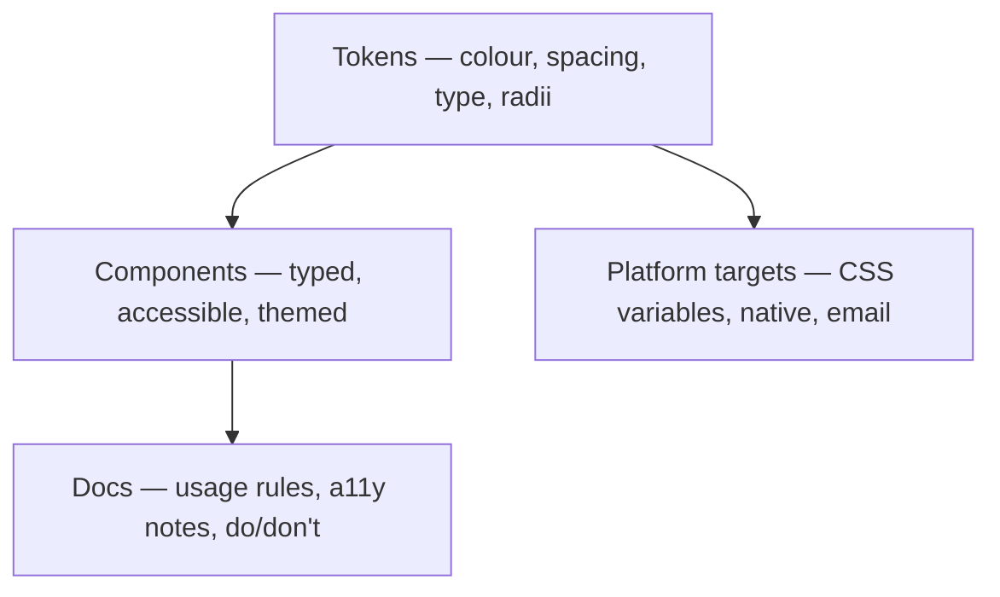

# Design Systems at Scale {#ch-design-systems-at-scale}

> Ship components forty teams can adopt without freezing the design.

**In this chapter:** the three layers · design tokens · the component contract · theming · versioning and breaking changes · why adoption is the hard part

## 💡 The Core Idea

A design system is three things stacked: **tokens** (the values), **components** (the implementations),
and **documentation** (how to choose between them). Its purpose is not consistency for its own sake —
it is that a change to the brand, the contrast ratio or the focus style happens once instead of forty
times.

The part that fails in practice is never the components. It is adoption and versioning. A design
system nobody upgrades to is a second UI library, and a system that ships breaking changes without a
migration path gets forked. Treat it as a product with consumers, because that is what it is.

## How It Works



**Tokens are the only layer other platforms can consume; components are web-only.**

### Design tokens

Tokens store design decisions as data. The rule that makes them work is the split between **primitive**
tokens (raw values, named after what they are) and **semantic** tokens (named after what they are for).

```typescript
// Primitives — never used directly in a component
const palette = {
  blue500: "#2196f3",
  blue700: "#1976d2",
  grey0: "#ffffff",
  grey900: "#212121",
  red600: "#d32f2f",
} as const;

// Semantics — the only names a component is allowed to reference
export const tokens = {
  colour: {
    surface: palette.grey0,
    text: palette.grey900,
    actionPrimary: palette.blue500,
    actionPrimaryHover: palette.blue700,
    danger: palette.red600,
  },
  space: { xs: "0.25rem", sm: "0.5rem", md: "1rem", lg: "1.5rem", xl: "2rem" },
  radius: { sm: "2px", md: "6px", pill: "999px" },
} as const;
```

The reason for the two layers is that `actionPrimary` can be re-pointed at a different primitive for a
sub-brand or a high-contrast theme. A component referencing `blue500` directly cannot be re-themed at all.

### The component contract

What a consumer depends on is the **props**, not the markup. Keep the surface small and typed, and keep
the accessible behaviour inside the component rather than in the consumer's hands.

```typescript
type ButtonVariant = "primary" | "secondary" | "ghost" | "danger";
type ButtonSize = "sm" | "md" | "lg";

interface ButtonProps extends React.ButtonHTMLAttributes<HTMLButtonElement> {
  variant?: ButtonVariant;
  size?: ButtonSize;
  loading?: boolean;
}

export function Button({
  variant = "primary",
  size = "md",
  loading = false,
  disabled,
  children,
  ...rest
}: ButtonProps) {
  return (
    <button
      className={`btn btn--${variant} btn--${size}`}
      // The a11y behaviour lives here so no consumer can forget it
      disabled={disabled ?? loading}
      aria-busy={loading || undefined}
      {...rest}
    >
      {loading ? <Spinner aria-hidden="true" /> : children}
    </button>
  );
}
```

Two decisions in that signature are worth defending in an interview. Extending
`ButtonHTMLAttributes` means consumers get `type`, `form` and `onFocus` without you enumerating them.
Not exposing a `className`-driven styling escape hatch — or exposing one deliberately and documenting
it as unsupported — is what stops the system being bypassed the first time a team is in a hurry.

### Theming

Themes swap semantic tokens, never component code. CSS custom properties are the mechanism that
works without re-rendering.

```typescript
// Emit semantic tokens as CSS variables, one block per theme
function themeToCss(theme: Record<string, string>, selector: string): string {
  const decls = Object.entries(theme)
    .map(([name, value]) => `  --ds-${name}: ${value};`)
    .join("\n");
  return `${selector} {\n${decls}\n}`;
}

// :root gets light, [data-theme="dark"] overrides it — no JavaScript on the render path
```

```css
.btn--primary {
  background: var(--ds-colour-action-primary);
  color: var(--ds-colour-surface);
  padding: var(--ds-space-sm) var(--ds-space-md);
}
```

A React context that holds a theme object forces every themed component to subscribe and re-render on
a theme change. CSS variables cascade instead, which is why the variable approach is the default for
new systems and the context approach survives mostly in older ones.

### Versioning and breaking changes

The system is a published package with an API. Semantic versioning is the contract, and a major
version needs three things or teams will not take it.

| Version bump | Means | What you owe consumers |
| ------------ | ----- | ---------------------- |
| Patch | Bug fix, no API change | Nothing |
| Minor | New component or new optional prop | A changelog entry |
| Major | Renamed prop, removed component, changed default | A migration guide, a codemod, and a deprecation period on the previous major |

```json
{
  "name": "@acme/design-system",
  "version": "3.2.0",
  "peerDependencies": { "react": "^19.0.0" }
}
```

`peerDependencies` rather than `dependencies` for the framework, so the consumer's React is the only
React in the tree. This is the same singleton constraint that
[Chapter ?? — Micro-Frontends](#ch-micro-frontends) runs into from the other direction.

## When to Use It

| Situation | Do this |
| --------- | ------- |
| One product, one team | A shared components folder. A published package is overhead |
| Several products, one brand | A published package with tokens and components |
| Several brands over one product | Tokens as the shared layer, themes per brand, components shared |
| Mixed frameworks across teams | Publish tokens plus Web Components; per-framework wrappers on top |
| Rapidly changing design language | Ship tokens first and hold components back until the language settles |

## Common Mistakes

❌ **Components referencing primitive tokens.** `blue500` in a button means the button cannot be
re-themed, which defeats the point of having tokens.
✅ Components read semantic tokens only; semantics point at primitives.

❌ **Accessibility as a consumer's job.** A `Dialog` that does not trap focus will ship inaccessible
in every app that uses it.
✅ Focus management, keyboard handling and roles live inside the component and are tested there.

❌ **Breaking changes in a minor version.** One renamed prop in a minor release breaks builds across
every consumer and destroys trust in the upgrade path.
✅ Major version, deprecation period, codemod.

❌ **Measuring success by component count.** Forty components with three consumers is a failed system.
✅ Measure adoption — what share of production UI renders through the system — and track it.

❌ **No escape hatch at all.** Teams under deadline will fork the component or reimplement it, and
you will never hear about it.
✅ Provide a documented, deliberately awkward escape hatch, and treat its use as a feature request.

## 🔑 Key Takeaways

- A design system is tokens, components and documentation; tokens are the layer that outlives the rest.
- Split tokens into primitives and semantics, and let components see only the semantic names.
- CSS custom properties beat a theme context because a theme change costs no re-render.
- The published API is the props, so semantic versioning plus a migration path is the real contract.
- Adoption is the success metric, and an escape hatch is what keeps teams inside the system.

## Interview Questions

**Q: How would you introduce a design system into forty teams that all have their own components?**

Not all at once. Ship the token layer first as CSS variables, because it is adoptable in an afternoon
and immediately fixes colour and spacing drift. Then publish components one at a time, starting with
the highest-traffic primitives — button, input, dialog — and let teams migrate per component rather
than per app. A big-bang cutover fails because it needs forty teams to schedule the same sprint.

**Q: Why split tokens into primitive and semantic layers?**

Because a component that references `blue500` has hard-coded a decision that belongs to the theme. The
semantic layer — `actionPrimary` — is an indirection you can re-point per brand, per theme, or for a
high-contrast mode without touching a single component. It also makes the token names reviewable:
`danger` communicates intent in a way `red600` does not.

**Q: You need to rename a prop on your most-used component. How do you ship it?**

Accept both names for a full major version, with the old one warning in development and marked
`@deprecated` in the types so editors surface it. Publish a codemod and a migration guide with the
major release, and give consumers a stated support window on the previous major. The alternative — a
clean break — is technically correct and gets your system forked.

**Q: When is a design system the wrong investment?**

When the design language is still moving. Components encode decisions, so building them before the
decisions are settled means rebuilding them, and the second version arrives after teams have already
worked around the first. Ship tokens early, because values are cheap to change, and hold the
component library until the language is stable enough to be worth freezing.

## What to Read Next

- [Chapter ?? — Micro-Frontends](#ch-micro-frontends) — the case where a shared system is what stops five teams diverging
- [Chapter ?? — Frontend Architecture Patterns](#ch-frontend-architecture-patterns) — where the shared layer sits in a feature-organised tree
- [Chapter ?? — Accessibility](#ch-accessibility) — the standard every published component has to meet
