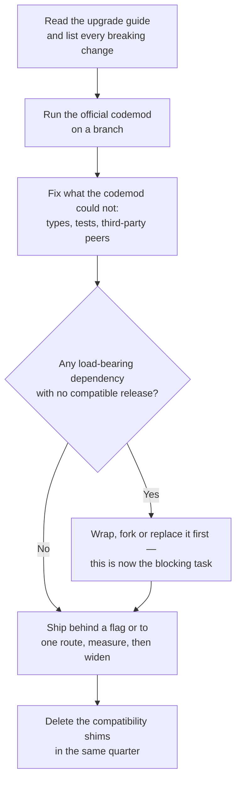

# Dependencies and Upgrades {#ch-dependencies-and-upgrades}

> Keep a five-year-old frontend upgradable by pricing each dependency, automating the boring half, and running majors as migrations rather than as bumps.

**In this chapter:** why delay is the cost driver · four tiers of dependency · automating the safe updates · the major-version playbook · measuring upgrade debt

## 💡 The Core Idea

The cost of an upgrade is not set by the size of the diff. It is set by **how long you waited**.

A React minor taken the week it ships is a lockfile change and a green pipeline. The same jump taken
three years later arrives bundled with a build-tool major, a testing-library rewrite, and four
abandoned packages that never shipped support for it. Nothing got harder in the meantime — the
upgrades just stopped being independent of each other, and a codebase can only absorb one migration
at a time.

So the senior skill here is not knowing how to run a migration. It is arranging the codebase and the
pipeline so that upgrades stay small, arrive continuously, and are never all due at once.

## How It Works

### Price every dependency before you add it

A dependency is a standing commitment to track someone else's release schedule. Four tiers, four
different policies, and knowing which tier a package is in is most of the decision.

| Tier | Examples | Replacement cost | Policy |
| ---- | -------- | ---------------- | ------ |
| **Framework** | React, the router, the bundler, Node itself | Months. It shapes every file | Track majors deliberately, never drift more than one behind |
| **Load-bearing third party** | Data-fetching layer, form library, charting, auth SDK | Weeks. It has an API your code is written against | Wrap it, so replacement is one adapter |
| **Leaf utility** | Date formatting, `clsx`, a slug helper | Hours | Take updates automatically; delete rather than upgrade if it is trivial |
| **Your own packages** | The design system, shared config | Yours to control | You owe consumers the contract in [Chapter ?? — Design Systems at Scale](#ch-design-systems-at-scale) |

The middle tier is the one that gets teams into trouble. A form library reaches into every screen
because nobody drew a boundary around it, and then it is a framework in practice with none of a
framework's support guarantees.

**Wrap a load-bearing dependency so the blast radius is one file:**

```typescript
// lib/analytics.ts — the only file in the app that imports the vendor SDK.
import { track as vendorTrack } from "@vendor/analytics";

export interface AnalyticsEvent {
  name: string;
  props?: Record<string, string | number | boolean>;
}

export function track(event: AnalyticsEvent): void {
  // The vendor's argument shape is an implementation detail of this module.
  vendorTrack(event.name, event.props ?? {});
}
```

Two hundred call sites now depend on `AnalyticsEvent`, which you own, not on the vendor's signature,
which you do not. Swapping vendors is a rewrite of one file.

### Automate the safe updates so a human only sees the risky ones

Patch and minor updates are the bulk of the volume and almost none of the risk. Reviewing them by hand
guarantees they pile up. The policy that works is: **automate everything non-breaking, batch it, and
route majors to a human queue.**

```json
{
  "extends": ["config:recommended"],
  "packageRules": [
    {
      "matchDepTypes": ["devDependencies"],
      "matchUpdateTypes": ["patch", "minor"],
      "groupName": "devDependencies (non-major)",
      "automerge": true
    },
    {
      "matchUpdateTypes": ["patch"],
      "automerge": true
    },
    {
      "matchUpdateTypes": ["major"],
      "dependencyDashboardApproval": true
    }
  ],
  "minimumReleaseAge": "3 days"
}
```

Four decisions in that file, and each one is worth being able to defend:

| Setting | Why |
| ------- | --- |
| Dev dependencies grouped and automerged | They cannot reach production. One pull request a week, not thirty |
| Patches automerged | A patch that breaks you was a mislabelled release; your tests are the check |
| Majors held behind approval | A major is a migration with a plan, not a queue item |
| A release-age delay | Supply-chain exposure, covered in [Chapter ?? — Package Management](#ch-package-management) |

> ⚠️ **Moving target:** the configuration keys above are Renovate 41's, and the equivalent
> Dependabot grouping options are spelled differently again. The durable principle is that automation
> decides by **update type and dependency type**, and that automerge is only defensible when the test
> suite is what gates it. Check the current key names before copying a config.

**Automerge is a claim about your test suite.** If integration coverage is thin, automerging patches
ships unreviewed third-party changes straight to users. Fix the suite first, or automerge dev
dependencies only and say so.

### Run a major as a migration

A framework major is not a version bump with extra steps. It is a project, and it wants the same
shape as any other migration.



**The order a framework major actually runs in, and where it stalls.**

Three things make the difference between a two-week migration and an abandoned branch:

- **Do the peer-dependency audit before you write any code.** One unmaintained package that pins the
  old major will block the entire upgrade, and you want to find that on day one, not in week three.
- **Land it incrementally.** A route, a flag, or a single package in the workspace. A branch that has
  to be all-or-nothing accumulates conflicts faster than it makes progress.
- **Book the cleanup.** Shims added "temporarily" are how a codebase ends up on two versions of the
  same library for two years.

### Give upgrade debt a number

"We are behind on dependencies" loses an argument for headcount. A measurement wins it. Three numbers,
all cheap to collect in the pipeline:

| Metric | How | What it tells you |
| ------ | --- | ----------------- |
| **Majors behind** | Count dependencies at least one major below current | The size of the cliff |
| **Dependency age** | Median days between the installed version's release and today | Whether the drift is getting worse |
| **Unmaintained count** | Direct dependencies with no release in 18 months | Where the next block will come from |

Put those three on the same dashboard as the performance and error budgets. Debt that is visible every
sprint gets paid down; debt that surfaces once a year in an incident does not.

## When to Use It

| Situation | Do this | Why |
| --------- | ------- | --- |
| Patch or minor on any tier | Automate it | The review cost exceeds the risk |
| Framework major, current release + 0 | Wait one minor | Let the ecosystem's peer ranges catch up |
| Framework major, you are two behind | Stop feature work and schedule it | The gap is compounding, and each further release widens it |
| A transitive dependency has an advisory, no fix released | `overrides` to a patched version | Faster than waiting on the maintainer |
| A direct dependency is unmaintained but small | Vendor the file into the repo and delete the dependency | You already own the maintenance; now you own the code too |
| A direct dependency is unmaintained and large | Wrap it, then plan replacement | Forking a large package is a permanent commitment |
| A dependency you added for one function | Delete it and write the function | Fewer things to track is the only permanent fix |

## Common Mistakes

❌ **Treating the upgrade as done when the pipeline goes green.** Compatibility shims, dual-installed
versions and skipped tests are all still there.
✅ Close the migration with a cleanup pull request in the same quarter, and delete the shims by name.

❌ **A quarterly "dependency week".** Batching upgrades reintroduces exactly the coupling that makes
them expensive, and the week always slips.
✅ Continuous small updates through automation, with majors scheduled individually.

❌ **Automerging everything because the pull requests are noisy.** Noise is a grouping problem, not a
reason to stop reviewing production dependencies.
✅ Group by dependency type to cut the volume; keep production majors in front of a person.

❌ **Pinning exact versions everywhere to "be safe".** Exact pins on every transitive dependency mean
security patches need a manual bump in a dozen places.
✅ Pin your own tooling, use ranges for libraries, and let the lockfile provide the reproducibility.

❌ **Adding a dependency without naming its tier.** The library that seemed like a leaf utility ends
up imported in 200 files.
✅ Decide the tier at review time, and wrap anything above leaf.

## 🔑 Key Takeaways

- The cost of an upgrade is driven by how long you waited, not by the size of the change.
- Every dependency belongs to a tier — framework, load-bearing, leaf, or your own — and each tier gets
  a different update policy.
- Automating patch and minor updates is only defensible if the test suite is what gates the merge.
- A framework major is a migration: audit peers first, land it incrementally, and book the cleanup.
- Upgrade debt needs a number in a dashboard, or it will not be funded.

## Interview Questions

**Q: A team says they cannot upgrade React because "too much would break". How do you find out whether that is true?**

Start with the peer-dependency audit, not the code. List every direct dependency, check which ones
have a release supporting the target major, and separate the genuinely blocking ones from the ones
that just need a bump. Usually two or three packages are blocking and the rest is codemod work. That
turns an unbounded fear into a list of named tasks, which is what makes it schedulable.

**Q: Would you automerge dependency updates?**

Patch and dev-dependency updates, yes — provided the integration and end-to-end suites actually run on
that pull request. Automerge is a statement that the tests are trusted more than a human skim of a
lockfile diff, and for third-party patches that is usually true. Production majors never, because a
major needs a migration plan rather than a review.

**Q: When is forking a dependency the right call?**

When it is unmaintained, you need one specific fix, and the package is small enough that you can own
it. For anything large, forking means inheriting a codebase you do not understand and losing the
upstream security fixes, so wrapping it behind your own interface and planning a replacement is the
better trade. The size of the package is the deciding factor, not how urgent the fix feels.

**Q: How would you stop this problem coming back?**

Automation for the safe updates, a dependency-age metric on the same dashboard as the error budget,
and a review rule that a new dependency has to be assigned a tier before it is approved. The first two
keep drift visible; the third stops the middle tier growing by accident, which is where the expensive
surprises come from.

## What to Read Next

- [Chapter ?? — Package Management](#ch-package-management) — what the lockfile guarantees, and the supply-chain controls this chapter assumes
- [Chapter ?? — Repository Strategies: Monorepo vs Polyrepo](#ch-repository-strategies) — whether one version of a dependency or many is even an option
- [Chapter ?? — Design Systems at Scale](#ch-design-systems-at-scale) — the same versioning contract seen from the publisher's side
