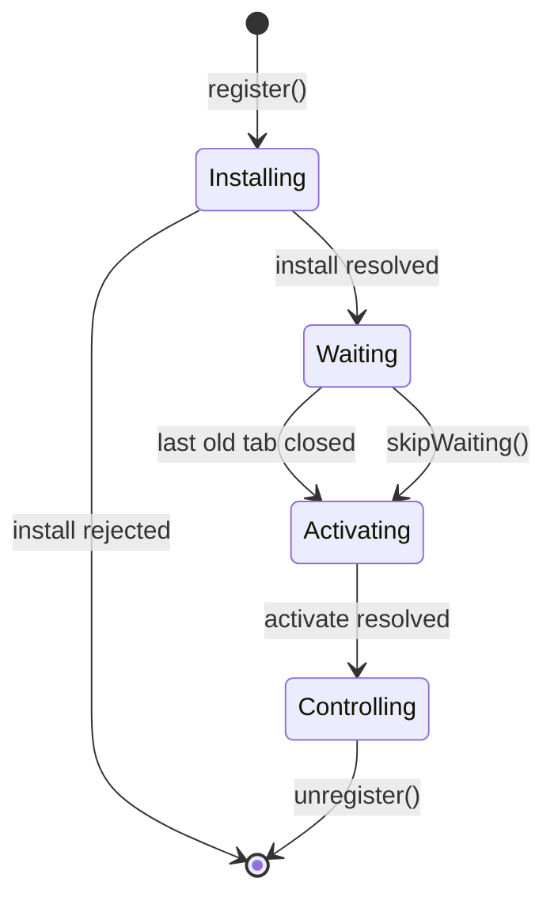

# Service Workers, Caching and Offline {#ch-service-workers}

> Ship a service worker you can update, pick a caching strategy per request, and say exactly when a new version takes over.

**In this chapter:** the lifecycle · scope and `fetch` · the five caching strategies · shipping an update without stranding a tab · the kill switch

## 💡 The Core Idea

A service worker is a script the browser keeps outside your page. It sits between the app and the
network, like a proxy you wrote yourself. It survives every tab being closed, and it decides what each
request returns.

That last power is what makes it useful and what makes it dangerous. Once a worker is installed, the
browser asks it first. So a bad worker can serve a broken build to a user who has no way to clear it.

> A service worker is code you deploy once and cannot easily take back. Design the update path before
> you design the caching.

> ⚠️ **Moving target:** the tooling churns much faster than the platform. Workbox renames its strategies
> across majors, and framework plugins change the worker they generate. The durable principle is the
> lifecycle underneath — install, wait, activate — and the fact that you own the update path, whatever
> generated the worker.

## How It Works

The page registers the worker. After that, the worker runs in its own global scope, with no DOM, no
`window` and no synchronous storage.

**Registering, only where it can work:**

```typescript
// Service workers need HTTPS. localhost is exempt, so development still works.
if ("serviceWorker" in navigator) {
  // Registration competes with page start-up for bandwidth, so wait for load.
  window.addEventListener("load", (): void => {
    void navigator.serviceWorker.register("/sw.js", { scope: "/" });
  });
}
```

A worker moves through four stages. The second one is where most production incidents live.

| Stage | Event | What you do in it |
| ----- | ----- | ----------------- |
| Installing | `install` | Precache the app shell. If the handler rejects, the worker is discarded |
| Waiting | — | Nothing. The worker waits while any tab is still controlled by the old one |
| Activating | `activate` | Delete caches from previous versions |
| Controlling | `fetch`, `message`, `push` | Answer requests |



**The lifecycle, including the two ways out of `waiting`.**

**Install and activate, the shape they always take:**

```typescript
declare const self: ServiceWorkerGlobalScope;

const CACHE = "shell-v3"; // Change this on every deploy that changes the shell.

self.addEventListener("install", (event: ExtendableEvent): void => {
  // waitUntil keeps the worker alive. Without it the browser may stop it mid-cache.
  event.waitUntil(caches.open(CACHE).then((c: Cache) => c.addAll(["/", "/offline.html", "/app.css"])));
});

self.addEventListener("activate", (event: ExtendableEvent): void => {
  event.waitUntil(
    caches
      .keys()
      .then((names: string[]) => Promise.all(names.filter((n) => n !== CACHE).map((n) => caches.delete(n))))
      .then((): Promise<void> => self.clients.claim()),
  );
});
```

### Scope decides what it can intercept

A worker controls the directory it is served from and everything below it. `/js/sw.js` controls
`/js/*` and nothing else. That is the most common reason a service worker "does not work". Serve it
from the origin root, or send `Service-Worker-Allowed: /` to widen the scope.

### The five caching strategies

Inside `fetch`, `event.respondWith` commits you to producing a response. A request you do not call it
for goes to the network untouched — the right default for requests you have no opinion about.

Every strategy trades staleness for speed. There is no correct strategy, only a correct pairing of
strategy to request.

| Strategy | Reads | Serves offline | Use for |
| -------- | ----- | -------------- | ------- |
| **Cache first** | Cache, network only on a miss | Yes | Hashed assets, fonts, versioned images |
| **Network first** | Network, cache on failure | Last good copy | HTML documents, anything that must be current |
| **Stale-while-revalidate** | Cache now, refresh behind it | Yes | Avatars, thumbnails, feeds, non-critical reads |
| **Cache only** | Cache, never network | Yes | The precached offline page |
| **Network only** | Network, no cache | No | Analytics, payments, anything with a side effect |

**Stale-while-revalidate — the one worth knowing by heart:**

```typescript
async function staleWhileRevalidate(request: Request, cacheName: string): Promise<Response> {
  const cache: Cache = await caches.open(cacheName);
  const cached: Response | undefined = await cache.match(request);

  // Start the refresh but do not wait for it. The point is to answer now.
  const refresh: Promise<Response> = fetch(request).then(async (fresh: Response) => {
    // A body can be read once, so the cache gets the clone.
    if (fresh.ok) await cache.put(request, fresh.clone());
    return fresh;
  });

  return cached ?? refresh;
}
```

Network first needs a timeout. A request that hangs for thirty seconds is worse than a copy five
minutes old. `navigator.onLine` does not help here: it reports whether a network interface exists, not
whether requests succeed. Pass `AbortSignal.timeout(3000)` to the `fetch` and fall back to the cache
when it throws.

**Responses go in the Cache API, records go in IndexedDB.** The Cache API stores `Request`/`Response`
pairs keyed by URL. Application data, and any queue of writes made offline, needs IndexedDB's
transactions and indexes. The offline write queue itself — sequential replay, idempotency keys — is a
design question, and Part VI treats it as one.

## When to Use It

| Scenario | Choose | Why |
| -------- | ------ | --- |
| `/assets/app.a91f3c.js` | Cache first, never expire | The hash in the name changes when the content does |
| Any navigation request | Network first, 3s timeout, offline page | A stale document pins users to an old build |
| `GET /api/dashboard` | Stale-while-revalidate plus a "last updated" label | Show something, and be honest about its age |
| `POST /api/orders` | Network only | A silent retry on a payment is a defect |
| An update must reach users today | `skipWaiting()` plus a reload | The new worker activates without waiting for tabs to close |
| Read-only content site | No service worker | A CDN with correct cache headers does the job with no update risk |

> ⚠️ `skipWaiting()` activates a new worker under a page still running the old JavaScript. If the new
> worker serves a new asset manifest, a lazy chunk the old page asks for may no longer exist. Pair it
> with a reload, or prompt the user instead.

**The prompt-then-reload update, which is the safe default:**

```typescript
const reg: ServiceWorkerRegistration = await navigator.serviceWorker.register("/sw.js");

reg.addEventListener("updatefound", (): void => {
  reg.installing?.addEventListener("statechange", (): void => {
    // A waiting worker while another one controls the page means an update is ready.
    if (reg.waiting && navigator.serviceWorker.controller) showUpdateBanner();
  });
});

function applyUpdate(): void {
  reg.waiting?.postMessage({ type: "SKIP_WAITING" });
}

// One reload, not a loop. controllerchange fires once per takeover.
let reloading = false;
navigator.serviceWorker.addEventListener("controllerchange", (): void => {
  if (reloading) return;
  reloading = true;
  window.location.reload();
});
```

## Common Mistakes

**❌ Wrong — cache first for the document:**

```typescript
// Every navigation now returns whichever build was live on the first visit.
event.respondWith(caches.match(event.request).then((c) => c ?? fetch(event.request)));
```

**✅ Right — network first for navigations:**

```typescript
if (event.request.mode === "navigate") {
  event.respondWith(fetch(event.request).catch(async () => (await caches.match("/offline.html"))!));
}
```

The document is the file that names every other file. Serving it from cache pins the whole app to an
old version.

**❌ Wrong — no way out.** A worker with no unregister path means a caching bug can only be fixed by
every user clearing site data. Keep a kill switch you can deploy: a worker whose `install` handler calls
`self.registration.unregister()`, deletes every cache and reloads its clients. Naming it before the
interviewer asks is a strong senior signal.

**❌ Wrong — an unbounded cache.** Every `cache.put` with no eviction grows until the browser evicts the
whole origin. Cap each cache by entry count or age.

## 🔑 Key Takeaways

- A service worker is a proxy you deploy, and it keeps serving the old version until you deliberately replace it.
- A new worker waits until every tab controlled by the old one closes, which is why a fix can seem not to ship.
- Scope is the directory the worker file is served from, so a worker under `/js/` controls only `/js/`.
- Caching strategy is a decision per request: cache first only where the URL changes with the content, network first for documents.
- Every production service worker needs an unregister path you can deploy in one commit.

## Interview Questions

**Q: You shipped a fix an hour ago and users still report the bug. What happened?**

Their tab is still controlled by the previous worker, so the new one is stuck in `waiting`. Activation
waits for every controlled tab to close, and a pinned tab never does. The fix is an update prompt that
posts `SKIP_WAITING` to the waiting worker and reloads on `controllerchange`.

**Q: What is the difference between `skipWaiting()` and `clients.claim()`?**

`skipWaiting()` moves a new worker out of `waiting` early. `clients.claim()` makes an active worker take
control of pages that are open now. You usually want both, followed by a reload, because the claimed
pages are still running the previous build's JavaScript.

**Q: Walk me through the strategy you would pick for each request on a dashboard.**

Hashed JavaScript and CSS get cache first with no expiry. The document gets network first with a short
timeout and a precached offline page. Widget data gets stale-while-revalidate with its timestamp shown,
because slightly old numbers beat a spinner. Mutations go straight to the network.

**Q: When would you not use a service worker at all?**

When there is no offline or install requirement. A service worker adds a deploy path that is harder to
roll back than anything else in the frontend. HTTP caching at the CDN gives most of the speed with none
of the staleness risk, and it is far easier to invalidate.

## What to Read Next

- [Chapter ?? — Offline-First Architecture](#ch-offline-first-architecture) — the write queue, conflict handling and sync, as a design question
- [Chapter ?? — Web Storage and IndexedDB](#ch-storage-apis) — quotas, eviction and the store the write queue lives in
