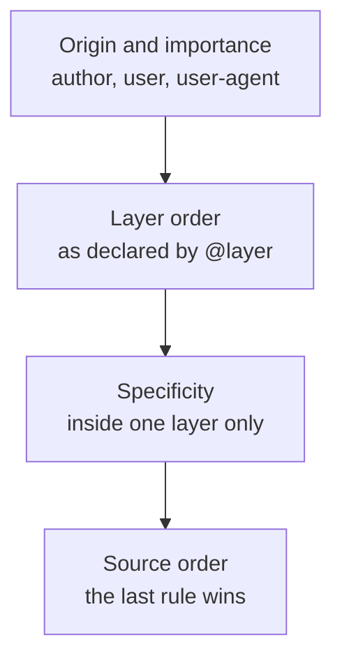

# Container Queries and Cascade Layers {#ch-container-queries-and-layers}

> Style a component by the space it is given rather than by the size of the window, and win a specificity argument without `!important`.

**In this chapter:** why the viewport was always the wrong input · container queries · container units · cascade layers · ordering third-party CSS · the two mistakes

## 💡 The Core Idea

Two features shipped in 2023 that replaced two long-running workarounds, and both do the same kind of
thing: they let you say something once, at the top, instead of defending it in every rule underneath.

**Container queries** change what a component responds to. A media query asks about the window, which the
component does not live in — it lives in a sidebar, or a modal, or a grid cell. **Cascade layers** change
how conflicts are resolved. Without them, the winner of a conflict is whoever wrote the longer selector,
so teams escalate. With them, you declare the order of your stylesheets once and specificity only
decides fights *inside* a layer.

> Both features move a decision out of individual rules and into one declaration at the top of the
> stylesheet. That is why they are architecture rather than syntax.

## How It Works

### Container queries

A component queries the element it sits inside, once that element has declared itself a container.

**Declaring a container and querying it:**

```css
/* The parent opts in. `inline-size` means "measure the width only". */
.card-slot {
  container-type: inline-size;
  container-name: card;
}

/* The card now responds to its slot, not to the window. */
@container card (min-width: 30rem) {
  .card {
    display: grid;
    grid-template-columns: 8rem 1fr;
  }
}
```

The same card can now sit in a 900px main column and a 280px sidebar on one page, and be correct in
both. No prop, no JavaScript measurement, and no page-level breakpoint that has to know where the
component was placed.

**Container query units** measure against the container rather than the viewport:

| Unit | Is 1% of the container's | Replaces |
| ---- | ------------------------ | -------- |
| `cqw` / `cqh` | width / height | `vw` / `vh` inside a component |
| `cqi` / `cqb` | inline size / block size | The writing-mode-safe version, and the one to prefer |
| `cqmin` / `cqmax` | smaller / larger of the two | A clamp built out of viewport units |

> ⚠️ **A container cannot query itself.** `container-type: inline-size` makes an element a query target
> for its descendants, not for its own rules. It also creates containment, which means the element no
> longer sizes itself from its content in the contained axis — a `container-type: size` element with no
> explicit height collapses.

### Cascade layers

`@layer` gives you an ordering that beats specificity. A rule in a later layer wins over a rule in an
earlier one **no matter how specific either is**.

**Declaring the order once, at the top:**

```css
/* Everything after this is resolved in this order, whatever the file order is. */
@layer reset, vendor, base, components, utilities;

@layer components {
  /* A specificity of 0,2,0 … */
  .card .title { font-size: 1.25rem; }
}

@layer utilities {
  /* … loses to a specificity of 0,1,0, because utilities is the later layer. */
  .text-sm { font-size: 0.875rem; }
}
```

That is what makes a utility class reliable without `!important`: the utility layer is declared last, so
a one-class utility beats a three-class component rule by position.

**The layered cascade, in the order the browser resolves it:**



**Where layers sit in the cascade: above specificity, below importance.**

Unlayered styles win over every layer. That is deliberate — it means adding layers to an existing
codebase cannot break the unlayered CSS already there — and it is also the thing that surprises people.

## When to Use It

| Situation | Reach for | Why |
| --------- | --------- | --- |
| A component used in slots of different widths | Container queries | The component stops needing to know where it was placed |
| Page-level layout: one column or two | A media query | The viewport genuinely is the input |
| Importing a third-party stylesheet you cannot edit | `@layer` on the import | Its specificity stops competing with yours |
| A utility class that must always win | A last-declared utilities layer | Removes the `!important` argument permanently |
| A design system consumed by other teams | Both, plus custom properties | The layer order is the contract for who overrides whom |

**Layering an import you do not control:**

```css
/* Everything in the file lands in the `vendor` layer, whatever its own specificity. */
@import url("some-widget.css") layer(vendor);
```

## Common Mistakes

**❌ Turning every wrapper into a container.** `container-type` creates containment, and containment has
a cost and a behaviour change. Declare it on the handful of elements that are genuinely layout slots —
the grid cell, the sidebar, the modal body — not on every `div` on the way down.

**❌ Reaching for `container-type: size`.** It contains both axes, so the element takes its height from
its own rules rather than from its content, and content that grows overflows silently.
`inline-size` is the one you almost always want.

**❌ Declaring layers in the file that uses them.** If the `@layer` order statement lives in a component
file, the order depends on which file the bundler happened to put first — which is exactly the
non-determinism layers exist to remove. Declare the full order once, in the entry stylesheet, before
anything else.

**❌ Assuming a layer beats `!important`.** Importance is resolved before layer order, and for
`!important` declarations the layer order is *reversed* — the earliest layer wins. A reset layer using
`!important` will beat an important utility, which is almost never what anyone expects.

## 🔑 Key Takeaways

- A media query asks about the window; a container query asks about the space the component was actually
  given, which is what a reusable component needs.
- `container-type: inline-size` is the safe default — `size` contains both axes and breaks
  content-driven height.
- Cascade layers resolve conflicts by declared order, above specificity, so a one-class utility can beat
  a three-class component rule by design rather than by `!important`.
- Unlayered CSS beats every layer, which is what makes layers safe to adopt in an existing codebase.
- Both features move a decision from individual rules into one declaration at the top of the stylesheet.

## Interview Questions

**Q: A card component looks wrong in the sidebar but right in the main column. How do you fix it?**

The card is responding to the viewport when it should be responding to its slot. Give the slot
`container-type: inline-size` and rewrite the card's breakpoints as `@container` queries. Two other answers get offered: a `variant="compact"` prop, or a page-level media query that knows
the sidebar exists. Both push knowledge of the layout into the component or into the page. Both stop
working the next time someone places the card somewhere new.

**Q: What problem do cascade layers solve that BEM did not?**

BEM keeps specificity flat by agreement; nothing enforces it, and it does nothing about CSS you did not
write. Layers make the ordering a declaration the browser enforces: a third-party stylesheet imported
into a `vendor` layer cannot outrank your components however specific its selectors are. BEM is a
convention about names, layers are a mechanism about precedence — most codebases want both.

**Q: Where do cascade layers sit relative to specificity and `!important`?**

Origin and importance first, then layer order, then specificity within a layer, then source order. So a
later layer beats an earlier one regardless of specificity, and unlayered styles beat all layers. The
catch worth knowing is that `!important` reverses the layer order: an important declaration in the
*first* layer wins. That is why `!important` inside a reset layer is a trap.

**Q: When is a container query the wrong tool?**

When the thing you are styling genuinely depends on the viewport — a page-level one-column-or-two
decision, a fixed header that changes at small screens, or anything driven by device capability rather
than by available space. Container queries also cannot look upwards past a container boundary, so a rule
that needs to know about the page as a whole still belongs in a media query.

## What to Read Next

- [Chapter ?? — Advanced CSS](#ch-advanced-css) — custom properties, `:has()` and subgrid, the rest of what shipped since 2023
- [Chapter ?? — Styling Strategy](#ch-styling-strategy) — which styling approach carries these features, and what a runtime library costs
- [Chapter ?? — Design Systems at Scale](#ch-design-systems-at-scale) — where the layer order becomes a contract between teams
