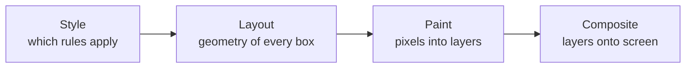

# Animation and View Transitions {#ch-animation-and-view-transitions}

> Know which properties a browser can animate for free, and how to animate between two states of a page without owning both of them.

**In this chapter:** the four rendering stages · compositor-only properties · the Web Animations API · the View Transitions API · reduced motion as a requirement · the jank checklist

## 💡 The Core Idea

Every animation costs one of three amounts, and which one depends entirely on the property you chose.
The browser renders in stages — style, layout, paint, composite — and animating a property forces every
stage from that property's stage onwards, on every frame.

`transform` and `opacity` are the two properties the compositor can change on its own. Everything else
drags layout or paint back into the frame budget, and at 60fps the whole budget is 16.7 milliseconds
including whatever JavaScript is already running.

> The senior version of "why is this janky" is not "add `will-change`". It is "you animated a property
> that forces layout, sixty times a second".

## How It Works

### The four stages, and what each property costs



**Animating a property re-runs its stage and every stage to the right of it.**

| Animating | Triggers | Cost per frame |
| --------- | -------- | -------------- |
| `width`, `height`, `top`, `margin` | Layout → paint → composite | The whole pipeline, for the element and usually its siblings |
| `background-color`, `box-shadow`, `border-radius` | Paint → composite | Repaint of the affected layer |
| `transform`, `opacity` | Composite only | Effectively free — the GPU moves an existing layer |
| `filter` | Composite, with a caveat | Cheap on its own, expensive when it forces a new layer per frame |

The practical rule: **animate `transform` and `opacity`, and express everything else in terms of them.**
Moving an element is `translate`, not `left`. Growing it is `scale`, not `width`.

### Declaring motion

CSS transitions handle state changes, keyframes handle sequences, and the Web Animations API handles
anything that needs to be driven by code:

```typescript
// Same model as CSS keyframes, with a promise and a handle on the animation.
const drawer: Element = document.querySelector(".drawer")!;

const animation: Animation = drawer.animate(
  [{ transform: "translateX(100%)" }, { transform: "translateX(0)" }],
  { duration: 220, easing: "cubic-bezier(0.2, 0, 0, 1)", fill: "forwards" },
);

await animation.finished;
```

The API matters for interruption. A CSS transition that is reversed mid-flight jumps; an `Animation`
object can be reversed, paused or cancelled, which is what makes a drawer feel attached to the finger
that is dragging it.

### View transitions

The problem view transitions solve is ownership. Animating from one state of a page to another means
holding both states in the DOM at once — the old list and the new list, the small image and the large
one — and every framework grew its own machinery for it.

The browser can do it instead. `startViewTransition` snapshots the page, runs the DOM update, snapshots
again, and cross-fades between the two:

```typescript
// The callback does the ordinary DOM update. The browser animates the difference.
function update(next: () => void): void {
  if (!document.startViewTransition) {
    next(); // No support: the update still happens, just without the animation.
    return;
  }
  document.startViewTransition(next);
}
```

Naming an element makes it animate as itself rather than as part of the cross-fade:

```css
/* The same name on both pages means "this is the same thing, move it". */
.hero-image {
  view-transition-name: hero;
}
```

Cross-document transitions apply the same idea to an ordinary navigation, with no JavaScript at all:

```css
@view-transition {
  navigation: auto;
}
```

> ⚠️ **Moving target:** the same-document API shipped in Chromium in 2023 and Safari 18; cross-document
> came later and Firefox later still, so check current support before relying on it. The durable
> principle is the one to hold on to — the API is a progressive enhancement by construction. Feature-detect,
> run the plain update when it is missing, and the page is correct either way.

## When to Use It

| Situation | Reach for | Why |
| --------- | --------- | --- |
| Hover, focus, open/close on one element | A CSS transition | Declarative, interruptible, no JavaScript |
| A looping or multi-step sequence | CSS keyframes | The sequence belongs in the stylesheet |
| Motion driven by a gesture or by state in code | Web Animations API | You need to reverse, pause and cancel |
| Two states of a list, a route, or a detail view | View transitions | The browser holds both states so you do not have to |
| Anything moving more than a few elements | `transform` and `opacity` only | It is the only combination that stays on the compositor |

### Reduced motion is not an optional extra

`prefers-reduced-motion` is a user setting for a medical condition — vestibular disorders, where large
motion causes real nausea. WCAG 2.2 treats motion that the user cannot disable as a failure, so this is
the same legal territory as the rest of Part II's accessibility material.

**Reduce, rather than remove:**

```css
@media (prefers-reduced-motion: reduce) {
  /* Keep the state change legible — replace movement with a fade, do not delete feedback. */
  *,
  ::before,
  ::after {
    animation-duration: 0.01ms !important;
    transition-duration: 0.01ms !important;
  }
}
```

View transitions respect the setting the same way: wrap the call, or disable the named transitions
inside the media query.

## Common Mistakes

**❌ `will-change` on everything.** It promotes the element to its own compositor layer permanently,
which costs memory and can make things slower. Apply it just before the animation starts and remove it
after, or leave it out — browsers already promote what they need.

**❌ Animating `height: auto`.** There is nothing to interpolate towards, so it does not animate at all.
Animate `grid-template-rows` from `0fr` to `1fr`, or `scale` a wrapper, or measure and animate to a
pixel value.

**❌ Treating a view transition as a page-level effect.** Without `view-transition-name` on the elements
that persist, everything cross-fades — which reads as a flash, not as a relationship. The value of the
API is telling the browser which two elements are the same thing.

## 🔑 Key Takeaways

- The browser renders in four stages, and animating a property re-runs its stage and everything after it
  on every frame.
- `transform` and `opacity` are the only two properties the compositor can animate on its own — express
  motion in terms of them.
- The Web Animations API exists for motion that has to be reversed, paused or cancelled; CSS is better
  for everything else.
- View transitions let the browser hold the old and new state of a page, which is the machinery every
  framework used to implement itself.
- `prefers-reduced-motion` is an accessibility requirement, not a preference — reduce the motion, but
  keep the feedback.

## Interview Questions

**Q: An engineer reports that a slide-in panel stutters on mid-range Android. Where do you start?**

Ask what is being animated. If it is `left`, `width` or `margin`, every frame re-runs layout for the
panel and usually for its siblings, and no amount of `will-change` changes that. Rewrite it as
`transform: translateX()`, which the compositor handles without touching layout or paint. Only after
that is it worth looking at what else is on the main thread during the animation — a long task will drop
frames whatever the property.

**Q: What does the View Transitions API actually do for you?**

It holds both states. Animating between two versions of a page normally means keeping the old DOM alive
while the new DOM renders, which is the hard part and the reason animation libraries are large. The
browser snapshots before and after your update and animates the difference, and
`view-transition-name` tells it which elements in the two snapshots are the same object so it can move
them rather than fade them.

**Q: How do you handle `prefers-reduced-motion` without making the interface confusing?**

Reduce, do not delete. If a panel slides in and you remove the animation entirely, the user gets no
signal that anything changed — replace the movement with an opacity change, which carries the same
information with none of the vestibular cost. The failure mode people hit is a blanket rule that
disables all animation, including the loading spinner that was the only evidence the app was working.

**Q: When would you use a JavaScript animation library rather than the platform?**

When the motion is physical rather than timed — spring dynamics, gestures that hand off velocity,
layout animations across a list that reorders. The platform's timing model is duration and easing, and
faking a spring with a cubic bézier stops being convincing as soon as the user interrupts it. For
everything else the platform is smaller, and it does not ship a runtime to the user.

## What to Read Next

- [Chapter ?? — Container Queries and Cascade Layers](#ch-container-queries-and-layers) — the other two features that replaced a workaround
- [Chapter ?? — Core Web Vitals](#ch-core-web-vitals) — where dropped frames show up as a number someone is held to
- [Chapter ?? — Why Accessibility, and the Law](#ch-accessibility-and-the-law) — why reduced motion is a requirement rather than a courtesy
