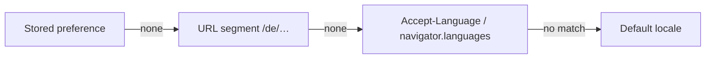

# Internationalisation Fundamentals {#ch-i18n-fundamentals}

> Build a UI that can ship in another language without a rewrite, and say what belongs in a translation file.

**In this chapter:** i18n against l10n · what a translation key must not assume · detecting and switching locale · interpolation and JSX · typed keys

## 💡 The Core Idea

Internationalisation is not translation. It is removing every assumption your interface makes about
language — that text reads left to right, that a sentence has one plural form, that a name is
`first last`, that a date is a number followed by a slash, that a label will still fit its button. Do
that and adding a language is a content task. Skip it and adding a language is a rewrite, because
every one of those assumptions is baked into the markup and the layout.

> i18n is the plumbing and l10n is the water. Engineers own the plumbing, and it has to be laid before
> anyone knows which languages are coming.

## How It Works

| | Internationalisation (i18n) | Localisation (l10n) |
| - | --------------------------- | ------------------- |
| What it is | The infrastructure that makes language swappable | The content and conventions for one locale |
| Who owns it | Engineers | Translators and regional teams |
| When it happens | Once, in the architecture | Repeatedly, per locale |
| Cost shape | Fixed, and rises steeply if deferred | Linear per language |

### A translation key is a contract

The single most common i18n defect is a sentence assembled from fragments. Word order differs between
languages, so a fragment cannot be translated in isolation.

```typescript
// ❌ Untranslatable: German and Japanese put these pieces in a different order,
// and the translator sees three unrelated strings with no sentence to work from.
`${t('you.have')} ${count} ${t('unread.messages')}`;

// ✅ One key, one whole sentence, with named placeholders.
t('inbox.unread', { count });
```

Keys are named for **meaning**, not for the English words or the place they appear. `button.save` breaks
the moment the same button says "Update" in a second context; `document.action.save` survives it. And
never key by the source string itself — the day someone edits the English copy, every translation
silently detaches.

### Organising the files

```text
locales/
├── en/
│   ├── common.json      shared: save, cancel, delete
│   ├── auth.json        sign-in and registration
│   └── dashboard.json   one feature
└── de/ …
```

Start with one file per locale. Split into namespaces when a file passes a few hundred keys, and split
by feature only when teams start colliding in it. The reason to split is not tidiness — it is that a
namespace is the unit you can load on demand, so the German user of the dashboard never downloads the
sign-in strings.

### Detecting and switching

Order the signals by how strongly each one expresses intent.



**Locale resolution. An explicit choice always outranks a detected one.**

Put the locale in the URL. A locale held only in `localStorage` cannot be shared, linked, crawled, or
server-rendered correctly, and search engines will index one language for every URL you have.

```typescript
const SUPPORTED = ['en', 'de', 'fr', 'ar'] as const;
type Locale = (typeof SUPPORTED)[number];

function isSupported(value: string | null): value is Locale {
  return value !== null && (SUPPORTED as readonly string[]).includes(value);
}

function resolveLocale(pathSegment: string | null, stored: string | null): Locale {
  if (isSupported(stored)) return stored;
  if (isSupported(pathSegment)) return pathSegment;

  // navigator.languages is ordered by preference; match the base tag so
  // de-AT resolves to de rather than falling through to the default.
  for (const tag of navigator.languages) {
    const base = tag.split('-')[0];
    if (isSupported(base)) return base;
  }
  return 'en';
}
```

Switching locale is three side effects, and forgetting the last two is what breaks screen readers and
right-to-left layouts.

```typescript
async function setLocale(locale: Locale): Promise<void> {
  await loadMessages(locale);
  localStorage.setItem('locale', locale);
  // lang drives hyphenation, quotation marks and the screen reader's voice.
  document.documentElement.lang = locale;
  document.documentElement.dir = ['ar', 'he', 'fa', 'ur'].includes(locale) ? 'rtl' : 'ltr';
}
```

### Interpolation, and text that contains markup

A string with a link inside it cannot be split without breaking word order. Pass the elements to the
translation instead of concatenating around it — every library has some form of this, usually a
component that maps placeholders in the string onto React children.

```json
{ "terms.accept": "I accept the <terms>terms</terms> and the <privacy>privacy policy</privacy>" }
```

The translator receives one sentence with two marked spans and can move them wherever the target
language needs them.

### Typed keys

Untyped `t()` calls are the only place in a TypeScript codebase where a typo ships silently, then
renders a raw key to a user.

```typescript
// Derive the key union from the source-language file, so adding a key to the
// JSON is the only step and a typo is a compile error.
import type en from '../locales/en/common.json';

type Leaves<T> = T extends string
  ? ''
  : { [K in keyof T & string]: '' extends Leaves<T[K]> ? K : `${K}.${Leaves<T[K]>}` }[keyof T & string];

export type MessageKey = Leaves<typeof en>;
declare function t(key: MessageKey, values?: Record<string, string | number>): string;
```

## When to Use It

| Situation | Choose | Why |
| --------- | ------ | --- |
| One locale today, more plausible later | Extract strings, skip the tooling | Extraction is the expensive part and it does not get cheaper |
| Locale is per user, content is per locale | URL segment plus stored preference | Shareable, crawlable, and server-renderable |
| Server-rendered app | Resolve locale on the server, per request | Rendering the wrong language then correcting it is a visible flash |
| Right-to-left locale in scope | Set `dir` from day one | Retrofitting direction touches every layout rule |
| A handful of static labels | The platform's `Intl` APIs alone | A translation library for six strings is pure overhead |

## Common Mistakes

**❌ Wrong — text baked into a fixed-width layout:**

```typescript
// German is routinely 30% longer than English; Finnish more. The label clips.
<button className="w-24 truncate">{t('actions.submit')}</button>
```

**✅ Right — let the content size the control:**

```typescript
<button className="min-w-24 px-4 py-2">{t('actions.submit')}</button>
```

**❌ Wrong — locale only in client state.** No shareable URL, no correct server render, and one indexed
language for the whole site.

**❌ Wrong — formatting by hand.** Building `${day}/${month}/${year}` or inserting thousands separators
with a regular expression re-implements, badly, what `Intl` already knows for every locale.

## 🔑 Key Takeaways

- Internationalisation removes assumptions about language; localisation supplies the content for one locale.
- A translation key holds a whole sentence, because word order differs and a fragment cannot be translated in isolation.
- Name keys for meaning rather than for the English text, so editing the copy does not detach every translation.
- The locale belongs in the URL, because a locale in client state cannot be shared, crawled, or server-rendered.
- Switching locale means updating the messages, `lang`, and `dir` — the last two are what assistive technology reads.

## Interview Questions

**Q: What is the difference between i18n and l10n, and which is your job?**

i18n is the engineering work that makes language, direction, and format swappable: extracted strings,
locale resolution, `Intl` formatting, layouts that survive longer text. l10n is the content work for a
specific locale. The engineer owns i18n, and it has to exist before the first translation arrives,
because retrofitting it means touching every component.

**Q: Why can you not build a sentence by concatenating translated fragments?**

Because word order is not universal. English "You have 3 unread messages" reorders in German and
restructures in Japanese, and the translator working on a fragment has no sentence to reason about.
One key per sentence with named placeholders lets the translator move the placeholders wherever the
grammar requires.

**Q: Where do you keep the current locale, and why?**

In the URL, with a stored preference as the tiebreaker. A URL-borne locale is shareable, indexable, and
available to the server before the first render, so the page never renders the wrong language and then
corrects itself. Client-only state fails all four.

**Q: When would you not add an i18n library?**

When there is one locale and no roadmap for a second, or when the surface is a handful of static
labels. Extracting strings and using `Intl` for dates and numbers costs almost nothing and keeps the
door open; a full translation runtime, namespace loading and a translation-management workflow is
overhead until a second locale actually exists.

## What to Read Next

- [Chapter ?? — Pluralisation](#ch-pluralization) — why `count === 1` is wrong in most languages
- [Chapter ?? — Date and Number Formatting](#ch-date-number-formatting) — the `Intl` APIs that replace hand-rolled formatting
- [Chapter ?? — RTL Support](#ch-rtl-support) — what setting `dir` actually changes
