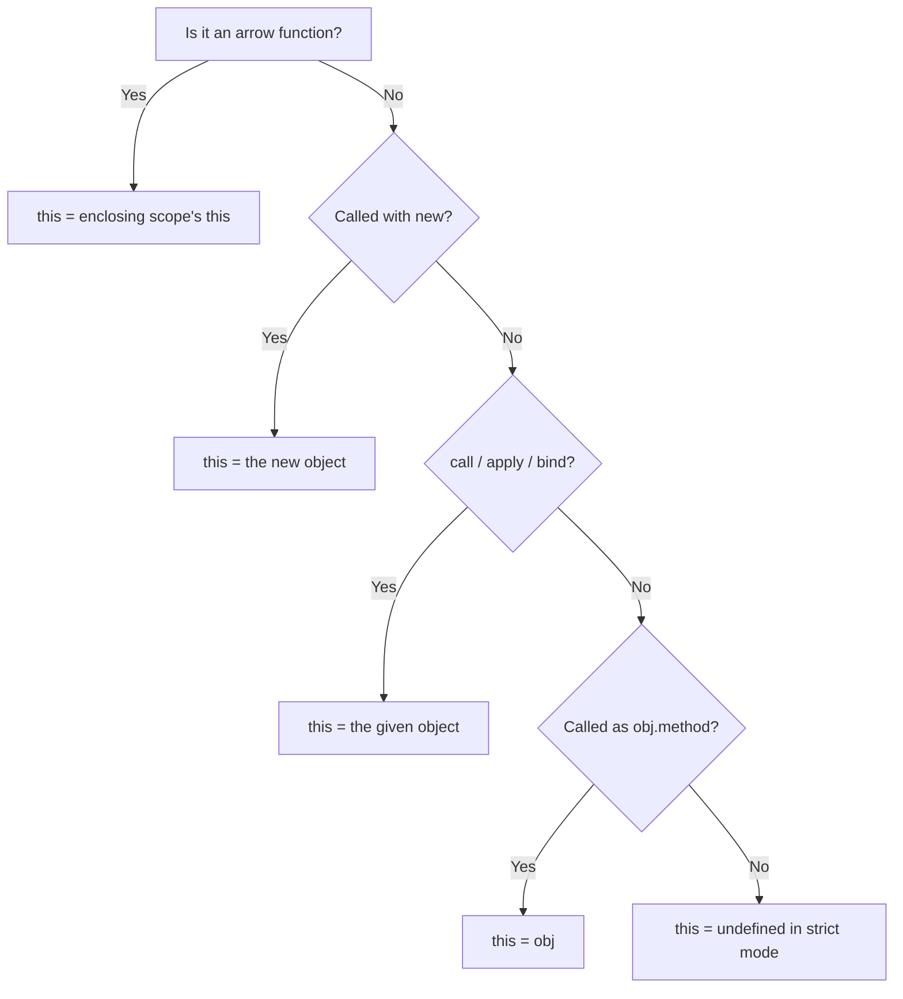

# The `this` Keyword {#ch-this-keyword}

> Work out what `this` will be from the call site alone, and fix it when it is wrong.

**In this chapter:** the four binding rules · losing an implicit binding · `call`, `apply` and `bind` · why arrows have no `this` · the mistakes interviewers probe

## 💡 The Core Idea

`this` is decided by **how a function is called**, not where it is written. That single sentence
answers almost every `this` question. A function has no fixed `this`; the call site supplies one, and
four rules decide which. Arrow functions are the exception that proves the rule — they have no `this`
of their own at all, so they fall through to the enclosing scope's.

## How It Works

### The four binding rules, in priority order

| Priority | Rule            | Call looks like       | `this` becomes                             |
| -------- | --------------- | --------------------- | ------------------------------------------ |
| 1st      | `new` binding   | `new Person()`        | The freshly created object                 |
| 2nd      | Explicit        | `fn.call(obj)`        | Whatever you passed                        |
| 3rd      | Implicit        | `obj.method()`        | The object immediately before the dot      |
| 4th      | Default         | `fn()`                | `undefined` in strict mode and in modules; `globalThis` in a sloppy-mode script |



**Resolving `this` from the call site, in priority order.**

### Implicit binding, and losing it

Implicit binding depends on the dot being present **at the moment of the call**. It is not a property
of the function.

```typescript
const user = {
  name: 'Alice',
  greet(): void {
    console.log(`Hello, I'm ${this.name}`);
  },
};

user.greet(); // ✅ 'Hello, I'm Alice'

const greet = user.greet; // the dot is gone
greet(); // ❌ this is undefined
```

Only the object immediately before the dot counts. In `company.department.show()`, `this` is
`department`, never `company`.

| Call                                     | Binding kept? | Fix                        |
| ---------------------------------------- | ------------- | -------------------------- |
| `obj.method()`                           | ✅             | —                          |
| `const fn = obj.method`                  | ❌             | `.bind(obj)`               |
| `setTimeout(obj.method, 0)`              | ❌             | Arrow wrapper or `.bind`   |
| `el.addEventListener('click', obj.method)` | ❌ — `this` becomes the element | `.bind` or a class-field arrow |
| `array.map(obj.method)`                  | ❌             | Arrow wrapper              |

### Explicit binding

```typescript
// The `this` parameter is not a real argument. It exists so TypeScript can
// check what call, apply and bind are allowed to pass
function greet(this: { name: string }, greeting: string, punctuation: string): void {
  console.log(`${greeting}, I'm ${this.name}${punctuation}`);
}

greet.call(user, 'Hello', '!'); // arguments listed
greet.apply(user, ['Hi', '.']); // arguments in an array — the only difference
const bound: () => void = greet.bind(user, 'Hey', '!'); // returns a new function
```

`bind` is permanent: a bound function cannot be re-bound, and calling it with `new` is the one thing
that overrides it. It also accepts leading arguments, which makes it a partial-application tool:

```typescript
function log(level: 'ERROR' | 'INFO', message: string): void {
  console.log(`[${level}] ${message}`);
}

const logError: (message: string) => void = log.bind(null, 'ERROR');
```

### Arrow functions

An arrow has no `this` slot, so `this` inside one resolves through the scope chain like any other
variable. `call`, `apply` and `bind` therefore have no effect on it.

```typescript
const timer = {
  seconds: 0,
  start(): void {
    // ✅ the arrow keeps start()'s `this`
    setInterval((): void => {
      this.seconds++;
    }, 1000);
  },
};
```

Three ways to solve the same callback problem, in order of preference today: an arrow (above),
`fn.bind(this)`, or the pre-ES2015 idiom `const self = this`. All three still appear in real code.

## When to Use It

| Scenario                                       | Reach for                     | Why                                                  |
| ---------------------------------------------- | ----------------------------- | ---------------------------------------------------- |
| Callback inside a method that needs the instance | Arrow function              | Inherits `this`, nothing to bind                     |
| Handler passed to `addEventListener` from a class | Class-field arrow           | Bound once per instance, safe to detach and pass around |
| Calling a method on an object that does not own it | `fn.call(other)`           | Method borrowing without copying the method          |
| Fixing leading arguments on a `this`-free function | `fn.bind(null, arg)`       | Cheaper than writing a wrapper                       |

## Common Mistakes

**❌ An arrow as an object method.** It never binds to the object, so `this.name` reads the enclosing
scope:

<!-- lint-allow-fence: javascript — an arrow as an object-literal method is the mistake; TypeScript flags it rather than letting it return undefined at runtime -->
```javascript
const person = {
    name: 'Alice',
    greet: () => console.log(`Hello, ${this.name}`) // 'Hello, undefined'
};
```

**✅ Method shorthand for methods; arrows only inside them.**

**❌ Passing a method as a callback.** `setTimeout(user.greet, 1000)` passes the function and drops
the dot. Wrap it — `setTimeout(() => user.greet(), 1000)` — or bind it.

**❌ Relying on a prototype method surviving detachment:**

```typescript
class Button {
  private count = 0;

  handleWrong(): void {
    this.count++; // ❌ prototype method — loses `this` when passed as a handler
  }

  handle = (): void => {
    this.count++; // ✅ class field arrow — bound at construction, safe to pass
  };
}
```

The class field costs one closure per instance rather than one function per class. For a handler you
pass around, that is the right trade; for a method you always call with a dot, it is waste.

**❌ Calling a constructor function without `new`.** In sloppy mode `this` becomes `globalThis` and
the assignments silently pollute it. Use `class`, which throws instead.

> ⚠️ Strict mode changes rule 4: default binding gives `undefined` rather than `globalThis`. Every
> ES module is strict, so in any modern codebase a stray `this` throws instead of writing a global —
> which is what you want.

## 🔑 Key Takeaways

- `this` is set by the call site, not by where the function is defined.
- The four rules apply in order: `new`, then explicit, then implicit, then default.
- Implicit binding is lost the moment the function is detached from the dot.
- `bind` is permanent and also fixes leading arguments; `call` and `apply` differ only in argument shape.
- Arrows have no `this`, so they inherit lexically and cannot be rebound.

## Interview Questions

**Q: `const fn = obj.method; fn();` — what is `this`, and why?**

`undefined` in strict mode. Implicit binding comes from the call site, and the call site here is a
plain function call with no receiver. Extracting the method copied the function value and left the
object behind. `obj.method.bind(obj)` restores it.

**Q: What is the difference between `call`, `apply` and `bind`?**

`call` and `apply` both invoke immediately with a given `this` and differ only in how arguments are
passed — listed versus in an array. `bind` invokes nothing; it returns a new function with `this`
permanently fixed, optionally with leading arguments pre-filled.

**Q: When would you choose `bind` over a class-field arrow for an event handler?**

When the handler should be shared on the prototype rather than duplicated per instance — for example
a class with thousands of instances, or one whose methods you want subclasses to override. The
class-field arrow is not on the prototype, so it cannot be overridden by a subclass method and cannot
be spied on via the prototype in tests.

## What to Read Next

- [Chapter ?? — Functions and Scope](#ch-functions-scope) — what arrows give up in exchange for lexical `this`
- [Chapter ?? — Prototypes and Inheritance](#ch-prototypes-inheritance) — where `new` binding gets its object from
- [Chapter ?? — Closures](#ch-closures) — the other mechanism for a function to remember context
