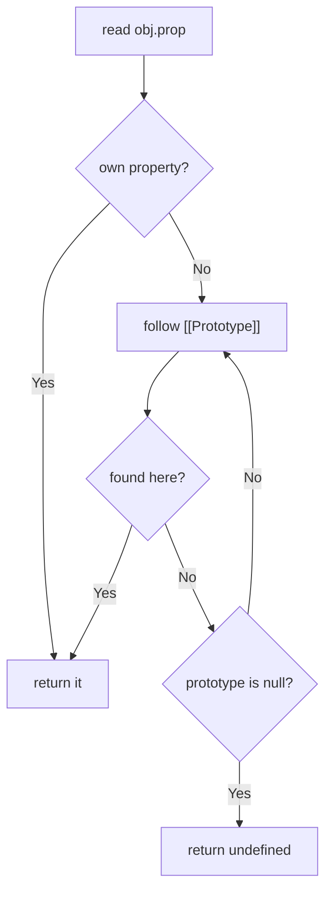

# Prototypes and Inheritance {#ch-prototypes-inheritance}

> Follow a property lookup up the prototype chain and explain what `class` is actually doing underneath.

**In this chapter:** delegation vs classical inheritance · the prototype chain · `Object.create` · constructor functions · what `class` compiles to

## 💡 The Core Idea

JavaScript has no classes at runtime. It has objects that **delegate** to other objects. Every object
holds a hidden link, `[[Prototype]]`, to another object; reading a property that the object does not
own follows that link, and the next, until something matches or the chain reaches `null`. `class` is
syntax over exactly this — a nicer way to build the same links.

## How It Works

| Aspect        | Classical (Java, C#)             | Prototypal (JavaScript)           |
| ------------- | -------------------------------- | --------------------------------- |
| **Model**     | Class blueprint → instance copies | Object → object delegation        |
| **Methods**   | Copied into each instance's type  | Shared, found by walking the chain |
| **Timing**    | Fixed when the class is compiled  | Mutable at runtime                |
| **Built from** | `class`, `extends`               | `[[Prototype]]` links, `Object.create` |

### The lookup



**A property read walks the chain one link at a time and stops at the first match.**

For `const buddy = new Dog()` where `Dog extends Animal`, the chain is
`buddy → Dog.prototype → Animal.prototype → Object.prototype → null`. That is why every object has
`toString` without anyone defining it.

**Reading and setting the link:**

<!-- lint-allow-fence: javascript — `__proto__` is a deprecated accessor that TypeScript does not put on the object type; the fence exists to compare it with `Object.getPrototypeOf` -->
```javascript
const obj = {};

obj.__proto__;              // deprecated accessor — recognise it, don't write it
Object.getPrototypeOf(obj); // ✅ the standard read
Object.setPrototypeOf(a, b); // ✅ the standard write — but slow, avoid in hot paths
```

### Why methods go on the prototype

An instance property holds its own copy per object. A prototype method is one function shared by
every instance.

<!-- lint-allow-fence: javascript — a constructor function assigning to `this` and hanging methods off `.prototype` has no TypeScript form — `class` is the TypeScript form, and using it here would hide the mechanism the chapter exists to explain -->
```javascript
// ❌ assigning in the constructor: one greet function per instance
function PersonBad(name) { this.name = name; this.greet = function () {}; }
new PersonBad('a').greet === new PersonBad('b').greet; // false

// ✅ on the prototype: one greet function, shared
function Person(name) { this.name = name; }
Person.prototype.greet = function () { console.log(this.name); };
new Person('a').greet === new Person('b').greet; // true
```

A thousand instances means a thousand closures in the first form and one function in the second.

### What `new` does

Four steps: create an empty object; set its `[[Prototype]]` to the constructor's `.prototype`; run
the constructor body with `this` bound to that object; return it, unless the body explicitly returns
a different object.

`Object.create(Person.prototype)` does the first two steps on their own — which is why it is the
direct way to express delegation with no constructor at all.

```typescript
const personPrototype = {
  greet(this: { name: string }): void {
    console.log(`Hello, I'm ${this.name}`);
  },
};

const alice = Object.create(personPrototype) as { name: string; greet(): void };
alice.name = 'Alice';
alice.greet(); // 'Hello, I'm Alice'
```

### `class`, and what it is sugar for

```typescript
class Animal {
  constructor(public name: string) {}

  eat(): void {
    console.log(`${this.name} is eating`);
  }
}

class Dog extends Animal {
  // `extends` is what wires Dog.prototype → Animal.prototype
  override eat(): void {
    super.eat(); // reaches the shadowed prototype method
    console.log('and wagging');
  }
}

typeof Animal; // 'function' — still a function, still a prototype
Object.getPrototypeOf(new Dog('a')) === Dog.prototype; // true
```

The pre-2015 equivalent was three lines of manual wiring —
`Animal.call(this, name)` in the child constructor,
`Dog.prototype = Object.create(Animal.prototype)`, and
`Dog.prototype.constructor = Dog` to repair the reference the assignment clobbered. Recognise it in
old code; never write it.

### `prototype` versus `__proto__`

Two different things with confusingly similar names:

- `Fn.prototype` — a property **on a constructor function**, holding the object that instances will
  delegate to.
- `obj.__proto__` — the link **on an instance**, pointing at that object.

So `alice.__proto__ === Person.prototype` is `true`, and `Person.__proto__` is `Function.prototype`,
which is something else entirely.

## When to Use It

| Scenario                                        | Reach for                | Why                                             |
| ----------------------------------------------- | ------------------------ | ----------------------------------------------- |
| A type with shared behaviour and many instances  | `class`                  | Methods land on the prototype automatically      |
| One object that should delegate to another       | `Object.create(proto)`   | Expresses delegation without inventing a class  |
| Behaviour combined from several independent sources | Composition, or a mixin class expression | Single inheritance cannot express it |
| Adding a helper to arrays or strings             | A standalone function    | Patching a built-in prototype breaks other code |

## Common Mistakes

**❌ Replacing the prototype object after instances exist.** Existing instances keep the old link and
lose the new methods:

```typescript
Person.prototype = { greet() {} }; // ❌ old instances are stranded
Person.prototype.greet = function () {}; // ✅ add to the existing object
```

**❌ Patching a built-in prototype.** `Array.prototype.first = ...` is visible to every library in
the page, appears in `for...in`, and collides with future standard methods. Write `first(arr)`
instead.

**❌ Assuming a shadowed property is gone.** Assigning `alice.age = 25` creates an *own* property that
hides the prototype's; `delete alice.age` makes the prototype value reappear.

**❌ Using `this` before `super()`.** In a derived constructor `this` does not exist until `super`
returns. TypeScript catches it; plain JavaScript throws a `ReferenceError` at runtime.

> ⚠️ `Object.setPrototypeOf` on an existing object deoptimises it in every major engine. Set the
> prototype at creation time with `Object.create` or `class` instead.

## 🔑 Key Takeaways

- Property lookup walks the `[[Prototype]]` chain and stops at the first match, ending at `null`.
- `class` is syntax: `typeof` a class is `'function'`, and its methods live on `.prototype`.
- Methods on the prototype are shared; methods assigned in the constructor are duplicated per instance.
- `Fn.prototype` is the object instances delegate to; `obj.__proto__` is the link pointing at it.
- Assigning a property shadows the prototype's rather than replacing it.

## Interview Questions

**Q: What is the difference between `prototype` and `__proto__`?**

`prototype` is a property on a constructor function holding the object its instances will delegate
to. `__proto__` is the delegation link on an instance. For `const a = new Person()`,
`a.__proto__ === Person.prototype`. Read the link with `Object.getPrototypeOf`; `__proto__` is a
deprecated accessor.

**Q: Are ES2015 classes real classes?**

No. `class` is syntax over constructor functions and prototypes. A class is still a function, its
methods are still installed on `.prototype`, and `extends` still just links one prototype to another.
It adds real semantics on top — the TDZ for the binding, a required `super()` before `this`, methods
that are non-enumerable and cannot be called with `new` — but the object model underneath is
unchanged.

**Q: When would you prefer `Object.create` to a `class`?**

When you want one object to delegate to another without inventing a type — a config object falling
back to defaults, a test double delegating to a real implementation, or a prototype chain built at
runtime from data. It also gives fine control through property descriptors, which class syntax does
not expose.

## What to Read Next

- [Chapter ?? — The `this` Keyword](#ch-this-keyword) — how `new` binding supplies the object
- [Chapter ?? — OOP Core Concepts](#ch-oop-core-concepts) — encapsulation and polymorphism on top of this model
- [Chapter ?? — Composition over Inheritance](#ch-composition-over-inheritance) — when the chain stops helping
